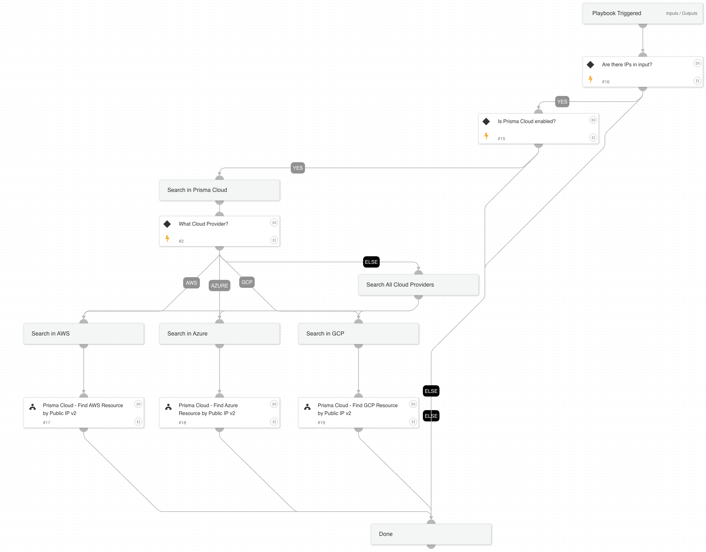

Find Public Cloud resource by Public IP using Prisma Cloud inventory

## Dependencies

This playbook uses the following sub-playbooks, integrations, and scripts.

### Sub-playbooks

* Prisma Cloud - Find GCP Resource by Public IP v2
* Prisma Cloud - Find Azure Resource by Public IP v2
* Prisma Cloud - Find AWS Resource by Public IP v2

### Integrations

This playbook does not use any integrations.

### Scripts

This playbook does not use any scripts.

### Commands

This playbook does not use any commands.

## Playbook Inputs

---

| **Name** | **Description** | **Default Value** | **Required** |
| --- | --- | --- | --- |
| PublicIPAddress | Public IP Address to look up |  | Required |
| CloudProvider | Public Cloud Provider \(AWS, Azure, GCP\) |  | Optional |

## Playbook Outputs

---

| **Path** | **Description** | **Type** |
| --- | --- | --- |
| PrismaCloud.Attribution | Prisma Cloud attributed asset information. | unknown |
| PrismaCloud.Config.data.tags | Prisma Cloud Tags information. | unknown |

## Playbook Image

---

