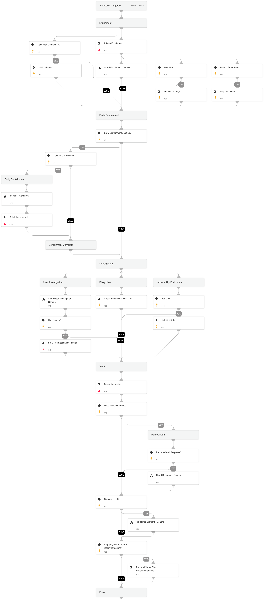

This playbook handles incidents of internet exposed services and detects potential risky configurations that can make your cloud environment vulnerable to attacks, and
incidents of unusual network and user activity for all users, and are especially critical for privileged users and assumed roles where detecting unusual activity may indicate the first steps in a potential misuse or account compromise.

## Dependencies

This playbook uses the following sub-playbooks, integrations, and scripts.

### Sub-playbooks

* Ticket Management - Generic
* Cloud Enrichment - Generic
* Cloud User Investigation - Generic
* Block IP - Generic v3
* Cloud Response - Generic

### Integrations

* PrismaCloud v2
* PrismaCloudV2
* PrismaCloudIAM
* RedLock

### Scripts

JsonToTable

### Commands

* prisma-cloud-host-finding-list
* core-list-risky-users
* setAlert
* ip
* cve
* prisma-cloud-alert-get-details

## Playbook Inputs

---

| **Name** | **Description** | **Default Value** | **Required** |
| --- | --- | --- | --- |
| serviceNowShortDescription | A short description of the ticket. |  | Optional |
| serviceNowImpact | The impact for the new ticket. Leave empty for ServiceNow default impact. |  | Optional |
| serviceNowUrgency | The urgency of the new ticket. Leave empty for ServiceNow default urgency. |  | Optional |
| serviceNowSeverity | The severity of the new ticket. Leave empty for ServiceNow default severity. |  | Optional |
| serviceNowTicketType | The ServiceNow ticket type. Options are "incident", "problem", "change_request", "sc_request", "sc_task", or "sc_req_item". Default is "incident". |  | Optional |
| serviceNowCategory | The category of the ServiceNow ticket. |  | Optional |
| serviceNowAssignmentGroup | The group to which to assign the new ticket. |  | Optional |
| ZendeskPriority | The urgency with which the ticket should be addressed. Allowed values are "urgent", "high", "normal", or "low". |  | Optional |
| ZendeskRequester | The user who requested this ticket. |  | Optional |
| ZendeskStatus | The state of the ticket. Allowed values are "new", "open", "pending", "hold", "solved", or "closed". |  | Optional |
| ZendeskSubject | The value of the subject field for this ticket. |  | Optional |
| ZendeskTags | The array of tags applied to this ticket. |  | Optional |
| ZendeskType | The type of this ticket. Allowed values are "problem", "incident", "question", or "task". |  | Optional |
| ZendeskAssigne | The agent currently assigned to the ticket. |  | Optional |
| ZendeskCollaborators | The users currently CC'ed on the ticket. |  | Optional |
| ZenDeskDescription | The ticket description. |  | Optional |
| CreateTicket | Whether to create a ticket in ZenDesk or ServiceNow. Options are True or False. | False | Optional |
| StopForRecommendations |  | True | Optional |
| EarlyContainment |  | True | Optional |

## Playbook Outputs

---
There are no outputs for this playbook.

## Playbook Image

---

