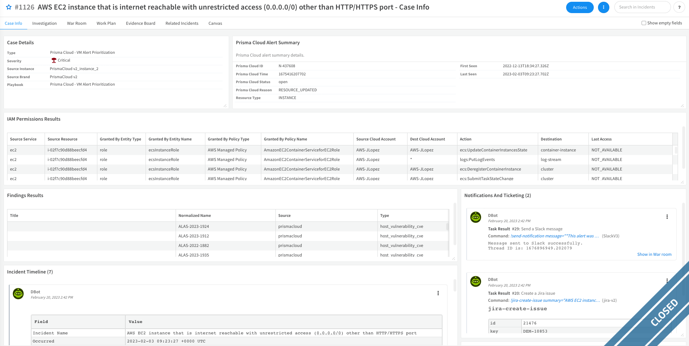
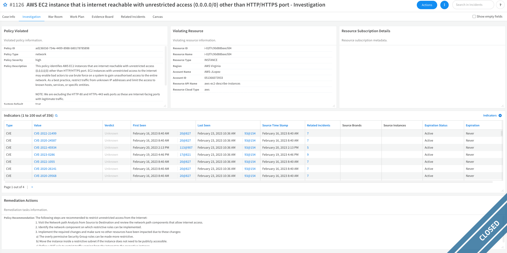
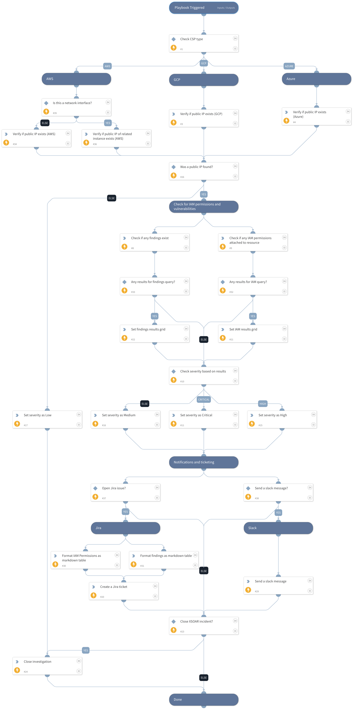
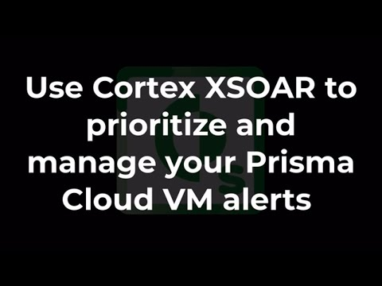

This playbook handles incidents related to dozens of Prisma Cloud public VM alerts.
It determines the severity of the ingested alert based on data returned from Cortex XSOAR commands interacting with the Prisma Cloud API and creates new issues in either Slack or Jira, with all of the relevant information.
The playbook updates the Cortex XSOAR incident’s layout with information the analyst can use to investigate the alert. It also extracts and enriches indicators using existing configured integrations and then closes the investigation.

The flow of this playbook is as following:
1) Check the CSP type.
2) Check whether there's a public IP associated to the instance. In case there is, it will continue to other steps, if not, it will set the severity of the incident to "Low" and will close the incident.
3) Check if there are any vulnerabilities or findings related to the instance.
4) Check if there are any IAM permissions associated to the instance.
5) Set the incident severity based on the results:
  - Low - No public IP was found.
  - Medium - Public IP was found, other checks didn't return results.
  - High - Public IP was found and also one of the other checks returned results.
  - Critical - Public IP was found and both of the other checks returned results.
6) Notifications and ticketing with 3rd party systems.
7) Close the incident.

This playbook will run when a new incident is created with the **Prisma Cloud - VM Alert Prioritization** incident type which also includes a dedicated layout.

**The Layout**

There are 2 main tabs in the layout: *Case Info* and *Investigation*.
- The *Case Info* tab presents high level data, the enrichment results, and the notifications & communications results:

- The *Investigation* tab presents low level data, including policy data, violating resources, and indicators:

## Dependencies

This playbook uses the following sub-playbooks, integrations, and scripts.

### Sub-playbooks

This playbook does not use any sub-playbooks.

### Integrations

* jira-v2
* SlackV3

### Scripts

* SetAndHandleEmpty
* SetGridField

### Commands

* closeInvestigation
* prisma-cloud-host-finding-list
* prisma-cloud-config-search
* prisma-cloud-permission-list
* send-notification
* setIncident
* jira-create-issue

## Playbook Inputs

---

| **Name** | **Description**                                                  | **Default Value** | **Required** |
| --- |------------------------------------------------------------------| --- | --- |
| JiraProjectName | The project name with which to associate the issue.              |  | Optional |
| JiraIssueTypeName | The name of the issue type to be opened.                         |  | Optional |
| CloseIncidentAfterNotification | Whether to close the incident after Jira/Slack issue was opened. | True | Optional |
| SlackChannelName | The name of the Slack channel to which to send the message.      |  | Optional |
| SlackChannelID | The ID of the Slack channel to which to send the message.        |  | Optional |

## Playbook Outputs

---
There are no outputs for this playbook.

## Playbook Image

---

##### Video

