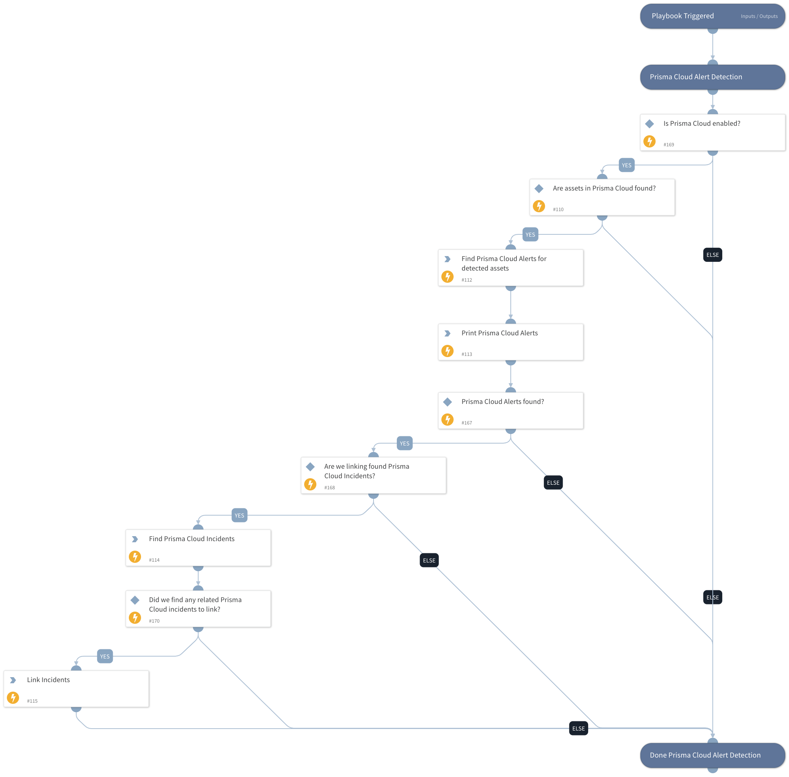

Search alerts in Prisma Cloud for a specific asset ID and, if present in XSOAR, link them.

## Dependencies

This playbook uses the following sub-playbooks, integrations, and scripts.

### Sub-playbooks

This playbook does not use any sub-playbooks.

### Integrations

PrismaCloud v2

### Scripts

* SearchIncidentsV2
* ToTable

### Commands

* linkIncidents
* prisma-cloud-alert-search

## Playbook Inputs

---

| **Name** | **Description** | **Default Value** | **Required** |
| --- | --- | --- | --- |
| Prisma Cloud Attribution | Attribution information from Prisma Cloud. | PrismaCloud.Attribution | Optional |
| Link Incidents | Link found Prisma Cloud incidents to current one? | True | Optional |

## Playbook Outputs

---

| **Path** | **Description** | **Type** |
| --- | --- | --- |
| foundIncidents | Found Prisma Cloud incidents | unknown |
| PrismaCloud.Alert | Prisma Cloud alert. | unknown |

## Playbook Image

---

