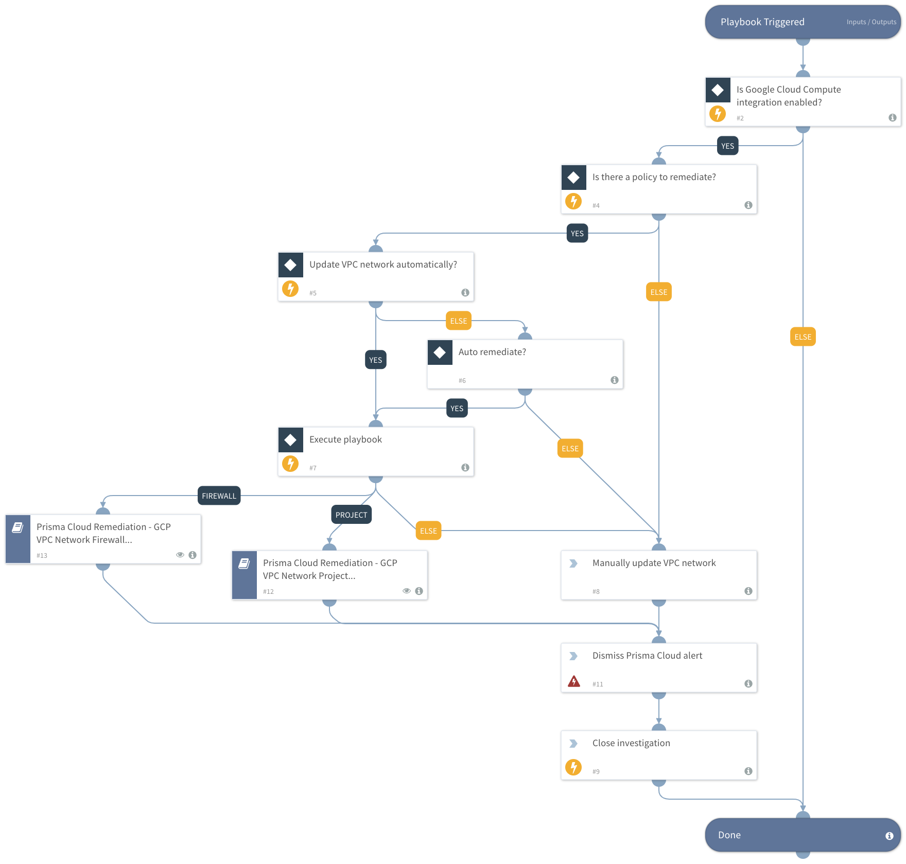

# Prisma Cloud

Automate and unify security incident response across your cloud environments, while still giving a degree of control to dedicated cloud teams. 
Cloud adoption has expanded the threat surface and created disparate ecosystems that hamper visibility into security vulnerabilities across the network. In addition, cloud provisioning is often managed by multiple teams, making it hard for security teams to keep pace.
The pack includes playbooks that automate Prisma Cloud alert response and custom incident fields, views and layouts to facilitate analyst investigation. The remediation playbooks orchestrate across multiple native cloud integrations (AWS, GCP, Azure) to automate actions like changing policies, revoking access, creating new rules etc. 
With this content pack, you can significantly reduce the time your Security Analysts/Cloud Operations team spend on Cloud Security alerts and standardize the way you manage misconfiguration incidents.

##### What does this pack do?
The playbooks included in this Pack help automate the remediation of alerts generated from the Prisma Cloud platform.
- Take action on, remediate, and resolve incidents/ alerts from Prisma Cloud.
- Track configuration issues across all your Cloud environments. 
- Ensure your Cloud environments are compliant and up to date with the latest compliance standards.
- Configure your Cloud environments using industry best practices.

As part of this pack, you will also get out-of-the-box Prisma Cloud incident views, segregated alert layouts and playbooks. All of these are easily customizable to suit the needs of your organization.

_For more information, visit our [Cortex XSOAR Developer Docs](https://xsoar.pan.dev/docs/reference/packs/prisma-cloud)_

<~XSIAM>

This pack includes Cortex XSIAM content.

It supports Prisma Cloud alerts ingestion and modeling. 

For additional details regarding Prisma Cloud alerts ingestion & Prisma Cloud Collector configuration, see [Ingest Alerts from Prisma Cloud](https://docs-cortex.paloaltonetworks.com/r/Cortex-XDR/Cortex-XDR-Pro-Administrator-Guide/Ingest-Alerts-from-Prisma-Cloud).

</~XSIAM>