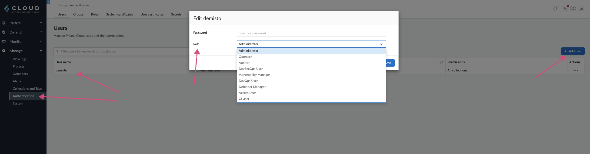
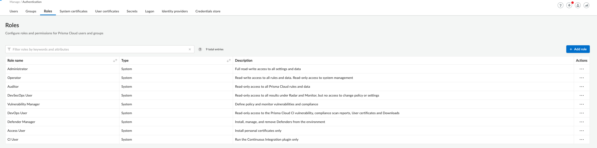

Prisma™ Cloud Compute Edition delivers cloud workload protection (CWPP) for modern
enterprises, providing holistic protection across hosts, containers, and serverless deployments in any cloud, 
throughout the application lifecycle. Prisma Cloud Compute Edition is cloud native and API-enabled, 
protecting all your workloads regardless of their underlying compute technology or the cloud in which they run.

This integration lets you import *Palo Alto Networks - Prisma Cloud Compute* alerts into Cortex XSOAR.

## Configure Prisma Cloud Compute to Send Alerts to Cortex XSOAR

To send alerts from Prisma Cloud Compute to Cortex XSOAR, you need to create an alert profile.

1. Log in to your Prisma Cloud Compute console.
2. Navigate to **Manage > Alerts**.
3. Click **Add Profile** to create a new alert profile.
4. On the left, select **Demisto** from the provider list.
5. On the right, select the alert triggers. Alert triggers specify which alerts are sent to Cortex XSOAR.
6. Click **Save** to save the alert profile.
7. Make sure you configure the user role to be at least `auditor`, otherwise you will not be able to fetch the alerts.

## Configure Prisma Cloud Compute in Cortex

   | Parameter | Description | Example |
   | --- | --- | --- |
   | **Name**                                              | A meaningful name for the integration instance. | Prisma Cloud Compute_&lt;alertProfileName&gt; |
   | **Fetches incidents**                                 | Configures this integration instance to fetch alerts from Prisma Cloud Compute. | N/A |
   | **Prisma Cloud Compute Console URL**                  | URL address and port of your Prisma Cloud Compute console. Copy the address from the alert profile created in Prisma Cloud Compute. | https:/<span></span>/proxyserver.com |
   | **Prisma Cloud Compute Project Name (if applicable)** | Copy the project name from the alert profile created in Prisma Cloud Compute and paste in this field. | N/A |
   | **Trust any certificate (not secure)**                | Skips verification of the CA certificate (not recommended). | N/A |
   | **Use system proxy settings**                         | Runs the integration instance using the proxy server (HTTP or HTTPS) that you defined in the server configuration. | <span></span>https://proxyserver.com |
   | **Username**                                          | Prisma Cloud Compute login credentials. | N/A |
   | **Prisma Cloud Compute CA Certificate**               | CA Certificate used by Prisma Cloud Compute. Copy the certificate from the alert profile created in Prisma Cloud Compute. | N/A |
   | **Source Reliability**                                   | Reliability of the source providing the intelligence data. | False |

## Configure Prisma Cloud Compute User Roles 

* In order to access Prisma Cloud Compute resources, a user must be assigned with a role.
* Without sufficient user roles, commands/fetching incidents might not work.
* See below the user roles and their descriptions.
* See 'Requires Role' section (each command requires a different type of role).

1) Go to `Manage` -> `Authentication`.

2) Choose the user that you want to edit roles -> `Actions` -> Press `...`.

3) Press on `Edit` -> Choose a Role in the `Role` section.



## Required User Roles
In order to use the entire integration commands a user must have the permissions of the following user roles:

* devSecOps
* ci
* auditor
* operator
* devOps
* vulnerabilityManager

The administrator user role can use the entire integration commands.

See user roles descriptions in Prisma Cloud Compute:


Commands
--------

You can execute these commands from the CLI, as part of an automation, or in a playbook. After you successfully execute a command, a DBot message appears in the War Room with the command details.

### prisma-cloud-compute-profile-host-list
***
Get information about the hosts and their profile events. This command supports asterisks which allows you to get host profiles by filtering its fields according to a specific substring.


#### Base Command

`prisma-cloud-compute-profile-host-list`

#### Requires Role
devSecOps

#### Input

| **Argument Name** | **Description** | **Required** |
| --- | --- | --- |
| hostname | A comma-separated list of profile (hostname) IDs. For example, !prisma-cloud-compute-profile-host-list hostname="*149*,*257*". | Optional | 
| limit | The maximum number of hosts and their profile events to return. Must be between 1-50. Default is 15. | Optional | 
| offset | The offset by which to begin listing hosts and their profile events. Default is 0. | Optional | 


#### Context Output

| **Path** | **Type** | **Description** |
| --- | --- | --- |
| PrismaCloudCompute.ProfileHost._id | String | The profile ID \(hostname\). | 
| PrismaCloudCompute.ProfileHost.accountID | String | The cloud account ID associated with the profile. | 
| PrismaCloudCompute.ProfileHost.apps.listeningPorts.command | String | The command that triggered the connection. | 
| PrismaCloudCompute.ProfileHost.apps.listeningPorts.modified | Date | The timestamp of when the event occurred. | 
| PrismaCloudCompute.ProfileHost.apps.listeningPorts.port | Number | The listening port number. | 
| PrismaCloudCompute.ProfileHost.apps.listeningPorts.processPath | String | The path to the process that uses the port. | 
| PrismaCloudCompute.ProfileHost.apps.name | String | The app name. | 
| PrismaCloudCompute.ProfileHost.apps.outgoingPorts.command | String | The command that triggered the connection. | 
| PrismaCloudCompute.ProfileHost.apps.outgoingPorts.country | String | The country ISO code for the given IP address. | 
| PrismaCloudCompute.ProfileHost.apps.outgoingPorts.ip | String | The IP address captured over this port. | 
| PrismaCloudCompute.ProfileHost.apps.outgoingPorts.modified | Date | The timestamp of when the event occurred. | 
| PrismaCloudCompute.ProfileHost.apps.outgoingPorts.port | Number | The outgoing port number. | 
| PrismaCloudCompute.ProfileHost.apps.outgoingPorts.processPath | String | The path to the process that uses the port. | 
| PrismaCloudCompute.ProfileHost.apps.processes.command | String | The executed command. | 
| PrismaCloudCompute.ProfileHost.apps.processes.md5 | String | The process binary MD5 sum. | 
| PrismaCloudCompute.ProfileHost.apps.processes.modified | Boolean | Whether the process binary was modified after the container started. | 
| PrismaCloudCompute.ProfileHost.apps.processes.path | String | The process binary path. | 
| PrismaCloudCompute.ProfileHost.apps.processes.ppath | String | The parent process path. | 
| PrismaCloudCompute.ProfileHost.apps.processes.time | Date | The time in which the process was added. If the process was modified, time is the modification time. | 
| PrismaCloudCompute.ProfileHost.apps.processes.user | String | The username of the user who started the process. | 
| PrismaCloudCompute.ProfileHost.apps.startupProcess.command | String | The executed command. | 
| PrismaCloudCompute.ProfileHost.apps.startupProcess.md5 | String | The process binary MD5 sum. | 
| PrismaCloudCompute.ProfileHost.apps.startupProcess.modified | Boolean | Whether the process binary was modified after the container started. | 
| PrismaCloudCompute.ProfileHost.apps.startupProcess.path | String | The process binary path. | 
| PrismaCloudCompute.ProfileHost.apps.startupProcess.ppath | String | The parent process path. | 
| PrismaCloudCompute.ProfileHost.apps.startupProcess.time | Date | The time in which the process was added. If the process was modified, time is the modification time. | 
| PrismaCloudCompute.ProfileHost.apps.startupProcess.user | String | The username of the user who started the process. | 
| PrismaCloudCompute.ProfileHost.collections | String | A list of collections to which this profile applies. | 
| PrismaCloudCompute.ProfileHost.created | Date | The profile creation time. | 
| PrismaCloudCompute.ProfileHost.hash | Number | The uint32 hash associated with the profile. | 
| PrismaCloudCompute.ProfileHost.labels | String | The labels associated with the profile. | 
| PrismaCloudCompute.ProfileHost.sshEvents.command | String | The executed command. | 
| PrismaCloudCompute.ProfileHost.sshEvents.country | String | The SSH client's country of origin. | 
| PrismaCloudCompute.ProfileHost.sshEvents.ip | String | The connection client IP address. | 
| PrismaCloudCompute.ProfileHost.sshEvents.loginTime | Date | The SSH login time. | 
| PrismaCloudCompute.ProfileHost.sshEvents.md5 | String | The process binary MD5 sum. | 
| PrismaCloudCompute.ProfileHost.sshEvents.modified | Boolean | Whether the process binary was modified after the container started. | 
| PrismaCloudCompute.ProfileHost.sshEvents.path | String | The process binary path. | 
| PrismaCloudCompute.ProfileHost.sshEvents.ppath | String | The parent process path. | 
| PrismaCloudCompute.ProfileHost.sshEvents.time | Date | The time in which the process was added. If the process was modified, time is the modification time. | 
| PrismaCloudCompute.ProfileHost.sshEvents.user | String | The username of the user who started the process. | 
| PrismaCloudCompute.ProfileHost.time | Date | The last time this profile was modified. | 
| PrismaCloudCompute.ProfileHost.geoip.countries.code | String | The country code of the computer that accessed the host. | 
| PrismaCloudCompute.ProfileHost.geoip.countries.ip | String | The IP address of the computer that accessed the host. | 
| PrismaCloudCompute.ProfileHost.geoip.countries.modified | Date | The last time the IP address associated with this country accessed the host console. | 
| PrismaCloudCompute.ProfileHost.geoip.modified | Date | The last time any of the country IP addresses accessed the host console. | 


#### Command Example
```!prisma-cloud-compute-profile-host-list hostname=*163*```

#### Context Example
```json
{
    "PrismaCloudCompute": {
        "ProfileHost": {
            "hash": 1, 
            "created": "2020-11-10T09:37:30.314Z", 
            "geoip": {
                "modified": "2021-12-10T11:06:03.206Z", 
                "countries": [
                    {
                        "ip": "1.1.1.1", 
                        "code": "US", 
                        "modified": "2021-12-10T11:06:03.206Z"
                    }, 
                    {
                        "ip": "2.2.2.2", 
                        "code": "IE", 
                        "modified": "2021-12-10T05:22:01.858Z"
                    }
                ]
            }, 
            "labels": [
                "osDistro:amzn", 
                "osVersion:2"
            ], 
            "apps": [
                {
                    "processes": [
                        {
                            "ppath": "/usr/lib/systemd/systemd", 
                            "command": "/usr/sbin/auditd", 
                            "user": "root", 
                            "time": "2020-11-10T09:37:30.415Z", 
                            "path": "/usr/sbin/auditd", 
                            "md5": ""
                        }
                    ], 
                    "startupProcess": {
                        "ppath": "/usr/lib/systemd/systemd", 
                        "command": "/usr/sbin/auditd", 
                        "user": "root", 
                        "time": "2020-11-10T09:37:30.415Z", 
                        "path": "/usr/sbin/auditd", 
                        "md5": ""
                    }, 
                    "name": "auditd"
                }, 
                {
                    "processes": [
                        {
                            "ppath": "/usr/lib/systemd/systemd", 
                            "command": "/usr/sbin/atd -f", 
                            "user": "root", 
                            "time": "2020-11-10T09:37:30.415Z", 
                            "path": "/usr/sbin/atd", 
                            "md5": ""
                        }
                    ], 
                    "startupProcess": {
                        "ppath": "/usr/lib/systemd/systemd", 
                        "command": "/usr/sbin/atd -f", 
                        "user": "root", 
                        "time": "2020-11-10T09:37:30.415Z", 
                        "path": "/usr/sbin/atd", 
                        "md5": ""
                    }, 
                    "name": "atd"
                }
            ], 
            "collections": [
                "All", 
                "123"
            ], 
            "time": "2021-12-10T11:06:03.206Z", 
            "sshEvents": [
                {
                    "ppath": "/usr/bin/bash", 
                    "country": "IL", 
                    "time": "December 10, 2021 11:06:03 AM", 
                    "command": "grep twistlock_data - High rate of events, throttling started", 
                    "user": "user123", 
                    "ip": "1.2.3.4", 
                    "path": "/usr/bin/grep", 
                    "loginTime": "September 02, 2021 09:27:41 AM", 
                    "md5": ""
                },
               {
                  "ppath": "/usr/bin/bash",
                  "country": "IL",
                  "time": "December 10, 2021 11:06:03 AM",
                  "command": "docker -H unix:///var/run/docker.sock ps -a --format {{ .Names }}",
                  "user": "user123",
                  "ip": "1.1.1.1",
                  "path": "/usr/bin/docker",
                  "loginTime": "September 02, 2021 09:27:41 AM",
                  "md5": ""
               }
            ], 
            "_id": "host163", 
            "accountID": "1234"
        }
    }
}
```

#### Human Readable Output - One Host
>### Host Description
>|Hostname|Distribution|Collections|
>|---|---|---|
>| host163 | amzn 2 | All,<br>123 |
>### Apps
>|AppName|StartupProcess|User|LaunchTime|
>|---|---|---|---|
>| auditd | /usr/sbin/auditd | root | November 10, 2020 09:37:30 AM |
>| atd | /usr/sbin/atd | root | November 10, 2020 09:37:30 AM |
>### SSH Events
>|User|Ip|ProcessPath|Command|Time|
>|---|---|---|---|---|
>| user123 | 1.2.3.4 | /usr/bin/grep | grep twistlock_data - High rate of events, throttling started | December 10, 2021 11:06:03 AM |
>| user123 | 1.1.1.1 | /usr/bin/docker | docker -H unix:///var/run/docker.sock ps -a --format {{ .Names }} | December 10, 2021 11:06:03 AM |

#### Human Readable Output - Multiple Hosts
>### Host Description
>|Hostname|Distribution|Collections|
>|---|---|---|
>| host163 | amzn 2 | All,<br>123 |
>| host249 | Ubuntu 16.04 | All,<br>123 |


### prisma-cloud-compute-profile-container-list
***
Get information about the containers and their profile events. This command supports asterisks which allows you to get container profiles by filtering its fields according to a specific substring.

#### Base Command
`prisma-cloud-compute-profile-container-list`

#### Requires Role
devSecOps

#### Input

| **Argument Name** | **Description** | **Required** |
| --- | --- | --- |
| cluster | A comma-separated list of runtime profile Kubernetes clusters. | Optional | 
| id | A comma-separated list of runtime profile (hostname) IDs. For example, !prisma-cloud-compute-profile-container-list id="*256*,*148*". | Optional | 
| image | A comma-separated list of runtime profile images. For example, !prisma-cloud-compute-profile-container-list image="*console*,*defender*". | Optional | 
| image_id | A comma-separated list of runtime profile image IDs. For example, !prisma-cloud-compute-profile-container-list image_id="*123*,*456*". | Optional | 
| namespace | A comma-separated list of runtime profile Kubernetes namespaces. For example, !prisma-cloud-compute-profile-container-list namespace="*namespace1*,*namespace2*". | Optional | 
| os | A comma-separated list of service runtime profile operating systems. For example, !prisma-cloud-compute-profile-container-list os="*Red Hat*,*Windows*". | Optional | 
| state | A comma-separated list of runtime profile states. For example, !prisma-cloud-compute-profile-container-list state=*active*. | Optional | 
| limit | The maximum number of containers and their profile events. Must be between 1-50. Default is 15. | Optional | 
| offset | The offset by which to begin listing containers and their profile events. Default is 0. | Optional | 


#### Context Output

| **Path** | **Type** | **Description** |
| --- | --- | --- |
| PrismaCloudCompute.ProfileContainer._id | String | The profile ID. | 
| PrismaCloudCompute.ProfileContainer.accountsIDs | String | The cloud account IDs associated with the container runtime profile. | 
| PrismaCloudCompute.ProfileContainer.archived | Boolean | Whether this profile is archived. | 
| PrismaCloudCompute.ProfileContainer.capabilities.ci | Boolean | Whether the container is allowed to write binaries to disk and run them based on static analysis. | 
| PrismaCloudCompute.ProfileContainer.capabilities.cloudMetadata | Boolean | Whether the given container can query cloud metadata API based on static analysis. | 
| PrismaCloudCompute.ProfileContainer.capabilities.dnsCache | Boolean | Whether the DNS services used by all the pods in the cluster were added to the profile based on static analysis. | 
| PrismaCloudCompute.ProfileContainer.capabilities.dynamicDNSQuery | Boolean | Whether capped behavioral DNS queries were added to the profile based on static analysis. | 
| PrismaCloudCompute.ProfileContainer.capabilities.dynamicFileCreation | Boolean | Whether capped behavioral file system paths were added to the profile based on static analysis. | 
| PrismaCloudCompute.ProfileContainer.capabilities.dynamicProcessCreation | Boolean | Whether capped behavioral processes were added to the profile based on static analysis. | 
| PrismaCloudCompute.ProfileContainer.capabilities.k8s | Boolean | Whether the given container can perform Kubernetes networking tasks (e.g., contact to API server). | 
| PrismaCloudCompute.ProfileContainer.capabilities.proxy | Boolean | Whether the container can listen on any port and perform multiple outbound connections. | 
| PrismaCloudCompute.ProfileContainer.capabilities.sshd | Boolean | Whether the container can run sshd processes. | 
| PrismaCloudCompute.ProfileContainer.capabilities.unpacker | Boolean | Whether the container is allowed to write shared libraries to disk. | 
| PrismaCloudCompute.ProfileContainer.cluster | String | The provided cluster name. | 
| PrismaCloudCompute.ProfileContainer.collections | String | Collections to which this profile applies. | 
| PrismaCloudCompute.ProfileContainer.created | Date | The profile creation time. | 
| PrismaCloudCompute.ProfileContainer.entrypoint | String | The image entrypoint. | 
| PrismaCloudCompute.ProfileContainer.events._id | String | The history event entity. | 
| PrismaCloudCompute.ProfileContainer.events.command | String | The process that was executed. | 
| PrismaCloudCompute.ProfileContainer.events.hostname | String | The hostname on which the command was invoked. | 
| PrismaCloudCompute.ProfileContainer.events.time | Date | The time of the event. | 
| PrismaCloudCompute.ProfileContainer.filesystem.behavioral.mount | Boolean | Whether the given folder is mounted. | 
| PrismaCloudCompute.ProfileContainer.filesystem.behavioral.path | String | The file path. | 
| PrismaCloudCompute.ProfileContainer.filesystem.behavioral.process | String | The process that accessed the file. | 
| PrismaCloudCompute.ProfileContainer.filesystem.behavioral.time | Date | The time in which the file was added. | 
| PrismaCloudCompute.ProfileContainer.filesystem.static.mount | Boolean | Whether the given folder is a mounted. | 
| PrismaCloudCompute.ProfileContainer.filesystem.static.path | String | The file path. | 
| PrismaCloudCompute.ProfileContainer.filesystem.static.process | String | The process that accessed the file. | 
| PrismaCloudCompute.ProfileContainer.filesystem.static.time | Date | The time in which the file was added. | 
| PrismaCloudCompute.ProfileContainer.hash | Number | The uint32 hash associated with the profile. | 
| PrismaCloudCompute.ProfileContainer.hostNetwork | Boolean | Whether the instance shares the network namespace with the host. | 
| PrismaCloudCompute.ProfileContainer.hostPid | Boolean | Whether the instance shares the PID namespace with the host. | 
| PrismaCloudCompute.ProfileContainer.image | String | The image the container runs with. | 
| PrismaCloudCompute.ProfileContainer.imageID | String | The profile's image ID. | 
| PrismaCloudCompute.ProfileContainer.infra | Boolean | Whether this is an infrastructure container. | 
| PrismaCloudCompute.ProfileContainer.istio | Boolean | Whether it is an Istio-monitored profile. | 
| PrismaCloudCompute.ProfileContainer.k8s.clusterRoles.labels.key | String | The key of the label. | 
| PrismaCloudCompute.ProfileContainer.k8s.clusterRoles.labels.value | String | The value of the label. | 
| PrismaCloudCompute.ProfileContainer.k8s.clusterRoles.name | String | The role name. | 
| PrismaCloudCompute.ProfileContainer.k8s.clusterRoles.roleBinding | String | The name of the role binding used for display. | 
| PrismaCloudCompute.ProfileContainer.k8s.clusterRoles.rules | String | The list of rules associated with the cluster role. | 
| PrismaCloudCompute.ProfileContainer.k8s.roles.labels.key | String | The key of the label. | 
| PrismaCloudCompute.ProfileContainer.k8s.roles.labels.value | String | The value of the label. | 
| PrismaCloudCompute.ProfileContainer.k8s.roles.name | String | The Kubernetes role name. | 
| PrismaCloudCompute.ProfileContainer.k8s.roles.namespace | String | The namespace associated with the role. | 
| PrismaCloudCompute.ProfileContainer.k8s.roles.roleBinding | String | The name of the role binding used for display. | 
| PrismaCloudCompute.ProfileContainer.k8s.roles.rules | String | The policy rules associated with the role. | 
| PrismaCloudCompute.ProfileContainer.k8s.serviceAccount | String | The service account used to access the Kubernetes API server. This field will be empty if the container is not running inside of a pod. | 
| PrismaCloudCompute.ProfileContainer.label | String | The profile's label. | 
| PrismaCloudCompute.ProfileContainer.lastUpdate | Date | The last time this profile was modified. | 
| PrismaCloudCompute.ProfileContainer.learnedStartup | Boolean | Whether the startup events were learned. | 
| PrismaCloudCompute.ProfileContainer.namespace | String | The Kubernetes deployment namespace. | 
| PrismaCloudCompute.ProfileContainer.network.behavioral.dnsQueries.domainName | String | The queried domain name. | 
| PrismaCloudCompute.ProfileContainer.network.behavioral.dnsQueries.domainType | String | The queried domain type. | 
| PrismaCloudCompute.ProfileContainer.network.listeningPorts.app | String | The name of the app. | 
| PrismaCloudCompute.ProfileContainer.network.listeningPorts.portsData.all | Boolean | Whether this port data represents any arbitrary ports. | 
| PrismaCloudCompute.ProfileContainer.network.listeningPorts.portsData.ports.port | Number | The port number. | 
| PrismaCloudCompute.ProfileContainer.network.listeningPorts.portsData.ports.time | Date | The learning timestamp of this port. | 
| PrismaCloudCompute.ProfileContainer.network.outboundPorts.portsData.all | Boolean | Whether this port data represents any arbitrary ports. | 
| PrismaCloudCompute.ProfileContainer.network.outboundPorts.portsData.ports.port | Number | The port number. | 
| PrismaCloudCompute.ProfileContainer.network.static.listeningPorts.ports.time | Date | The learning timestamp of this port. | 
| PrismaCloudCompute.ProfileContainer.network.static.listeningPorts.app | String | The name of the app. | 
| PrismaCloudCompute.ProfileContainer.network.static.listeningPorts.portsData.all | Boolean | Whether this port data represents any arbitrary ports. | 
| PrismaCloudCompute.ProfileContainer.network.static.listeningPorts.portsData.ports.port | Number | The port number. | 
| PrismaCloudCompute.ProfileContainer.network.static.listeningPorts.portsData.ports.time | Date | The learning timestamp of this port. | 
| PrismaCloudCompute.ProfileContainer.os | String | The profile image operating system. | 
| PrismaCloudCompute.ProfileContainer.processes.behavioral.command | String | The executed command. | 
| PrismaCloudCompute.ProfileContainer.processes.behavioral.md5 | String | The process binary MD5 sum. | 
| PrismaCloudCompute.ProfileContainer.processes.behavioral.modified | Boolean | Whether the process binary was modified after the container started. | 
| PrismaCloudCompute.ProfileContainer.processes.behavioral.path | String | The process binary path. | 
| PrismaCloudCompute.ProfileContainer.processes.behavioral.ppath | String | The parent process path. | 
| PrismaCloudCompute.ProfileContainer.processes.behavioral.time | Date | The time in which the process was added. If the process was modified, time is the modification time. | 
| PrismaCloudCompute.ProfileContainer.processes.behavioral.user | String | The username of the user who started the process. | 
| PrismaCloudCompute.ProfileContainer.processes.static.command | String | The executed command. | 
| PrismaCloudCompute.ProfileContainer.processes.static.md5 | String | The process binary MD5 sum. | 
| PrismaCloudCompute.ProfileContainer.processes.static.modified | Boolean | Whether the process binary was modified after the container started. | 
| PrismaCloudCompute.ProfileContainer.processes.static.path | String | The process binary path. | 
| PrismaCloudCompute.ProfileContainer.processes.static.ppath | String | The parent process path. | 
| PrismaCloudCompute.ProfileContainer.processes.static.time | Date | The time in which the process was added. If the process was modified, time is the modification time. | 
| PrismaCloudCompute.ProfileContainer.processes.static.user | String | The username of the user who started the process. | 
| PrismaCloudCompute.ProfileContainer.relearningCause | String | The reason a profile entered the learning mode after being activated. | 
| PrismaCloudCompute.ProfileContainer.remainingLearningDurationSec | Number | The total time left that the system needs to finish learning this image. | 
| PrismaCloudCompute.ProfileContainer.state | String | The current state of the profile. | 


#### Command Example
```!prisma-cloud-compute-profile-container-list image=*defender* limit=1```

#### Context Example
```json
{
    "PrismaCloudCompute": {
        "ProfileContainer": {
            "image": "twistlock/private:defender_21_04_439", 
            "hostNetwork": true, 
            "learnedStartup": true, 
            "k8s": {}, 
            "archived": false, 
            "network": {
                "geoip": {
                    "modified": "2021-12-10T13:31:42.924Z", 
                    "countries": [
                        {
                            "ip": "1.1.1.1", 
                            "code": "IE", 
                            "modified": "2021-12-10T13:31:42.922Z"
                        },
                        {
                            "ip": "2.2.2.2", 
                            "code": "US", 
                            "modified": "2021-12-09T13:30:42.148Z"
                        }
                    ]
                }, 
                "static": {
                    "listeningPorts": []
                }, 
                "behavioral": {
                    "outboundPorts": {
                        "ports": [
                            {
                                "port": 80, 
                                "time": "2021-09-02T11:05:16.836Z"
                            }
                        ]
                    }
                }
            }, 
            "capabilities": {
                "ci": true
            }, 
            "label": "twistlock", 
            "state": "active", 
            "collections": [
                "All", 
                "123", 
                "Prisma Cloud resources"
            ], 
            "entrypoint": "/usr/local/bin/defender", 
            "events": null, 
            "lastUpdate": "2021-09-02T11:05:10.935Z", 
            "hash": 3, 
            "infra": false, 
            "accountIDs": [
                "123"
            ], 
            "processes": {
                "static": [
                    {
                        "ppath": "", 
                        "path": "/usr/bin/mongodump", 
                        "time": "0001-01-01T00:00:00Z", 
                        "md5": ""
                    }, 
                    {
                        "ppath": "", 
                        "path": "/usr/bin/mongorestore", 
                        "time": "0001-01-01T00:00:00Z", 
                        "md5": ""
                    }
                ], 
                "behavioral": [
                    {
                        "ppath": "/usr/local/bin/defender", 
                        "path": "/usr/local/bin/fsmon", 
                        "time": "2021-09-02T11:05:08.931Z", 
                        "md5": ""
                    }, 
                    {
                        "ppath": "/usr/bin/apt-get", 
                        "path": "/usr/lib/apt/methods/gpgv", 
                        "time": "2021-11-24T15:12:28.502Z", 
                        "command": "gpgv", 
                        "md5": ""
                    }
                ]
            }, 
            "created": "2020-09-02T11:05:08.931Z", 
            "imageID": "sha256:8d82e2c21c33e1ffb37ea901d18df15c08123258609e6d7c4aecc7fb4a5a8738", 
            "filesystem": {
                "static": [
                    {
                        "process": "*", 
                        "path": "/var/log/audit", 
                        "mount": true, 
                        "time": "2021-09-02T11:05:08.931Z"
                    }, 
                    {
                        "process": "*", 
                        "path": "/var/lib/twistlock", 
                        "mount": true, 
                        "time": "2021-09-02T11:05:08.931Z"
                    }
                ], 
                "behavioral": [
                    {
                        "process": "/usr/local/bin/defender", 
                        "path": "/prisma-static-data", 
                        "mount": true, 
                        "time": "2021-09-02T11:05:10.935Z"
                    }, 
                    {
                        "process": "/usr/local/bin/defender", 
                        "path": "/tmp", 
                        "mount": false, 
                        "time": "2021-09-02T11:05:16.784Z"
                    }
                ]
            }, 
            "_id": "container123", 
            "os": "Red Hat Enterprise Linux 8.4 (Ootpa)", 
            "remainingLearningDurationSec": -1, 
            "hostPid": true
        }
    }
}
```

#### Human Readable Output - One Container
>### Container Description
>|ContainerID|Image|Os|State|Created|EntryPoint|
>|---|---|---|---|---|---|
>| container123 | twistlock/private:defender_21_04_439 | Red Hat Enterprise Linux 8.4 (Ootpa) | active | September 02, 2020 11:05:08 AM | /usr/local/bin/defender |
>### Processes
>|Type|Path|DetectionTime|
>|---|---|---|
>| static | /usr/bin/mongodump | January 01, 2021 00:00:00 AM |
>| static | /usr/bin/mongorestore | January 01, 2021 00:00:00 AM |
>| behavioral | /usr/local/bin/fsmon | September 02, 2021 11:05:08 AM |
>| behavioral | /usr/lib/apt/methods/gpgv | November 24, 2021 15:12:28 PM |

#### Human Readable Output - Multiple Containers
>### Container Description
>|ContainerID|Image|Os|State|Created|EntryPoint|
>|---|---|---|---|---|---|
>| container123 | twistlock/private:defender_21_04_439 | Red Hat Enterprise Linux 8.4 (Ootpa) | active | September 02, 2021 11:05:08 AM | /usr/local/bin/defender |
>| container1234 | twistlock/private:console_21_04_439 | Red Hat Enterprise Linux 8.4 (Ootpa) | active | September 02, 2021 11:05:08 AM | /app/server |

### prisma-cloud-compute-profile-container-hosts-list
***
Get the hosts where a specific container is running.


#### Base Command

`prisma-cloud-compute-profile-container-hosts-list`

#### Requires Role
devSecOps

#### Input

| **Argument Name** | **Description** | **Required** |
| --- | --- | --- |
| id | Container profile ID. Can be retrieved from the prisma-cloud-compute-profile-container-list command. | Required | 
| limit | The maximum number of hosts to return. Must be between 1-50. Default is 50. | Optional | 
| offset | The offset by which to begin listing hosts of the container. Default is 0. | Optional | 


#### Context Output

| **Path** | **Type** | **Description** |
| --- | --- | --- |
| PrismaCloudCompute.ProfileContainerHost.containerID | String | The container ID. | 
| PrismaCloudCompute.ProfileContainerHost.hostsIDs | String | The list of hosts where this container is running. | 


#### Command Example
```!prisma-cloud-compute-profile-container-hosts-list id=container123```

#### Context Example
```json
{
    "PrismaCloudCompute": {
        "ProfileContainerHost": {
            "containerID": "container123", 
            "hostsIDs": [
                "host1", 
                "host2"
            ]
        }
    }
}
```

#### Human Readable Output
>### Hosts
>|HostsIDs|
>|---|
>| host1,<br>host2 |

### prisma-cloud-compute-profile-container-forensic-list
***
Get runtime forensics data for a specific container on a specific host.


#### Base Command

`prisma-cloud-compute-profile-container-forensic-list`
#### Input

| **Argument Name** | **Description** | **Required** |
| --- | --- | --- |
| id | The container ID. Can be retrieved from the prisma-cloud-compute-profile-container-list command. | Required | 
| collections | The collections scoping the query. | Optional | 
| hostname | The hostname for which data should be fetched. | Required | 
| incident_id | The incident ID in case the request type is an incident. | Optional | 
| limit | The maximum number of forensics data records to return. Must be between 1-50. Default is 20. | Optional | 
| offset | The offset by which to begin listing records from. Default is 0. | Optional | 


#### Context Output

| **Path** | **Type** | **Description** |
| --- | --- | --- |
| PrismaCloudCompute.ContainerForensic.containerID | String | The container ID. | 
| PrismaCloudCompute.ContainerForensic.hostname | String | The hostname. | 
| PrismaCloudCompute.ContainerForensic.Forensics.allPorts | Boolean | Whether all listening ports are allowed. | 
| PrismaCloudCompute.ContainerForensic.Forensics.attack | String | The event attack type. | 
| PrismaCloudCompute.ContainerForensic.Forensics.category | String | The incident category. | 
| PrismaCloudCompute.ContainerForensic.Forensics.command | String | The event command. | 
| PrismaCloudCompute.ContainerForensic.Forensics.containerId | String | The event container ID. | 
| PrismaCloudCompute.ContainerForensic.Forensics.dstIP | String | The destination IP address of the connection. | 
| PrismaCloudCompute.ContainerForensic.Forensics.dstPort | String | The destination port. | 
| PrismaCloudCompute.ContainerForensic.Forensics.dstProfileID | String | The profile ID of the connection destination. | 
| PrismaCloudCompute.ContainerForensic.Forensics.effect | String | The runtime audit effect. | 
| PrismaCloudCompute.ContainerForensic.Forensics.listeningStartTime | Date | The port listening start time. | 
| PrismaCloudCompute.ContainerForensic.Forensics.message | String | The runtime audit message. | 
| PrismaCloudCompute.ContainerForensic.Forensics.networkCollectionType | String | The type of the network collection method. | 
| PrismaCloudCompute.ContainerForensic.Forensics.outbound | Boolean | Whether the port is outbound. | 
| PrismaCloudCompute.ContainerForensic.Forensics.path | String | The event path. | 
| PrismaCloudCompute.ContainerForensic.Forensics.pid | Number | The event process ID. | 
| PrismaCloudCompute.ContainerForensic.Forensics.port | Number | The listening port. | 
| PrismaCloudCompute.ContainerForensic.Forensics.ppid | Number | The event parent process ID. | 
| PrismaCloudCompute.ContainerForensic.Forensics.process | String | The event process description. | 
| PrismaCloudCompute.ContainerForensic.Forensics.srcIP | String | The source IP of the connection | 
| PrismaCloudCompute.ContainerForensic.Forensics.srcProfileID | String | The profile ID of the connection source. | 
| PrismaCloudCompute.ContainerForensic.Forensics.static | Boolean | Whether the event was added to the profile without behavioral indications. | 
| PrismaCloudCompute.ContainerForensic.Forensics.type | String | The event type. | 
| PrismaCloudCompute.ContainerForensic.Forensics.timestamp | Date | The event timestamp. | 
| PrismaCloudCompute.ContainerForensic.Forensics.user | String | The event user. | 


#### Command Example
```!prisma-cloud-compute-profile-container-forensic-list id=container123 hostname=host123 limit=2```

#### Context Example
```json
{
    "PrismaCloudCompute": {
        "ContainerForensic": {
            "Forensics": [
                {
                    "containerId": "a6f769dd", 
                    "timestamp": "December 10, 2021 11:49:50 AM", 
                    "pid": 1341, 
                    "listeningStartTime": "January 01, 0001 00:00:00 AM", 
                    "command": "mongodump --out=/var/lib/twistlock-backup/dump", 
                    "user": "twistlock", 
                    "path": "/usr/bin/mongodump", 
                    "ppid": 15816, 
                    "type": "Process spawned"
                }, 
                {
                    "containerId": "a6f769dd", 
                    "timestamp": "December 09, 2021 11:49:22 AM", 
                    "pid": 20891, 
                    "listeningStartTime": "January 01, 0001 00:00:00 AM", 
                    "command": "mongodump --out=/var/lib/twistlock-backup/dump", 
                    "user": "twistlock", 
                    "path": "/usr/bin/mongodump", 
                    "ppid": 15816, 
                    "type": "Process spawned"
                }
            ], 
            "containerID": "container123", 
            "hostname": "host123"
        }
    }
}
```

#### Human Readable Output
>### Containers forensic report
>|Type|Path|User|Pid|ContainerId|Timestamp|Command|
>|---|---|---|---|---|---|---|
>| Process spawned | /usr/bin/mongodump | twistlock | 1341 | a6f769dd | December 10, 2021 11:49:50 AM | mongodump --out=/var/lib/twistlock-backup/dump |
>| Process spawned | /usr/bin/mongodump | twistlock | 20891 | a6f769dd | December 09, 2021 11:49:22 AM | mongodump --out=/var/lib/twistlock-backup/dump |


### prisma-cloud-compute-host-forensic-list
***
Get forensics on a specific host.


#### Base Command
`prisma-cloud-compute-host-forensic-list`

#### Requires Role
devSecOps

#### Input

| **Argument Name** | **Description** | **Required** |
| --- | --- | --- |
| id | The host ID. Can be retrieved from the prisma-cloud-compute-profile-host-list command. | Required | 
| collections | The collections scoping the query. | Optional | 
| incident_id | The incident ID in case the request type is an incident. | Optional | 
| limit | The maximum number of forensics data records to return. Must be between 1-50. Default is 20. | Optional | 
| offset | The offset by which to begin listing host forensics from. Default is 0. | Optional | 


#### Context Output

| **Path** | **Type** | **Description** |
| --- | --- | --- |
| PrismaCloudCompute.HostForensic.Forensics.app | String | The application associated with the event. | 
| PrismaCloudCompute.HostForensic.Forensics.attack | String | The event attack type. | 
| PrismaCloudCompute.HostForensic.Forensics.category | String | The incident category. | 
| PrismaCloudCompute.HostForensic.Forensics.command | String | The event command. | 
| PrismaCloudCompute.HostForensic.Forensics.country | String | The country associated with the event. | 
| PrismaCloudCompute.HostForensic.Forensics.effect | String | The runtime audit effect. | 
| PrismaCloudCompute.HostForensic.Forensics.interactive | Boolean | Whether the event is interactive. | 
| PrismaCloudCompute.HostForensic.Forensics.ip | String | The IP address associated with the event. | 
| PrismaCloudCompute.HostForensic.Forensics.listeningStartTime | Date | The listening port start time. | 
| PrismaCloudCompute.HostForensic.Forensics.message | String | The runtime audit message. | 
| PrismaCloudCompute.HostForensic.Forensics.path | String | The event path. | 
| PrismaCloudCompute.HostForensic.Forensics.pid | Number | The event process ID. | 
| PrismaCloudCompute.HostForensic.Forensics.port | Number | The listening port. | 
| PrismaCloudCompute.HostForensic.Forensics.ppath | String | The event parent path. | 
| PrismaCloudCompute.HostForensic.Forensics.ppid | Number | The event parent process ID. | 
| PrismaCloudCompute.HostForensic.Forensics.process | String | The event process. | 
| PrismaCloudCompute.HostForensic.Forensics.timestamp | Date | The event timestamp. | 
| PrismaCloudCompute.HostForensic.Forensics.type | String | The event type. | 
| PrismaCloudCompute.HostForensic.Forensics.user | String | The event user. | 
| PrismaCloudCompute.HostForensic.hostID | String | The host ID that was analyzed. | 


#### Command Example
```!prisma-cloud-compute-host-forensic-list id=hostname123 limit=3 offset=5```

#### Context Example
```json
{
    "PrismaCloudCompute": {
        "HostForensic": {
            "Forensics": [
                {
                    "ppath": "/bin/bash", 
                    "timestamp": "December 10, 2021 21:36:03 PM", 
                    "app": "cron", 
                    "pid": 17478, 
                    "listeningStartTime": "January 01, 0001 00:00:00 AM", 
                    "command": "awk { printf  $3 \"|\" $2 \"|\" $1 \":\"}", 
                    "user": "cakeagent", 
                    "path": "/usr/bin/gawk", 
                    "ppid": 17475, 
                    "type": "Process spawned", 
                    "interactive": true
                }, 
                {
                    "ppath": "/bin/bash", 
                    "timestamp": "December 10, 2021 21:36:03 PM", 
                    "app": "cron", 
                    "pid": 17477, 
                    "listeningStartTime": "January 01, 0001 00:00:00 AM", 
                    "command": "grep -vE ^Filesystem|tmpfs|cdrom", 
                    "user": "cakeagent", 
                    "path": "/bin/grep", 
                    "ppid": 17475, 
                    "type": "Process spawned", 
                    "interactive": true
                }, 
                {
                    "ppath": "/bin/bash", 
                    "timestamp": "December 10, 2021 21:36:03 PM", 
                    "app": "cron", 
                    "pid": 17476, 
                    "listeningStartTime": "January 01, 0001 00:00:00 AM", 
                    "command": "df -H -P -B G", 
                    "user": "cakeagent", 
                    "path": "/bin/df", 
                    "ppid": 17475, 
                    "type": "Process spawned", 
                    "interactive": true
                }
            ], 
            "hostID": "hostname123"
        }
    }
}
```

#### Human Readable Output
>### Host forensics report
>|Type|Path|User|Pid|Timestamp|Command|App|
>|---|---|---|---|---|---|---|
>| Process spawned | /usr/bin/gawk | cakeagent | 17411 | December 10, 2021 21:34:03 PM | awk {gsub("%", "%%", $0);printf  $1 "\|" $2 "\|" $3 "\|" $4 "\|" $5 "\|" $6 "\|" $11 ":::"} | cron |
>| Process spawned | /bin/ps | cakeagent | 17410 | December 10, 2021 21:34:03 PM | ps aux | cron |
>| Process spawned | /bin/grep | cakeagent | 17407 | December 10, 2021 21:34:03 PM | grep -vE ^Filesystem\|tmpfs\|cdrom | cron |


### prisma-cloud-compute-console-version-info
***
Get the console version.


#### Base Command
`prisma-cloud-compute-console-version-info`

#### Requires Role
ci

#### Input

| **Argument Name** | **Description** | **Required** |
| --- | --- | --- |


#### Context Output

| **Path** | **Type** | **Description** |
| --- | --- | --- |
| PrismaCloudCompute.Console.Version | String | The console version. | 


#### Command Example
```!prisma-cloud-compute-console-version-info```

#### Context Example
```json
{
    "PrismaCloudCompute": {
        "Console": {
            "Version": "21.04.439"
        }
    }
}
```

#### Human Readable Output
>### Console version
>|Version|
>|---|
>| 21.04.439 |


### prisma-cloud-compute-custom-feeds-ip-list
***
Get all the blacklisted IP addresses in the system.


#### Base Command
`prisma-cloud-compute-custom-feeds-ip-list`

#### Requires Role
auditor

#### Input

| **Argument Name** | **Description** | **Required** |
| --- | --- | --- |


#### Context Output

| **Path** | **Type** | **Description** |
| --- | --- | --- |
| PrismaCloudCompute.CustomFeedIP.digest | String | An internal digest of the custom IP feed. | 
| PrismaCloudCompute.CustomFeedIP.feed | String | The list of blacklisted custom IP addresses. | 
| PrismaCloudCompute.CustomFeedIP.modified | Date | The last time the custom feed was modified. | 


#### Command Example
```!prisma-cloud-compute-custom-feeds-ip-list```

#### Context Example
```json
{
    "PrismaCloudCompute": {
        "CustomFeedIP": {
            "feed": [
                "2.2.2.2", 
                "1.1.1.1"
            ], 
            "modified": "December 10, 2021 21:12:32 PM", 
            "digest": "12345"
        }
    }
}
```

#### Human Readable Output
>### IP Feeds
>|Modified|Feed|
>|---|---|
>| December 10, 2021 21:12:32 PM | 2.2.2.2,<br>1.1.1.1 |


### prisma-cloud-compute-custom-feeds-ip-add
***
Add a list of banned IP addresses to be blocked by the system.

#### Base Command
`prisma-cloud-compute-custom-feeds-ip-add`

#### Requires Role
operator

#### Input

| **Argument Name** | **Description** | **Required** |
| --- | --- | --- |
| ip | List of custom IP addresses to add to the banned IPs list that will be blocked. For example ip=1.1.1.1,2.2.2.2. | Required | 


#### Context Output

There is no context output for this command.

#### Command Example
```!prisma-cloud-compute-custom-feeds-ip-add IP=1.1.1.1,2.2.2.2```

#### Human Readable Output
>Successfully updated the custom IP feeds

### prisma-cloud-compute-custom-feeds-ip-remove

***
Remove a list of IPs from the system's block list.

#### Base Command

`prisma-cloud-compute-custom-feeds-ip-remove`

#### Input

| **Argument Name** | **Description** | **Required** |
| --- | --- | --- |
| ip | A comma-separated list of custom IP addresses to remove from the banned IPs list. For example ip=1.1.1.1,2.2.2.2. | Required | 

#### Context Output

There is no context output for this command.
#### Command example
```!prisma-cloud-compute-custom-feeds-ip-remove ip=2.2.2.2,5.6.7.8```
#### Human Readable Output

>Successfully removed {'2.2.2.2'} from the custom IP feeds.
>        Could not find {'5.6.7.8'} in the custom IP feeds.

### prisma-cloud-compute-custom-feeds-malware-list
***
List all custom uploaded md5 malwares.


#### Base Command
`prisma-cloud-compute-custom-feeds-malware-list`

#### Requires Role
auditor

#### Input

| **Argument Name** | **Description** | **Required** |
| --- | --- | --- |
| limit | The maximum number of records of custom md5 malwares to return. Default is 50. | Optional | 


#### Context Output

| **Path** | **Type** | **Description** |
| --- | --- | --- |
| PrismaCloudCompute.CustomFeedMalware.digest | String | An internal digest of the feed. | 
| PrismaCloudCompute.CustomFeedMalware.feed.md5 | String | The md5 sum of the feed. | 
| PrismaCloudCompute.CustomFeedMalware.feed.modified | Date | The time the malware was added to the database. | 
| PrismaCloudCompute.CustomFeedMalware.feed.name | String | The name of the malware feed. | 
| PrismaCloudCompute.CustomFeedMalware.modified | Date | The last time the custom feed was modified. | 


#### Command Example
```prisma-cloud-compute-custom-feeds-malware-list limit=2```

#### Context Example
```json
{
    "PrismaCloudCompute": {
        "CustomFeedMalware": {
            "feed": [
                {
                    "md5": "md5_hash1", 
                    "name": "first_md5_hash", 
                    "allowed": false
                }, 
                {
                    "md5": "md5_hash2", 
                    "name": "second_md5_hash", 
                    "allowed": false
                }
            ], 
            "modified": "December 09, 2021 13:31:38 PM", 
            "digest": "1234"
        }
    }
}
```

#### Human Readable Output
>### Malware Feeds
>|Name|Md5|Allowed|
>|---|---|---|
>| first_md5_hash | md5_hash1 | false |
>| second_md5_hash | md5_hash2 | false |


### prisma-cloud-compute-custom-feeds-malware-add
***
Add custom md5 malware hashes.

#### Base Command
`prisma-cloud-compute-custom-feeds-malware-add`

#### Requires Role
operator

#### Input

| **Argument Name** | **Description** | **Required** |
| --- | --- | --- |
| name | The name that will be attached to the md5 records. | Required | 
| md5 | Comma-separated list of md5 hashes to be added. | Required | 


#### Context Output

There is no context output for this command.

#### Command Example
```!prisma-cloud-compute-custom-feeds-malware-add name=test md5=md5_hash1,md5_hash2,md5_hash3```

#### Human Readable Output
>Successfully updated the custom md5 malware feeds


### cve
***
Get information about the CVEs in the system. Will return a maximum of 50 records. It is possible to query for a partial CVE description such as cve-2020 or cve-2014 or by severity/distro/package.


#### Base Command
`cve`

#### Requires Role
devOps

#### Input

| **Argument Name** | **Description** | **Required** |
| --- | --- | --- |
| cve | Comma-separated list of CVEs, for example, cve=cve-2016-223,cve-2020-3546. | Required | 


#### Context Output

| **Path** | **Type** | **Description** |
| --- | --- | --- |
| CVE.ID | String | The ID of the CVE, for example: CVE-2015-1653 | 
| CVE.CVSS | String | The CVSS of the CVE, for example: 10.0 | 
| CVE.Modified | Date | The timestamp of when the CVE was last modified. | 
| CVE.Description | String | A description of the CVE. | 
| DBotScore.Indicator | String | The indicator value. | 
| DBotScore.Score | Number | The indicator score. | 
| DBotScore.Type | String | The indicator type. | 
| DBotScore.Vendor | String | The vendor reporting the score of the indicator. | 
| DBotScore.Reliability | String | Reliability of the source providing the intelligence data. | 


#### Command Example
```!cve cve=CVE-2021-4333```

#### Context Example
```json
{
    "DBotScore": [
        {
            "Vendor": "PaloAltoNetworks_PrismaCloudCompute", 
            "Indicator": "CVE-2021-43332", 
            "Score": 0, 
            "Type": "cve"
        },
        {
            "Vendor": "PaloAltoNetworks_PrismaCloudCompute", 
            "Indicator": "CVE-2021-43337", 
            "Score": 0, 
            "Type": "cve"
        }
    ], 
    "CVE": [
        {
            "ID": "CVE-2021-43331", 
            "CVSS": 6.1, 
            "Modified": "November 17, 2021 16:40:14 PM", 
            "Description": "In GNU Mailman before 2.1.36, a crafted URL to the Cgi/options.py user options page can execute arbitrary JavaScript for XSS."
        }, 
        {
            "ID": "CVE-2021-43337", 
            "CVSS": 6.5, 
            "Modified": "November 18, 2021 08:40:01 AM", 
            "Description": "SchedMD Slurm 21.08.* before 21.08.4 has Incorrect Access Control. On sites using the new AccountingStoreFlags=job_script and/or job_env options, the access control rules in SlurmDBD may permit users to request job scripts and environment files to which they should not have access."
        }
    ]
}
```

#### Human Readable Output
>### CVE-2021-43332
>|CVSS|Description|ID|Modified|
>|---|---|---|---|
>| 6.1 | In GNU Mailman before 2.1.36, the CSRF token for the Cgi/admindb.py admindb page contains an encrypted version of the list admin password. This could potentially be cracked by a moderator via an offline brute-force attack. | CVE-2021-43332 | November 19, 2021 08:40:01 AM |
>### CVE-2021-43337
>|CVSS|Description|ID|Modified|
>|---|---|---|---|
>| 6.5 | SchedMD Slurm 21.08.* before 21.08.4 has Incorrect Access Control. On sites using the new AccountingStoreFlags=job_script and/or job_env options, the access control rules in SlurmDBD may permit users to request job scripts and environment files to which they should not have access. | CVE-2021-43337 | November 18, 2021 08:40:01 AM |


### prisma-cloud-compute-defenders-list
***
Retrieve a list of defenders and their information.

#### Base Command
`prisma-cloud-compute-defenders-list`

#### Requires Role
vulnerabilityManager

#### Input

| **Argument Name** | **Description** | **Required** |
| --- | --- | --- |
| cluster | The cluster name by which to scope the query. | Optional | 
| hostname | Name of a specific defender to retrieve. Can be retrieved from !prisma-cloud-compute-profile-host-list. | Optional | 
| type | Indicates the defender types to return (e.g., docker, dockerWindows, cri, etc). | Optional | 
| connected | Indicates whether to return only connected defenders (true) or disconnected defenders (false). Possible values are: true, false. | Optional | 
| limit | The maximum number of defender records to return. Default is 20. | Optional | 
| offset | The offset number by which to begin listing defenders and their information. Default is 0. | Optional | 


#### Context Output

| **Path** | **Type** | **Description** |
| --- | --- | --- |
| PrismaCloudCompute.DefenderDetails.category | String | The category of the defender type \(host/container/serverless\). Range of acceptable values: container, host, serverless, appEmbedded | 
| PrismaCloudCompute.DefenderDetails.certificateExpiration | Date | The client's certificate expiry time. | 
| PrismaCloudCompute.DefenderDetails.cloudMetadata | Unknown | The cloud provider metadata of the host. | 
| PrismaCloudCompute.DefenderDetails.cluster | String | CThe provided cluster name. \(Fallback is internal IP address.\) | 
| PrismaCloudCompute.DefenderDetails.clusterID | String | The unique ID generated for each daemon set and used to group defenders by clusters. Note - Kubernetes does not provide a cluster name as part of its API. | 
| PrismaCloudCompute.DefenderDetails.compatibleVersion | Boolean | Whether the defender has a compatible version for communication \(e.g. request logs\). | 
| PrismaCloudCompute.DefenderDetails.connected | Boolean | Whether the defender is connected. | 
| PrismaCloudCompute.DefenderDetails.features | Unknown | The features that are enabled in the defender, such as listener type. | 
| PrismaCloudCompute.DefenderDetails.firewallProtection | Unknown | The firewall protection status of app embedded defenders. | 
| PrismaCloudCompute.DefenderDetails.fqdn | String | The fully qualified domain name used in audit alerts to identify specific hosts. | 
| PrismaCloudCompute.DefenderDetails.hostname | String | The defender hostname. | 
| PrismaCloudCompute.DefenderDetails.lastModified | Date | The last time the defender connectivity was modified. | 
| PrismaCloudCompute.DefenderDetails.port | Number | The communication port between the defender and the console. | 
| PrismaCloudCompute.DefenderDetails.proxy | Unknown | The proxy options of the defender. | 
| PrismaCloudCompute.DefenderDetails.remoteLoggingSupported | Boolean | Whether the defender logs can be retrieved remotely. | 
| PrismaCloudCompute.DefenderDetails.remoteMgmtSupported | Boolean | Whether the defender can be remotely managed \(upgrade, restart\). | 
| PrismaCloudCompute.DefenderDetails.status | Unknown | The feature status of the defender. | 
| PrismaCloudCompute.DefenderDetails.systemInfo | Unknown | The system information of the defender host. | 
| PrismaCloudCompute.DefenderDetails.tasClusterID | String | The ID used to identify the TAS cluster of the defender. Typically will be the cloud controller API address | 
| PrismaCloudCompute.DefenderDetails.type | String | The type of the defender \(registry scanner/kubernetes node/etc...\). | 
| PrismaCloudCompute.DefenderDetails.version | String | The agent version. | 


#### Command Example
```!prisma-cloud-compute-defenders-list connected=true limit=1```

#### Context Example
```json
{
    "PrismaCloudCompute": {
        "DefenderDetails": {
            "category": "container", 
            "cloudMetadata": {
                "resourceID": "123", 
                "image": "image name", 
                "provider": "aws", 
                "type": "c5.xlarge", 
                "region": "aws region", 
                "accountID": "1234"
            }, 
            "hostname": "host1", 
            "features": {
                "proxyListenerType": "none"
            }, 
            "compatibleVersion": true, 
            "lastModified": "September 02, 2021 11:05:08 AM", 
            "firewallProtection": {
                "supported": false, 
                "enabled": false
            }, 
            "fqdn": "host1.lab.com", 
            "remoteMgmtSupported": true, 
            "status": {
                "container": {
                    "scanTime": "2021-12-13T11:05:14.178Z", 
                    "completed": true
                }, 
                "features": {
                    "err": ""
                }, 
                "process": {
                    "enabled": true, 
                    "err": ""
                }, 
                "lastModified": "0001-01-01T00:00:00Z", 
                "appFirewall": {
                    "enabled": true, 
                    "err": ""
                }, 
                "hostNetworkFirewall": {
                    "enabled": true, 
                    "err": ""
                }, 
                "hostCustomCompliance": {
                    "err": ""
                }, 
                "filesystem": {
                    "enabled": true, 
                    "err": ""
                }, 
                "runtime": {
                    "enabled": true, 
                    "err": ""
                }, 
                "image": {
                    "scanTime": "2021-12-13T14:19:36.09Z", 
                    "completed": true
                }, 
                "containerNetworkFirewall": {
                    "enabled": true, 
                    "err": ""
                }, 
                "network": {
                    "enabled": true, 
                    "err": ""
                }
            }, 
            "version": "21.04.439", 
            "collections": [
                "All", 
                "123"
            ], 
            "proxy": {
                "httpProxy": "", 
                "ca": "", 
                "password": {
                    "encrypted": ""
                }, 
                "noProxy": "", 
                "user": ""
            }, 
            "systemInfo": {
                "kernelVersion": "4.14.123-111.109.amzn2.x86_64", 
                "totalDiskSpaceGB": 199, 
                "cpuCount": 4, 
                "freeDiskSpaceGB": 180, 
                "memoryGB": 7.446006774902344
            }, 
            "connected": true, 
            "remoteLoggingSupported": true, 
            "type": "docker", 
            "port": 8084, 
            "certificateExpiration": "2024-09-01T11:00:00Z"
        }
    }
}
```

#### Human Readable Output
>### Defenders Information
>|Hostname|Version|Status|Listener|
>|---|---|---|---|
>| host1 | 21.04.439 | Connected since September 02, 2021 11:05:08 AM | none


### prisma-cloud-compute-collections-list
***
Retrieves a list of all collections.


#### Base Command
`prisma-cloud-compute-collections-list`

#### Requires Role
auditor

#### Input

| **Argument Name** | **Description** | **Required** |
| --- | --- | --- |
| limit | The maximum number of records of collections to return. Default is 50. | Optional | 


#### Context Output

| **Path** | **Type** | **Description** |
| --- | --- | --- |
| PrismaCloudCompute.Collection.accountIDs | String | A list of the cloud account IDs | 
| PrismaCloudCompute.Collection.appIDs | String | A list of application IDs. | 
| PrismaCloudCompute.Collection.clusters | String | A list of Kubernetes cluster names. | 
| PrismaCloudCompute.Collection.codeRepos | String | A list of remote code repositories. | 
| PrismaCloudCompute.Collection.color | String | A color code associated with the collection. | 
| PrismaCloudCompute.Collection.containers | String | A list of containers that are associated with this collection. | 
| PrismaCloudCompute.Collection.description | String | A free-text description of the collection. | 
| PrismaCloudCompute.Collection.functions | String | A list of functions that are associated with this collection | 
| PrismaCloudCompute.Collection.hosts | String | A list of hosts that are associated with this collection | 
| PrismaCloudCompute.Collection.images | String | A list of images that are associated with this collection | 
| PrismaCloudCompute.Collection.labels | String | A list of labels that are associated with this collection. | 
| PrismaCloudCompute.Collection.modified | Date | The timestamp if when the collection was last modified. | 
| PrismaCloudCompute.Collection.name | String | A unique name associated with the collection. | 
| PrismaCloudCompute.Collection.namespaces | String | The Kubernetes namespaces. | 
| PrismaCloudCompute.Collection.owner | String | The collection owner \(the last user who modified the collection\). | 
| PrismaCloudCompute.Collection.system | Boolean | Whether this collection was created by the system or by the user. | 


#### Command Example
```!prisma-cloud-compute-collections-list limit=1```


#### Context Example
```json
{
    "PrismaCloudCompute": {
        "Collection": {
            "functions": [
                "*"
            ], 
            "appIDs": [
                "*"
            ], 
            "description": "System - all resources collection", 
            "color": "#602DFB", 
            "prisma": false, 
            "labels": [
                "*"
            ], 
            "modified": "September 02, 2021 11:05:06 AM", 
            "system": true, 
            "owner": "system", 
            "hosts": [
                "*"
            ], 
            "namespaces": [
                "*"
            ], 
            "codeRepos": [
                "*"
            ], 
            "images": [
                "*"
            ], 
            "clusters": [
                "*"
            ], 
            "accountIDs": [
                "*"
            ], 
            "containers": [
                "*"
            ], 
            "name": "All"
        }
    }
}
```

#### Human Readable Output
>### Collections Information
>|Name|Description|Owner|Modified|
>|---|---|---|---|
>| All | System - all resources collection | system | September 02, 2021 11:05:06 AM |


### prisma-cloud-compute-container-namespace-list
***
Get the containers namespaces names.


#### Base Command

`prisma-cloud-compute-container-namespace-list`

#### Requires Role
devSecOps

#### Input

| **Argument Name** | **Description** | **Required** |
| --- | --- | --- |
| cluster | Comma-separated list of cluster names to filter the results by. | Optional | 
| collections | Comma-separated list of collections to filter the results by. Can be retrieved from !prisma-cloud-compute-collections-list. | Optional | 
| limit | The maximum number of namespace name records to return. Default is 50. | Optional | 


#### Context Output

| **Path** | **Type** | **Description** |
| --- | --- | --- |
| PrismaCloudCompute.RadarContainerNamespace | String | The names of the container namespaces. | 


#### Command Example
```!prisma-cloud-compute-container-namespace-list limit=3```

#### Context Example
```json
{
    "PrismaCloudCompute": {
        "RadarContainerNamespace": [
            "namespace1", 
            "namespace2", 
            "namespace3"
        ]
    }
}
```

#### Human Readable Output
>### Collections Information
>|Name|
>|---|
>| namespace1 |
>| namespace2 |
>| namespace3 |


### prisma-cloud-compute-images-scan-list
***
Get images scan report. The report includes vulnerabilities, compliance issues, binaries, etc.


#### Base Command
`prisma-cloud-compute-images-scan-list`

#### Requires Role
vulnerabilityManager

#### Input

| **Argument Name** | **Description** | **Required** |
| --- | --- | --- |
| clusters | A comma-separated list of cluster names to filter the results by. | Optional | 
| compact | Whether only minimal image data is to be returned (i.e., skip vulnerabilities, compliance, and extended image metadata). Possible values are: true, false. Default is true. | Optional | 
| fields | A comma-separated list of fields to return. Possible values are labels, repo, registry, clusters, hosts, tag. | Optional | 
| hostname | A comma-separated list of hostnames to filter the results by. Can be retrieved from !prisma-cloud-compute-profile-host-list. | Optional | 
| id | A comma-separated list of image IDs to filter the results by. Run !prisma-cloud-compute-images-scan-list without any arguments to get image IDs. | Optional | 
| name | A comma-separated list of image names to filter the results by. | Optional | 
| registry | A comma-separated list of image registries to filter the results by. | Optional | 
| repository | A comma-separated list of image repositories to filter the results by. | Optional | 
| compliance_ids | A comma-separated list of compliance IDs to filter the results by. | Optional | 
| limit_record | The maximum number of scan image records to return. Default is 10. | Optional | 
| limit_stats | The maximum number of compliance/vulnerability records to return. Default is 10. | Optional | 
| offset | The offset by which to begin listing image scan results. Default is 0. | Optional | 
| all_results | Whether to retrieve all results. The "limit_record" and "limit_stats" arguments will be ignored. More than 1,500 results will slow down the process. Possible values are: true, false. Default is false. | Optional | 

#### Context Output

| **Path** | **Type** | **Description** |
| --- | --- | --- |
| PrismaCloudCompute.ReportsImagesScan._id | String | Image identifier \(image ID or repo:tag\). | 
| PrismaCloudCompute.ReportsImagesScan.allCompliance | Unknown | Data regarding passed compliance checks. | 
| PrismaCloudCompute.ReportsImagesScan.appEmbedded | Boolean | Whether this image was scanned by an app-embedded defender. | 
| PrismaCloudCompute.ReportsImagesScan.applications | Unknown | Products in the image. | 
| PrismaCloudCompute.ReportsImagesScan.baseImage | String | The base name of the image. Used when filtering the vulnerabilities by base images. | 
| PrismaCloudCompute.ReportsImagesScan.binaries | Unknown | Binaries in the image. | 
| PrismaCloudCompute.ReportsImagesScan.cloudMetadata | Unknown | The metadata for an instance running in a cloud provider \(AWS/GCP/Azure\). | 
| PrismaCloudCompute.ReportsImagesScan.clusters | String | Cluster names. | 
| PrismaCloudCompute.ReportsImagesScan.collections | String | Collections to which this result applies. | 
| PrismaCloudCompute.ReportsImagesScan.complianceDistribution | Unknown | The number of vulnerabilities per type. | 
| PrismaCloudCompute.ReportsImagesScan.complianceIssues | Unknown | Number of compliance issues. | 
| PrismaCloudCompute.ReportsImagesScan.complianceRiskScore | Number | Compliance risk score for the image. | 
| PrismaCloudCompute.ReportsImagesScan.creationTime | Date | Date/time when the image was created. | 
| PrismaCloudCompute.ReportsImagesScan.distro | String | Full name of the distribution. | 
| PrismaCloudCompute.ReportsImagesScan.ecsClusterName | String | Elastic Container Service \(ECS\) cluster name. | 
| PrismaCloudCompute.ReportsImagesScan.err | String | Description of an error that occurred during the image health scan. | 
| PrismaCloudCompute.ReportsImagesScan.externalLabels | Unknown | Kubernetes external labels of all containers running this image. | 
| PrismaCloudCompute.ReportsImagesScan.files | Unknown | Files in the container. | 
| PrismaCloudCompute.ReportsImagesScan.firewallProtection | Unknown | The status of the Web-Application and API Security \(WAAS\) protection. | 
| PrismaCloudCompute.ReportsImagesScan.firstScanTime | Date | Date/time when this image was first scanned \(preserved during version updates\). | 
| PrismaCloudCompute.ReportsImagesScan.history | Unknown | Docker image history. | 
| PrismaCloudCompute.ReportsImagesScan.hostDevices | String | Map from host network device name to IP address. | 
| PrismaCloudCompute.ReportsImagesScan.hostname | String | Name of the host that was scanned. | 
| PrismaCloudCompute.ReportsImagesScan.hosts | Unknown | A fast index for image scan results metadata per host. | 
| PrismaCloudCompute.ReportsImagesScan.id | String | Image ID. | 
| PrismaCloudCompute.ReportsImagesScan.image | Unknown | A container image. | 
| PrismaCloudCompute.ReportsImagesScan.installedProducts | Unknown | Data regarding products running in the environment. | 
| PrismaCloudCompute.ReportsImagesScan.instances | Unknown | Details about each occurrence of the image \(tag \+ host\). | 
| PrismaCloudCompute.ReportsImagesScan.k8sClusterAddr | String | Endpoint of the Kubernetes API server. | 
| PrismaCloudCompute.ReportsImagesScan.labels | String | Image labels. | 
| PrismaCloudCompute.ReportsImagesScan.layers | String | Image's filesystem layers. Each layer is a SHA256 digest of the filesystem diff. | 
| PrismaCloudCompute.ReportsImagesScan.missingDistroVulnCoverage | Boolean | Whether the image operating system is covered in the IS \(true\) or not \(false\). | 
| PrismaCloudCompute.ReportsImagesScan.namespaces | String | Kubernetes namespaces of all the containers running this image. | 
| PrismaCloudCompute.ReportsImagesScan.osDistro | String | Name of the operating system distribution. | 
| PrismaCloudCompute.ReportsImagesScan.osDistroRelease | String | Operating system distribution release. | 
| PrismaCloudCompute.ReportsImagesScan.osDistroVersion | String | Operating system  distribution version. | 
| PrismaCloudCompute.ReportsImagesScan.packageManager | Boolean | Whether the package manager is installed for the operating system. | 
| PrismaCloudCompute.ReportsImagesScan.packages | Unknown | Packages that exist in the image. | 
| PrismaCloudCompute.ReportsImagesScan.registryNamespace | String | IBM cloud namespace to which the image belongs. | 
| PrismaCloudCompute.ReportsImagesScan.repoDigests | String | Digests of the image. Used for content trust \(notary\). Has one digest per tag. | 
| PrismaCloudCompute.ReportsImagesScan.repoTag | Unknown | An image repository and its associated tag or registry digest. | 
| PrismaCloudCompute.ReportsImagesScan.rhelRepos | String | The \(RPM\) repositories IDs from which the packages in this image were installed. Used for matching vulnerabilities by Red Hat CPEs. | 
| PrismaCloudCompute.ReportsImagesScan.riskFactors | Unknown | The mapping of the existence of vulnerability risk factors. | 
| PrismaCloudCompute.ReportsImagesScan.scanID | String | Scan ID. | 
| PrismaCloudCompute.ReportsImagesScan.scanTime | Date | Date/time of the last scan of the image. | 
| PrismaCloudCompute.ReportsImagesScan.scanVersion | String | Defender version that published the image. | 
| PrismaCloudCompute.ReportsImagesScan.startupBinaries | Unknown | Binaries that are expected to run when the container is created from this image. | 
| PrismaCloudCompute.ReportsImagesScan.tags | Unknown | Tags associated with the given image. | 
| PrismaCloudCompute.ReportsImagesScan.topLayer | String | SHA256 of the image's last layer that is the last element of the Layers field. | 
| PrismaCloudCompute.ReportsImagesScan.trustResult | Unknown | An aggregated image trust result. | 
| PrismaCloudCompute.ReportsImagesScan.trustStatus | String | The trust status for an image. | 
| PrismaCloudCompute.ReportsImagesScan.twistlockImage | Boolean | Whether the image is a Twistlock image \(true\) or not \(false\). | 
| PrismaCloudCompute.ReportsImagesScan.type | Unknown | The scanning type performed. | 
| PrismaCloudCompute.ReportsImagesScan.vulnerabilities | Unknown | CVE vulnerabilities of the image. | 
| PrismaCloudCompute.ReportsImagesScan.vulnerabilitiesCount | Number | Total number of vulnerabilities. | 
| PrismaCloudCompute.ReportsImagesScan.vulnerabilityDistribution | Unknown | The number of vulnerabilities per type. | 
| PrismaCloudCompute.ReportsImagesScan.vulnerabilityRiskScore | Number | Image's CVE risk score. | 
| PrismaCloudCompute.ReportsImagesScan.wildFireUsage | Unknown | The Wildfire usage stats. The period for the usage varies with the context. | 
| PrismaCloudCompute.ReportsImagesScan.complianceIssuesCount | Number | Number of compliance issues. | 


#### Command Example
```!prisma-cloud-compute-images-scan-list id=image123 limit_stats=2 compact=false```


#### Context Example
```json
{
    "PrismaCloudCompute": {
        "ReportsImagesScan": {
            "cloudMetadata": {
                "resourceID": "i-123", 
                "image": "ami-123", 
                "provider": "aws", 
                "type": "t2.large", 
                "region": "eu-west-123", 
                "accountID": "123"
            }, 
            "hostname": "", 
            "vulnerabilityDistribution": {
                "high": 28, 
                "total": 60, 
                "medium": 20, 
                "critical": 12, 
                "low": 0
            }, 
            "image": {
                "created": "2018-05-10T10:32:49.309Z"
            }, 
            "instances": [
                {
                    "image": "demisto/python:1.3-alpine", 
                    "modified": "2021-12-14T14:19:36.091Z", 
                    "repo": "demisto/python", 
                    "host": "host123", 
                    "tag": "1.3-alpine", 
                    "registry": ""
                }
            ], 
            "complianceIssues": [
                {
                    "templates": [
                        "PCI", 
                        "DISA STIG"
                    ], 
                    "vecStr": "", 
                    "text": "", 
                    "discovered": "0001-01-01T00:00:00Z", 
                    "exploit": "", 
                    "layerTime": 0, 
                    "id": 41, 
                    "severity": "high", 
                    "title": "(CIS_Docker_v1.2.0 - 4.1) Image should be created with a non-root user", 
                    "packageVersion": "", 
                    "cause": "", 
                    "cvss": 0, 
                    "status": "", 
                    "twistlock": false, 
                    "fixDate": "", 
                    "description": "It is a good practice to run the container as a non-root user, if possible. Though user\nnamespace mapping is now available, if a user is already defined in the container image, the\ncontainer is run as that user by default and specific user namespace remapping is not\nrequired", 
                    "link": "", 
                    "cri": false, 
                    "riskFactors": null, 
                    "type": "image", 
                    "packageName": "", 
                    "functionLayer": "", 
                    "published": 0, 
                    "cve": ""
                }
            ], 
            "repoTag": {
                "repo": "demisto/python", 
                "tag": "1.3-alpine", 
                "registry": ""
            }, 
            "packageManager": true, 
            "repoDigests": [
                "demisto/python@sha256:0bfa24a116efb99c51076ee3801ee8de80e5998a0f85522599c7036dea8a67f1"
            ], 
            "id": "image123", 
            "layers": [
                "sha256:04a094fe844e055828cb2d64ead6bd3eb4257e7c7b5d1e2af0da89fa20472cf4", 
                "sha256:b901e62fe587b147e801712b7833942a540492af8f67cc683ac5a3b7bcbf7eda", 
                "sha256:240070abd5cc482cbe83e70710e9c161105bf1b69fc4551ceedac541aec1e552", 
                "sha256:08ed7077578e63f32e98ec38644705d67aec68661663cfa43e7e771f37ac781b", 
                "sha256:25f89c88aa30915565de42481044fdc3edcde2edcd88c32098b16adbe09c65ec", 
                "sha256:607e311316ef7ea1437fe4b8f7a6f04f9a61b0f21e2d4ee0611c05bd1d245ff7", 
                "sha256:21511d4e2cf5964090236c3db6aa38c23f8937aab18226dd1898ef4346fa9a3c", 
                "sha256:9ec31cab0619e95e88291cd611370e4d0f61d540862496b89eed00845d48a3a8", 
                "sha256:ce388cb57837216290c2ec5c33ee70ff50ee70a479fdc401f9170f278e68c15d", 
                "sha256:887b26e25244256638869a154e4b7427f124a1ef64723ea7082096025e7f1520", 
                "sha256:40c6aaccab9bea3953dfa459e3426d0f8a23fda23ec5495404ae21afa94af475", 
                "sha256:082ca23ed20f62157e6b3958ed4899fccd6de2501468f668874d746f0af1bc69", 
                "sha256:e252153001780e97deed131418ef8ed0ad8176f55e14916a338120cc8a464af8", 
                "sha256:11f9d19047c7dfc84742694c7c7db04ceb346bf60e44a8a28947937aa3408ba2", 
                "sha256:1945710968a74b7692f635829f9dac189df097b8f7d135aa51f6726dccb2a2be", 
                "sha256:9dfc2f79a6a83bd3791f4b6c621850b49db37ff729cdc17fd0a7b0ec373338c6"
            ], 
            "packages": [
                {
                    "pkgsType": "package", 
                    "pkgs": [
                        {
                            "name": "busybox", 
                            "version": "1.27.2-r8", 
                            "cveCount": 450, 
                            "license": "GPL2", 
                            "layerTime": 1525948365
                        }, 
                        {
                            "name": "apk-tools", 
                            "version": "2.9.1-r2", 
                            "cveCount": 25, 
                            "license": "GPL2", 
                            "layerTime": 1512154128
                        }
                    ]
                }, 
                {
                    "pkgsType": "python", 
                    "pkgs": [
                        {
                            "name": "python", 
                            "version": "2.7.14", 
                            "cveCount": 65, 
                            "license": "PSF license", 
                            "layerTime": 1513722622
                        }, 
                        {
                            "name": "certifi", 
                            "version": "2017.11.5", 
                            "cveCount": 0, 
                            "license": "MPL-2.0", 
                            "layerTime": 1515337812
                        }
                    ]
                }
            ], 
            "complianceDistribution": {
                "high": 1, 
                "total": 1, 
                "medium": 0, 
                "critical": 0, 
                "low": 0
            }, 
            "firewallProtection": {
                "supported": false, 
                "enabled": false
            }, 
            "allCompliance": {}, 
            "appEmbedded": false, 
            "installedProducts": {
                "docker": "17.06.0-ce", 
                "osDistro": "Alpine Linux v3.7", 
                "hasPackageManager": true
            }, 
            "collections": [
                "All", 
                "123", 
                "Test Collection"
            ], 
            "startupBinaries": [
                {
                    "path": "/usr/local/bin/python2.7", 
                    "cveCount": 0, 
                    "name": "python", 
                    "md5": "dc8c57a9674d54da18637ffea29eeaba"
                }
            ], 
            "scanVersion": "21.04.439", 
            "type": "image", 
            "distro": "Alpine Linux v3.7", 
            "files": [], 
            "scanID": 0, 
            "osDistro": "alpine", 
            "tags": [
                {
                    "repo": "demisto/python", 
                    "tag": "1.3-alpine", 
                    "registry": ""
                }
            ], 
            "Secrets": [], 
            "applications": [
                {
                    "knownVulnerabilities": 26, 
                    "path": "/bin/busybox", 
                    "version": "1.27.2", 
                    "layerTime": 1525948355, 
                    "name": "busybox"
                }
            ], 
            "osDistroRelease": "3.7.0", 
            "topLayer": "sha256:9dfc2f79a6a83bd3791f4b6c621850b49db37ff729cdc17fd0a7b0ec373338c6", 
            "osDistroVersion": "3.7.0", 
            "trustStatus": "trusted", 
            "firstScanTime": "2021-09-02T11:05:27.439Z", 
            "_id": "image123", 
            "riskFactors": {
                "Remote execution": {}, 
                "High severity": {}, 
                "Has fix": {}, 
                "Attack complexity: low": {}, 
                "Recent vulnerability": {}, 
                "Attack vector: network": {}, 
                "Critical severity": {}, 
                "Medium severity": {}, 
                "DoS": {}
            }, 
            "err": "", 
            "vulnerabilitiesCount": 60, 
            "scanTime": "2021-12-14T14:19:36.091Z", 
            "complianceIssuesCount": 1, 
            "creationTime": "2018-05-10T10:32:49.309Z", 
            "vulnerabilities": [
                {
                    "templates": null, 
                    "vecStr": "CVSS:3.0/AV:N/AC:L/PR:N/UI:N/S:U/C:H/I:N/A:N", 
                    "text": "", 
                    "discovered": "2021-09-02T11:05:27Z", 
                    "exploit": "", 
                    "layerTime": 1525948365, 
                    "id": 46, 
                    "applicableRules": [
                        "<1.30.0"
                    ], 
                    "severity": "high", 
                    "title": "", 
                    "packageVersion": "1.27.2-r8", 
                    "cause": "", 
                    "cvss": 7.5, 
                    "status": "fixed in 1.30.1-r5", 
                    "twistlock": false, 
                    "fixDate": "January 09, 2019 16:29:00 PM", 
                    "description": "An issue was discovered in BusyBox before 1.30.0. An out of bounds read in udhcp components (consumed by the DHCP server, client, and relay) allows a remote attacker to leak sensitive information from the stack by sending a crafted DHCP message. This is related to verification in udhcp_get_option() in networking/udhcp/common.c that 4-byte options are indeed 4 bytes.", 
                    "link": "https://nvd.nist.gov/vuln/detail/CVE-2018-20679", 
                    "cri": false, 
                    "riskFactors": {
                        "Attack complexity: low": {}, 
                        "High severity": {}, 
                        "Attack vector: network": {}, 
                        "Has fix": {}
                    }, 
                    "type": "image", 
                    "packageName": "busybox", 
                    "functionLayer": "", 
                    "published": 1547051340, 
                    "cve": "CVE-2018-20679"
                }, 
                {
                    "templates": null, 
                    "vecStr": "CVSS:3.1/AV:N/AC:L/PR:N/UI:N/S:U/C:H/I:H/A:H", 
                    "text": "", 
                    "discovered": "2021-09-02T11:05:27Z", 
                    "exploit": "", 
                    "layerTime": 1525948365, 
                    "id": 46, 
                    "applicableRules": [
                        "<1.29.0"
                    ], 
                    "severity": "critical", 
                    "title": "", 
                    "packageVersion": "1.27.2-r8", 
                    "cause": "", 
                    "cvss": 9.8, 
                    "status": "fixed in 1.29.3-r10", 
                    "twistlock": false, 
                    "fixDate": "June 26, 2018 16:29:00 PM", 
                    "description": "BusyBox project BusyBox wget version prior to commit 8e2174e9bd836e53c8b9c6e00d1bc6e2a718686e contains a Buffer Overflow vulnerability in Busybox wget that can result in heap buffer overflow. This attack appear to be exploitable via network connectivity. This vulnerability appears to have been fixed in after commit 8e2174e9bd836e53c8b9c6e00d1bc6e2a718686e.", 
                    "link": "https://nvd.nist.gov/vuln/detail/CVE-2018-1000517", 
                    "cri": false, 
                    "riskFactors": {
                        "Attack complexity: low": {}, 
                        "Attack vector: network": {}, 
                        "Has fix": {}, 
                        "Critical severity": {}
                    }, 
                    "type": "image", 
                    "packageName": "busybox", 
                    "functionLayer": "", 
                    "published": 1530030540, 
                    "cve": "CVE-2018-1000517"
                }
            ], 
            "hosts": {
                "host123": {
                    "modified": "2021-12-14T14:19:36.091Z"
                }
            }, 
            "complianceRiskScore": 10000, 
            "wildFireUsage": null, 
            "binaries": [
                {
                    "path": "/bin/busybox", 
                    "version": "1.27.2", 
                    "cveCount": 0, 
                    "name": "busybox", 
                    "md5": "17890907c72a9aa14c5580faf4f6a30a"
                }, 
                {
                    "path": "/sbin/apk", 
                    "cveCount": 0, 
                    "name": "apk", 
                    "md5": "8f77c14fa2ab4f668f6af4bfa3e12587"
                }
            ], 
            "vulnerabilityRiskScore": 12282000, 
            "history": [
                {
                    "sizeBytes": 4143684, 
                    "instruction": "ADD file:2b00f26f6004576e2f8faeb3fb0517a14f79ea89a059fe096b54cbecf5da512e in / ", 
                    "emptyLayer": false, 
                    "id": "<missing>", 
                    "created": 1512154128
                }, 
                {
                    "instruction": "CMD [\"/bin/sh\"]", 
                    "emptyLayer": true, 
                    "id": "<missing>", 
                    "created": 1512154128
                }
            ]
        }
    }
}
```

#### Human Readable Output
>### Image description
>|ID|Image|OS Distribution|Vulnerabilities Count|Compliance Issues Count|
>|---|---|---|---|---|
>| image123 | demisto/python:1.3-alpine | Alpine Linux v3.7 | 60 | 1 |
>### Vulnerabilities
>|Cve|Description|Severity|Package Name|Status|Fix Date|
>|---|---|---|---|---|---|
>| CVE-2018-20679 | An issue was discovered in BusyBox before 1.30.0. An out of bounds read in udhcp components (consumed by the DHCP server, client, and relay) allows a remote attacker to leak sensitive information from the stack by sending a crafted DHCP message. This is related to verification in udhcp_get_option() in networking/udhcp/common.c that 4-byte options are indeed 4 bytes. | high | busybox | fixed in 1.30.1-r5 | January 09, 2019 16:29:00 PM |
>| CVE-2018-1000517 | BusyBox project BusyBox wget version prior to commit 8e2174e9bd836e53c8b9c6e00d1bc6e2a718686e contains a Buffer Overflow vulnerability in Busybox wget that can result in heap buffer overflow. This attack appear to be exploitable via network connectivity. This vulnerability appears to have been fixed in after commit 8e2174e9bd836e53c8b9c6e00d1bc6e2a718686e. | critical | busybox | fixed in 1.29.3-r10 | June 26, 2018 16:29:00 PM |
>### Compliances
>|Id|Severity|Description|
>|---|---|---|
>| 41 | high | It is a good practice to run the container as a non-root user, if possible. Though user<br>namespace mapping is now available, if a user is already defined in the container image, the<br>container is run as that user by default and specific user namespace remapping is not<br>required |


#### Command Example
```!prisma-cloud-compute-images-scan-list id=image123 limit_stats=2 compact=true```


#### Context Example
```json
{
    "PrismaCloudCompute": {
        "ReportsImagesScan": {
            "cloudMetadata": {
                "resourceID": "i-123", 
                "image": "ami-123", 
                "provider": "aws", 
                "type": "t2.large", 
                "region": "eu-west-123", 
                "accountID": "123"
            }, 
            "hostname": "", 
            "vulnerabilityDistribution": {
                "high": 28, 
                "total": 60, 
                "medium": 20, 
                "critical": 12, 
                "low": 0
            }, 
            "image": {
                "created": "2018-05-10T10:32:49.309Z"
            }, 
            "instances": [
                {
                    "image": "demisto/python:1.3-alpine", 
                    "modified": "2021-12-14T14:19:36.091Z", 
                    "repo": "demisto/python", 
                    "host": "host123", 
                    "tag": "1.3-alpine", 
                    "registry": ""
                }
            ], 
            "complianceIssues": null, 
            "repoTag": {
                "repo": "demisto/python", 
                "tag": "1.3-alpine", 
                "registry": ""
            }, 
            "packageManager": false, 
            "repoDigests": [
                "123"
            ], 
            "id": "image123", 
            "packages": null, 
            "complianceDistribution": {
                "high": 1, 
                "total": 1, 
                "medium": 0, 
                "critical": 0, 
                "low": 0
            }, 
            "firewallProtection": {
                "supported": false, 
                "enabled": false
            }, 
            "allCompliance": {}, 
            "appEmbedded": false, 
            "installedProducts": {
                "docker": "17.06.0-ce", 
                "osDistro": "Alpine Linux v3.7", 
                "hasPackageManager": true
            }, 
            "collections": [
                "All", 
                "123", 
                "Test Collection"
            ], 
            "startupBinaries": null, 
            "scanVersion": "21.04.439", 
            "type": "image", 
            "distro": "Alpine Linux v3.7", 
            "files": null, 
            "scanID": 0, 
            "osDistro": "alpine", 
            "tags": [
                {
                    "repo": "demisto/python", 
                    "tag": "1.3-alpine", 
                    "registry": ""
                }
            ], 
            "Secrets": null, 
            "osDistroRelease": "3.7.0", 
            "topLayer": "sha256:9dfc2f79a6a83bd3791f4b6c621850b49db37ff729cdc17fd0a7b0ec373338c6", 
            "osDistroVersion": "", 
            "trustStatus": "trusted", 
            "firstScanTime": "2021-09-02T11:05:27.439Z", 
            "_id": "image123", 
            "riskFactors": {
                "Remote execution": {}, 
                "High severity": {}, 
                "Has fix": {}, 
                "Attack complexity: low": {}, 
                "Recent vulnerability": {}, 
                "Attack vector: network": {}, 
                "Critical severity": {}, 
                "Medium severity": {}, 
                "DoS": {}
            }, 
            "err": "", 
            "vulnerabilitiesCount": 60, 
            "scanTime": "2021-12-14T14:19:36.091Z", 
            "complianceIssuesCount": 1, 
            "creationTime": "2018-05-10T10:32:49.309Z", 
            "vulnerabilities": null, 
            "hosts": {
                "host123": {
                    "modified": "2021-12-14T14:19:36.091Z"
                }
            }, 
            "complianceRiskScore": 10000, 
            "wildFireUsage": null, 
            "binaries": null, 
            "vulnerabilityRiskScore": 12282000, 
            "history": null
        }
    }
}
```

#### Human Readable Output
>### Image description
>|ID|Image|OS Distribution|Vulnerabilities Count|Compliance Issues Count|
>|---|---|---|---|---|
>| image123 | demisto/python:1.3-alpine | Alpine Linux v3.7 | 60 | 1 |
>### Vulnerability Statistics
>|Critical|High|Medium|Low|
>|---|---|---|---|
>| 12 | 28 | 20 | 0 |
>### Compliance Statistics
>|Critical|High|Medium|Low|
>|---|---|---|---|
>| 0 | 1 | 0 | 0 |


### prisma-cloud-compute-hosts-scan-list
***
Get hosts scan report. The report includes vulnerabilities, compliance issues, binaries, etc.


#### Base Command
`prisma-cloud-compute-hosts-scan-list`

#### Requires Role
vulnerabilityManager

#### Input

| **Argument Name** | **Description** | **Required** |
| --- | --- | --- |
| clusters | A comma-separated list of cluster names to filter the results by. | Optional | 
| compact | Whether only minimal image data is to be returned (i.e., skip vulnerabilities, compliance, and extended image metadata). Possible values are: true, false. Default is true. | Optional | 
| distro | A comma-separated list of operating system distros to filter the results by. | Optional | 
| fields | A comma-separated list of fields to return. Possible values are labels, repo, registry, clusters, hosts, tag. | Optional | 
| hostname | A comma-separated list of hostnames to filter the results by. Can be retrieved from !prisma-cloud-compute-profile-host-list. | Optional | 
| provider | A comma-separated list of cloud providers to filter the results by. | Optional | 
| compliance_ids | A comma-separated list of compliance IDs to filter the results by. | Optional | 
| limit_record | The maximum number of scan host records to return. Default is 10. | Optional | 
| limit_stats | The maximum number of compliance/vulnerability records to return. Default is 10. | Optional | 
| offset | The offset by which to begin listing host scan results. Default is 0. | Optional | 
| all_results | Whether to retrieve all results. The "limit_record" and "limit_stats" arguments will be ignored. More than 1,500 results will slow down the process. Possible values are: true, false. Default is false. | Optional | 

#### Context Output

| **Path** | **Type** | **Description** |
| --- | --- | --- |
| PrismaCloudCompute.ReportHostScan._id | String | The host identifier \(host ID or hostname\). | 
| PrismaCloudCompute.ReportHostScan.allCompliance | Unknown | The data regarding passed compliance checks. | 
| PrismaCloudCompute.ReportHostScan.appEmbedded | Boolean | Whether this image was scanned by an app-embedded defender. | 
| PrismaCloudCompute.ReportHostScan.applications | Unknown | Products in the image. | 
| PrismaCloudCompute.ReportHostScan.binaries | Unknown | Binaries in the image. | 
| PrismaCloudCompute.ReportHostScan.cloudMetadata | Unknown | The metadata for an instance running in a cloud provider \(AWS/GCP/Azure\). | 
| PrismaCloudCompute.ReportHostScan.clusters | String | Cluster names. | 
| PrismaCloudCompute.ReportHostScan.collections | String | Collections to which this result applies. | 
| PrismaCloudCompute.ReportHostScan.complianceDistribution | Unknown | The number of vulnerabilities per type. | 
| PrismaCloudCompute.ReportHostScan.complianceIssues | Unknown | Number of compliance issues. | 
| PrismaCloudCompute.ReportHostScan.complianceRiskScore | Number | Compliance risk score for the image. | 
| PrismaCloudCompute.ReportHostScan.creationTime | Date | Date/time when the image was created. | 
| PrismaCloudCompute.ReportHostScan.distro | String | Full name of the distribution. | 
| PrismaCloudCompute.ReportHostScan.ecsClusterName | String | Elastic Container Service \(ECS\) cluster name. | 
| PrismaCloudCompute.ReportHostScan.err | String | Description of an error that occurred during image health scan. | 
| PrismaCloudCompute.ReportHostScan.externalLabels | Unknown | Kubernetes external labels of all containers running this image. | 
| PrismaCloudCompute.ReportHostScan.firewallProtection | Unknown | The status of the Web-Application and API Security \(WAAS\) protection. | 
| PrismaCloudCompute.ReportHostScan.firstScanTime | Date | Date/time when this image was first scanned \(preserved during version updates\). | 
| PrismaCloudCompute.ReportHostScan.history | Unknown | Docker image history. | 
| PrismaCloudCompute.ReportHostScan.hostDevices | String | Map from host network device name to IP address. | 
| PrismaCloudCompute.ReportHostScan.hostname | String | Name of the host that was scanned. | 
| PrismaCloudCompute.ReportHostScan.hosts | Unknown | A fast index for image scan results metadata per host. | 
| PrismaCloudCompute.ReportHostScan.image | Unknown | A container image. | 
| PrismaCloudCompute.ReportHostScan.installedProducts | Unknown | Data regarding products running in the environment. | 
| PrismaCloudCompute.ReportHostScan.instances | Unknown | Details about each occurrence of the image \(tag \+ host\). | 
| PrismaCloudCompute.ReportHostScan.k8sClusterAddr | String | Endpoint of the Kubernetes API server. | 
| PrismaCloudCompute.ReportHostScan.namespaces | String | Kubernetes namespaces of all the containers running this image. | 
| PrismaCloudCompute.ReportHostScan.osDistro | String | Name of the operating system distribution. | 
| PrismaCloudCompute.ReportHostScan.osDistroRelease | String | Operating system distribution release. | 
| PrismaCloudCompute.ReportHostScan.osDistroVersion | String | Operating system distribution version. | 
| PrismaCloudCompute.ReportHostScan.packageManager | Boolean | Whether the package manager is installed for the operating system. | 
| PrismaCloudCompute.ReportHostScan.packages | Unknown | The packages that exist in the image. | 
| PrismaCloudCompute.ReportHostScan.repoDigests | String | Digests of the image. Used for content trust \(notary\). Has one digest per tag. | 
| PrismaCloudCompute.ReportHostScan.repoTag | Unknown | An image repository and its associated tag or registry digest. | 
| PrismaCloudCompute.ReportHostScan.riskFactors | Unknown | Maps of the existence of vulnerability risk factors. | 
| PrismaCloudCompute.ReportHostScan.scanID | String | Scan ID. | 
| PrismaCloudCompute.ReportHostScan.scanTime | Date | Date/time of the last scan of the image. | 
| PrismaCloudCompute.ReportHostScan.scanVersion | String | Defender version that published the image. | 
| PrismaCloudCompute.ReportHostScan.startupBinaries | Unknown | Binaries that are expected to run when the container is created from this image. | 
| PrismaCloudCompute.ReportHostScan.tags | Unknown | Tags associated with the given image. | 
| PrismaCloudCompute.ReportHostScan.topLayer | String | SHA256 of the image's last layer that is the last element of the Layers field. | 
| PrismaCloudCompute.ReportHostScan.trustStatus | String | The trust status for an image. | 
| PrismaCloudCompute.ReportHostScan.type | Unknown | The scanning type performed. | 
| PrismaCloudCompute.ReportHostScan.vulnerabilities | Unknown | CVE vulnerabilities of the host. | 
| PrismaCloudCompute.ReportHostScan.vulnerabilitiesCount | Number | Total number of vulnerabilities. | 
| PrismaCloudCompute.ReportHostScan.vulnerabilityDistribution | Unknown | The number of vulnerabilities per type. | 
| PrismaCloudCompute.ReportHostScan.vulnerabilityRiskScore | Number | Image's CVE risk score. | 
| PrismaCloudCompute.ReportHostScan.wildFireUsage | Unknown | The Wildfire usage stats. The period for the usage varies with the context. | 
| PrismaCloudCompute.ReportHostScan.complianceIssuesCount | Unknown | Number of compliance issues. | 


#### Command Example
```!prisma-cloud-compute-hosts-scan-list hostname=host123 compact=false limit_stats=2```

#### Context Example
```json
{
    "PrismaCloudCompute": {
        "ReportHostScan": {
            "cloudMetadata": {
                "resourceID": "i-123", 
                "image": "ami-123", 
                "provider": "aws", 
                "type": "t2.large", 
                "region": "eu-west-123", 
                "accountID": "123"
            }, 
            "hostname": "host123", 
            "vulnerabilityDistribution": {
                "high": 4, 
                "total": 191, 
                "medium": 78, 
                "critical": 0, 
                "low": 109
            }, 
            "creationTime": "0001-01-01T00:00:00Z", 
            "image": {
                "created": "0001-01-01T00:00:00Z"
            }, 
            "labels": [
                "osDistro:ubuntu", 
                "osVersion:16.04"
            ], 
            "instances": [], 
            "complianceIssues": [
                {
                    "templates": [
                        "GDPR"
                    ], 
                    "vecStr": "", 
                    "text": "", 
                    "discovered": "0001-01-01T00:00:00Z", 
                    "exploit": "", 
                    "layerTime": 0, 
                    "id": 16, 
                    "severity": "high", 
                    "title": "(CIS_Docker_CE_v1.1.0 - 1.4) Only allow trusted users to control Docker daemon", 
                    "packageVersion": "", 
                    "cause": "1 users in docker group: demisto", 
                    "cvss": 0, 
                    "status": "", 
                    "twistlock": false, 
                    "fixDate": "", 
                    "description": "Docker allows you to share a directory between the Docker host and a guest container\nwithout limiting the access rights of the container. This means that you can start a\ncontainer and map the / directory on your host to the container. The container will then be\nable to alter your host file system without any restrictions. In simple terms, it means that\nyou can attain elevated privileges with just being a member of the docker group and then\nstarting a container with mapped / directory on the host", 
                    "link": "", 
                    "cri": false, 
                    "riskFactors": null, 
                    "type": "host_config", 
                    "packageName": "", 
                    "functionLayer": "", 
                    "published": 0, 
                    "cve": ""
                }, 
                {
                    "templates": [
                        "PCI", 
                        "HIPAA"
                    ], 
                    "vecStr": "", 
                    "text": "", 
                    "discovered": "0001-01-01T00:00:00Z", 
                    "exploit": "", 
                    "layerTime": 0, 
                    "id": 21, 
                    "severity": "high", 
                    "title": "(CIS_Docker_v1.2.0 - 2.1) Restrict network traffic between containers", 
                    "packageVersion": "", 
                    "cause": "", 
                    "cvss": 0, 
                    "status": "", 
                    "twistlock": false, 
                    "fixDate": "", 
                    "description": "By default, all network traffic is allowed between containers on the same host on the\ndefault network bridge. If not desired, restrict all the inter-container communication. Link\nspecific containers together that require communication. Alternatively, you can create\ncustom network and only join containers that need to communicate to that custom\nnetwork", 
                    "link": "", 
                    "cri": false, 
                    "riskFactors": null, 
                    "type": "daemon_config", 
                    "packageName": "", 
                    "functionLayer": "", 
                    "published": 0, 
                    "cve": ""
                }
            ], 
            "repoTag": null, 
            "packageManager": true, 
            "repoDigests": [], 
            "allCompliance": {}, 
            "packages": [
                {
                    "pkgsType": "package", 
                    "pkgs": [
                        {
                            "name": "kbd", 
                            "version": "1.15.5-1ubuntu5", 
                            "cveCount": 5, 
                            "license": "GPL-2+", 
                            "layerTime": 0
                        }, 
                        {
                            "name": "xdg-utils", 
                            "version": "1.1.1-1ubuntu1.16.04.5", 
                            "cveCount": 50, 
                            "license": "", 
                            "layerTime": 0
                        }
                    ]
                }
            ], 
            "complianceDistribution": {
                "high": 16, 
                "total": 17, 
                "medium": 0, 
                "critical": 1, 
                "low": 0
            }, 
            "firewallProtection": {
                "supported": false, 
                "enabled": false
            }, 
            "appEmbedded": false, 
            "installedProducts": {
                "docker": "17.06.0-ce", 
                "osDistro": "xenial", 
                "hasPackageManager": true
            }, 
            "collections": [
                "All", 
                "123", 
                "Test Collection"
            ], 
            "startupBinaries": [], 
            "type": "host", 
            "distro": "Ubuntu 16.04.2 LTS", 
            "files": [], 
            "scanID": 0, 
            "osDistro": "ubuntu", 
            "tags": [], 
            "Secrets": [], 
            "applications": [
                {
                    "knownVulnerabilities": 20, 
                    "path": "", 
                    "version": "17.06.0-ce", 
                    "layerTime": 0, 
                    "name": "docker"
                }
            ], 
            "osDistroRelease": "xenial", 
            "osDistroVersion": "16.04", 
            "trustStatus": "", 
            "firstScanTime": "0001-01-01T00:00:00Z", 
            "_id": "host123", 
            "riskFactors": {
                "Remote execution": {}, 
                "High severity": {}, 
                "Has fix": {}, 
                "Exploit exists": {}, 
                "Attack complexity: low": {}, 
                "Recent vulnerability": {}, 
                "Attack vector: network": {}, 
                "Medium severity": {}, 
                "DoS": {}, 
                "Package in use": {}
            }, 
            "err": "", 
            "vulnerabilitiesCount": 191, 
            "scanTime": "2021-12-15T14:19:48.792Z", 
            "complianceIssuesCount": 17, 
            "hostDevices": [
                {
                    "ip": "1.1.1.1", 
                    "name": "eth0"
                }
            ], 
            "vulnerabilities": [
                {
                    "templates": null, 
                    "vecStr": "CVSS:3.1/AV:N/AC:L/PR:N/UI:N/S:U/C:N/I:N/A:H", 
                    "text": "", 
                    "discovered": "2020-11-04T18:15:00Z", 
                    "exploit": "", 
                    "layerTime": 0, 
                    "id": 46, 
                    "applicableRules": [
                        "*"
                    ], 
                    "severity": "low", 
                    "title": "", 
                    "packageVersion": "4.9.3-0ubuntu0.16.04.1", 
                    "cause": "", 
                    "cvss": 7.5, 
                    "status": "needed", 
                    "twistlock": false, 
                    "fixDate": "", 
                    "description": "The ppp decapsulator in tcpdump 4.9.3 can be convinced to allocate a large amount of memory.", 
                    "link": "https://people.canonical.com/~ubuntu-security/cve/2020/CVE-2020-8037", 
                    "cri": false, 
                    "riskFactors": {
                        "Attack complexity: low": {}, 
                        "Recent vulnerability": {}, 
                        "Attack vector: network": {}
                    }, 
                    "type": "image", 
                    "packageName": "tcpdump", 
                    "functionLayer": "", 
                    "published": 1604513700, 
                    "cve": "CVE-2020-8037"
                }, 
                {
                    "templates": null, 
                    "vecStr": "CVSS:3.1/AV:N/AC:L/PR:N/UI:R/S:C/C:L/I:L/A:N", 
                    "text": "", 
                    "discovered": "2021-04-29T05:15:00Z", 
                    "exploit": "", 
                    "layerTime": 0, 
                    "id": 46, 
                    "applicableRules": [
                        "*"
                    ], 
                    "severity": "medium", 
                    "title": "", 
                    "packageVersion": "1.17.1-1ubuntu1.5", 
                    "cause": "", 
                    "cvss": 6.1, 
                    "status": "deferred", 
                    "twistlock": false, 
                    "fixDate": "", 
                    "description": "GNU Wget through 1.21.1 does not omit the Authorization header upon a redirect to a different origin, a related issue to CVE-2018-1000007.", 
                    "link": "https://people.canonical.com/~ubuntu-security/cve/2021/CVE-2021-31879", 
                    "cri": false, 
                    "riskFactors": {
                        "Medium severity": {}, 
                        "Attack complexity: low": {}, 
                        "Recent vulnerability": {}, 
                        "Attack vector: network": {}
                    }, 
                    "type": "image", 
                    "packageName": "wget", 
                    "functionLayer": "", 
                    "published": 1619673300, 
                    "cve": "CVE-2021-31879"
                }
            ], 
            "hosts": {}, 
            "complianceRiskScore": 1160000, 
            "wildFireUsage": null, 
            "binaries": [
                {
                    "services": [
                        "lxcfs"
                    ], 
                    "path": "/usr/bin/lxcfs", 
                    "cveCount": 0, 
                    "name": "lxcfs", 
                    "md5": ""
                }, 
                {
                    "services": [
                        "systemd-udevd"
                    ], 
                    "path": "/lib/systemd/systemd-udevd", 
                    "cveCount": 0, 
                    "name": "systemd-udevd", 
                    "md5": ""
                }
            ], 
            "vulnerabilityRiskScore": 47909, 
            "history": []
        }
    }
}
```

#### Human Readable Output
>### Host description
>|Hostname|Docker Version|OS Distribution|Vulnerabilities Count|Compliance Issues Count|
>|---|---|---|---|---|
>| host123 | 17.06.0-ce | Ubuntu 16.04.2 LTS | 191 | 17 |
>### Vulnerabilities
>|Cve|Description|Severity|Package Name|Status|
>|---|---|---|---|---|
>| CVE-2020-8037 | The ppp decapsulator in tcpdump 4.9.3 can be convinced to allocate a large amount of memory. | low | tcpdump | needed |
>| CVE-2021-31879 | GNU Wget through 1.21.1 does not omit the Authorization header upon a redirect to a different origin, a related issue to CVE-2018-1000007. | medium | wget | deferred |
>### Compliances
>|Id|Severity|Description|
>|---|---|---|
>| 16 | high | Docker allows you to share a directory between the Docker host and a guest container<br>without limiting the access rights of the container. This means that you can start a<br>container and map the / directory on your host to the container. The container will then be<br>able to alter your host file system without any restrictions. In simple terms, it means that<br>you can attain elevated privileges with just being a member of the docker group and then<br>starting a container with mapped / directory on the host |
>| 21 | high | By default, all network traffic is allowed between containers on the same host on the<br>default network bridge. If not desired, restrict all the inter-container communication. Link<br>specific containers together that require communication. Alternatively, you can create<br>custom network and only join containers that need to communicate to that custom<br>network |


#### Command Example
```!prisma-cloud-compute-hosts-scan-list hostname=host123 compact=true limit_stats=2```

#### Context Example
```json
{
    "PrismaCloudCompute": {
        "ReportHostScan": {
            "cloudMetadata": {
                "resourceID": "i-123", 
                "image": "ami-123", 
                "provider": "aws", 
                "type": "t2.large", 
                "region": "eu-west-123", 
                "accountID": "123"
            }, 
            "hostname": "host123", 
            "vulnerabilityDistribution": {
                "high": 4, 
                "total": 191, 
                "medium": 78, 
                "critical": 0, 
                "low": 109
            }, 
            "creationTime": "0001-01-01T00:00:00Z", 
            "image": {
                "created": "0001-01-01T00:00:00Z"
            }, 
            "labels": [
                "osDistro:ubuntu", 
                "osVersion:16.04"
            ], 
            "instances": [], 
            "complianceIssues": null, 
            "repoTag": null, 
            "packageManager": false, 
            "repoDigests": [], 
            "allCompliance": {}, 
            "packages": null, 
            "complianceDistribution": {
                "high": 16, 
                "total": 17, 
                "medium": 0, 
                "critical": 1, 
                "low": 0
            }, 
            "firewallProtection": {
                "supported": false, 
                "enabled": false
            }, 
            "appEmbedded": false, 
            "installedProducts": {
                "docker": "17.06.0-ce", 
                "osDistro": "xenial", 
                "hasPackageManager": true
            }, 
            "collections": [
                "All", 
                "123", 
                "Test Collection"
            ], 
            "startupBinaries": null, 
            "type": "host", 
            "distro": "Ubuntu 16.04.2 LTS", 
            "files": null, 
            "scanID": 0, 
            "osDistro": "ubuntu", 
            "tags": [], 
            "Secrets": null, 
            "osDistroRelease": "xenial", 
            "osDistroVersion": "", 
            "trustStatus": "", 
            "firstScanTime": "0001-01-01T00:00:00Z", 
            "_id": "host123", 
            "riskFactors": {
                "Remote execution": {}, 
                "High severity": {}, 
                "Has fix": {}, 
                "Exploit exists": {}, 
                "Attack complexity: low": {}, 
                "Recent vulnerability": {}, 
                "Attack vector: network": {}, 
                "Medium severity": {}, 
                "DoS": {}, 
                "Package in use": {}
            }, 
            "err": "", 
            "vulnerabilitiesCount": 191, 
            "scanTime": "2021-12-15T14:19:48.792Z", 
            "complianceIssuesCount": 17, 
            "hostDevices": [
                {
                    "ip": "1.1.1.1", 
                    "name": "eth0"
                }
            ], 
            "vulnerabilities": null, 
            "hosts": {}, 
            "complianceRiskScore": 1160000, 
            "wildFireUsage": null, 
            "binaries": null, 
            "vulnerabilityRiskScore": 47909, 
            "history": null
        }
    }
}
```

#### Human Readable Output
>### Host description
>|Hostname|OS Distribution|Vulnerabilities Count|Compliance Issues Count|
>|---|---|---|---|
>| host123 | Ubuntu 16.04.2 LTS | 191 | 17 |
>### Vulnerability Statistics
>|Critical|High|Medium|Low|
>|---|---|---|---|
>| 0 | 4 | 78 | 109 |
>### Compliance Statistics
>|Critical|High|Medium|Low|
>|---|---|---|---|
>| 1 | 16 | 0 | 0 |


### prisma-cloud-compute-vulnerabilities-impacted-resources-list
***
Get the list of Prisma Cloud Compute vulnerabilities resources.


#### Base Command
`prisma-cloud-compute-vulnerabilities-impacted-resources-list`

#### Requires Role
vulnerabilityManager

#### Input

| **Argument Name** | **Description** | **Required** |
| --- | --- | --- |
| cve | Comma-separated list of CVEs IDs that can be used as a pivot for the impacted resource search. For example cve=CVE-2018-14600,CVE-2021-31535. | Optional | 
| limit | The maximum records of impacted hosts/images to return. Default is 50. | Optional | 
| offset | The offset by which to begin listing impacted hosts/images records. Default is 0. | Optional | 


#### Context Output

| **Path** | **Type** | **Description** |
| --- | --- | --- |
| PrismaCloudCompute.VulnerabilitiesImpactedResource._id | String | The CVE ID. \(The index for the impacted resources\). | 
| PrismaCloudCompute.VulnerabilitiesImpactedResource.functions | Unknown | The mapping between the function ID and its details. | 
| PrismaCloudCompute.VulnerabilitiesImpactedResource.hosts | String | The list of impacted hosts. | 
| PrismaCloudCompute.VulnerabilitiesImpactedResource.riskTree | Unknown | The risk tree associated with the CVE ID. | 


#### Command Example
```!prisma-cloud-compute-vulnerabilities-impacted-resources-list cve=CVE-2021-31535,CVE-2018-14600```

#### Context Example

```json
{
    "PrismaCloudCompute": {
        "VulnerabilitiesImpactedResource": [
            {
                "_id": "CVE-2021-31535", 
                "hosts": [
                    "host1"
                ], 
                "riskTree": {
                    "sha256:c24dea8ef267038c3c1d64b66c7cd660df85563146af841c1b452b291093abdf": [
                        {
                            "image": "image1", 
                            "factors": {}
                        }
                    ], 
                    "sha256:dccfc7e8628161ff6f859cb74aa9de07f1b2650554532b6103658d8831e6991f": [
                        {
                            "image": "image2", 
                            "factors": {}
                        }
                    ]
                }
            }, 
            {
                "_id": "CVE-2018-14600", 
                "riskTree": {
                    "sha256:c24dea8ef267038c3c1d64b66c7cd660df85563146af841c1b452b291093abdf": [
                        {
                            "image": "image3", 
                            "factors": {}
                        }
                    ], 
                    "sha256:dccfc7e8628161ff6f859cb74aa9de07f1b2650554532b6103658d8831e6991f": [
                        {
                            "image": "image4", 
                            "factors": {}
                        }
                    ]
                }
            }
        ]
    }
}
```

#### Human Readable Output
>### Impacted Images
>|Cve|Image|
>|---|---|
>| CVE-2021-31535 | image1 |
>| CVE-2021-31535 | image2 |
>| CVE-2018-14600 | image3 |
>| CVE-2018-14600 | image4 |
>### Impacted Hosts
>|Cve|Hostname|
>|---|---|
>| CVE-2021-31535 | host1 |


### prisma-cloud-compute-get-waas-policies
***
Get the Waas Container Policies from Defend >> WAAS >> Containers


#### Base Command

`prisma-cloud-compute-get-waas-policies`
#### Input

| **Argument Name** | **Description** | **Required** |
| --- | --- | --- |


#### Context Output
| **Path** | **Type** | **Description** |
| --- | --- | --- |
| PrismaCloudCompute.Policies.Name | String | The WaaS policy Name. | 
| PrismaCloudCompute.Policies.WaasPolicy.ATP | String | The list of Waas Policies and there current setting. | 
| PrismaCloudCompute.Policies.WaasPolicy.CodeInjection | String | The list of Waas Policies and there current setting. | 
| PrismaCloudCompute.Policies.WaasPolicy.SQLInjection | String | The list of Waas Policies and there current setting. | 
| PrismaCloudCompute.Policies.WaasPolicy.DetectInformationLeakage | String | The list of Waas Policies and there current setting. | 
| PrismaCloudCompute.Policies.WaasPolicy.CrossSiteScriptingXSS | String | The list of Waas Policies and there current setting. | 
| PrismaCloudCompute.Policies.WaasPolicy.OSCommandInjetion | String | The list of Waas Policies and there current setting. | 
| PrismaCloudCompute.Policies.WaasPolicy.AttackToolsAndVulnScanners | String | The list of Waas Policies and there current setting. | 
| PrismaCloudCompute.Policies.WaasPolicy.LocalFileInclusion | String | The list of Waas Policies and there current setting. | 
| PrismaCloudCompute.Policies.WaasPolicy.Shellshock | String | The list of Waas Policies and there current setting. | 
| PrismaCloudCompute.Policies.WaasPolicy.MalformedHTTPRequest | String | The list of Waas Policies and there current setting. | 

#### Command example
```!prisma-cloud-compute-get-waas-policies```
#### Context Example
```json
{
    "PrismaCloudCompute": {
        "Policies": {
            "Name": "dvwa",
            "WaasPolicy": [
                {
                    "ATP": "alert",
                    "AttackToolsAndVulnScanners": "alert",
                    "CodeInjection": "alert",
                    "CrossSiteScriptingXSS": "alert",
                    "DetectInformationLeakage": "alert",
                    "LocalFileInclusion": "alert",
                    "MalformedHTTPRequest": "alert",
                    "OSCommandInjetion": "alert",
                    "SQLInjection": "ban",
                    "Shellshock": "alert"
                }
            ]
        }
    }
}
```

#### Human Readable Output

>### dvwa
>|ATP|AttackToolsAndVulnScanners|CodeInjection|CrossSiteScriptingXSS|DetectInformationLeakage|LocalFileInclusion|MalformedHTTPRequest|OSCommandInjetion|SQLInjection|Shellshock|
>|---|---|---|---|---|---|---|---|---|---|
>| alert | alert | alert | alert | alert | alert | alert | alert | ban | alert |


### prisma-cloud-compute-update-waas-policies
***
Update the Waas Policy for containers


#### Base Command

`prisma-cloud-compute-update-waas-policies`
#### Input

| **Argument Name** | **Description** | **Required** |
| --- | --- | --- |
| policy | The complete policy object.  Get it by running prisma-cloud-compute-get-waas-policies raw-response=true extend-context=PCC=. | Required | 
| attack_type | The specific policy to update. Possible values are: sqli, xss, cmdi, codeInjection, lfi, attackTools, shellshock, malformedReq, advancedProtectionEffect, intelGathering. | Required | 
| action | The new policy action for the attack type. Possible values are: ban, prevent, alert, allow, disable, reCAPTCHA. | Required | 
| rule_name | The rule name for the WaaS policy settings. | Required | 


#### Context Output

There is no context output for this command.

### Human Readable Output
> Successfully updated the WaaS policy

### prisma-cloud-compute-get-audit-firewall-container-alerts
***
Get the audits for the firewall container policies


#### Base Command

`prisma-cloud-compute-get-audit-firewall-container-alerts`
#### Input

| **Argument Name** | **Description** | **Required** |
| --- | --- | --- |
| ImageName | The image name to get the alerts for. | Required | 
| FromDays | The Number of days back to look. | Optional | 
| audit_type | The type of audit alert to retrieve. | Required | 


#### Context Output

There is no context output for this command.
#### Command example
```!prisma-cloud-compute-get-audit-firewall-container-alerts audit_type=lfi ImageName=`vulnerables/web-dvwa:latest````
#### Human Readable Output

>### Audits
>**No entries.**


## Known limitations:
When fetching an incident from the Prisma Cloud Compute platform, the platform will delete the fetched incident.
Therefore, it is recommended to configure only one instance per user to fetch incidents.


### prisma-cloud-compute-get-alert-profiles

***
Get the available alert alert profiles from a specific project.

#### Base Command

`prisma-cloud-compute-get-alert-profiles`

#### Input

| **Argument Name** | **Description** | **Required** |
| --- | --- | --- |
| project | The project to get the alert profiles for. | Optional | 

#### Context Output

| **Path** | **Type** | **Description** |
| --- | --- | --- |
| PrismaCloudCompute.AlertProfiles.Cortex.Application | String | The alert profile application. | 
| PrismaCloudCompute.AlertProfiles.Cortex.CredentialId | String | The credential ID. | 
| PrismaCloudCompute.AlertProfiles.Cortex.Enabled | Boolean | Whether the alert profile is enabled. | 
| PrismaCloudCompute.AlertProfiles.Cortex.Url | String | The alert profile URL. | 
| PrismaCloudCompute.AlertProfiles.Email.CredentialId | String | The alert profile credential ID. | 
| PrismaCloudCompute.AlertProfiles.Email.Enabled | Boolean | The email setting for the alert profile. | 
| PrismaCloudCompute.AlertProfiles.Email.From | String | The from setting for the email profile. | 
| PrismaCloudCompute.AlertProfiles.Email.Port | Number | The email alert profile port. | 
| PrismaCloudCompute.AlertProfiles.Email.SmtpAddress | String | The SMTP address. | 
| PrismaCloudCompute.AlertProfiles.Email.Ssl | Boolean | The email alert profile SSL. | 
| PrismaCloudCompute.AlertProfiles.GcpPubsub.CredentialId | String | The credential ID. | 
| PrismaCloudCompute.AlertProfiles.GcpPubsub.Enabled | Boolean | Whether the GCP Pub Sub is enabled. | 
| PrismaCloudCompute.AlertProfiles.GcpPubsub.Topic | String | The GCP Pub Sub topic. | 
| PrismaCloudCompute.AlertProfiles.Jira.BaseUrl | String | The Jira base URL. | 
| PrismaCloudCompute.AlertProfiles.Jira.CaCert | String | The Jira CA Cert. | 
| PrismaCloudCompute.AlertProfiles.Jira.CredentialId | String | The Jira credential ID. | 
| PrismaCloudCompute.AlertProfiles.Jira.Enabled | Boolean | Jira alert profile status. | 
| PrismaCloudCompute.AlertProfiles.Jira.IssueType | String | The Jira issue type. | 
| PrismaCloudCompute.AlertProfiles.Jira.Priority | String | The Jira priority. | 
| PrismaCloudCompute.AlertProfiles.LastError | String | The last error. | 
| PrismaCloudCompute.AlertProfiles.Modified | Date | The modified time. | 
| PrismaCloudCompute.AlertProfiles.Name | String | The alert profile name. | 
| PrismaCloudCompute.AlertProfiles.Owner | String | The alert profile owner. | 
| PrismaCloudCompute.AlertProfiles.Pagerduty.RoutingKey.Encrypted | String | The PagerDuty routing key encryption status. | 
| PrismaCloudCompute.AlertProfiles.Pagerduty.Severity | String | The PagerDuty severity. | 
| PrismaCloudCompute.AlertProfiles.Pagerduty.Summary | String | The PagerDuty summary. | 
| PrismaCloudCompute.AlertProfiles.Policy.Admission.AllRules | Boolean | The policy all rules. | 
| PrismaCloudCompute.AlertProfiles.Policy.Admission.Enabled | Boolean | Whether the admission is enabled. | 
| PrismaCloudCompute.AlertProfiles.Policy.AgentlessAppFirewall.AllRules | Boolean | The agentless app firewall rules. | 
| PrismaCloudCompute.AlertProfiles.Policy.AgentlessAppFirewall.Enabled | Boolean | Whether the agentless app firewall is enabled. | 
| PrismaCloudCompute.AlertProfiles.Policy.AppEmbeddedAppFirewall.AllRules | Boolean | App embedded firewall rules. | 
| PrismaCloudCompute.AlertProfiles.Policy.AppEmbeddedAppFirewall.Enabled | Boolean | Whether the app embedded firewall is enabled. | 
| PrismaCloudCompute.AlertProfiles.Policy.AppEmbeddedRuntime.AllRules | Boolean | App embedded runtime rules. | 
| PrismaCloudCompute.AlertProfiles.Policy.AppEmbeddedRuntime.Enabled | Boolean | Whether the app embedded runtime is enabled. | 
| PrismaCloudCompute.AlertProfiles.Policy.CloudDiscovery.AllRules | Boolean | The cloud discovery rules. | 
| PrismaCloudCompute.AlertProfiles.Policy.CloudDiscovery.Enabled | Boolean | Whether the cloud discovery is enabled. | 
| PrismaCloudCompute.AlertProfiles.Policy.CodeRepoVulnerability.AllRules | Boolean | The code repo vulnerability rules. | 
| PrismaCloudCompute.AlertProfiles.Policy.CodeRepoVulnerability.Enabled | Boolean | Whether the code repo vulnerability is enabled. | 
| PrismaCloudCompute.AlertProfiles.Policy.ContainerAppFirewall.AllRules | Boolean | The container app firewall rules. | 
| PrismaCloudCompute.AlertProfiles.Policy.ContainerAppFirewall.Enabled | Boolean | Whether the container app firewall is enabled. | 
| PrismaCloudCompute.AlertProfiles.Policy.ContainerCompliance.AllRules | Boolean | The container compliance rules. | 
| PrismaCloudCompute.AlertProfiles.Policy.ContainerCompliance.Enabled | Boolean | Whether the container compliance is enabled. | 
| PrismaCloudCompute.AlertProfiles.Policy.ContainerComplianceScan.AllRules | Boolean | The container compliance scan rules. | 
| PrismaCloudCompute.AlertProfiles.Policy.ContainerComplianceScan.Enabled | Boolean | Whether the container compliance scan is enabled. | 
| PrismaCloudCompute.AlertProfiles.Policy.ContainerRuntime.AllRules | Boolean | The container runtime rules. | 
| PrismaCloudCompute.AlertProfiles.Policy.ContainerRuntime.Enabled | Boolean | Whether the container runtime is enabled. | 
| PrismaCloudCompute.AlertProfiles.Policy.ContainerVulnerability.AllRules | Boolean | The container vulnerability rules. | 
| PrismaCloudCompute.AlertProfiles.Policy.ContainerVulnerability.Enabled | Boolean | Whether the container vulnerability is enabled. | 
| PrismaCloudCompute.AlertProfiles.Policy.Defender.AllRules | Boolean | The Defender policy rules. | 
| PrismaCloudCompute.AlertProfiles.Policy.Defender.Enabled | Boolean | Whether the Defender policy is enabled. | 
| PrismaCloudCompute.AlertProfiles.Policy.Docker.AllRules | Boolean | The Docker rules. | 
| PrismaCloudCompute.AlertProfiles.Policy.Docker.Enabled | Boolean | Whether the Docker rules are enabled. | 
| PrismaCloudCompute.AlertProfiles.Policy.HostAppFirewall.AllRules | Boolean | The app host firewall rules. | 
| PrismaCloudCompute.AlertProfiles.Policy.HostAppFirewall.Enabled | Boolean | Whether the host app firewall is enabled. | 
| PrismaCloudCompute.AlertProfiles.Policy.HostCompliance.AllRules | Boolean | The host compliance rules. | 
| PrismaCloudCompute.AlertProfiles.Policy.HostCompliance.Enabled | Boolean | Whether the host compliance is enabled. | 
| PrismaCloudCompute.AlertProfiles.Policy.HostComplianceScan.AllRules | Boolean | The host compliance scan rules. | 
| PrismaCloudCompute.AlertProfiles.Policy.HostComplianceScan.Enabled | Boolean | Whether the host compliance scan is enabled. | 
| PrismaCloudCompute.AlertProfiles.Policy.HostRuntime.AllRules | Boolean | The host runtime rules. | 
| PrismaCloudCompute.AlertProfiles.Policy.HostRuntime.Enabled | Boolean | Whether the host runtime rules are enabled. | 
| PrismaCloudCompute.AlertProfiles.Policy.HostVulnerability.AllRules | Boolean | The host vulnerability rules. | 
| PrismaCloudCompute.AlertProfiles.Policy.HostVulnerability.Enabled | Boolean | Whether the host vulnerability rule is enabled. | 
| PrismaCloudCompute.AlertProfiles.Policy.Incident.AllRules | Boolean | The policy incident rules. | 
| PrismaCloudCompute.AlertProfiles.Policy.Incident.Enabled | Boolean | Whether the policy incident is enabled. | 
| PrismaCloudCompute.AlertProfiles.Policy.KubernetesAudit.AllRules | Boolean | The K8S rules. | 
| PrismaCloudCompute.AlertProfiles.Policy.KubernetesAudit.Enabled | Boolean | Whether K8S is enabled. | 
| PrismaCloudCompute.AlertProfiles.Policy.NetworkFirewall.AllRules | Boolean | The network firewall rules. | 
| PrismaCloudCompute.AlertProfiles.Policy.NetworkFirewall.Enabled | Boolean | Whether the network firewall rule is enabled. | 
| PrismaCloudCompute.AlertProfiles.Policy.RegistryVulnerability.AllRules | Boolean | The registry vulnerability rules. | 
| PrismaCloudCompute.AlertProfiles.Policy.RegistryVulnerability.Enabled | Boolean | Whether the registry vulnerability rule is enabled. | 
| PrismaCloudCompute.AlertProfiles.Policy.ServerlessAppFirewall.AllRules | Boolean | The servervless app firewall rules. | 
| PrismaCloudCompute.AlertProfiles.Policy.ServerlessAppFirewall.Enabled | Boolean | Whether the serverless app firewall rule is enabled. | 
| PrismaCloudCompute.AlertProfiles.Policy.ServerlessRuntime.AllRules | Boolean | The serverless runtime rules. | 
| PrismaCloudCompute.AlertProfiles.Policy.ServerlessRuntime.Enabled | Boolean | Whether the serverless runtime rule is enabled. | 
| PrismaCloudCompute.AlertProfiles.Policy.VmCompliance.AllRules | Boolean | The VM compliance rules. | 
| PrismaCloudCompute.AlertProfiles.Policy.VmCompliance.Enabled | Boolean | Whether the VM compliance rule is enabled. | 
| PrismaCloudCompute.AlertProfiles.Policy.VmVulnerability.AllRules | Boolean | The VM vulnerability rules. | 
| PrismaCloudCompute.AlertProfiles.Policy.VmVulnerability.Enabled | Boolean | Whether the VM vulnerability rules are enabled. | 
| PrismaCloudCompute.AlertProfiles.Policy.WaasHealth.AllRules | Boolean | The WAAS health rules. | 
| PrismaCloudCompute.AlertProfiles.Policy.WaasHealth.Enabled | Boolean | Whether the WAAS health rules are enabled. | 
| PrismaCloudCompute.AlertProfiles.PreviousName | String | The alert profile previous name. | 
| PrismaCloudCompute.AlertProfiles.SecurityAdvisor.CredentialID | String | The security advisor credential ID. | 
| PrismaCloudCompute.AlertProfiles.SecurityAdvisor.Enabled | Boolean | Whether the security advisor is enabled. | 
| PrismaCloudCompute.AlertProfiles.SecurityAdvisor.FindingsURL | String | The security advisor findings URL. | 
| PrismaCloudCompute.AlertProfiles.SecurityAdvisor.ProviderId | String | The security advisor provider ID. | 
| PrismaCloudCompute.AlertProfiles.SecurityAdvisor.TokenURL | String | The security advisor token URL. | 
| PrismaCloudCompute.AlertProfiles.SecurityCenter.CredentialId | String | The security center crendential ID. | 
| PrismaCloudCompute.AlertProfiles.SecurityCenter.Enabled | Boolean | Whether the security center is enabled. | 
| PrismaCloudCompute.AlertProfiles.SecurityCenter.SourceID | String | The security center source ID. | 
| PrismaCloudCompute.AlertProfiles.SecurityHub.AccountID | String | The security hub account ID. | 
| PrismaCloudCompute.AlertProfiles.SecurityHub.CredentialId | String | The security hub credential ID. | 
| PrismaCloudCompute.AlertProfiles.SecurityHub.Enabled | Boolean | Whether the security hub is enabled. | 
| PrismaCloudCompute.AlertProfiles.SecurityHub.Region | String | The security hub region. | 
| PrismaCloudCompute.AlertProfiles.ServiceNow.Application | String | The ServiceNow application. | 
| PrismaCloudCompute.AlertProfiles.ServiceNow.Assignee | String | The ServiceNow assignee. | 
| PrismaCloudCompute.AlertProfiles.ServiceNow.CredentialID | String | The ServiceNow credential ID. | 
| PrismaCloudCompute.AlertProfiles.ServiceNow.Project | String | The ServiceNow project. | 
| PrismaCloudCompute.AlertProfiles.Slack.Enabled | Boolean | Whether the Slack alert profile is enabled. | 
| PrismaCloudCompute.AlertProfiles.Slack.WebhookUrl | String | The Slack URL. | 
| PrismaCloudCompute.AlertProfiles.Splunk.AuthToken.Encrypted | String | The Splunk auth token. | 
| PrismaCloudCompute.AlertProfiles.Splunk.SourceType | String | The Splunk source type. | 
| PrismaCloudCompute.AlertProfiles.Splunk.Url | String | The Splunk URL. | 
| PrismaCloudCompute.AlertProfiles.VulnerabilityImmediateAlertsEnabled | Boolean | Whether the vulnerability alert is enabled. | 
| PrismaCloudCompute.AlertProfiles.Webhook.CredentialId | String | The webhook credential ID. | 
| PrismaCloudCompute.AlertProfiles.Webhook.Url | String | The webhook URL. | 
| PrismaCloudCompute.AlertProfiles._Id | String | The alert profile ID. | 

#### Command example
```!prisma-cloud-compute-get-alert-profiles```
#### Context Example
```json
{
    "PrismaCloudCompute": {
        "AlertProfiles": {
            "Cortex": {
                "Application": "xsoar",
                "CredentialId": "",
                "Enabled": true,
                "Url": ""
            },
            "Email": {
                "CredentialId": "",
                "Enabled": false,
                "From": "",
                "Port": 0,
                "SmtpAddress": "",
                "Ssl": false
            },
            "GcpPubsub": {
                "CredentialId": "",
                "Enabled": false,
                "Topic": ""
            },
            "Jira": {
                "Assignee": {},
                "BaseUrl": "",
                "CaCert": "",
                "CredentialId": "",
                "Enabled": false,
                "IssueType": "",
                "Labels": {},
                "Priority": "",
                "ProjectKey": {}
            },
            "LastError": "",
            "Modified": "2023-04-03T18:43:05.575Z",
            "Name": "XSOAR",
            "Owner": "admin",
            "Pagerduty": {
                "RoutingKey": {
                    "Encrypted": ""
                },
                "Severity": "",
                "Summary": ""
            },
            "Policy": {
                "Admission": {
                    "AllRules": true,
                    "Enabled": false,
                    "Rules": []
                },
                "AgentlessAppFirewall": {
                    "AllRules": true,
                    "Enabled": true,
                    "Rules": []
                },
                "AppEmbeddedAppFirewall": {
                    "AllRules": true,
                    "Enabled": true,
                    "Rules": []
                },
                "AppEmbeddedRuntime": {
                    "AllRules": true,
                    "Enabled": false,
                    "Rules": []
                },
                "CloudDiscovery": {
                    "AllRules": true,
                    "Enabled": false,
                    "Rules": []
                },
                "CodeRepoVulnerability": {
                    "AllRules": true,
                    "Enabled": false,
                    "Rules": []
                },
                "ContainerAppFirewall": {
                    "AllRules": true,
                    "Enabled": true,
                    "Rules": []
                },
                "ContainerCompliance": {
                    "AllRules": true,
                    "Enabled": false,
                    "Rules": []
                },
                "ContainerComplianceScan": {
                    "AllRules": true,
                    "Enabled": false,
                    "Rules": []
                },
                "ContainerRuntime": {
                    "AllRules": true,
                    "Enabled": false,
                    "Rules": []
                },
                "ContainerVulnerability": {
                    "AllRules": true,
                    "Enabled": false,
                    "Rules": []
                },
                "Defender": {
                    "AllRules": true,
                    "Enabled": false,
                    "Rules": []
                },
                "Docker": {
                    "AllRules": true,
                    "Enabled": false,
                    "Rules": []
                },
                "HostAppFirewall": {
                    "AllRules": true,
                    "Enabled": true,
                    "Rules": []
                },
                "HostCompliance": {
                    "AllRules": true,
                    "Enabled": false,
                    "Rules": []
                },
                "HostComplianceScan": {
                    "AllRules": true,
                    "Enabled": false,
                    "Rules": []
                },
                "HostRuntime": {
                    "AllRules": true,
                    "Enabled": false,
                    "Rules": []
                },
                "HostVulnerability": {
                    "AllRules": true,
                    "Enabled": false,
                    "Rules": []
                },
                "Incident": {
                    "AllRules": true,
                    "Enabled": false,
                    "Rules": []
                },
                "KubernetesAudit": {
                    "AllRules": true,
                    "Enabled": false,
                    "Rules": []
                },
                "NetworkFirewall": {
                    "AllRules": true,
                    "Enabled": false,
                    "Rules": []
                },
                "RegistryVulnerability": {
                    "AllRules": true,
                    "Enabled": false,
                    "Rules": []
                },
                "ServerlessAppFirewall": {
                    "AllRules": true,
                    "Enabled": true,
                    "Rules": []
                },
                "ServerlessRuntime": {
                    "AllRules": true,
                    "Enabled": false,
                    "Rules": []
                },
                "VmCompliance": {
                    "AllRules": true,
                    "Enabled": false,
                    "Rules": []
                },
                "VmVulnerability": {
                    "AllRules": true,
                    "Enabled": false,
                    "Rules": []
                },
                "WaasHealth": {
                    "AllRules": true,
                    "Enabled": true,
                    "Rules": []
                }
            },
            "PreviousName": "",
            "SecurityAdvisor": {
                "CredentialID": "",
                "Enabled": false,
                "FindingsURL": "",
                "ProviderId": "",
                "TokenURL": ""
            },
            "SecurityCenter": {
                "CredentialId": "",
                "Enabled": false,
                "SourceID": ""
            },
            "SecurityHub": {
                "AccountID": "",
                "CredentialId": "",
                "Enabled": false,
                "Region": ""
            },
            "ServiceNow": {
                "Application": "",
                "Assignee": "",
                "CredentialID": "",
                "Project": ""
            },
            "Slack": {
                "Enabled": false,
                "WebhookUrl": ""
            },
            "Splunk": {
                "AuthToken": {
                    "Encrypted": ""
                },
                "SourceType": "",
                "Url": ""
            },
            "Sqs": {},
            "VulnerabilityImmediateAlertsEnabled": false,
            "Webhook": {
                "CredentialId": "",
                "Url": ""
            },
            "_Id": "XSOAR"
        }
    }
}
```

#### Human Readable Output

>### Alert Profiles
>|admission|agentlessAppFirewall|appEmbeddedAppFirewall|appEmbeddedRuntime|cloudDiscovery|codeRepoVulnerability|containerAppFirewall|containerCompliance|containerComplianceScan|containerRuntime|containerVulnerability|defender|docker|hostAppFirewall|hostCompliance|hostComplianceScan|hostRuntime|hostVulnerability|incident|kubernetesAudit|networkFirewall|registryVulnerability|serverlessAppFirewall|serverlessRuntime|vmCompliance|vmVulnerability|waasHealth|
>|---|---|---|---|---|---|---|---|---|---|---|---|---|---|---|---|---|---|---|---|---|---|---|---|---|---|---|
>| enabled: false<br/>allRules: true<br/>rules:  | enabled: true<br/>allRules: true<br/>rules:  | enabled: true<br/>allRules: true<br/>rules:  | enabled: false<br/>allRules: true<br/>rules:  | enabled: false<br/>allRules: true<br/>rules:  | enabled: false<br/>allRules: true<br/>rules:  | enabled: true<br/>allRules: true<br/>rules:  | enabled: false<br/>allRules: true<br/>rules:  | enabled: false<br/>allRules: true<br/>rules:  | enabled: false<br/>allRules: true<br/>rules:  | enabled: false<br/>allRules: true<br/>rules:  | enabled: false<br/>allRules: true<br/>rules:  | enabled: false<br/>allRules: true<br/>rules:  | enabled: true<br/>allRules: true<br/>rules:  | enabled: false<br/>allRules: true<br/>rules:  | enabled: false<br/>allRules: true<br/>rules:  | enabled: false<br/>allRules: true<br/>rules:  | enabled: false<br/>allRules: true<br/>rules:  | enabled: false<br/>allRules: true<br/>rules:  | enabled: false<br/>allRules: true<br/>rules:  | enabled: false<br/>allRules: true<br/>rules:  | enabled: false<br/>allRules: true<br/>rules:  | enabled: true<br/>allRules: true<br/>rules:  | enabled: false<br/>allRules: true<br/>rules:  | enabled: false<br/>allRules: true<br/>rules:  | enabled: false<br/>allRules: true<br/>rules:  | enabled: true<br/>allRules: true<br/>rules:  |


### prisma-cloud-compute-get-settings-defender

***
Get the Defender settings.

#### Base Command

`prisma-cloud-compute-get-settings-defender`

#### Input

| **Argument Name** | **Description** | **Required** |
| --- | --- | --- |
| hostname | The Defender hostname. | Optional | 

#### Context Output

| **Path** | **Type** | **Description** |
| --- | --- | --- |
| PrismaCloudCompute.DefenderSettings.AdmissionControlEnabled | Boolean | The admission control setting. | 
| PrismaCloudCompute.DefenderSettings.AdmissionControlWebhookSuffix | String | The webhook suffix. | 
| PrismaCloudCompute.DefenderSettings.AppEmbeddedFileSystemTracingEnabled | Boolean | The file tracing setting. | 
| PrismaCloudCompute.DefenderSettings.AutomaticUpgrade | Boolean | The automatic upgrade setting. | 
| PrismaCloudCompute.DefenderSettings.DisconnectPeriodDays | Number | The disconnect period in days. | 
| PrismaCloudCompute.DefenderSettings.HostCustomComplianceEnabled | Boolean | The custom compliance setting. | 
| PrismaCloudCompute.DefenderSettings.ListeningPort | Number | The defender listening port. | 

#### Command example
```!prisma-cloud-compute-get-settings-defender```
#### Context Example
```json
{
    "PrismaCloudCompute": {
        "DefenderSettings": {
            "AdmissionControlEnabled": false,
            "AdmissionControlWebhookSuffix": "sdgfskdjfbsdkfbsdkjfbsdkfbksdjbf",
            "AppEmbeddedFileSystemTracingEnabled": false,
            "AutomaticUpgrade": false,
            "DisconnectPeriodDays": 1,
            "HostCustomComplianceEnabled": false,
            "ListeningPort": 9998
        }
    }
}
```

#### Human Readable Output

>### Results
>|AdmissionControlEnabled|AdmissionControlWebhookSuffix|AppEmbeddedFileSystemTracingEnabled|AutomaticUpgrade|DisconnectPeriodDays|HostCustomComplianceEnabled|ListeningPort|
>|---|---|---|---|---|---|---|
>| false | sdgfskdjfbsdkfbsdkjfbsdkfbksdjbf | false | false | 1 | false | 9998 |


### prisma-cloud-compute-logs-defender

***
Download the Defender logs.

#### Base Command

`prisma-cloud-compute-logs-defender`

#### Input

| **Argument Name** | **Description** | **Required** |
| --- | --- | --- |
| hostname | The Defender hostname. | Optional | 
| lines | The number of log lines to fetch. Default is 10. | Optional | 

#### Context Output

| **Path** | **Type** | **Description** |
| --- | --- | --- |
| PrismaCloudCompute.Defenders.Hostname | String | The hostname the log was retrieved from. | 
| PrismaCloudCompute.Defenders.Logs.Level | String | The log level. | 
| PrismaCloudCompute.Defenders.Logs.Log | String | The log message. | 
| PrismaCloudCompute.Defenders.Logs.Time | Date | The time of the log. | 

#### Command example
```!prisma-cloud-compute-logs-defender hostname=test-host.internal lines=2```
#### Context Example
```json
{
    "PrismaCloudCompute": {
        "Defenders": {
            "Hostname": "test-host.internal",
            "Logs": [
                {
                    "Level": "DEBUG",
                    "Log": "defender.go:2042 Received upload logs message: &{DestLogs:defender_1681221297.tar.gz Lines:2}",
                    "Time": "2023-04-11T13:54:57.862Z"
                },
                {
                    "Level": "DEBUG",
                    "Log": "ws.go:517 Received message with type uploadLogs",
                    "Time": "2023-04-11T13:54:57.861Z"
                }
            ]
        }
    }
}
```

#### Human Readable Output

>### Logs
>|level|log|time|
>|---|---|---|
>| DEBUG | defender.go:2042 Received upload logs message: &{DestLogs:defender_1681221297.tar.gz Lines:2} | 2023-04-11T13:54:57.862Z |
>| DEBUG | ws.go:517 Received message with type uploadLogs | 2023-04-11T13:54:57.861Z |


### prisma-cloud-compute-logs-defender-download

***
Download a zip of all Defender logs.

#### Base Command

`prisma-cloud-compute-logs-defender-download`

#### Input

| **Argument Name** | **Description** | **Required** |
| --- | --- | --- |
| hostname | The Defender hostname. | Optional | 
| lines | The number of log lines to fetch. Default is 100. | Optional | 

#### Context Output

| **Path** | **Type** | **Description** |
| --- | --- | --- |
| InfoFile.Name | String | The file name. | 
| InfoFile.EntryID | String | The File entry ID. | 
| InfoFile.Size | Number | The file size. | 
| InfoFile.Type | String | The file type. | 
| InfoFile.Info | String | Basic information of the file. | 
| InfoFile.Extension | String | File extension. | 


#### Command example
```!prisma-cloud-compute-logs-defender-download hostname=`test-host.internal` lines=2```
#### Context Example
```json
{
    "InfoFile": {
        "EntryID": "355@d93bd179-ac81-4015-8ddc-c904349d83e0",
        "Extension": "gz",
        "Info": "application/gzip",
        "Name": "test-host.internal",
        "Size": 682469,
        "Type": "gzip compressed data"
    }
}
```

### prisma-cloud-compute-get-backups

***
Returns the available backups.

#### Base Command

`prisma-cloud-compute-get-backups`

#### Input

| **Argument Name** | **Description** | **Required** |
| --- | --- | --- |
| project | The project to retrieve the backups from. | Optional | 

#### Context Output

| **Path** | **Type** | **Description** |
| --- | --- | --- |
| PrismaCloudCompute.Backups.Id | String | The ID of the backup. | 
| PrismaCloudCompute.Backups.Name | String | The name of the backup. | 
| PrismaCloudCompute.Backups.Release | String | The release of the backup. | 
| PrismaCloudCompute.Backups.Time | Date | The time of the backup. | 

#### Command example
```!prisma-cloud-compute-get-backups```
#### Context Example
```json
{
    "PrismaCloudCompute": {
        "Backups": [
            {
                "Id": "daily-22.12.585-1681184909.tar.gz",
                "Name": "daily",
                "Release": "22.12.585",
                "Time": "2023-04-11T03:48:29Z"
            },
            {
                "Id": "monthly-22.12.585-1679972425.tar.gz",
                "Name": "monthly",
                "Release": "22.12.585",
                "Time": "2023-03-28T03:00:25Z"
            },
            {
                "Id": "weekly-22.12.585-1681184909.tar.gz",
                "Name": "weekly",
                "Release": "22.12.585",
                "Time": "2023-04-11T03:48:29Z"
            }
        ]
    }
}
```

#### Human Readable Output

>### Results
>|Id|Name|Release|Time|
>|---|---|---|---|
>| daily-22.12.585-1681184909.tar.gz | daily | 22.12.585 | 2023-04-11T03:48:29Z |
>| monthly-22.12.585-1679972425.tar.gz | monthly | 22.12.585 | 2023-03-28T03:00:25Z |
>| weekly-22.12.585-1681184909.tar.gz | weekly | 22.12.585 | 2023-04-11T03:48:29Z |


### prisma-cloud-compute-get-file-integrity-events

***

#### Base Command

`prisma-cloud-compute-get-file-integrity-events`

#### Input

| **Argument Name** | **Description** | **Required** |
| --- | --- | --- |
| hostname | Hostname for which to get runtime file integrity audit events. Either event_id or hostname is required. | Optional | 
| event_id | Event ID of runtime file integrity audit event for which to get details. Either event_id or hostname is required. | Optional | 
| limit | Limit on number of events to return. Only relevant if filtering by hostname. Default is 10. | Optional | 

#### Context Output

| **Path** | **Type** | **Description** |
| --- | --- | --- |
| PrismaCloudCompute.FileIntegrity.Path | string | The absolute path of the event. | 
| PrismaCloudCompute.FileIntegrity.RuleName | string | The name of the applied rule for auditing file integrity rules. | 
| PrismaCloudCompute.FileIntegrity.AccountID | string | The cloud account ID. | 
| PrismaCloudCompute.FileIntegrity.User | string | The user that initiated the event. | 
| PrismaCloudCompute.FileIntegrity.Time | date | The time of the event. | 
| PrismaCloudCompute.FileIntegrity.Hostname | string | The hostname on which the event was found. | 
| PrismaCloudCompute.FileIntegrity.EventType | string | Represents the type of the file integrity event. Possible values: \[metadata,read,write\]. | 
| PrismaCloudCompute.FileIntegrity.Collections | unknown | Collections to which this event applies. | 
| PrismaCloudCompute.FileIntegrity.Fqdn | string | The current fully qualified domain name used in audit alerts. | 
| PrismaCloudCompute.FileIntegrity.FileType | number | Represents the file type. | 
| PrismaCloudCompute.FileIntegrity.ProcessName | string | The name of the process that initiated the event. | 
| PrismaCloudCompute.FileIntegrity.Cluster | string | The cluster on which the event was found. | 
| PrismaCloudCompute.FileIntegrity._Id | string | The activity's unique identifier. | 
| PrismaCloudCompute.FileIntegrity.Description | unknown | A human readable description of the action performed on the path. | 

#### Command example
```!prisma-cloud-compute-get-file-integrity-events hostname=host123 limit=3```
#### Context Example
```json
{
    "PrismaCloudCompute": {
        "FileIntegrity": [
            {
                "AccountID": "123",
                "Cluster": "",
                "Collections": [
                    "All",
                    "123"
                ],
                "Description": "Process touch wrote to path (user: root)",
                "EventType": "write",
                "FileType": 2,
                "Fqdn": "",
                "Hostname": "host123",
                "Path": "/tmp/alert/test1",
                "ProcessName": "touch",
                "RuleName": "Default - alert on suspicious runtime behavior",
                "Time": "2023-08-30T01:16:01.037Z",
                "User": "root",
                "_Id": "64ee985138b8ac44a6f3d468"
            },
            {
                "AccountID": "123",
                "Cluster": "",
                "Collections": [
                    "All",
                    "123"
                ],
                "Description": "Process touch wrote to path (user: root)",
                "EventType": "write",
                "FileType": 2,
                "Fqdn": "",
                "Hostname": "host123",
                "Path": "/tmp/alert/test1",
                "ProcessName": "touch",
                "RuleName": "Default - alert on suspicious runtime behavior",
                "Time": "2023-08-30T00:16:01.883Z",
                "User": "root",
                "_Id": "64ee8a4138b8ac44a6f3d460"
            },
            {
                "AccountID": "123",
                "Cluster": "",
                "Collections": [
                    "All",
                    "123"
                ],
                "Description": "Process touch wrote to path (user: root)",
                "EventType": "write",
                "FileType": 2,
                "Fqdn": "",
                "Hostname": "host123",
                "Path": "/tmp/alert/test1",
                "ProcessName": "touch",
                "RuleName": "Default - alert on suspicious runtime behavior",
                "Time": "2023-08-29T23:16:01.673Z",
                "User": "root",
                "_Id": "64ee7c3138b8ac44a6f3d458"
            }
        ]
    }
}
```

#### Human Readable Output

>### Results
>|AccountID|Cluster|Collections|Description|EventType|FileType|Fqdn|Hostname|Path|ProcessName|RuleName|Time|User|_Id|
>|---|---|---|---|---|---|---|---|---|---|---|---|---|---|
>| 123 |  | All,<br/>123 | Process touch wrote to path (user: root) | write | 2 |  | host123 | /tmp/alert/test1 | touch | Default - alert on suspicious runtime behavior | 2023-08-30T01:16:01.037Z | root | 64ee985138b8ac44a6f3d468 |
>| 123 |  | All,<br/>123 | Process touch wrote to path (user: root) | write | 2 |  | host123 | /tmp/alert/test1 | touch | Default - alert on suspicious runtime behavior | 2023-08-30T00:16:01.883Z | root | 64ee8a4138b8ac44a6f3d460 |
>| 123 |  | All,<br/>123 | Process touch wrote to path (user: root) | write | 2 |  | host123 | /tmp/alert/test1 | touch | Default - alert on suspicious runtime behavior | 2023-08-29T23:16:01.673Z | root | 64ee7c3138b8ac44a6f3d458 |


### prisma-cloud-compute-unstuck-fetch-stream

***
Use this command to unstuck the fetch stream in case it's getting duplicated incidents.

#### Base Command

`prisma-cloud-compute-unstuck-fetch-stream`

#### Input

- No input.

#### Context Output

- No context output for this command.

#### Command example
```!prisma-cloud-compute-unstuck-fetch-stream```


#### Human Readable Output

```The fetch stream was released successfully.```

### prisma-cloud-compute-ci-scan-results-list

***
Retrieves all scan reports for images scanned by the Jenkins plugin or twistcli. Maps to Monitor > Vulnerabilities > Images > CI in the Console UI. The default will retrieve only the passed scans.

#### Base Command

`prisma-cloud-compute-ci-scan-results-list`

#### Input

| **Argument Name** | **Description** | **Required** |
| --- | --- | --- |
| account_ids | A comma-separated list of cloud account IDs to filter the result by. | Optional | 
| resource_ids | A comma-separated list of resource IDs to scope the query by. | Optional | 
| region | A comma-separated list of regions to scope the query by. | Optional | 
| scan_id | Scan ID used in the image layers fetch. | Optional | 
| image_id | Image ID of scanned image. | Optional | 
| job_name | A comma-separated list of Jenkins job names. | Optional | 
| search | Retrieves the result for a search term. | Optional | 
| pass | Indicates whether to filter on passed scans (true) or not (false). Possible values are: true, false. Default is true. | Optional | 
| scan_time_to | Filters results by end datetime. Based on scan time. | Optional | 
| scan_time_from | Filters results by start datetime. Based on scan time. | Optional | 
| limit | The maximum number of CI scan results to return. Must be between 1-50. Default is 50. | Optional | 
| offset | The offset by which to begin listing CI scan results. Default is 0. | Optional | 

#### Context Output

| **Path** | **Type** | **Description** |
| --- | --- | --- |
| PrismaCloudCompute.CIScan._id | String | The scan ID. | 
| PrismaCloudCompute.CIScan.time | String | The scan time. | 
| PrismaCloudCompute.CIScan.pass | Boolean | Whether the scan passed. | 
| PrismaCloudCompute.CIScan.vulnFailureSummary | String | Vulnerability scan failure summary. | 
| PrismaCloudCompute.CIScan.version | String | The scan version. | 
| PrismaCloudCompute.CIScan.entityInfo._id | String | The scanned entity ID. | 
| PrismaCloudCompute.CIScan.entityInfo.type | String | The scanned entity type. | 
| PrismaCloudCompute.CIScan.entityInfo.hostname | String | The scanned entity hostname. | 
| PrismaCloudCompute.CIScan.entityInfo.scanTime | String | The entity scan time. | 
| PrismaCloudCompute.CIScan.entityInfo.binaries | Unknown | Binaries in the scanned entity. | 
| PrismaCloudCompute.CIScan.entityInfo.Secrets | Unknown | Secrets found in the scanned entity. | 
| PrismaCloudCompute.CIScan.entityInfo.startupBinaries | Unknown | Startup binaries in the scanned entity. | 
| PrismaCloudCompute.CIScan.entityInfo.osDistro | String | The OS distribution. | 
| PrismaCloudCompute.CIScan.entityInfo.osDistroVersion | String | The OS distribution version. | 
| PrismaCloudCompute.CIScan.entityInfo.osDistroRelease | String | The OS distribution release. | 
| PrismaCloudCompute.CIScan.entityInfo.distro | String | The distribution. | 
| PrismaCloudCompute.CIScan.entityInfo.packages | Unknown | Packages in the scanned entity. | 
| PrismaCloudCompute.CIScan.entityInfo.files | Unknown | Files in the scanned entity. | 
| PrismaCloudCompute.CIScan.entityInfo.packageManager | Boolean | The package manager. | 
| PrismaCloudCompute.CIScan.entityInfo.applications | Unknown | Applications in the scanned entity. | 
| PrismaCloudCompute.CIScan.entityInfo.isARM64 | Boolean | Whether the scanned entity is ARM64. | 
| PrismaCloudCompute.CIScan.entityInfo.packageCorrelationDone | Boolean | Whether package correlation was done. | 
| PrismaCloudCompute.CIScan.entityInfo.redHatNonRPMImage | Boolean | Whether it is a RedHat non-RPM image. | 
| PrismaCloudCompute.CIScan.entityInfo.foundSecrets | Unknown | Whether secrets were found. | 
| PrismaCloudCompute.CIScan.entityInfo.secretScanMetrics | Unknown | Secret scan metrics. | 
| PrismaCloudCompute.CIScan.entityInfo.image | Unknown | The scanned image. | 
| PrismaCloudCompute.CIScan.entityInfo.history | Unknown | The image history. | 
| PrismaCloudCompute.CIScan.entityInfo.id | String | The entity ID. | 
| PrismaCloudCompute.CIScan.entityInfo.complianceIssues | Unknown | Compliance issues found. | 
| PrismaCloudCompute.CIScan.entityInfo.allCompliance | Unknown | All compliance data. | 
| PrismaCloudCompute.CIScan.entityInfo.vulnerabilities | Unknown | Vulnerabilities found. | 
| PrismaCloudCompute.CIScan.entityInfo.repoTag | Unknown | Repository tag. | 
| PrismaCloudCompute.CIScan.entityInfo.tags | Unknown | Image tags. | 
| PrismaCloudCompute.CIScan.entityInfo.repoDigests | Unknown | Repository digests. | 
| PrismaCloudCompute.CIScan.entityInfo.creationTime | String | Image creation time. | 
| PrismaCloudCompute.CIScan.entityInfo.pushTime | String | Image push time. | 
| PrismaCloudCompute.CIScan.entityInfo.vulnerabilitiesCount | Number | Number of vulnerabilities found. | 
| PrismaCloudCompute.CIScan.entityInfo.complianceIssuesCount | Number | Number of compliance issues found. | 
| PrismaCloudCompute.CIScan.entityInfo.vulnerabilityDistribution | Unknown | Vulnerability distribution data. | 
| PrismaCloudCompute.CIScan.entityInfo.complianceDistribution | Unknown | Compliance distribution data. | 
| PrismaCloudCompute.CIScan.entityInfo.vulnerabilityRiskScore | Number | Vulnerability risk score. | 
| PrismaCloudCompute.CIScan.entityInfo.complianceRiskScore | Number | Compliance risk score. | 
| PrismaCloudCompute.CIScan.entityInfo.layers | Unknown | Image layers data. | 
| PrismaCloudCompute.CIScan.entityInfo.topLayer | String | Top image layer data. | 
| PrismaCloudCompute.CIScan.entityInfo.riskFactors | Unknown | Risk factors data. | 
| PrismaCloudCompute.CIScan.entityInfo.labels | Unknown | Image labels. | 
| PrismaCloudCompute.CIScan.entityInfo.installedProducts | Unknown | Installed products data. | 
| PrismaCloudCompute.CIScan.entityInfo.scanVersion | String | The scan version. | 
| PrismaCloudCompute.CIScan.entityInfo.scanBuildDate | String | The scan build date. | 
| PrismaCloudCompute.CIScan.entityInfo.firstScanTime | String | First scan time. | 
| PrismaCloudCompute.CIScan.entityInfo.cloudMetadata | Unknown | Cloud metadata. | 
| PrismaCloudCompute.CIScan.entityInfo.instances | Unknown | Instance data. | 
| PrismaCloudCompute.CIScan.entityInfo.hosts | Unknown | Host data. | 
| PrismaCloudCompute.CIScan.entityInfo.err | String | Error data. | 
| PrismaCloudCompute.CIScan.entityInfo.collections | Unknown | Collection data. | 
| PrismaCloudCompute.CIScan.entityInfo.scanID | Number | The scan ID. | 
| PrismaCloudCompute.CIScan.entityInfo.trustStatus | String | Trust status data. | 
| PrismaCloudCompute.CIScan.entityInfo.firewallProtection | Unknown | Firewall protection data. | 
| PrismaCloudCompute.CIScan.entityInfo.appEmbedded | Boolean | Whether app is embedded. | 
| PrismaCloudCompute.CIScan.entityInfo.wildFireUsage | Unknown | WildFire usage data. | 
| PrismaCloudCompute.CIScan.entityInfo.agentless | Boolean | Whether it is an agentless scan. | 
| PrismaCloudCompute.CIScan.entityInfo.malwareAnalyzedTime | String | Malware analyzed time. | 

#### Command example
```!prisma-cloud-compute-ci-scan-results-list limit=2```
#### Context Example
```json
{
    "PrismaCloudCompute": {
        "CIScan": [
            {
                "_id": "aaa",
                "entityInfo": {
                    "Secrets": [
                        "/opt/az/lib/python3.10/test/key.pem"
                    ],
                    "_id": "sha256:a1",
                    "agentless": false,
                    "allCompliance": {},
                    "appEmbedded": false,
                    "applications": [
                        {
                            "installedFromPackage": true,
                            "knownVulnerabilities": 115,
                            "layerTime": 1695214343,
                            "name": "node",
                            "path": "/usr/bin/node",
                            "version": "12.22.9"
                        }
                    ],
                    "binaries": [
                        {
                            "cveCount": 0,
                            "fileMode": 493,
                            "md5": "a1",
                            "name": "python3.10",
                            "path": "/opt/az/bin/python3.10"
                        },
                        {
                            "cveCount": 0,
                            "fileMode": 420,
                            "md5": "a2",
                            "name": "python.o",
                            "path": "/opt/az/lib/python3.10/config-3.10-x86_64-linux-gnu/python.o"
                        }
                    ],
                    "cloudMetadata": {},
                    "collections": [
                        "All",
                        "Access Group"
                    ],
                    "complianceDistribution": {
                        "critical": 0,
                        "high": 4,
                        "low": 0,
                        "medium": 1,
                        "total": 5
                    },
                    "complianceIssues": [
                        {
                            "cause": "",
                            "cri": false,
                            "cve": "",
                            "cvss": 0,
                            "description": "It is a good practice to run the container as a non-root user, if possible.",
                            "discovered": "0001-01-01T00:00:00Z",
                            "exploit": "",
                            "fixDate": 0,
                            "functionLayer": "",
                            "id": 41,
                            "layerTime": 0,
                            "link": "",
                            "packageName": "",
                            "packageVersion": "",
                            "published": 0,
                            "riskFactors": null,
                            "secret": {},
                            "severity": "high",
                            "status": "",
                            "templates": [
                                "AAA"
                            ],
                            "text": "",
                            "title": "Image should be created with a non-root user",
                            "twistlock": false,
                            "type": "image",
                            "vecStr": "",
                            "wildfireMalware": {}
                        }
                    ],
                    "complianceIssuesCount": 5,
                    "complianceRiskScore": 40100,
                    "creationTime": "2023-09-20T12:53:00.899Z",
                    "distro": "Ubuntu 22.04.3 LTS",
                    "err": "",
                    "files": [],
                    "firewallProtection": {
                        "enabled": false,
                        "outOfBandMode": "",
                        "supported": false
                    },
                    "firstScanTime": "2023-09-20T12:53:12.177Z",
                    "foundSecrets": null,
                    "history": [
                        {
                            "created": 1692165712,
                            "emptyLayer": true,
                            "id": "11",
                            "instruction": "RELEASE"
                        }
                    ],
                    "hostname": "aaa",
                    "hosts": {},
                    "id": "sha256:a3",
                    "image": {
                        "created": "2023-09-20T12:53:00.899Z",
                        "entrypoint": [
                            "python3"
                        ]
                    },
                    "installedProducts": {
                        "docker": "24.0.6",
                        "hasPackageManager": true,
                        "osDistro": "Ubuntu"
                    },
                    "instances": [
                        {
                            "host": "a4",
                            "image": "1.dkr.ecr.eu-central-1.amazonaws.com/pythonscript:a3",
                            "modified": "2023-09-20T12:53:36.956Z",
                            "registry": "1.dkr.ecr.eu-central-1.amazonaws.com",
                            "repo": "pythonscript",
                            "tag": "tag"
                        }
                    ],
                    "isARM64": false,
                    "labels": [
                        "org.opencontainers.image.ref.name:ubuntu"
                    ],
                    "layers": [
                        "sha256:a5"
                    ],
                    "malwareAnalyzedTime": "0001-01-01T00:00:00Z",
                    "osDistro": "ubuntu",
                    "osDistroRelease": "jammy",
                    "osDistroVersion": "22.04",
                    "packageCorrelationDone": true,
                    "packageManager": true,
                    "pushTime": "0001-01-01T00:00:00Z",
                    "redHatNonRPMImage": false,
                    "repoDigests": [],
                    "repoTag": {
                        "registry": "1.dkr.ecr.eu-central-1.amazonaws.com",
                        "repo": "pythonscript",
                        "tag": "tag"
                    },
                    "riskFactors": {
                        "Attack complexity: low": {},
                        "Attack vector: network": {},
                        "Critical severity": {},
                        "DoS - High": {},
                        "DoS - Low": {},
                        "Exploit exists - POC": {},
                        "Has fix": {},
                        "High severity": {},
                        "Medium severity": {},
                        "Recent vulnerability": {},
                        "Remote execution": {}
                    },
                    "scanBuildDate": "20230914",
                    "scanID": 0,
                    "scanTime": "2023-09-20T12:53:36.956Z",
                    "scanVersion": "31.01.131",
                    "secretScanMetrics": {},
                    "tags": [
                        {
                            "registry": "1.dkr.ecr.eu-central-1.amazonaws.com",
                            "repo": "pythonscript",
                            "tag": "tag"
                        }
                    ],
                    "topLayer": "sha256:a6",
                    "trustStatus": "",
                    "type": "ciImage",
                    "vulnerabilitiesCount": 81,
                    "vulnerabilityDistribution": {
                        "critical": 1,
                        "high": 5,
                        "low": 34,
                        "medium": 41,
                        "total": 81
                    },
                    "vulnerabilityRiskScore": 1054134,
                    "wildFireUsage": null
                },
                "pass": true,
                "time": "2023-09-20T12:53:37.229Z",
                "version": "30.01.1"
            },
            {
                "_id": "bbb",
                "entityInfo": {
                    "Secrets": [
                        "/opt/aa/lib/python3.10/test/secret.pem"
                    ],
                    "_id": "sha256:f3",
                    "agentless": false,
                    "allCompliance": {},
                    "appEmbedded": false,
                    "applications": [
                        {
                            "installedFromPackage": true,
                            "knownVulnerabilities": 115,
                            "layerTime": 1695209203,
                            "name": "ccc",
                            "path": "/usr/bin/node",
                            "version": "12.01.01"
                        }
                    ],
                    "cloudMetadata": {},
                    "collections": [
                        "Access Group"
                    ],
                    "complianceDistribution": {
                        "critical": 0,
                        "high": 4,
                        "low": 0,
                        "medium": 1,
                        "total": 5
                    },
                    "complianceIssuesCount": 5,
                    "complianceRiskScore": 40100,
                    "creationTime": "2023-09-20T11:27:10.233Z",
                    "distro": "Ubuntu 22.04.3 LTS",
                    "err": "",
                    "files": [],
                    "firewallProtection": {
                        "enabled": false,
                        "outOfBandMode": "",
                        "supported": false
                    },
                    "firstScanTime": "2023-09-20T11:27:22.081Z",
                    "foundSecrets": null,
                    "hostname": "aaa",
                    "hosts": {},
                    "id": "sha256:a1",
                    "image": {
                        "created": "2023-09-20T11:27:10.233Z",
                        "entrypoint": [
                            "python3"
                        ]
                    },
                    "installedProducts": {
                        "docker": "24.0.6",
                        "hasPackageManager": true,
                        "osDistro": "Ubuntu 22.04.3 LTS"
                    },
                    "instances": [
                        {
                            "host": "aaa",
                            "image": "pythonserver.azurecr.io/pythonserver:a1",
                            "modified": "2023-09-20T11:27:50.809Z",
                            "registry": "pythonserver.azurecr.io",
                            "repo": "pythonserver",
                            "tag": "a1"
                        }
                    ],
                    "isARM64": false,
                    "labels": [
                        "org.opencontainers.image.ref.name:ubuntu",
                        "org.opencontainers.image.version:22.04"
                    ],
                    "layers": [
                        "sha256:a1"
                    ],
                    "malwareAnalyzedTime": "0001-01-01T00:00:00Z",
                    "osDistro": "ubuntu",
                    "osDistroRelease": "jammy",
                    "osDistroVersion": "22.04",
                    "packageCorrelationDone": true,
                    "packageManager": true,
                    "pushTime": "0001-01-01T00:00:00Z",
                    "redHatNonRPMImage": false,
                    "repoDigests": [],
                    "repoTag": {
                        "registry": "pythonserver.azurecr.io",
                        "repo": "pythonserver",
                        "tag": "tag"
                    },
                    "riskFactors": {
                        "Attack complexity: low": {},
                        "Attack vector: network": {},
                        "Critical severity": {},
                        "DoS - High": {},
                        "DoS - Low": {},
                        "Exploit exists - POC": {},
                        "Has fix": {},
                        "High severity": {},
                        "Medium severity": {},
                        "Recent vulnerability": {},
                        "Remote execution": {}
                    },
                    "scanBuildDate": "20230914",
                    "scanID": 0,
                    "scanTime": "2023-09-20T11:27:50.809Z",
                    "scanVersion": "31.01.131",
                    "secretScanMetrics": {},
                    "tags": [
                        {
                            "registry": "pythonserver.azurecr.io",
                            "repo": "pythonserver",
                            "tag": "tag"
                        }
                    ],
                    "topLayer": "sha256:a6",
                    "trustStatus": "",
                    "type": "ciImage",
                    "vulnerabilitiesCount": 72,
                    "vulnerabilityDistribution": {
                        "critical": 1,
                        "high": 5,
                        "low": 34,
                        "medium": 32,
                        "total": 72
                    },
                    "vulnerabilityRiskScore": 1053234,
                    "wildFireUsage": null
                },
                "pass": true,
                "time": "2023-09-20T11:27:51.087Z",
                "version": "31.01.131"
            }
        ]
    }
}
```

#### Human Readable Output

>### CI Scan Information
>|Image|ID|OS Distribution|OS Release|Scan Status|Scan Time|
>|---|---|---|---|---|---|
>| 1.dkr.ecr.eu-central-1.amazonaws.com/pythonscript:tag | sha256:a6 | ubuntu | jammy | true | 2023-09-20T12:53:37.229Z |
>| pythonserver.azurecr.io/pythonserver:a1 | sha256:a5 | ubuntu | jammy | true | 2023-09-20T11:27:51.087Z |


### prisma-cloud-compute-trusted-images-list

***
Returns the trusted registries, repositories, and images. Maps to the image table in Defend > Compliance > Trusted Images in the Console UI.

#### Base Command

`prisma-cloud-compute-trusted-images-list`

#### Input

There are no input arguments for this command.

#### Context Output

| **Path** | **Type** | **Description** |
| --- | --- | --- |
| PrismaCloudCompute.TrustedImage.policy.enabled | Boolean | Whether the trusted image policy is enabled. | 
| PrismaCloudCompute.TrustedImage.policy._id | String | The ID of the trusted image policy. | 
| PrismaCloudCompute.TrustedImage.policy.rules.name | String | The name of the trusted image rule. | 
| PrismaCloudCompute.TrustedImage.policy.rules.allowedGroups | Unknown | The allowed groups for the trusted image rule. | 
| PrismaCloudCompute.TrustedImage.policy.rules.effect | String | The effect of the trusted image rule. | 
| PrismaCloudCompute.TrustedImage.policy.rules.modified | Date | The last modified timestamp for the trusted image rule. | 
| PrismaCloudCompute.TrustedImage.policy.rules.previousName | String | The previous name of the trusted image rule. | 
| PrismaCloudCompute.TrustedImage.policy.rules.owner | String | The owner of the trusted image rule. | 
| PrismaCloudCompute.TrustedImage.policy.rules.disabled | Boolean | Whether the trusted image rule is disabled. | 
| PrismaCloudCompute.TrustedImage.policy.rules.collections | Unknown | The collections for the trusted image rule. | 
| PrismaCloudCompute.TrustedImage.groups.modified | Date | The last modified timestamp for the trusted image group. | 
| PrismaCloudCompute.TrustedImage.groups.owner | String | The owner of the trusted image group. | 
| PrismaCloudCompute.TrustedImage.groups.name | String | The name of the trusted image group. | 
| PrismaCloudCompute.TrustedImage.groups.previousName | String | The previous name of the trusted image group. | 
| PrismaCloudCompute.TrustedImage.groups._id | String | The ID of the trusted image group. | 
| PrismaCloudCompute.TrustedImage.groups.images | Unknown | The images in the trusted image group. | 

#### Command example
```!prisma-cloud-compute-trusted-images-list```
#### Context Example
```json
{
    "PrismaCloudCompute": {
        "TrustedImage": {
            "groups": [
                {
                    "_id": "Deny All",
                    "images": [
                        "*gg/*"
                    ],
                    "modified": "2022-04-27T17:30:02.803Z",
                    "name": "",
                    "owner": "test@paloaltonetworks.com",
                    "previousName": ""
                },
                {
                    "_id": "TRUSTED IMAGES",
                    "images": [
                        "img/aa:*",
                        "img/bb:*"
                    ],
                    "modified": "2023-02-27T21:35:49.697Z",
                    "name": "",
                    "owner": "test@paloaltonetworks.com",
                    "previousName": ""
                },
                {
                    "_id": "test",
                    "images": [
                        "img/abc:*"
                    ],
                    "modified": "2023-02-28T19:53:44.491Z",
                    "name": "",
                    "owner": "test@paloaltonetworks.com",
                    "previousName": ""
                }
            ],
            "policy": {
                "_id": "trust",
                "enabled": true,
                "rules": [
                    {
                        "allowedGroups": [
                            "test"
                        ],
                        "collections": [
                            {
                                "accountIDs": [
                                    "*"
                                ],
                                "appIDs": [
                                    "*"
                                ],
                                "clusters": [
                                    "*"
                                ],
                                "codeRepos": [
                                    "*"
                                ],
                                "color": "#3FA2F7",
                                "containers": [
                                    "*"
                                ],
                                "description": "System - all resources collection",
                                "functions": [
                                    "*"
                                ],
                                "hosts": [
                                    "*"
                                ],
                                "images": [
                                    "*"
                                ],
                                "labels": [
                                    "*"
                                ],
                                "modified": "2021-01-31T08:21:54.823Z",
                                "name": "All",
                                "namespaces": [
                                    "*"
                                ],
                                "owner": "system",
                                "prisma": false,
                                "system": true
                            }
                        ],
                        "disabled": true,
                        "effect": "alert",
                        "modified": "2023-06-08T12:28:46.723Z",
                        "name": "test",
                        "owner": "test@paloaltonetworks.com",
                        "previousName": ""
                    },
                    {
                        "collections": [
                            {
                                "accountIDs": [
                                    "*"
                                ],
                                "appIDs": [
                                    "*"
                                ],
                                "clusters": [
                                    "*"
                                ],
                                "codeRepos": [
                                    "*"
                                ],
                                "color": "#3FA2F7",
                                "containers": [
                                    "*"
                                ],
                                "description": "System - all resources collection",
                                "functions": [
                                    "*"
                                ],
                                "hosts": [
                                    "*"
                                ],
                                "images": [
                                    "*"
                                ],
                                "labels": [
                                    "*"
                                ],
                                "modified": "2021-01-31T08:21:54.823Z",
                                "name": "All",
                                "namespaces": [
                                    "*"
                                ],
                                "owner": "system",
                                "prisma": false,
                                "system": true
                            }
                        ],
                        "disabled": true,
                        "effect": "alert",
                        "modified": "2022-04-27T19:24:00.987Z",
                        "name": "Default - alert all",
                        "owner": "test@paloaltonetworks.com",
                        "previousName": ""
                    }
                ]
            }
        }
    }
}
```

#### Human Readable Output

>## Trusted Images Details
>### Policy Rules Information
>|Rule Name|Effect|Owner|Allowed Groups|Modified|
>|---|---|---|---|---|
>| test | alert | test@paloaltonetworks.com | test | 2023-06-08T12:28:46.723Z |
>| Default - alert all | alert | test@paloaltonetworks.com |  | 2022-04-27T19:24:00.987Z |
>### Trust Groups Information
>|ID|Owner|Modified|
>|---|---|---|
>| Deny All | test@paloaltonetworks.com | 2022-04-27T17:30:02.803Z |
>| TRUSTED IMAGES | test@paloaltonetworks.com | 2023-02-27T21:35:49.697Z |
>| test | test@paloaltonetworks.com | 2023-02-28T19:53:44.491Z |


### prisma-cloud-compute-trusted-images-update

***
Updates a trusted image to the system. Specify trusted images using either the image name or layers properties. This is a potentially harmful command, so use with caution.

#### Base Command

`prisma-cloud-compute-trusted-images-update`

#### Input

| **Argument Name** | **Description** | **Required** |
| --- | --- | --- |
| images_list_json | JSON containing the list of trusted images to update. In order to view the structure, use ***prisma-cloud-compute-trusted-images-list*** to retrieve the current state of the list. | Required | 

#### Context Output

There is no context output for this command.
### prisma-cloud-compute-container-scan-results-list

***
Retrieves container scan reports. Maps to Monitor > Compliance > Images > Deployed in the Console UI.

#### Base Command

`prisma-cloud-compute-container-scan-results-list`

#### Input

| **Argument Name** | **Description** | **Required** |
|-------------------| --- | --- |
| collections       | A comma-separated list of collection names that you have defined in Prisma Cloud Compute. | Optional | 
| account_ids       | A comma-separated list of cloud account IDs. | Optional | 
| clusters          | A comma-separated list of clusters to filter by. | Optional | 
| namespaces        | A comma-separated list of namespaces to filter by. | Optional | 
| resource_ids      | A comma-separated list of resource IDs to scope the query by. | Optional | 
| region            | A comma-separated list of regions to scope the query by. | Optional | 
| container_ids     | A comma-separated list of container IDs to retrieve details for. | Optional | 
| profile_id        | A comma-separated list of runtime profile IDs to filter by. | Optional | 
| image_name        | A comma-separated list of image names to filter by. | Optional | 
| image_id          | A comma-separated list of image IDs to filter by. | Optional | 
| hostname          | A comma-separated list of hostnames to filter by. | Optional | 
| compliance_ids    | A comma-separated list of compliance IDs to filter by. | Optional | 
| agentless         | Whether to filter by agentless scans. Possible values are: true, false. | Optional | 
| search            | Term to search for. | Optional | 
| limit             | The maximum number of container scan reports to return. Must be between 1-50. Default is 50. | Optional | 
| offset            | The offset by which to begin listing container scan reports. Default is 0. | Optional | 
| all_results       | Whether to retrieve all results. The "limit" argument will be ignored. Using this argument may return a lot of results and might slow down the command run time. Therefore, it is not recommended to be used often. Possible values are: true, false. Default is false. | Optional | 

#### Context Output

| **Path** | **Type** | **Description** |
| --- | --- | --- |
| PrismaCloudCompute.ContainersScanResults._id | String | The container scan ID. | 
| PrismaCloudCompute.ContainersScanResults.hostname | String | The container hostname. | 
| PrismaCloudCompute.ContainersScanResults.scanTime | Date | The container scan time. | 
| PrismaCloudCompute.ContainersScanResults.collections | Unknown | The collections the container belongs to. | 
| PrismaCloudCompute.ContainersScanResults.firewallProtection | Unknown | Firewall protection data. | 
| PrismaCloudCompute.ContainersScanResults.csa | Boolean | Container security assessment data. | 
| PrismaCloudCompute.ContainersScanResults.info.name | String | The container name. | 
| PrismaCloudCompute.ContainersScanResults.info.profileID | String | The profile ID. | 
| PrismaCloudCompute.ContainersScanResults.info.infra | Boolean | Whether the container is infrastructure. | 
| PrismaCloudCompute.ContainersScanResults.info.id | String | The container ID. | 
| PrismaCloudCompute.ContainersScanResults.info.ImageID | String | The container image ID. | 
| PrismaCloudCompute.ContainersScanResults.info.image | String | The container image. | 
| PrismaCloudCompute.ContainersScanResults.info.imageName | String | The container image name. | 
| PrismaCloudCompute.ContainersScanResults.info.app | String | The container application name. | 
| PrismaCloudCompute.ContainersScanResults.info.namespace | String | The container namespace. | 
| PrismaCloudCompute.ContainersScanResults.info.cluster | String | The container cluster name. | 
| PrismaCloudCompute.ContainersScanResults.info.clusterType | String | The container cluster type. | 
| PrismaCloudCompute.ContainersScanResults.info.externalLabels | Unknown | Container external labels. | 
| PrismaCloudCompute.ContainersScanResults.info.complianceIssues | Unknown | Compliance issues found. | 
| PrismaCloudCompute.ContainersScanResults.info.allCompliance | Unknown | All compliance data. | 
| PrismaCloudCompute.ContainersScanResults.info.complianceIssuesCount | Number | Number of compliance issues. | 
| PrismaCloudCompute.ContainersScanResults.info.complianceRiskScore | Number | Compliance risk score. | 
| PrismaCloudCompute.ContainersScanResults.info.complianceDistribution | Unknown | Compliance issue distribution. | 
| PrismaCloudCompute.ContainersScanResults.info.processes | Unknown | Container processes data. | 
| PrismaCloudCompute.ContainersScanResults.info.network | Unknown | Network data. | 
| PrismaCloudCompute.ContainersScanResults.info.labels | Unknown | Container labels. | 
| PrismaCloudCompute.ContainersScanResults.info.installedProducts | Unknown | Installed products data. | 
| PrismaCloudCompute.ContainersScanResults.info.cloudMetadata | Unknown | Cloud metadata. | 
| PrismaCloudCompute.ContainersScanResults.info.startTime | Date | Container start time. | 

#### Command example
```!prisma-cloud-compute-container-scan-results-list limit=2```
#### Context Example
```json
{
    "PrismaCloudCompute": {
        "ContainersScanResults": [
            {
                "_id": "a1",
                "collections": [
                    "All",
                    "Access Group"
                ],
                "csa": false,
                "firewallProtection": {
                    "enabled": false,
                    "outOfBandMode": "",
                    "supported": false
                },
                "hostname": "a1",
                "info": {
                    "allCompliance": {},
                    "app": "a2",
                    "cloudMetadata": {
                        "accountID": "ii",
                        "image": "img",
                        "name": "a1",
                        "provider": "gcp",
                        "region": "europe-west4-c",
                        "resourceID": "4"
                    },
                    "cluster": "demo",
                    "clusterType": "GKE",
                    "complianceDistribution": {
                        "critical": 7,
                        "high": 5,
                        "low": 0,
                        "medium": 0,
                        "total": 12
                    },
                    "complianceIssues": [
                        {
                            "cause": "",
                            "cri": false,
                            "cve": "",
                            "cvss": 0,
                            "description": "Process ID (PID) namespaces isolate the process ID number space",
                            "discovered": "0001-01-01T00:00:00Z",
                            "exploit": "",
                            "fixDate": 0,
                            "functionLayer": "",
                            "id": 515,
                            "layerTime": 0,
                            "link": "",
                            "packageName": "",
                            "packageVersion": "",
                            "published": 0,
                            "riskFactors": null,
                            "secret": {},
                            "severity": "critical",
                            "status": "",
                            "templates": [
                                "GGG"
                            ],
                            "text": "",
                            "title": "Do not share the process namespace",
                            "twistlock": false,
                            "type": "container",
                            "vecStr": "",
                            "wildfireMalware": {}
                        }
                    ],
                    "complianceIssuesCount": 12,
                    "complianceRiskScore": 7050000,
                    "id": "a4",
                    "image": "img3",
                    "imageID": "sha256:a5",
                    "imageName": "img5",
                    "infra": false,
                    "installedProducts": {
                        "crio": true
                    },
                    "labels": [
                        "aa"
                    ],
                    "name": "a7",
                    "namespace": "system",
                    "network": {
                        "ports": []
                    },
                    "processes": [
                        {
                            "name": "a7"
                        }
                    ],
                    "profileID": "sha256:a3",
                    "startTime": "2023-09-10T01:46:16.542Z"
                },
                "scanTime": "2023-09-26T01:46:44.579Z"
            },
            {
                "_id": "a2",
                "agentless": true,
                "agentlessScanID": 476,
                "collections": [
                    "All"
                ],
                "csa": false,
                "firewallProtection": {
                    "enabled": false,
                    "outOfBandMode": "",
                    "supported": false
                },
                "hostname": "hostname",
                "info": {
                    "allCompliance": {},
                    "app": "app9",
                    "cloudMetadata": {
                        "accountID": "66",
                        "image": "img7",
                        "name": "a5-master",
                        "provider": "aws",
                        "region": "eu-south-1",
                        "resourceID": "i-3",
                        "type": "m5.xlarge"
                    },
                    "cluster": "a5",
                    "clusterType": "",
                    "complianceDistribution": {
                        "critical": 7,
                        "high": 5,
                        "low": 0,
                        "medium": 0,
                        "total": 12
                    },
                    "complianceIssues": [
                        {
                            "cause": "",
                            "cri": true,
                            "cve": "",
                            "cvss": 0,
                            "description": "The main container's host has full access to its network interfaces",
                            "discovered": "0001-01-01T00:00:00Z",
                            "exploit": "",
                            "fixDate": 0,
                            "functionLayer": "",
                            "id": 5059,
                            "layerTime": 0,
                            "link": "",
                            "packageName": "",
                            "packageVersion": "",
                            "published": 0,
                            "riskFactors": null,
                            "secret": {},
                            "severity": "critical",
                            "status": "",
                            "templates": null,
                            "text": "",
                            "title": "Do not share the host's network namespace",
                            "twistlock": false,
                            "type": "container",
                            "vecStr": "",
                            "wildfireMalware": {}
                        }
                    ],
                    "complianceIssuesCount": 12,
                    "complianceRiskScore": 7050000,
                    "id": "a5",
                    "image": "a7",
                    "imageID": "a9",
                    "imageName": "a7",
                    "infra": false,
                    "installedProducts": {
                        "crio": true
                    },
                    "labels": [
                        "tag"
                    ],
                    "name": "aaa",
                    "namespace": "test",
                    "network": {
                        "ports": []
                    },
                    "processes": [],
                    "profileID": "a9_test_a5",
                    "startTime": "2022-09-14T09:07:18.502Z"
                },
                "scanTime": "2023-09-26T00:20:45.054Z"
            }
        ]
    }
}
```

#### Human Readable Output

>### CI Scan Information
>|ID|Hostname|Scan Time|Image ID|Image Name|Name|App|
>|---|---|---|---|---|---|---|
>| a1 | a1 | 2023-09-26T01:46:44.579Z | sha256:a1 | img5 | hhh | a2 |
>| a5 | hostname | 2023-09-26T00:20:45.054Z | a9 | a7 | a9 | test |


### prisma-cloud-compute-hosts-list

***
Returns minimal information that includes hostname, distro, distro-release, collections, clusters, and agentless about all deployed hosts.

#### Base Command

`prisma-cloud-compute-hosts-list`

#### Input

| **Argument Name** | **Description** | **Required** |
| --- | --- | --- |
| collections | A comma-separated list of collection names that you have defined in Prisma Cloud Compute. | Optional | 
| account_ids | A comma-separated list of cloud account IDs. | Optional | 
| clusters | A comma-separated list of clusters to filter by. | Optional | 
| resource_ids | A comma-separated list of resource IDs to scope the query by. | Optional | 
| region | A comma-separated list of regions to scope the query by. | Optional | 
| hostname | A comma-separated list of hostnames to filter by. | Optional | 
| compliance_ids | A comma-separated list of compliance IDs to filter by. | Optional | 
| agentless | Whether to filter by agentless scans. Possible values are: true, false. | Optional | 
| search | Term to search for. | Optional | 
| limit | The maximum number of container scan reports to return. Must be between 1-50. Default is 50. | Optional | 
| offset | The offset by which to begin listing container scan reports. Default is 0. | Optional | 

#### Context Output

| **Path** | **Type** | **Description** |
| --- | --- | --- |
| PrismaCloudCompute.Hosts._id | String | The host ID. | 
| PrismaCloudCompute.Hosts.type | String | The host type. | 
| PrismaCloudCompute.Hosts.hostname | String | The host hostname. | 
| PrismaCloudCompute.Hosts.scanTime | Date | The host scan time. | 
| PrismaCloudCompute.Hosts.Secrets | Unknown | Secrets found on the host. | 
| PrismaCloudCompute.Hosts.osDistro | String | The OS distribution. | 
| PrismaCloudCompute.Hosts.osDistroVersion | String | The OS distribution version. | 
| PrismaCloudCompute.Hosts.osDistroRelease | String | The OS distribution release. | 
| PrismaCloudCompute.Hosts.distro | String | The host distribution. | 
| PrismaCloudCompute.Hosts.foundSecrets | Boolean | Whether secrets were found. | 
| PrismaCloudCompute.Hosts.vulnerabilitiesCount | Number | Number of vulnerabilities found. | 
| PrismaCloudCompute.Hosts.complianceIssuesCount | Number | Number of compliance issues found. | 
| PrismaCloudCompute.Hosts.vulnerabilityRiskScore | Number | The host's vulnerability risk score. | 
| PrismaCloudCompute.Hosts.complianceRiskScore | Number | The host's compliance risk score. | 
| PrismaCloudCompute.Hosts.riskFactors | Unknown | Risk factors for the host. | 
| PrismaCloudCompute.Hosts.collections | Unknown | The collections the host belongs to. | 
| PrismaCloudCompute.Hosts.agentless | Boolean | Whether the host was scanned agentlessly. | 

#### Command example
```!prisma-cloud-compute-hosts-list limit=2```
#### Context Example
```json
{
    "PrismaCloudCompute": {
        "Hosts": [
            {
                "Secrets": null,
                "_id": "a9",
                "agentless": false,
                "allCompliance": {},
                "appEmbedded": false,
                "binaries": null,
                "cloudMetadata": {},
                "collections": [
                    "All"
                ],
                "complianceDistribution": {
                    "critical": 0,
                    "high": 0,
                    "low": 0,
                    "medium": 0,
                    "total": 0
                },
                "complianceIssues": null,
                "complianceIssuesCount": 0,
                "complianceRiskScore": 0,
                "creationTime": "0001-01-01T00:00:00Z",
                "distro": "Ubuntu 20.04.4 LTS",
                "err": "",
                "files": null,
                "firewallProtection": {
                    "enabled": false,
                    "outOfBandMode": "",
                    "supported": false
                },
                "firstScanTime": "0001-01-01T00:00:00Z",
                "foundSecrets": null,
                "history": null,
                "hostname": "a9",
                "hosts": null,
                "image": {
                    "created": "0001-01-01T00:00:00Z"
                },
                "installedProducts": {},
                "instances": null,
                "isARM64": false,
                "malwareAnalyzedTime": "0001-01-01T00:00:00Z",
                "osDistro": "",
                "osDistroRelease": "focal",
                "osDistroVersion": "",
                "packageCorrelationDone": false,
                "packageManager": false,
                "packages": null,
                "pushTime": "0001-01-01T00:00:00Z",
                "redHatNonRPMImage": false,
                "repoDigests": null,
                "repoTag": null,
                "riskFactors": null,
                "scanID": 0,
                "scanTime": "0001-01-01T00:00:00Z",
                "secretScanMetrics": {},
                "startupBinaries": null,
                "tags": null,
                "trustStatus": "",
                "type": "",
                "vulnerabilities": null,
                "vulnerabilitiesCount": 0,
                "vulnerabilityDistribution": {
                    "critical": 0,
                    "high": 0,
                    "low": 0,
                    "medium": 0,
                    "total": 0
                },
                "vulnerabilityRiskScore": 0,
                "wildFireUsage": null
            },
            {
                "Secrets": null,
                "_id": "a4",
                "agentless": false,
                "allCompliance": {},
                "appEmbedded": false,
                "binaries": null,
                "cloudMetadata": {},
                "collections": [
                    "All"
                ],
                "complianceDistribution": {
                    "critical": 0,
                    "high": 0,
                    "low": 0,
                    "medium": 0,
                    "total": 0
                },
                "complianceIssues": null,
                "complianceIssuesCount": 0,
                "complianceRiskScore": 0,
                "creationTime": "0001-01-01T00:00:00Z",
                "distro": "Ubuntu 20.04.4 LTS",
                "err": "",
                "files": null,
                "firewallProtection": {
                    "enabled": false,
                    "outOfBandMode": "",
                    "supported": false
                },
                "firstScanTime": "0001-01-01T00:00:00Z",
                "foundSecrets": null,
                "history": null,
                "hostname": "hostname3",
                "hosts": null,
                "image": {
                    "created": "0001-01-01T00:00:00Z"
                },
                "installedProducts": {},
                "instances": null,
                "isARM64": false,
                "malwareAnalyzedTime": "0001-01-01T00:00:00Z",
                "osDistro": "",
                "osDistroRelease": "focal",
                "osDistroVersion": "",
                "packageCorrelationDone": false,
                "packageManager": false,
                "packages": null,
                "pushTime": "0001-01-01T00:00:00Z",
                "redHatNonRPMImage": false,
                "repoDigests": null,
                "repoTag": null,
                "riskFactors": null,
                "scanID": 0,
                "scanTime": "0001-01-01T00:00:00Z",
                "secretScanMetrics": {},
                "startupBinaries": null,
                "tags": null,
                "trustStatus": "",
                "type": "",
                "vulnerabilities": null,
                "vulnerabilitiesCount": 0,
                "vulnerabilityDistribution": {
                    "critical": 0,
                    "high": 0,
                    "low": 0,
                    "medium": 0,
                    "total": 0
                },
                "vulnerabilityRiskScore": 0,
                "wildFireUsage": null
            }
        ]
    }
}
```

#### Human Readable Output

>### Hosts Information
>|ID|Hostname|Scan Time|Distro|Distro Release|
>|---|---|---|---|---|
>| a9 | a9 | 0001-01-01T00:00:00Z | Ubuntu 20.04.4 LTS | focal |
>| a4 | hostname1 | 0001-01-01T00:00:00Z | Ubuntu 20.04.4 LTS | focal |


### prisma-cloud-compute-runtime-container-audit-events-list

***
Retrieves all container audit events when a runtime sensor such as process, network, file system, or system call detects an activity that deviates from the predictive model.

#### Base Command

`prisma-cloud-compute-runtime-container-audit-events-list`

#### Input

| **Argument Name** | **Description** | **Required** |
| --- | --- | --- |
| collections | A comma-separated list of collection names that you have defined in Prisma Cloud Compute. | Optional | 
| account_ids | A comma-separated list of cloud account IDs. | Optional | 
| clusters | A comma-separated list of cluster names. | Optional | 
| namespaces | A comma-separated list of namespace names. | Optional | 
| resource_ids | A comma-separated list of resource IDs. | Optional | 
| region | A comma-separated list of cloud region names. | Optional | 
| audit_id | A comma-separated list of audit event IDs. | Optional | 
| profile_id | A comma-separated list of runtime profile IDs. | Optional | 
| image_name | A comma-separated list of image names. | Optional | 
| container | A comma-separated list of container names. | Optional | 
| container_id | A comma-separated list of container IDs. | Optional | 
| type | A comma-separated list of audit event types. | Optional | 
| effect | A comma-separated list of audit event effects. | Optional | 
| user | A comma-separated list of users. | Optional | 
| os | A comma-separated list of operating systems. | Optional | 
| app | A comma-separated list of applications. | Optional | 
| hostname | A comma-separated list of hostnames. | Optional | 
| search | Term to search for. | Optional | 
| limit | The maximum number of container scan reports to return. Must be between 1-50. Default is 50. | Optional | 
| offset | The offset by which to begin listing container scan reports. Default is 0. | Optional | 

#### Context Output

| **Path** | **Type** | **Description** |
| --- | --- | --- |
| PrismaCloudCompute.RuntimeContainerAuditEvents.os | String | The operating system of the container. | 
| PrismaCloudCompute.RuntimeContainerAuditEvents._id | String | The audit event ID. | 
| PrismaCloudCompute.RuntimeContainerAuditEvents.time | Date | The audit event time. | 
| PrismaCloudCompute.RuntimeContainerAuditEvents.hostname | String | The hostname. | 
| PrismaCloudCompute.RuntimeContainerAuditEvents.fqdn | String | The audited event container's fully qualified domain name. | 
| PrismaCloudCompute.RuntimeContainerAuditEvents.user | String | The audited event user. | 
| PrismaCloudCompute.RuntimeContainerAuditEvents.type | String | The audit event type. | 
| PrismaCloudCompute.RuntimeContainerAuditEvents.containerId | String | The container ID. | 
| PrismaCloudCompute.RuntimeContainerAuditEvents.containerName | String | The container name. | 
| PrismaCloudCompute.RuntimeContainerAuditEvents.imageName | String | The image name. | 
| PrismaCloudCompute.RuntimeContainerAuditEvents.imageId | String | The image ID. | 
| PrismaCloudCompute.RuntimeContainerAuditEvents.namespace | String | The namespace. | 
| PrismaCloudCompute.RuntimeContainerAuditEvents.effect | String | The audit event effect. | 
| PrismaCloudCompute.RuntimeContainerAuditEvents.ruleName | String | The rule name. | 
| PrismaCloudCompute.RuntimeContainerAuditEvents.msg | String | The audit event message. | 
| PrismaCloudCompute.RuntimeContainerAuditEvents.profileId | String | The profile ID. | 
| PrismaCloudCompute.RuntimeContainerAuditEvents.pid | Number | The process ID. | 
| PrismaCloudCompute.RuntimeContainerAuditEvents.processPath | String | The process path. | 
| PrismaCloudCompute.RuntimeContainerAuditEvents.collections | Unknown | The collections. | 
| PrismaCloudCompute.RuntimeContainerAuditEvents.attackType | String | The attack type. | 
| PrismaCloudCompute.RuntimeContainerAuditEvents.count | Number | The count of audit events. | 
| PrismaCloudCompute.RuntimeContainerAuditEvents.container | Boolean | Whether the audit event was from a container. | 
| PrismaCloudCompute.RuntimeContainerAuditEvents.severity | String | The severity of the audit event. | 
| PrismaCloudCompute.RuntimeContainerAuditEvents.region | String | The region of the container. | 
| PrismaCloudCompute.RuntimeContainerAuditEvents.accountID | String | The account ID of the container. | 
| PrismaCloudCompute.RuntimeContainerAuditEvents.cluster | String | The cluster of the container. | 
| PrismaCloudCompute.RuntimeContainerAuditEvents.filepath | String | The file path of the audit event. | 
| PrismaCloudCompute.RuntimeContainerAuditEvents.md5 | String | The MD5 hash of the file. | 
| PrismaCloudCompute.RuntimeContainerAuditEvents.command | String | The command of the audit event. | 
| PrismaCloudCompute.RuntimeContainerAuditEvents.provider | String | The provider of the container. | 

#### Command example
```!prisma-cloud-compute-runtime-container-audit-events-list limit=2```
#### Context Example
```json
{
    "PrismaCloudCompute": {
        "RuntimeContainerAuditEvents": [
            {
                "_id": "a9",
                "accountID": "11",
                "attackType": "malwareFileFeed",
                "cluster": "pc-demo-eks-ii",
                "collections": [
                    "All"
                ],
                "command": "cmd",
                "container": true,
                "containerId": "c2",
                "containerName": "python-server-app",
                "count": 1,
                "effect": "block",
                "filepath": "f5",
                "fqdn": "",
                "hostname": "hostname4",
                "imageId": "sha256:r4",
                "imageName": "r6",
                "md5": "r8",
                "msg": "msg6",
                "namespace": "default",
                "os": "Ubuntu 22.04.2 LTS",
                "pid": 6283,
                "processPath": "/usr/bin/git",
                "profileId": "sha256:r4_default_pc-demo-eks-ii",
                "provider": "aws",
                "region": "eu-central-1",
                "ruleName": "ii-pc-advanced-demo-eks-block",
                "severity": "high",
                "time": "2023-08-20T12:44:45.128Z",
                "type": "filesystem",
                "user": "root"
            },
            {
                "_id": "b5",
                "accountID": "s4",
                "attackType": "malwareFileFeed",
                "cluster": "pc-github",
                "collections": [
                    "All"
                ],
                "command": "cmd",
                "container": true,
                "containerId": "t6",
                "containerName": "na6",
                "count": 1,
                "effect": "block",
                "filepath": "f5",
                "fqdn": "",
                "hostname": "n7",
                "imageId": "sha256:n6",
                "imageName": "img6",
                "md5": "r8",
                "msg": "msg6",
                "namespace": "default",
                "os": "Ubuntu 22.04.3 LTS",
                "pid": 25597,
                "processPath": "/usr/bin/git",
                "profileId": "sha256:n6_default_pc-github",
                "provider": "aws",
                "region": "us-east-2",
                "ruleName": "ii-pc-advanced-demo-eks-block",
                "severity": "high",
                "time": "2023-08-20T12:45:45.405Z",
                "type": "filesystem",
                "user": "root"
            }
        ]
    }
}
```

#### Human Readable Output

>### Runtime Container Audit Events Information
>|ID|Hostname|Container Name|Image Name|Effect|Type|Attack Type|Severity|
>|---|---|---|---|---|---|---|---|
>| a9 | hostname4 | python-server-app | r6 | block | filesystem | malwareFileFeed | high |
>| b5 | n7 | na6 | img6 | block | filesystem | malwareFileFeed | high |


### prisma-cloud-compute-archive-audit-incident

***
Acknowledges an incident and moves it to an archived state.

#### Base Command

`prisma-cloud-compute-archive-audit-incident`

#### Input

| **Argument Name** | **Description** | **Required** |
| --- | --- | --- |
| incident_id | Incident ID. | Required | 
| action | Action for the command. archive - incident will be archived, unarchive - incident will be unarchived. Possible values are: archive, unarchive. Default is archive. | Optional | 

#### Command example
```!prisma-cloud-compute-archive-audit-incident incident_id="1111"```
#### Human Readable Output

>Incident 1111 was successfully archived

### prisma-cloud-compute-runtime-host-audit-events-list

***
Retrieves the runtime host audit events.

#### Base Command

`prisma-cloud-compute-runtime-host-audit-events-list`

#### Input

| **Argument Name** | **Description** | **Required** |
| --- | --- | --- |
| clusters | A comma-separated list of cluster names. | Optional | 
| namespaces | A comma-separated list of namespace names. | Optional | 
| audit_id | A comma-separated list of audit event IDs. | Optional | 
| profile_id | A comma-separated list of runtime profile IDs. | Optional | 
| image_name | A comma-separated list of image names. | Optional | 
| container | A comma-separated list of container names. | Optional | 
| container_id | A comma-separated list of container IDs. | Optional | 
| type | A comma-separated list of audit event types. | Optional | 
| effect | A comma-separated list of audit event effects. | Optional | 
| user | A comma-separated list of users. | Optional | 
| os | A comma-separated list of operating systems. | Optional | 
| app | A comma-separated list of applications. | Optional | 
| hostname | A comma-separated list of hostnames. | Optional | 
| time | Time is used to filter by audit time. | Optional | 
| attack_type | AttackTypes is used to filter by runtime audit attack type. | Optional | 
| limit | The maximum number of container scan reports to return. Must be between 1-50. Default is 50. | Optional | 
| offset | The offset by which to begin listing container scan reports. Default is 0. | Optional | 
| all_results | Whether to retrieve all results. The "limit" argument will be ignored. Using this argument may return a lot of results and might slow down the command run time. Therefore, it is not recommended to be used often. Possible values are: true, false. Default is false. | Optional | 

#### Context Output

| **Path** | **Type** | **Description** |
| --- | --- | --- |
| PrismaCloudCompute.RuntimeHostAuditEvents._id | String | The audit event ID. | 
| PrismaCloudCompute.RuntimeHostAuditEvents.accountID | String | The account ID of the container. | 
| PrismaCloudCompute.RuntimeHostAuditEvents.app | String | The app. | 
| PrismaCloudCompute.RuntimeHostAuditEvents.attackType | String | The attack type. | 
| PrismaCloudCompute.RuntimeHostAuditEvents.attackTechniques | Unknown | Attack technique of the event | 
| PrismaCloudCompute.RuntimeHostAuditEvents.collections | Unknown | The collections. | 
| PrismaCloudCompute.RuntimeHostAuditEvents.command | String | The command of the audit event. | 
| PrismaCloudCompute.RuntimeHostAuditEvents.count | Number | The count of audit events. | 
| PrismaCloudCompute.RuntimeHostAuditEvents.effect | String | The audit event effect. | 
| PrismaCloudCompute.RuntimeHostAuditEvents.filepath | String | The file path of the audit event. | 
| PrismaCloudCompute.RuntimeHostAuditEvents.fqdn | String | The fully qualified domain name used in the audit event. | 
| PrismaCloudCompute.RuntimeHostAuditEvents.events.hostname | String | The hostname on which the command was invoked. | 
| PrismaCloudCompute.RuntimeHostAuditEvents.md5 | String | The MD5 hash of the file. | 
| PrismaCloudCompute.RuntimeHostAuditEvents.msg | String | The audit event message. | 
| PrismaCloudCompute.RuntimeHostAuditEvents.pid | Number | The process ID. | 
| PrismaCloudCompute.RuntimeHostAuditEvents.processPath | String | The process path. | 
| PrismaCloudCompute.RuntimeHostAuditEvents.profileId | String | The profile ID. | 
| PrismaCloudCompute.RuntimeHostAuditEvents.provider | String | The provider of the container. | 
| PrismaCloudCompute.RuntimeHostAuditEvents.region | String | The region of the container. | 
| PrismaCloudCompute.RuntimeHostAuditEvents.resourceID | String | The resource ID of the event. | 
| PrismaCloudCompute.RuntimeHostAuditEvents.ruleName | String | The rule name. | 
| PrismaCloudCompute.RuntimeHostAuditEvents.severity | String | The severity of the audit event. | 
| PrismaCloudCompute.RuntimeHostAuditEvents.time | Date | The audit event time. | 
| PrismaCloudCompute.RuntimeHostAuditEvents.type | String | The audit event type. | 
| PrismaCloudCompute.RuntimeHostAuditEvents.user | String | The audited event user. | 

#### Command example
```!prisma-cloud-compute-runtime-host-audit-events-list limit=1```
#### Context Example
```json
{
    "PrismaCloudCompute": {
        "RuntimeHostAuditEvents": {
            "_id": "2222",
            "accountID": "3333",
            "app": "test.amazon-test-agent.amazon-test-agent",
            "attackType": "unknownOriginBinary",
            "collections": [
                "BDausses_Collection",
                "3333",
                "testk"
            ],
            "command": "/usr/bin/python3.6",
            "count": 1,
            "effect": "alert",
            "filepath": "/var/log/amazon/test/patch-baseline-operations/simplejson/_speedups.so",
            "fqdn": "",
            "hostname": "test.ec2.internal",
            "md5": "1aaaaa",
            "msg": "/usr/bin/python3.6, which is not a known OS distribution package manager wrote the binary /var/log/amazon/test/patch-baseline-operations/simplejson/_speedups.so. MD5: 1aaaaa. Command: python3",
            "pid": 4808,
            "processPath": "/usr/bin/python3.6",
            "profileId": "test.ec2.internal",
            "provider": "aws",
            "region": "us-east-1",
            "resourceID": "i-test",
            "ruleName": "Windows File System Check",
            "severity": "high",
            "time": "2024-01-17T09:42:56.679Z",
            "type": "filesystem",
            "user": "root"
        }
    }
}
```

#### Human Readable Output

>### Runtime Host Audit Events Information
>|ID|Hostname|User|Type|AttackType|Message|Severity|Effect|
>|---|---|---|---|---|---|---|---|
>| 2222 | ip-10-10-10-76.ec2.internal | root | filesystem | unknownOriginBinary | /usr/bin/python3.6, which is not a known OS distribution package manager wrote the binary /var/log/amazon/ssm/patch-baseline-operations/simplejson/_speedups.so. MD5: 038ebdb3fb23a04fc288b2eb01a7da70. Command: python3 | high | alert |


### prisma-cloud-compute-runtime-container-policy-list

***
Retrieves the runtime policy for containers protected by Defender. A policy consists of ordered rules.

#### Base Command

`prisma-cloud-compute-runtime-container-policy-list`

#### Input

| **Argument Name** | **Description** | **Required** |
| --- | --- | --- |
| all_results | Whether to retrieve all results. The "limit" argument will be ignored. Using this argument may return a lot of results and might slow down the command run time. Therefore, it is not recommended to be used often. Possible values are: true, false. Default is false. | Optional | 
| limit | The maximum number of container scan reports to return. Must be between 1-50. Default is 50. | Optional | 
| offset | The offset by which to begin listing container scan reports. Default is 0. | Optional | 

#### Context Output

| **Path** | **Type** | **Description** |
| --- | --- | --- |
| PrismaCloudCompute.Policies.RuntimeContainerPolicy.name | Date | The audit event time. | 
| PrismaCloudCompute.Policies.RuntimeContainerPolicy.owner | String | The audit event type. | 
| PrismaCloudCompute.Policies.RuntimeContainerPolicy.modified | Date | The audited event modified time. | 

#### Command example
```!prisma-cloud-compute-runtime-container-policy-list limit=1```
#### Context Example
```json
{
    "PrismaCloudCompute": {
        "Policies": {
            "RuntimeContainerPolicy": {
                "advancedProtectionEffect": "alert",
                "cloudMetadataEnforcementEffect": "alert",
                "collections": [
                    {
                        "accountIDs": [
                            "*"
                        ],
                        "appIDs": [
                            "*"
                        ],
                        "clusters": [
                            "*"
                        ],
                        "codeRepos": [
                            "*"
                        ],
                        "color": "#53EB1C",
                        "containers": [
                            "*"
                        ],
                        "functions": [
                            "*"
                        ],
                        "hosts": [
                            "test-worker01",
                            "test-master02",
                            "test-worker02",
                            "test-worker03"
                        ],
                        "images": [
                            "test/mirrored*",
                            "test/hyperkube*"
                        ],
                        "labels": [
                            "*"
                        ],
                        "modified": "2024-01-12T16:35:54.402Z",
                        "name": "test-collection-test",
                        "namespaces": [
                            "*"
                        ],
                        "owner": "test1@paloaltonetworks.com",
                        "prisma": false,
                        "system": false
                    }
                ],
                "dns": {
                    "defaultEffect": "alert",
                    "disabled": true,
                    "domainList": {
                        "allowed": [],
                        "denied": [],
                        "effect": "disable"
                    }
                },
                "filesystem": {
                    "allowedList": [],
                    "backdoorFilesEffect": "alert",
                    "defaultEffect": "alert",
                    "deniedList": {
                        "effect": "disable",
                        "paths": []
                    },
                    "disabled": false,
                    "encryptedBinariesEffect": "alert",
                    "newFilesEffect": "alert",
                    "suspiciousELFHeadersEffect": "alert"
                },
                "kubernetesEnforcementEffect": "alert",
                "modified": "2024-01-12T16:52:25.358Z",
                "name": "test-monitor-test",
                "network": {
                    "allowedIPs": [
                        "127.0.0.1"
                    ],
                    "defaultEffect": "alert",
                    "deniedIPs": [],
                    "deniedIPsEffect": "disable",
                    "disabled": false,
                    "listeningPorts": {
                        "allowed": [],
                        "denied": [],
                        "effect": "disable"
                    },
                    "modifiedProcEffect": "alert",
                    "outboundPorts": {
                        "allowed": [
                            {
                                "deny": false,
                                "end": 6443,
                                "start": 6443
                            }
                        ],
                        "denied": [],
                        "effect": "disable"
                    },
                    "portScanEffect": "alert",
                    "rawSocketsEffect": "alert"
                },
                "owner": "test2@paloaltonetworks.com",
                "previousName": "",
                "processes": {
                    "allowedList": [],
                    "checkParentChild": true,
                    "cryptoMinersEffect": "alert",
                    "defaultEffect": "alert",
                    "deniedList": {
                        "effect": "disable",
                        "paths": []
                    },
                    "disabled": false,
                    "lateralMovementEffect": "alert",
                    "modifiedProcessEffect": "alert",
                    "reverseShellEffect": "alert",
                    "suidBinariesEffect": "disable"
                },
                "skipExecSessions": true,
                "wildFireAnalysis": "alert"
            }
        }
    }
}
```

#### Human Readable Output

>### Runtime Container Policy Events Information
>|Name|Owner|Modified|
>|---|---|---|
>| rke-monitor-rule | avega@paloaltonetworks.com | 2024-01-12T16:52:25.358Z |


## General Note:
- Do not use the reset last run button as it will cause incidents duplications to the instance. 
- In case you pressed reset last run button and you get duplicated incidents, run **prisma-cloud-compute-unstuck-fetch-stream** command.
