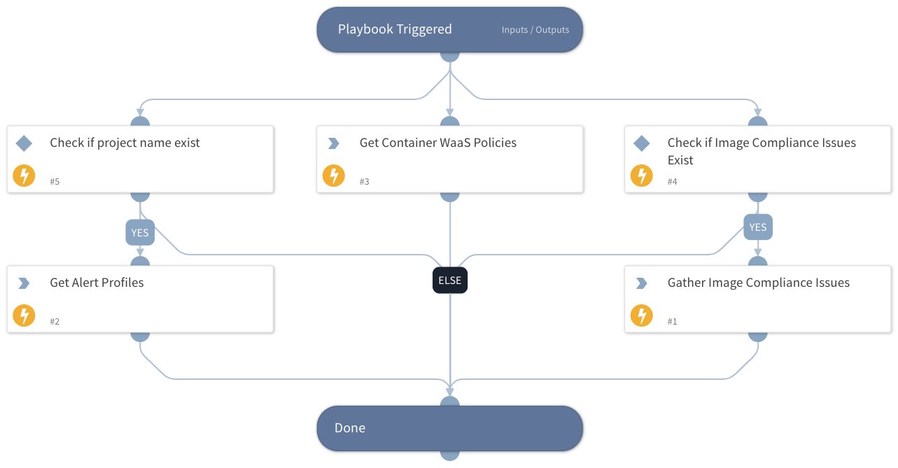

This is a sub-playbook of the "Prisma Cloud Compute - Audit Alert v2" playbook.
Retrieves the following information:
- Alert profiles
- Container WAAS policies
- Image compliance issues.

## Dependencies

This playbook uses the following sub-playbooks, integrations, and scripts.

### Sub-playbooks

This playbook does not use any sub-playbooks.

### Integrations

PaloAltoNetworks_PrismaCloudCompute

### Scripts

ToTable

### Commands

* prisma-cloud-compute-get-waas-policies
* prisma-cloud-compute-get-alert-profiles

## Playbook Inputs

---

| **Name** | **Description** | **Default Value** | **Required** |
| --- | --- | --- | --- |
| Project | The project to get the alert profiles for. |  | Optional |
| ComplianceIssues | Compliance issues for creating the compliance table in the layout. |  | Optional |

## Playbook Outputs

---

| **Path** | **Description** | **Type** |
| --- | --- | --- |
| ComplianceTable | Table with compliance issues. | unknown |

## Playbook Image

---

