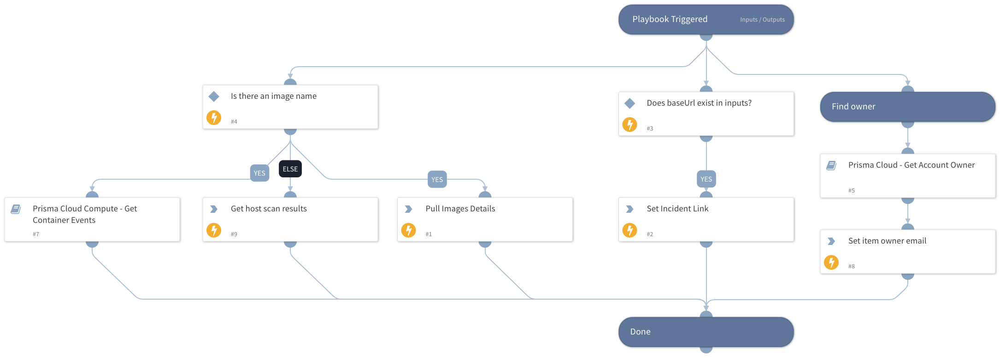

This is a sub-playbook of the "Prisma Cloud Compute - Audit Alert v2" playbook.
It does the following:
- Runs the "Prisma Cloud - Get Account Owner" playbook in order to retrieve potential owners for the alert.
- Sets the incident link to the layout.
- Pulls image details and alerts
- Pulls host scan results.

## Dependencies

This playbook uses the following sub-playbooks, integrations, and scripts.

### Sub-playbooks

* Prisma Cloud - Get Account Owner
* Prisma Cloud Compute - Get Container Events

### Integrations

PaloAltoNetworks_PrismaCloudCompute

### Scripts

This playbook does not use any scripts.

### Commands

* prisma-cloud-compute-images-scan-list
* prisma-cloud-compute-hosts-scan-list
* setIncident

## Playbook Inputs

---

| **Name** | **Description** | **Default Value** | **Required** |
| --- | --- | --- | --- |
| Hostname | The hostname to retrieve events for. Relevant only for audit events. |  | Optional |
| ImageName | The image name to retrieve events for. |  | Optional |
| AuditAlertType | The type of the audit alert. Will be used to determine whether to retrieve WAAS events or not. |  | Optional |
| BaseURL | The base URL of the Prisma Cloud Compute Instance used to create a link back to the alerts for an image. |  | Optional |
| ConsoleLink | The value of the alert's console link. Part of the original incident values. |  | Optional |
| AccountID | The cloud account ID. |  | Optional |
| Namespace | The namespace which will be used to search associated users with in the "Get Account Owner" playbook. |  | Optional |

## Playbook Outputs

---

| **Path** | **Description** | **Type** |
| --- | --- | --- |
| PrismaCloudCompute.ReportsImagesScan | Image scan results. | unknown |
| PrismaCloud.Users | Prisma Cloud users. | unknown |
| PrismaCloud.UserRoles | Prisma Cloud user roles. | unknown |
| PrismaCloud.UserRoles.associatedUsers | User roles associated users. | unknown |
| PrismaCloudCompute.ReportHostScan | Host scan results. | unknown |
| PrismaCloudCompute.ReportHostScan.complianceIssues | Number of compliance issues. | unknown |
| PrismaCloudCompute.ReportsImagesScan.complianceIssues | Number of compliance issues. | unknown |

## Playbook Image

---

