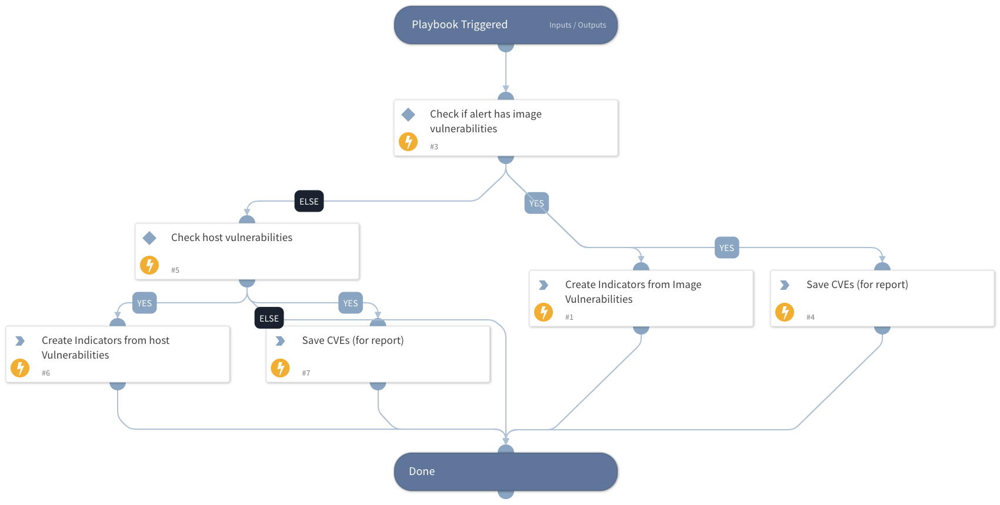

This is a sub-playbook of the "Prisma Cloud Compute - Audit Alert v2" playbook.
It creates CVE indicators based on image or host vulnerabilities. 

## Dependencies

This playbook uses the following sub-playbooks, integrations, and scripts.

### Sub-playbooks

This playbook does not use any sub-playbooks.

### Integrations

This playbook does not use any integrations.

### Scripts

SetAndHandleEmpty

### Commands

createNewIndicator

## Playbook Inputs

---

| **Name** | **Description**                                                                                                                                                                                                                               | **Default Value** | **Required** |
| --- |-----------------------------------------------------------------------------------------------------------------------------------------------------------------------------------------------------------------------------------------------| --- | --- |
| ImageVulnerabilities | Image vulnerabilities that were retrieved.                                                                                                                                                                                                    |  | Optional |
| HostVulnerabilities | Host vulnerabilities that were retrieved.                                                                                                                                                                                                     |  | Optional |
| CVEsIndicatorsSeverities | A list of the image or host CVE severities that the playbook creates indicators from. Available options \(not case sensitive\): - Critical - High - Medium - Low - Negligible  Default value: high, critical. | High, Critical | Optional |

## Playbook Outputs

---

| **Path** | **Description** | **Type** |
| --- | --- | --- |
| CVEReport | CVE report. | unknown |

## Playbook Image

---

