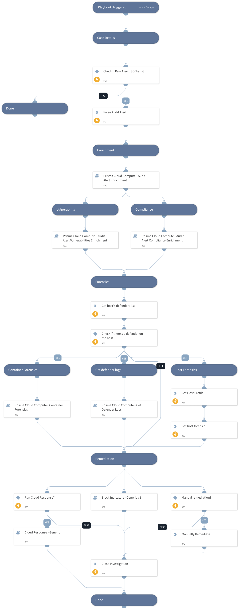

Default playbook for parsing and enrichment of Prisma Cloud Compute audit alerts.

## Dependencies

This playbook uses the following sub-playbooks, integrations, and scripts.

### Sub-playbooks

This playbook does not use any sub-playbooks.

### Integrations

PaloAltoNetworks_PrismaCloudCompute

### Scripts

* PrismaCloudComputeParseAuditAlert
* ToTable

### Commands

* prisma-cloud-compute-logs-defender
* prisma-cloud-compute-images-scan-list
* prisma-cloud-compute-get-waas-policies
* prisma-cloud-compute-profile-container-list
* setIncident
* prisma-cloud-compute-profile-container-forensic-list
* findIndicators
* createNewIndicator
* prisma-cloud-compute-logs-defender-download
* prisma-cloud-compute-host-forensic-list
* prisma-cloud-compute-get-backups
* prisma-cloud-compute-profile-host-list
* prisma-cloud-compute-get-audit-firewall-container-alerts
* prisma-cloud-compute-defenders-list
* closeInvestigation
* prisma-cloud-compute-get-alert-profiles

## Playbook Inputs

---

| **Name** | **Description** | **Default Value** | **Required** |
| --- | --- | --- | --- |
| baseUrl | The base URL of the Prisma Cloud Compute Instance used to create a link back to the alerts for an image. | https://app.prismacloud.io | Optional |
| Project | A specific project name to get alert profiles for | PrismaCloudCompute.AlertProfiles.ServiceNow.Project | Optional |

## Playbook Outputs

---
There are no outputs for this playbook.

## Playbook Image

---

