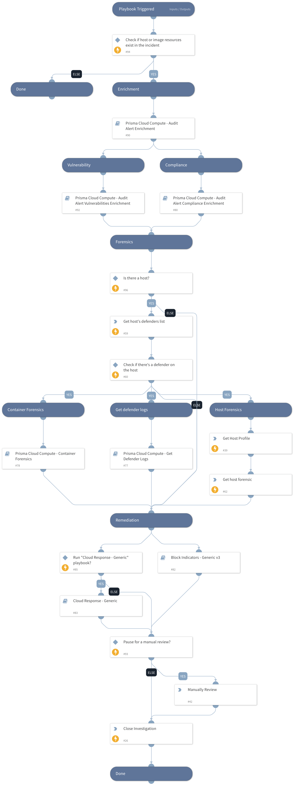

Default playbook for parsing and enrichment of Prisma Cloud Compute audit alerts.
The playbook has the following sections:
Enrichment:
- Image details
- Similar container events
- Owner details
- Vulnerabilities
- Compliance details
- Forensics
- Defender logs.

Remediation:
- Block Indicators - Generic v3
- Cloud Response - Generic
- Manual Remediation

Currently, the playbook supports incidents created by **Runtime** and **WAAS** triggers.

## Dependencies

This playbook uses the following sub-playbooks, integrations, and scripts.

### Sub-playbooks

* Prisma Cloud Compute - Audit Alert Vulnerabilities Enrichment
* Cloud Response - Generic
* Block Indicators - Generic v3
* Prisma Cloud Compute - Audit Alert Enrichment
* Prisma Cloud Compute - Container Forensics
* Prisma Cloud Compute - Get Defender Logs
* Prisma Cloud Compute - Audit Alert Compliance Enrichment

### Integrations

PaloAltoNetworks_PrismaCloudCompute

### Scripts

PrismaCloudComputeParseAuditAlert

### Commands

* prisma-cloud-compute-profile-host-list
* prisma-cloud-compute-host-forensic-list
* prisma-cloud-compute-defenders-list
* closeInvestigation

## Playbook Inputs

---

| **Name** | **Description** | **Default Value** | **Required** |
| --- | --- | --- | --- |
| baseUrl | The base URL of the Prisma Cloud Compute Instance used to create a link back to the alerts for an image. | https://app.prismacloud.io | Optional |
| Project | A specific project name to get alert profiles for | PrismaCloudCompute.AlertProfiles.ServiceNow.Project | Optional |
| AutoBlockIndicators | Relevant to the "Block Indicators - Generic v3" playbook. Possible values: True/False.  Default: True. Should the given indicators be automatically blocked, or should the user be given the option to choose?  If set to False - no prompt will appear, and all provided indicators will be blocked automatically. If set to True - the user will be prompted to select which indicators to block. | False | Optional |
| autoResourceRemediation | Relevant to the "Cloud Response - Generic playbook". Whether to execute the resource remediation flow automatically. Available options: - True - False | False | Optional |
| resourceRemediationType | Relevant to the "Cloud Response - Generic playbook". Available options: - Stop - Delete  | Stop | Optional |
| autoAccessKeyRemediation | Relevant to the "Cloud Response - Generic playbook". Whether to execute the access key remediation flow automatically. Available options: - True - False | False | Optional |
| accessKeyRemediationType | Relevant to the "Cloud Response - Generic playbook". Choose the remediation type for the user's access key. Available types: Disable - for disabling the user's access key. Delete - for the user's access key deletion. | Disable | Optional |
| userRemediationType | Relevant to the "Cloud Response - Generic playbook". Whether to execute the user remediation flow automatically. Choose the remediation type for the user involved.  - Disable - for disabling the user \(GCP \+ Azure\) or revoking the user's credentials \(AWS\). - Delete - for deleting the user. | Disable | Optional |
| autoUserRemediation | Relevant to the "Cloud Response - Generic playbook". Whether to execute the user remediation flow automatically. Available options: - True - False | False | Optional |
| CloudResponseFlow | Whether to run the Cloud Response - Generic playbook. Available options: - True - False | True | Optional |
| ManualRemediation | Whether to allow the analyst to manually review the alert before the playbook ends. Available options: - True - False |  | Optional |

## Playbook Outputs

---
There are no outputs for this playbook.

## Playbook Image

---

