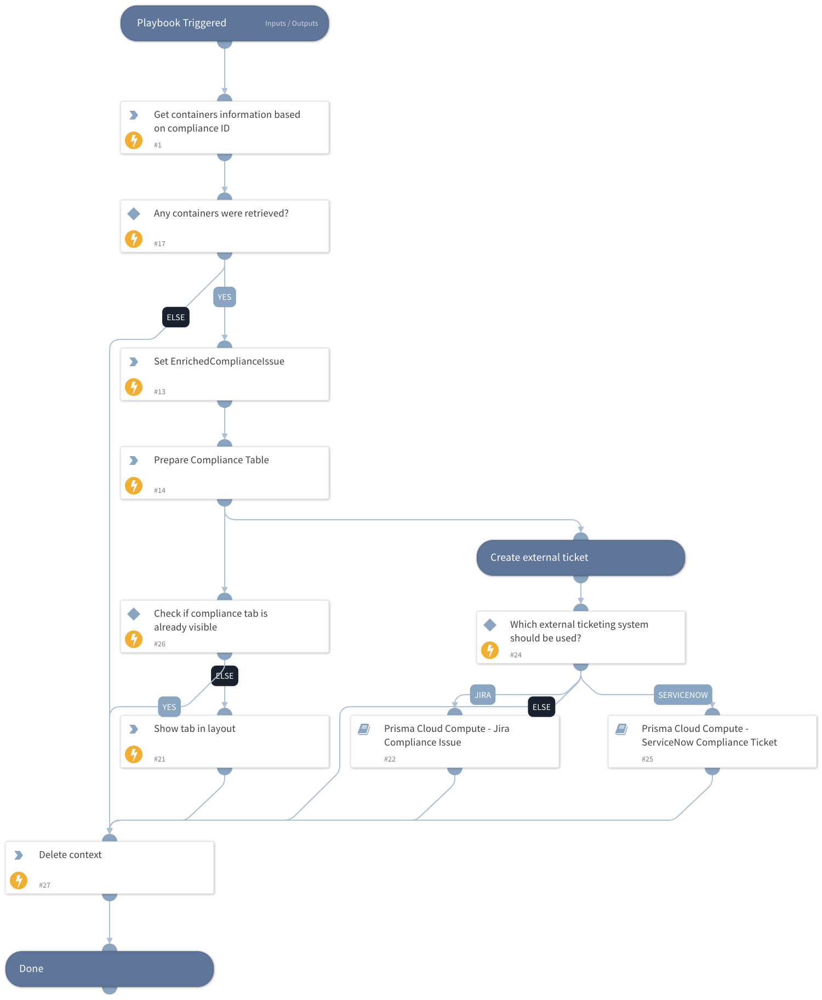

This is a sub playbook of the "Prisma Cloud Compute - Compliance Alert v2" playbook.
It will loop through all of the given compliance issue IDs and will retrieve the following information for each affected container based on the compliance issue ID:
- Container ID
- Compliance Issues
- Compliance Distribution
- Hostname
- Image Name
- Cloud MetaData

The enriched information will be displayed in the layout in a dedicated table under the "Container Compliance Information" tab.

## Dependencies

This playbook uses the following sub-playbooks, integrations, and scripts.

### Sub-playbooks

* Prisma Cloud Compute - Jira Compliance Issue
* Prisma Cloud Compute - ServiceNow Compliance Ticket

### Integrations

* PaloAltoNetworks_PrismaCloudCompute

### Scripts

* PrismaCloudComputeComplianceTable
* SetAndHandleEmpty
* DeleteContext

### Commands

* prisma-cloud-compute-container-scan-results-list
* setIncident

## Playbook Inputs

---

| **Name** | **Description** | **Default Value** | **Required** |
| --- | --- | --- | --- |
| ComplianceIssue | A compliance issue. This list is used to filter relevant containers for enrichment. |  | Optional |
| LastComplianceID | The ID of the last compliance issue fetched in the incidents. Used to know when to set the output after the loops end. |  | Optional |
| TicketingSystem | Which ticketing system should be used to create an external ticket. Available options: - Jira - ServiceNow  If none of the above selected, no external ticket will get created. For Jira, please also set the "JiraProjectName" and "JiraIssueTypeName" playbook inputs. |  | Optional |
| JiraIssueTypeName | Issue type name. For example: "Task". |  | Optional |
| JiraProjectName | The project name with which to associate the issue. |  | Optional |

## Playbook Outputs

---

| **Path** | **Description** | **Type** |
| --- | --- | --- |
| ComplianceTableOutput | Compliance issues table. | unknown |

## Playbook Image

---

