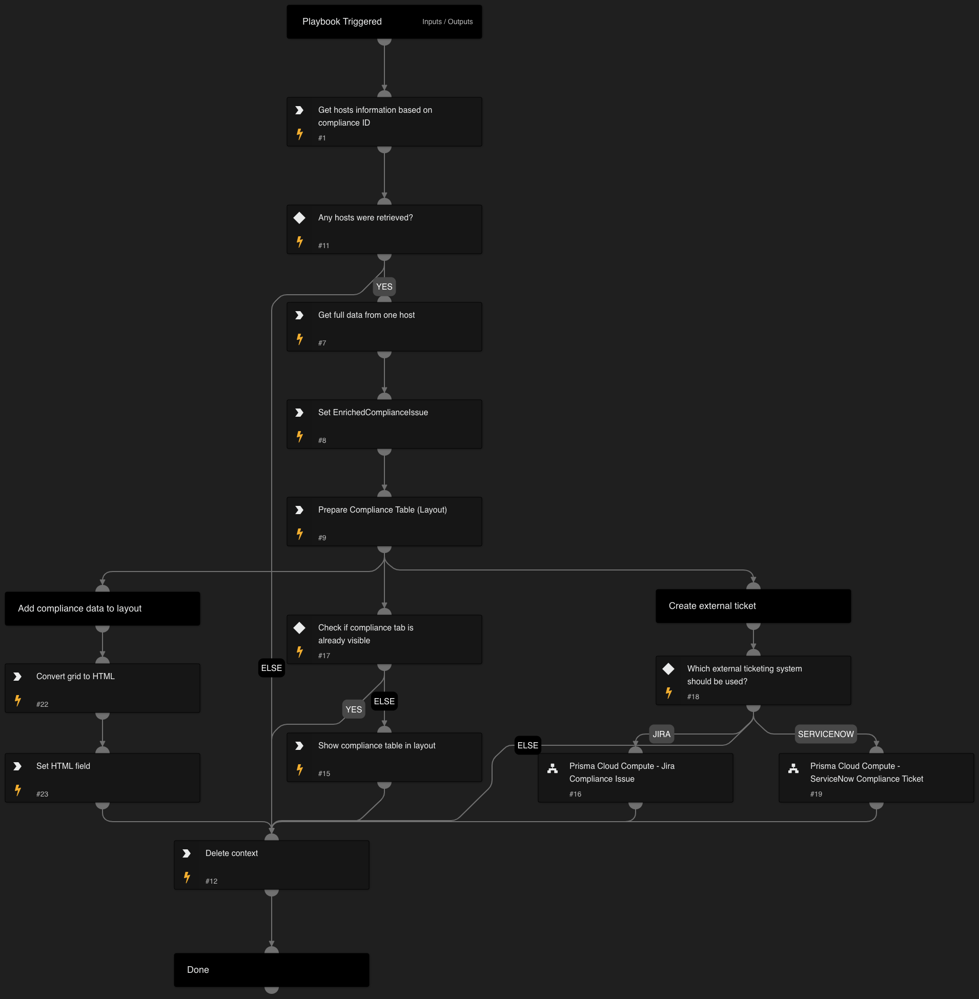

This is a sub-playbook of the "Prisma Cloud Compute - Compliance Alert v2" playbook.
It will loop through all of the given compliance issue IDs and will retrieve the following information for each affected host based on the compliance issue ID:
- Hostname
- Compliance Issues
- Compliance Distribution
- Cloud MetaData

The enriched information will be displayed in the layout in a dedicated table under the "Host Compliance Information" tab.

## Dependencies

This playbook uses the following sub-playbooks, integrations, and scripts.

### Sub-playbooks

* Prisma Cloud Compute - Jira Compliance Issue
* Prisma Cloud Compute - ServiceNow Compliance Ticket

### Integrations

PaloAltoNetworks_PrismaCloudCompute

### Scripts

* DeleteContext
* SetAndHandleEmpty
* PrismaCloudComputeComplianceTable

### Commands

* setIncident
* prisma-cloud-compute-hosts-scan-list

## Playbook Inputs

---

| **Name** | **Description**                                                                                                                                                                                                                                                                                      | **Default Value** | **Required** |
| --- |------------------------------------------------------------------------------------------------------------------------------------------------------------------------------------------------------------------------------------------------------------------------------------------------------| --- | --- |
| ComplianceIssueID | A compliance issue ID. This ID is used to filter relevant hostnames for enrichment.                                                                                                                                                                                                                  |  | Optional |
| TicketingSystem | Which ticketing system should be used to create an external ticket. Available options: - Jira - ServiceNow  If neither of the above are selected, no external ticket will be created. For Jira, also set the "JiraProjectName" and "JiraIssueTypeName" playbook inputs.  |  | Optional |
| JiraIssueTypeName | Issue type name. For example: "Task".                                                                                                                                                                                                                                                                |  | Optional |
| JiraProjectName | The project name with which to associate the issue.                                                                                                                                                                                                                                                  |  | Optional |

## Playbook Outputs

---
There are no outputs for this playbook.

## Playbook Image

---

