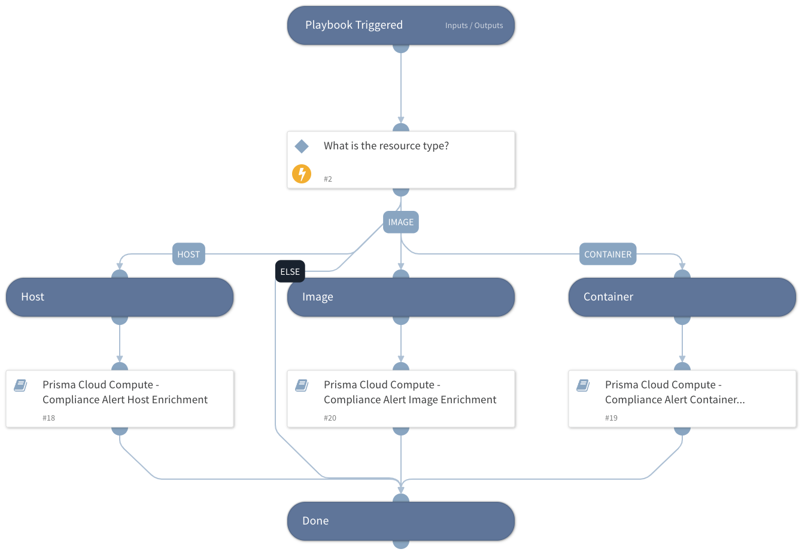

Playbook for enriching Prisma Cloud Compute compliance alerts.
It will handle hosts, images and container compliance alerts.
Each sub-playbook in this playbook is dedicated to a specific resource type: host, container or image, and will loop through all of the retrieved Compliance Issue IDs in order to retrieve enriched information about each of the resources.
The enriched information will be displayed in the layout under dedicated tabs and includes resources information like hostnames, container ID, image ID, cloud provider info, enriched compliance issue details and more.

In addition, the playbook can create and update external ticketing systems for each compliance issue automatically with the relevant enriched information. In order to do so, fill the relevant playbook inputs.

## Dependencies

This playbook uses the following sub-playbooks, integrations, and scripts.

### Sub-playbooks

* Prisma Cloud Compute - Compliance Alert Container Enrichment Loop
* Prisma Cloud Compute - Compliance Alert Image Enrichment Loop
* Prisma Cloud Compute - Compliance Alert Host Enrichment Loop

### Integrations

This playbook does not use any integrations.

### Scripts

This playbook does not use any scripts.

### Commands

This playbook does not use any commands.

## Playbook Inputs

---

| **Name** | **Description**                                                                                                                                                                                                                                                                                      | **Default Value** | **Required** |
| --- |------------------------------------------------------------------------------------------------------------------------------------------------------------------------------------------------------------------------------------------------------------------------------------------------------| --- | --- |
| TicketingSystem | Which ticketing system should be used to create an external ticket. Available options: - Jira - ServiceNow  If neither of the above are selected, no external ticket will be created. For Jira, also set the "JiraProjectName" and "JiraIssueTypeName" playbook inputs.  |  | Optional |
| JiraIssueTypeName | Issue type name. For example: "Task".                                                                                                                                                                                                                                                                |  | Optional |
| JiraProjectName | The project name with which to associate the issue.                                                                                                                                                                                                                                                  |  | Optional |

## Playbook Outputs

---
There are no outputs for this playbook.

## Playbook Image

---

