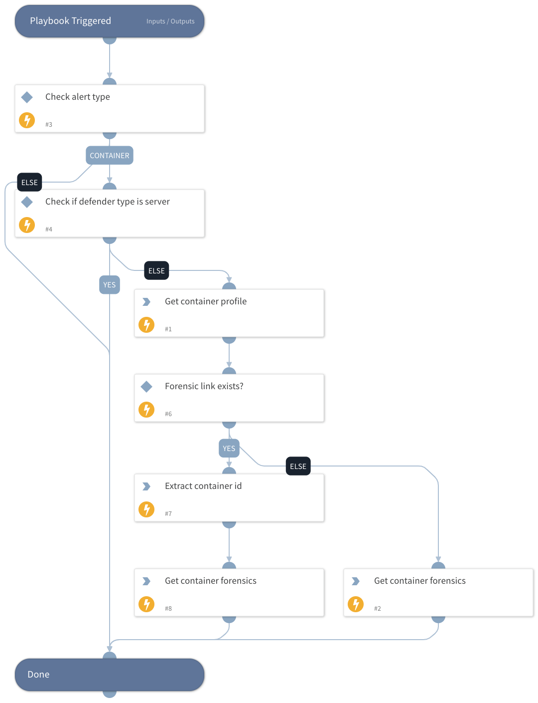

This is a sub-playbook of the "Prisma Cloud Compute - Audit Alert v2" playbook.
Gets the container profile and forensics.

## Dependencies

This playbook uses the following sub-playbooks, integrations, and scripts.

### Sub-playbooks

This playbook does not use any sub-playbooks.

### Integrations

PaloAltoNetworks_PrismaCloudCompute

### Scripts

SetAndHandleEmpty

### Commands

* prisma-cloud-compute-profile-container-list
* prisma-cloud-compute-profile-container-forensic-list

## Playbook Inputs

---

| **Name** | **Description**                              | **Default Value** | **Required** |
| --- |----------------------------------------------| --- | --- |
| AuditAlertType | The audit alert type.                        |  | Optional |
| Image | Image name.                                  |  | Optional |
| DefenderType | The defender type.                           |  | Optional |
| AlertCluster | The alert's cluster name.                    |  | Optional |
| Hostname | The hostname.                                |  | Optional |
| ForensicLink | This link exists in audit runtime incidents. |  | Optional |

## Playbook Outputs

---
There are no outputs for this playbook.

## Playbook Image

---

