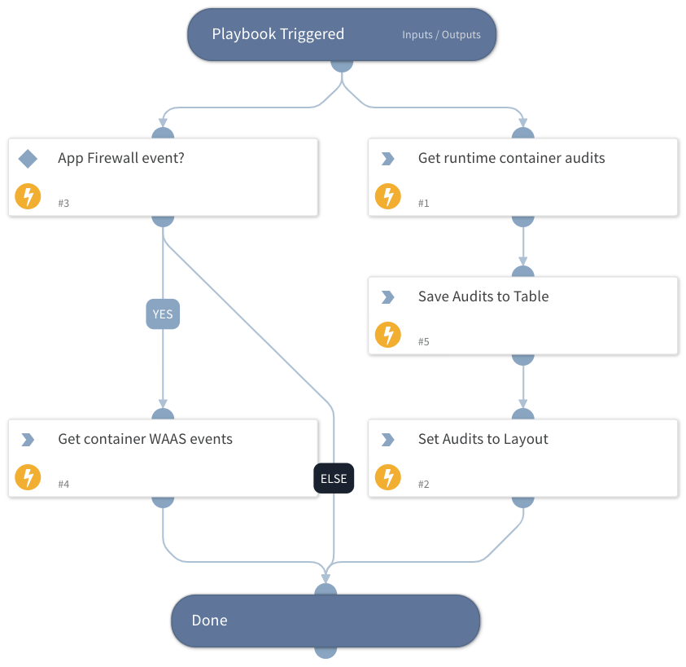

This is a sub-playbook of the "Prisma Cloud Compute - Audit Alert v2" playbook.
- Get container runtime or WAAS events and set it in the layout.

## Dependencies

This playbook uses the following sub-playbooks, integrations, and scripts.

### Sub-playbooks

This playbook does not use any sub-playbooks.

### Integrations

PaloAltoNetworks_PrismaCloudCompute

### Scripts

ToTable

### Commands

* prisma-cloud-compute-runtime-container-audit-events-list
* setIncident
* prisma-cloud-compute-get-audit-firewall-container-alerts

## Playbook Inputs

---

| **Name** | **Description** | **Default Value** | **Required** |
| --- | --- | --- | --- |
| hostname | The hostname to retrieve events for. Relevant only for audit events. |  | Optional |
| ImageName | The image name to retrieve events for. |  | Optional |
| AuditAlertType | The type of the audit alert. Will be used to determine whether to retrieve WAAS events or not. |  | Optional |

## Playbook Outputs

---
There are no outputs for this playbook.

## Playbook Image

---

