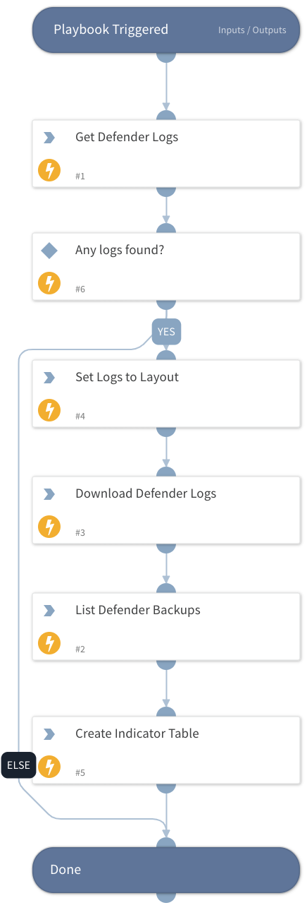

This is a sub-playbook of the “Prisma Cloud Compute - Audit Alert v2” playbook.
- Gets defender logs and sets them to layout
- Downloads defender logs
- Gets defender backups

## Dependencies

This playbook uses the following sub-playbooks, integrations, and scripts.

### Sub-playbooks

This playbook does not use any sub-playbooks.

### Integrations

PaloAltoNetworks_PrismaCloudCompute

### Scripts

ToTable

### Commands

* prisma-cloud-compute-logs-defender
* prisma-cloud-compute-get-backups
* findIndicators
* prisma-cloud-compute-logs-defender-download

## Playbook Inputs

---

| **Name** | **Description** | **Default Value** | **Required** |
| --- | --- | --- | --- |
| Hostname | The Defender hostname. Can be retrieved from the "prisma-cloud-compute-defenders-list" command. |  | Optional |
| Project | The project to retrieve the backups from. |  | Optional |

## Playbook Outputs

---
There are no outputs for this playbook.

## Playbook Image

---

