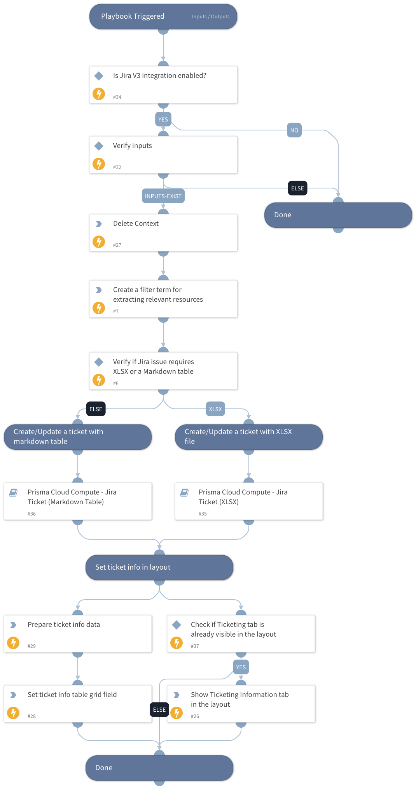

This playbook is a sub-playbook of the "Prisma Cloud Compute - Compliance Alert Host Enrichment Loop" playbook.
It creates a new Jira issue or updates an existing Jira issue for each compliance ID retrieved in the original Prisma Cloud compliance alert, with enriched data for each resource (host, image or container).

## Dependencies

This playbook uses the following sub-playbooks, integrations, and scripts.

### Sub-playbooks

* Prisma Cloud Compute - Jira Ticket (XLSX)
* Prisma Cloud Compute - Jira Ticket (Markdown Table)

### Integrations

This playbook does not use any integrations.

### Scripts

* DeleteContext
* IsIntegrationAvailable
* SetAndHandleEmpty
* SetGridField

### Commands

setIncident

## Playbook Inputs

---

| **Name** | **Description**                                                                                                                                                                                                                                                                                                                                                                                                               | **Default Value** | **Required** |
| --- |-------------------------------------------------------------------------------------------------------------------------------------------------------------------------------------------------------------------------------------------------------------------------------------------------------------------------------------------------------------------------------------------------------------------------------| --- | --- |
| ComplianceIssueID | The compliance issue ID to open a Jira issue for.                                                                                                                                                                                                                                                                                                                                                                             |  | Optional |
| ComplianceIssueDescription | The compliance issue description.                                                                                                                                                                                                                                                                                                                                                                                             |  | Optional |
| ComplianceIssueSeverity | The compliance issue severity.                                                                                                                                                                                                                                                                                                                                                                                                |  | Optional |
| AttachFileByDefault | Whether to create the Jira issue with an XLSX file by default.  Available options:  False - The playbook will create the issue with a markdown table containing the compliance issues. In case the table is too big \(32,000 characters and above\), it will create the Jira issue with an attached XLSX file.  True - The playbook will create the Jira issue with an attached XLSX file by default. |  | Optional |
| JiraProjectName | Issue type name. For example: "Task".                                                                                                                                                                                                                                                                                                                                                                                         |  | Optional |
| JiraIssueTypeName | The project name with which to associate the issue.                                                                                                                                                                                                                                                                                                                                                                           |  | Optional |

## Playbook Outputs

---
There are no outputs for this playbook.

## Playbook Image

---

