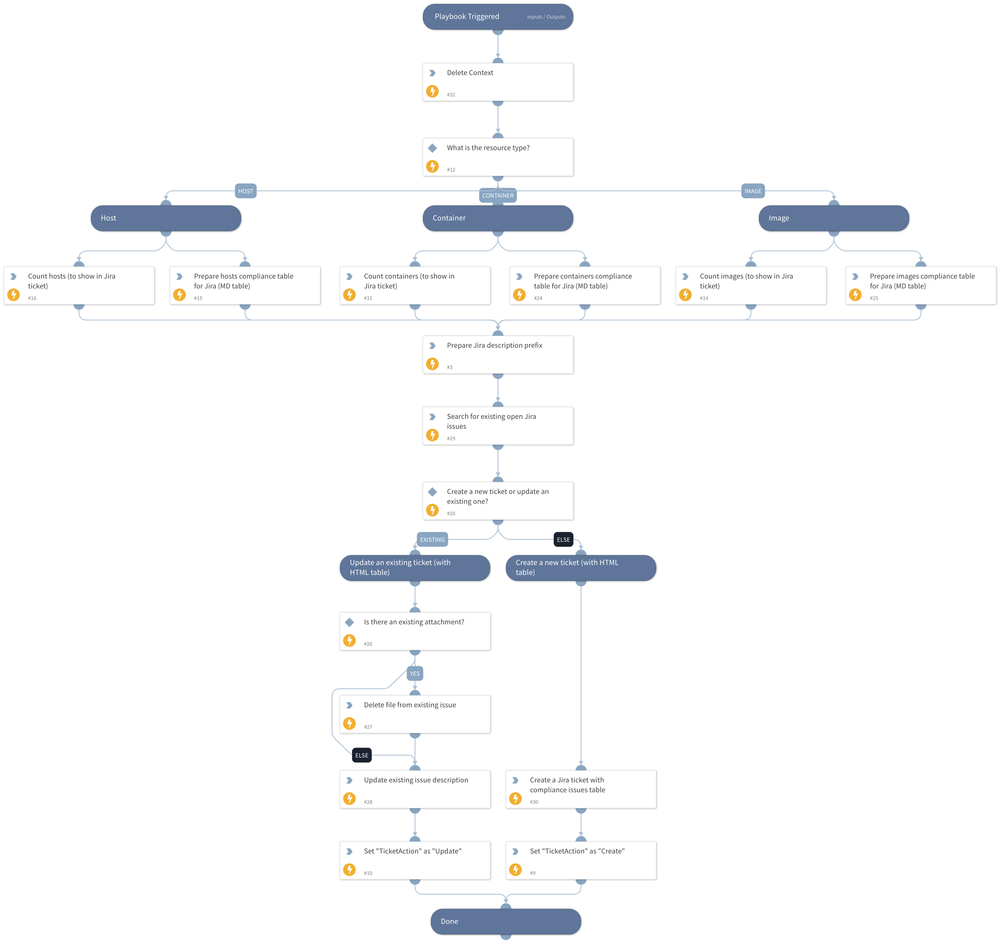

This playbook is a sub-playbook of the "Prisma Cloud Compute - Jira Compliance Issue" playbook.
It creates a new Jira issue or updates an existing Jira issue with a markdown table for the given compliance ID retrieved from the parent playbook, with enriched data for each resource (host, image or container).

## Dependencies

This playbook uses the following sub-playbooks, integrations, and scripts.

### Sub-playbooks

This playbook does not use any sub-playbooks.

### Integrations

This playbook does not use any integrations.

### Scripts

* SetAndHandleEmpty
* DeleteContext

### Commands

* jira-create-issue
* jira-issue-query
* jira-edit-issue
* jira-issue-delete-file

## Playbook Inputs

---

| **Name** | **Description**                                                                        | **Default Value** | **Required** |
| --- |----------------------------------------------------------------------------------------| --- | --- |
| Filter | A filter to use for extracting affected resources with a specific compliance issue ID. |  | Optional |
| ComplianceIssueID | The compliance issue ID to open a ServiceNow ticket for.                               |  | Optional |
| ComplianceIssueDescription | The compliance issue description.                                                      |  | Optional |
| ComplianceIssueSeverity | The compliance issue severity.                                                         |  | Optional |
| JiraIssueTypeName |                                                                                        |  | Optional |
| JiraProjectName |                                                                                        |  | Optional |

## Playbook Outputs

---

| **Path** | **Description** | **Type** |
| --- | --- | --- |
| TicketAction | The ticket action - create or update. | string |
| Ticket | The ticket object which was created or updated. | string |

## Playbook Image

---

