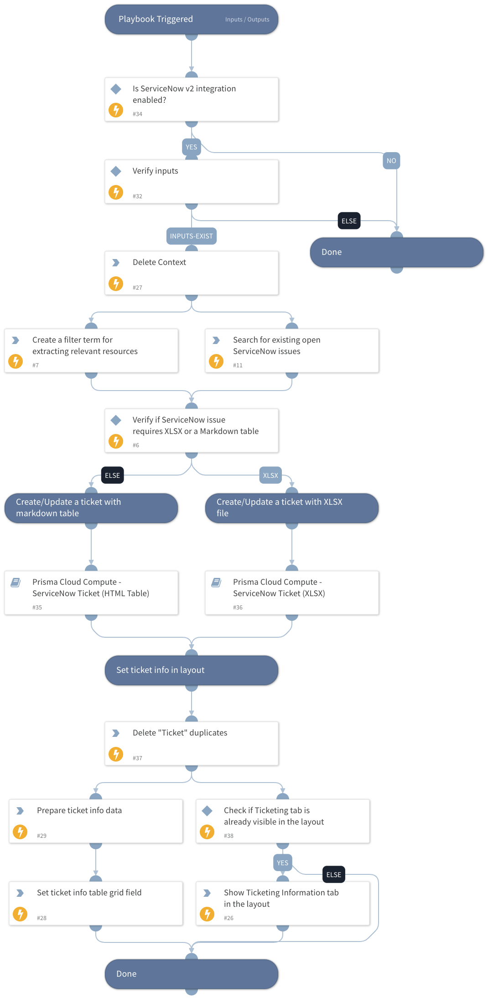

This playbook is a sub-playbook of the "Prisma Cloud Compute - Compliance Alert Host Enrichment Loop" playbook.
It creates a new ServiceNow ticket or updates an existing ServiceNow ticket for each compliance ID retrieved in the original Prisma Cloud compliance alert, with enriched data for each resource (host, image or container).

## Dependencies

This playbook uses the following sub-playbooks, integrations, and scripts.

### Sub-playbooks

* Prisma Cloud Compute - ServiceNow Ticket (HTML Table)
* Prisma Cloud Compute - ServiceNow Ticket (XLSX)

### Integrations

This playbook does not use any integrations.

### Scripts

* DeleteContext
* IsIntegrationAvailable
* SetGridField
* SetAndHandleEmpty

### Commands

* setIncident
* servicenow-query-tickets

## Playbook Inputs

---

| **Name** | **Description**                                                                                                                                                                                                                                                                                                                                                                                                                                  | **Default Value** | **Required** |
| --- |--------------------------------------------------------------------------------------------------------------------------------------------------------------------------------------------------------------------------------------------------------------------------------------------------------------------------------------------------------------------------------------------------------------------------------------------------| --- | --- |
| ComplianceIssueID | The compliance issue ID to open a ServiceNow ticket for.                                                                                                                                                                                                                                                                                                                                                                                         |  | Optional |
| ComplianceIssueDescription | The compliance issue description to open a ServiceNow ticket for.                                                                                                                                                                                                                                                                                                                                                                                |  | Optional |
| ComplianceIssueSeverity | The compliance issue severity.                                                                                                                                                                                                                                                                                                                                                                                                                   |  | Optional |
| AttachFileByDefault | Whether to create the ServiceNow ticket with an XLSX file by default.  Available options:  False - The playbook will create/update the ticket with an HTML table containing the compliance issues. In case the table is too big \(32,000 characters and above\), it will create the Jira issue with an attached XLSX file.  True - The playbook will create the ServiceNow ticket with an attached XLSX file by default. | False | Optional |

## Playbook Outputs

---
There are no outputs for this playbook.

## Playbook Image

---

