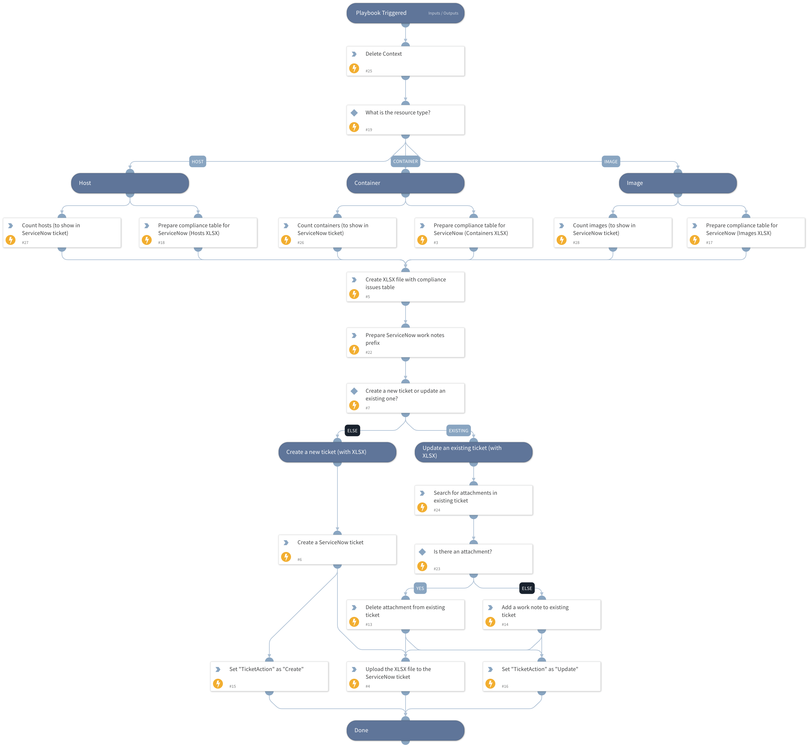

This playbook is a sub-playbook of the "Prisma Cloud Compute - ServiceNow Compliance Ticket" playbook.
It creates a new ServiceNow ticket or updates an existing ServiceNow ticket with an XLSX file for the given compliance ID retrieved from the parent playbook, with enriched data for each resource (host, image or container).

## Dependencies

This playbook uses the following sub-playbooks, integrations, and scripts.

### Sub-playbooks

This playbook does not use any sub-playbooks.

### Integrations

This playbook does not use any integrations.

### Scripts

* DeleteContext
* SetAndHandleEmpty
* ExportToXLSX

### Commands

* servicenow-update-ticket
* servicenow-create-ticket
* servicenow-delete-file
* servicenow-upload-file
* servicenow-query-table

## Playbook Inputs

---

| **Name** | **Description**                                                                                 | **Default Value** | **Required** |
| --- |-------------------------------------------------------------------------------------------------| --- | --- |
| TicketID | Existing ticket ID. Used to determine whether to create a new ticket or update an existing one. |  | Optional |
| Filter | A filter to use for extracting affected resources with a specific compliance issue ID.          |  | Optional |
| ComplianceIssueID | The compliance issue ID to open a ServiceNow ticket for.                                        |  | Optional |
| ComplianceIssueDescription | The compliance issue description.                                                               |  | Optional |
| ComplianceIssueSeverity | The compliance issue severity.                                                                  |  | Optional |

## Playbook Outputs

---

| **Path** | **Description** | **Type** |
| --- | --- | --- |
| TicketAction | The ticket action - create or update. | string |
| Ticket | The ticket object which was created or updated. | string |

## Playbook Image

---

