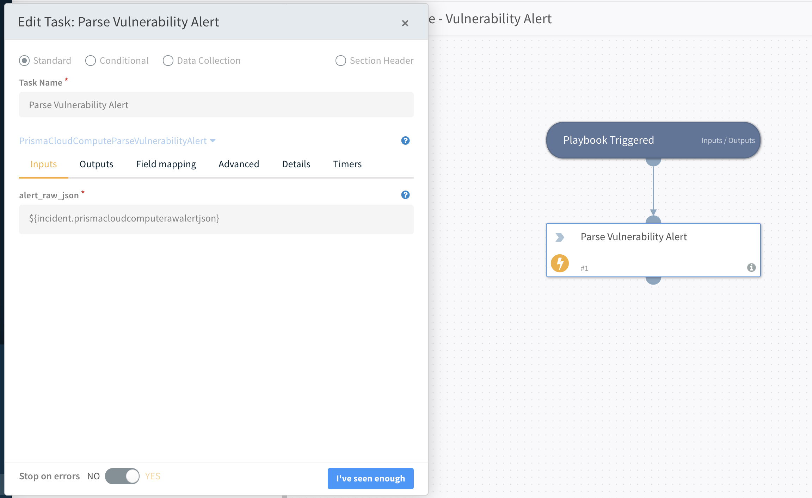
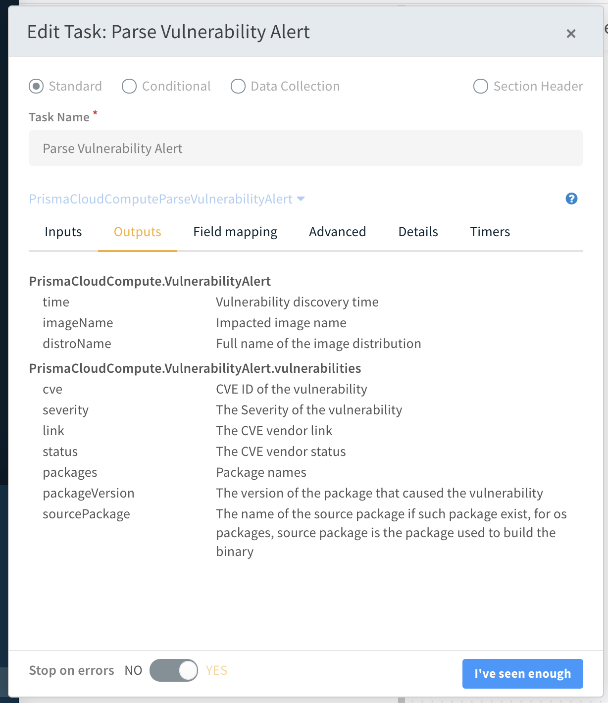
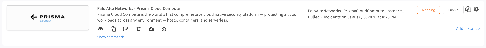

# Prisma Cloud Compute
This pack includes Cortex XSIAM content.

<~XSIAM>
## Overview

This integration lets you import **Palo Alto Networks - Prisma Cloud Compute** alerts into Cortex XSIAM.

## Use Cases

Manage Prisma Cloud Compute alerts in Cortex XSIAM.
You can create new playbooks, or extend the default ones, to analyze alerts, assign tasks based on your analysis, and open tickets on other platforms.

## Configure Prisma Cloud Compute

Configure Prisma Cloud Compute to send alerts to Cortex XSIAM by creating an alert profile.

1. Log in to your Prisma Cloud Compute console. On new Prisma Cloud versions, go to **Runtime Security**.
1. Navigate to **Manage > Alerts**.
1. Create a new alert profile by clicking **Add Profile**.
1. Provide a name, select **Cortex** from the provider list, and select **XSOAR** under Application.
1. Select the alert triggers. Alert triggers specify which alerts are sent to Cortex XSIAM.
1. Click **Save** to save the alert profile.

## Configure Cortex XSIAM

1. Navigate to **Settings > Integrations > Instances**.
1. Search for **Prisma Cloud Compute**.
1. Click **Add instance** to create and configure a new integration.
   * **Name**: Name for the integration.
   * **Fetches incidents**: Configures this integration instance to fetch alerts from Prisma Cloud Compute.
   * **Prisma Cloud Compute Console URL**: URL address of your Prisma Cloud Compute console. Copy the address from the alert profile created in Prisma Cloud Compute, or under **Runtime Security** copy the address from **System > Utilities > Path to Console**.
   * **Prisma Cloud Compute Project Name (if applies)**: If using projects in Prisma Cloud Compute, enter the project name here. Copy the project name from the alert profile created in Prisma Cloud Compute.
   * **Trust any certificate (not secure)**: Skips verification of the CA certificate (not recommended).
   * **Use system proxy settings**: Uses the system's proxy settings.
   * **Credentials**: Prisma Cloud Compute login credentials.
   * **Prisma Cloud Compute CA Certificate**: CA Certificate used by Prisma Cloud Compute. Copy the certificate from the alert profile created in Prisma Cloud Compute.
4. Click **Test** to validate the integration.
5. Click **Done** to save the integration.

## Using the integration and scripts

The integration ships with four default playbooks:
* **Prisma Cloud Compute - Audit Alert v3**
* **Prisma Cloud Compute - Cloud Discovery Alert**
* **Prisma Cloud Compute - Compliance Alert v2**
* **Prisma Cloud Compute - Vulnerability Alert**

Two of the above playbooks - _Cloud Discovery Alert_ and _Vulnerability Alert_, contain a single script. The script in each playbook encodes the raw JSON alerts into Cortex XSIAM objects that can then be used in the playbooks. The scripts are:

* **PrismaCloudComputeParseVulnerabilityAlert**
* **PrismaCloudComputeParseCloudDiscoveryAlert**

To better understand how playbooks and scripts interoperate, consider the _Prisma Cloud Compute - Vulnerability Alert_ playbook.

* When the playbook is triggered, a task called **Parse Vulnerability Alert** runs.
* The task runs the **PrismaCloudComputeParseVulnerabilityAlert** script, which takes the `prismacloudcomputerawalertjson` field of the incident (the raw JSON alert data) as input.

* Click **outputs** to see how the script transformed the raw JSON input into a Cortex XSOAR object.

At this point, you can add tasks that extend the playbook to check and respond to alerts depending on the properties of the Cortex XSOAR object.

### Audit Alert v3 playbook
This is a default playbook for parsing and enrichment of Prisma Cloud Compute audit alerts.

The playbook has the following sections:

Enrichment:
- Image details
- Similar container events
- Owner details
- Vulnerabilities
- Compliance details
- Forensics
- Defender logs

Remediation:
- Block Indicators - Generic v3
- Cloud Response - Generic
- Manual Remediation

Currently, the playbook supports incidents created by **Runtime** and **WAAS** triggers.

### Compliance Alert v2
This is a default playbook for parsing and enrichment of Prisma Cloud Compute compliance alerts.

It will handle hosts, images and container compliance alerts.
Each sub playbook in this playbook is dedicated to a specific resource type: host, container or image, and will loop through all of the retrieved Compliance Issue IDs in order to retrieve enriched information about each of the resources.
The enriched information will be displayed in the layout under dedicated tabs and includes resources information like hostnames, container ID, image ID, cloud provider info, enriched compliance issue details and more.

In addition, the playbook can create and update external ticketing systems for each compliance issue automatically with the relevant enriched information. In order to do so, fill the relevant playbook inputs

## Troubleshooting

If any alerts are missing in Cortex XSIAM, check the status of the integration:

</~XSIAM>

<~XSOAR>
## Overview

This integration lets you import **Palo Alto Networks - Prisma Cloud Compute** alerts into Cortex XSOAR.

## Use Cases

Manage Prisma Cloud Compute alerts in Cortex XSOAR.
You can create new playbooks, or extend the default ones, to analyze alerts, assign tasks based on your analysis, and open tickets on other platforms.

## Configure Prisma Cloud Compute

Configure Prisma Cloud Compute to send alerts to Cortex XSOAR by creating an alert profile.

1. Log in to your Prisma Cloud Compute console. On new Prisma Cloud versions, go to **Runtime Security**.
1. Navigate to **Manage > Alerts**.
1. Create a new alert profile by clicking **Add Profile**.
1. Provide a name, select **Cortex** from the provider list, and select **XSOAR** under Application.
1. Select the alert triggers. Alert triggers specify which alerts are sent to Cortex XSOAR.
1. Click **Save** to save the alert profile.

## Configure Cortex XSOAR

1. Navigate to **Settings > Integrations > Instances**.
1. Search for **Prisma Cloud Compute**.
1. Click **Add instance** to create and configure a new integration.
   * **Name**: Name for the integration.
   * **Fetches incidents**: Configures this integration instance to fetch alerts from Prisma Cloud Compute.
   * **Prisma Cloud Compute Console URL**: URL address of your Prisma Cloud Compute console. Copy the address from the alert profile created in Prisma Cloud Compute, or under **Runtime Security** copy the address from **System > Utilities > Path to Console**.
   * **Prisma Cloud Compute Project Name (if applies)**: If using projects in Prisma Cloud Compute, enter the project name here. Copy the project name from the alert profile created in Prisma Cloud Compute.
   * **Trust any certificate (not secure)**: Skips verification of the CA certificate (not recommended).
   * **Use system proxy settings**: Uses the system's proxy settings.
   * **Credentials**: Prisma Cloud Compute login credentials.
   * **Prisma Cloud Compute CA Certificate**: CA Certificate used by Prisma Cloud Compute. Copy the certificate from the alert profile created in Prisma Cloud Compute.
4. Click **Test** to validate the integration.
5. Click **Done** to save the integration.

## Using the integration and scripts

The integration ships with four default playbooks:
* **Prisma Cloud Compute - Audit Alert v3**
* **Prisma Cloud Compute - Cloud Discovery Alert**
* **Prisma Cloud Compute - Compliance Alert v2**
* **Prisma Cloud Compute - Vulnerability Alert**

Two of the above playbooks - _Cloud Discovery Alert_ and _Vulnerability Alert_, contain a single script. The script in each playbook encodes the raw JSON alerts into Cortex XSOAR objects that can then be used in the playbooks. The scripts are:

* **PrismaCloudComputeParseVulnerabilityAlert**
* **PrismaCloudComputeParseCloudDiscoveryAlert**

To better understand how playbooks and scripts interoperate, consider the _Prisma Cloud Compute - Vulnerability Alert_ playbook.

* When the playbook is triggered, a task called **Parse Vulnerability Alert** runs.
* The task runs the **PrismaCloudComputeParseVulnerabilityAlert** script, which takes the `prismacloudcomputerawalertjson` field of the incident (the raw JSON alert data) as input.

* Click **outputs** to see how the script transformed the raw JSON input into a Cortex XSOAR object.

At this point, you can add tasks that extend the playbook to check and respond to alerts depending on the properties of the Cortex XSOAR object.

### Audit Alert v3 playbook
This is a default playbook for parsing and enrichment of Prisma Cloud Compute audit alerts.

The playbook has the following sections:

Enrichment:
- Image details
- Similar container events
- Owner details
- Vulnerabilities
- Compliance details
- Forensics
- Defender logs

Remediation:
- Block Indicators - Generic v3
- Cloud Response - Generic
- Manual Remediation

Currently, the playbook supports incidents created by **Runtime** and **WAAS** triggers.

### Compliance Alert v2
This is a default playbook for parsing and enrichment of Prisma Cloud Compute compliance alerts.
It will handle hosts, images and container compliance alerts.
Each sub playbook in this playbook is dedicated to a specific resource type: host, container or image, and will loop through all of the retrieved Compliance Issue IDs in order to retrieve enriched information about each of the resources.
The enriched information will be displayed in the layout under dedicated tabs and includes resources information like hostnames, container ID, image ID, cloud provider info, enriched compliance issue details and more.

In addition, the playbook can create and update external ticketing systems for each compliance issue automatically with the relevant enriched information. In order to do so, fill the relevant playbook inputs

## Troubleshooting

If any alerts are missing in Cortex XSOAR, check the status of the integration:

</~XSOAR>