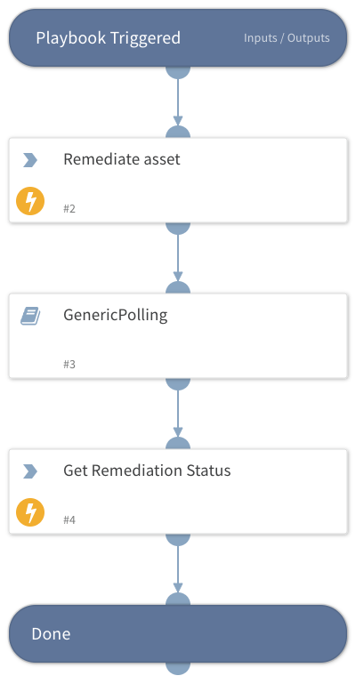

Take a remediation action over an asset:
  Use this playbook as a sub-playbook to take a remediation action on an asset. Available remediation actions are 1) Remove public sharing, 2) Quarantine, and 3) Restore.
  This playbook implements polling by continuously running the `saas-security-remediation-status-get`
    command to get the remediation status for a given asset ID, until the operation completes.

The remote action should have the following structure:
  1. Initiate the operation - provide the Asset ID and the remediation action.
  2. Poll to check if the operation completed.
  3. Get the results of the operation.

## Dependencies
This playbook uses the following sub-playbooks, integrations, and scripts.

### Sub-playbooks
* GenericPolling

### Integrations
* SaaS Security

### Scripts
This playbook does not use any scripts.

### Commands
* saas-security-remediation-status-get
* saas-security-asset-remediate

## Playbook Inputs
---

| **Name** | **Description** | **Default Value** | **Required** |
| --- | --- | --- | --- |
| asset_id | The ID of the asset to remediate |  | Required |
| remediation_type | The remediation action to take. Possible values: Remove public sharing, Quarantine, Restore. |  | Required |
| remove_inherited_sharing |  Used when remediation type is “remove_public_sharing”, when set to true, all the parent folder sharing url will be removed. |  | Optional |

## Playbook Outputs
---
There are no outputs for this playbook.

## Playbook Image
---

