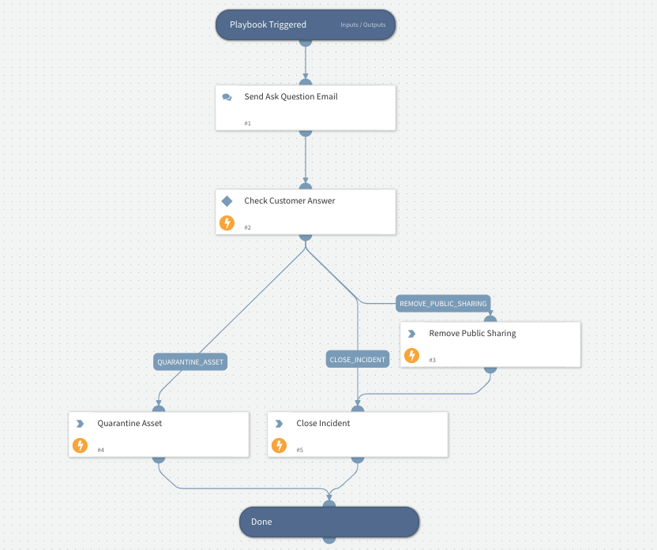

This sub-playbook will send email notification to the Saas Security Admin for taking remediation action on the incident.

## Dependencies
This playbook uses the following sub-playbooks, integrations, and scripts.

### Sub-playbooks
This playbook does not use any sub-playbooks.

### Integrations
* SaasSecurity

### Scripts
This playbook does not use any scripts.

### Commands
* saas-security-incident-state-update
* saas-security-asset-remediate

## Playbook Inputs
---

| **Name** | **Description** | **Default Value** | **Required** |
| --- | --- | --- | --- |
| email | Admin Email |  | Optional |
| incident_id | Prisma Saas Incident Id |  | Optional |
| asset_id | Prisma Saas Asset Id |  | Optional |
| asset_name | Prisma Saas Asset Name |  | Optional |

## Playbook Outputs
---
There are no outputs for this playbook.

## Playbook Image
---
