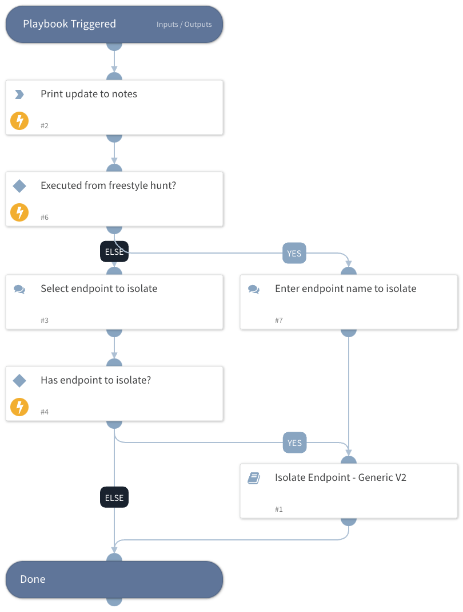

This playbook will be executed from the "Proactive Threat Hunting" layout button with the objective of isolating a host specified by the analyst.

## Dependencies

This playbook uses the following sub-playbooks, integrations, and scripts.

### Sub-playbooks

* Isolate Endpoint - Generic V2

### Integrations

This playbook does not use any integrations.

### Scripts

* Print

### Commands

This playbook does not use any commands.

## Playbook Inputs

---
There are no inputs for this playbook.

## Playbook Outputs

---
There are no outputs for this playbook.

## Playbook Image

---

