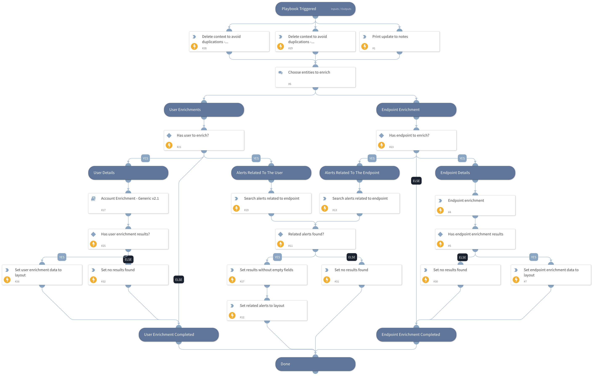

This playbook will be executed from the "Proactive Threat Hunting" layout button with the objective of enriching information on hosts and users specified by the analyst.

## Dependencies

This playbook uses the following sub-playbooks, integrations, and scripts.

### Sub-playbooks

* Account Enrichment - Generic v2.1

### Integrations

This playbook does not use any integrations.

### Scripts

* JsonToTable
* Print
* DeleteContext
* Set

### Commands

* setIncident
* endpoint
* xdr-get-alerts

## Playbook Inputs

---
There are no inputs for this playbook.

## Playbook Outputs

---
There are no outputs for this playbook.

## Playbook Image

---

