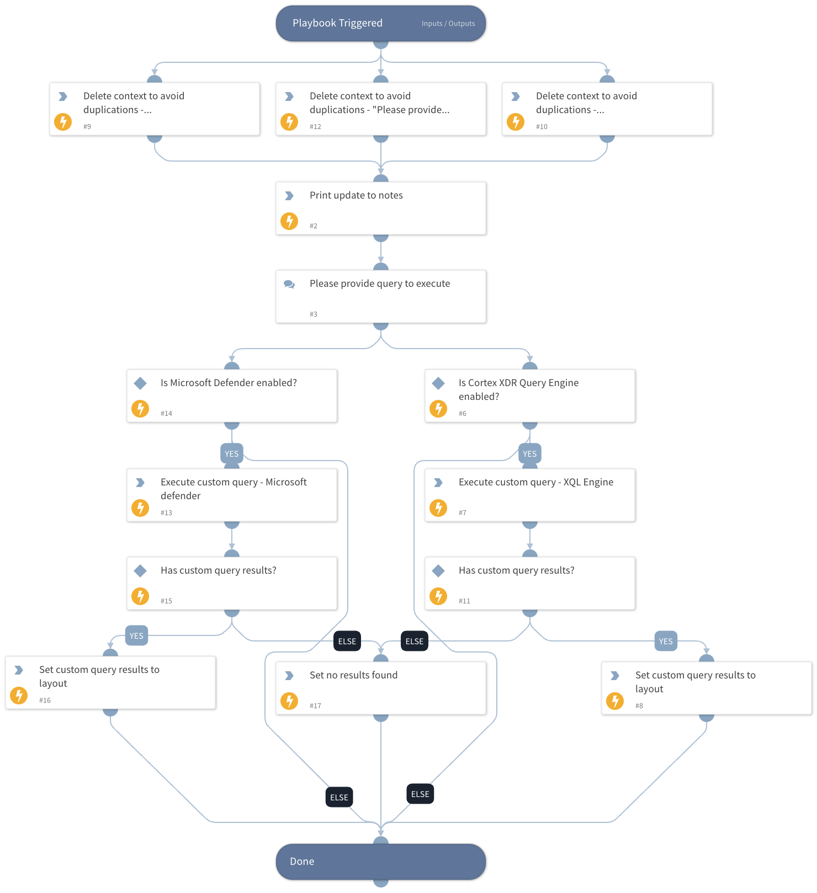

This playbook will be executed from the "Proactive Threat Hunting" layout button with the objective of executing a query that will be provided by the analyst. The playbook supports executing a query using the following integrations:

- Cortex XDR XQL Engine
- Microsoft Defender For Endpoint

## Dependencies

This playbook uses the following sub-playbooks, integrations, and scripts.

### Sub-playbooks

This playbook does not use any sub-playbooks.

### Integrations

This playbook does not use any integrations.

### Scripts

* DeleteContext
* JsonToTable
* Print

### Commands

* xdr-xql-generic-query
* setIncident
* microsoft-atp-advanced-hunting

## Playbook Inputs

---
There are no inputs for this playbook.

## Playbook Outputs

---
There are no outputs for this playbook.

## Playbook Image

---

