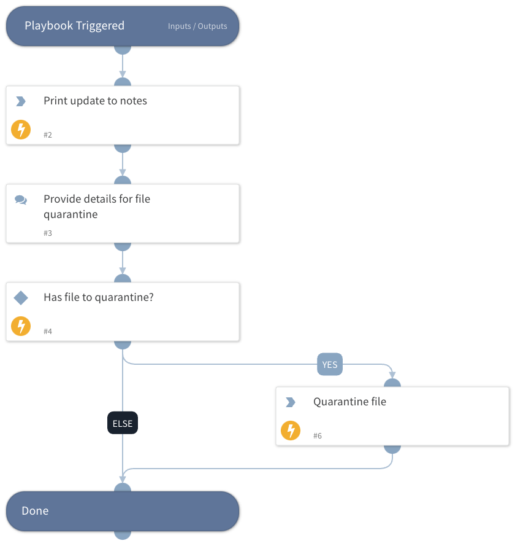

This playbook will be executed from the “Proactive Threat Hunting” layout button with the objective of quarantine a file specified by the analyst. The following integrations is supported:
- Cortex XDR IR

## Dependencies

This playbook uses the following sub-playbooks, integrations, and scripts.

### Sub-playbooks

This playbook does not use any sub-playbooks.

### Integrations

This playbook does not use any integrations.

### Scripts

* Print

### Commands

* xdr-file-quarantine

## Playbook Inputs

---
There are no inputs for this playbook.

## Playbook Outputs

---
There are no outputs for this playbook.

## Playbook Image

---

