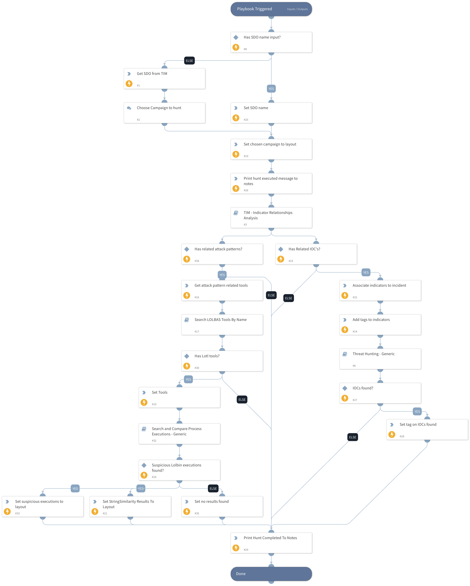

This playbook will be executed when the analyst is choosing to perform SDO hunt.
the playbook receives a SDO type indicator and executes for the following steps:

- Searches IOCs related to the SDO indicator - IPs, Hashes, Domains, URLs
- hunt for the found IOCs using "Threat Hunting - Generic" sub-playbook
- Searches Attack patterns that are related to the SDO indicator
- Searches LOLBAS tools that are related to the found attack patterns
- Hunt for Lolbin executions command-line arguments that are similar to LOLBAS  malicious commands patterns

## Dependencies

This playbook uses the following sub-playbooks, integrations, and scripts.

### Sub-playbooks

* 082cf7d6-b5a1-4298-8a8c-16779882e8fe
* a2656d24-8e5a-4381-8e88-e9081dab77af
* TIM - Indicator Relationships Analysis
* Threat Hunting - Generic

### Integrations

This playbook does not use any integrations.

### Scripts

* JsonToTable
* Set
* SearchIndicator
* Print
* SearchIndicatorRelationships

### Commands

* associateIndicatorsToIncident
* appendIndicatorField
* setIncident

## Playbook Inputs

---

| **Name** | **Description** | **Default Value** | **Required** |
| --- | --- | --- | --- |
| SDOName | The SDO name. |  | Optional |
| SDOType | The SDO type. | Campaign | Optional |
| HuntingTimeFrame | Time in relative date or range format \(for example: "1 day", "3 weeks ago", "between 2021-01-01 12:34:56 \+02:00 and 2021-02-01 12:34:56 \+02:00"\). The default is the last 24 hours. | 30 days | Optional |
| StringSimilarityThreshold |  |  | Optional |

## Playbook Outputs

---
There are no outputs for this playbook.

## Playbook Image

---

