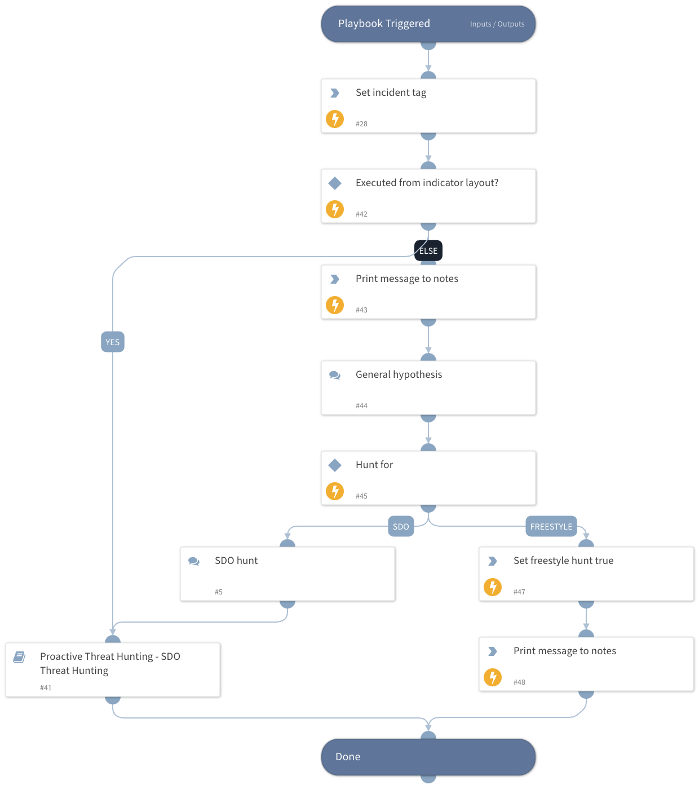

This playbook is the main playbook of the 'Proactive Threat Hunting' pack. It automatically runs during a new hunting session and guides the threat hunter through the session based on the selected hunting method. The available hunting methods are:

- SDO Hunt: Constructs the hunting hypothesis based on SDO indicators (Campaign, Malware, Intrusion Set).
- Freestyle Hunt: Allows the threat hunter to provide their own queries and IOCs for hunting.

## Dependencies

This playbook uses the following sub-playbooks, integrations, and scripts.

### Sub-playbooks

* Proactive Threat Hunting - SDO Threat Hunting

### Integrations

This playbook does not use any integrations.

### Scripts

* Print

### Commands

* setIncident

## Playbook Inputs

---

| **Name** | **Description** | **Default Value** | **Required** |
| --- | --- | --- | --- |
| IncidentTag | A tag that will be attached to Threat Hunting incidents. | Threat Hunting | Optional |
| HuntingTimeFrame | Time in relative date or range format \(for example: "1 day", "3 weeks ago", "between 2021-01-01 12:34:56 \+02:00 and 2021-02-01 12:34:56 \+02:00"\). The query execution script default is the last 24 hours. | 7 Days | Optional |
| StringSimilarityThreshold | StringSimilarity automation threshold. StringSimilarity is being used in this playbook to compare between pattern of malicious use in a tool and command-line arguments found in the environment. Please provide number between 0 and 1, where 1 represents the most similar results of string comparisons. The automation will output only the results with a similarity score equal to or greater than the specified threshold. | 0.5 | Optional |

## Playbook Outputs

---
There are no outputs for this playbook.

## Playbook Image

---

