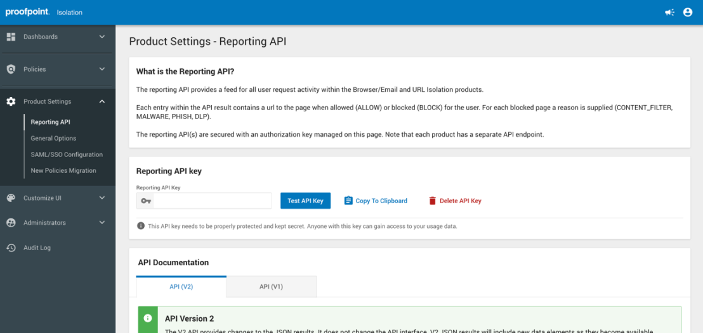

Proofpoint Isolation is an integration that supports fetching Browser and Email Isolation logs events within Cortex XSIAM.
This integration was integrated and tested with version V2 of ProofpointIsolation.

## Configure Proofpoint Isolation in Cortex


| **Parameter** | **Description** | **Required** |
| --- | --- | --- |
| Server URL | The endpoint URL. | True |
| API Key | The API Key to use for connection | True |
| Maximum number of events per fetch | Defines The maximum number of browser and email isolation events per fetch cycle. Default value: 50000. | True |
| Trust any certificate (not secure) |  | False |
| Use system proxy settings |  | False |

### How to Access Reporting API
1. In Proofpoint Isolation, navigate to **Product Settings** > **Reporting API**.  Proofpoint Isolation’s Reporting API tools and documentation display in the Console’s main viewing panel.
2. Copy the reporting API key.



## Commands

You can execute these commands from the CLI, as part of an automation, or in a playbook.
After you successfully execute a command, a DBot message appears in the War Room with the command details.

### proofpoint-isolation-get-events

***
Retrieves a list of events from the Proofpoint Isolation instance.

#### Base Command

`proofpoint-isolation-get-events`

#### Input

| **Argument Name** | **Description** | **Required** |
| --- | --- | --- |
| should_push_events | Set this argument to True in order to create events, otherwise it will only display them. Possible values are: true, false. Default is false. | Required | 
| limit | Maximum number of events to return. Value range: 1-50000. | Required | 
| start_date | From which date to fetch the events. | Required | 
| end_date | Until which date to fetch the events. | Required | 

#### Context Output

| **Path** | **Type** | **Description** |
| --- | --- | --- |
| ProofpointIsolationEventCollector | List | The list of events. | 

#### Command example
```!proofpoint-isolation-get-events should_push_events=false limit=10 end_date=2025-01-12 start_date=2025-01-11T11:27:08```