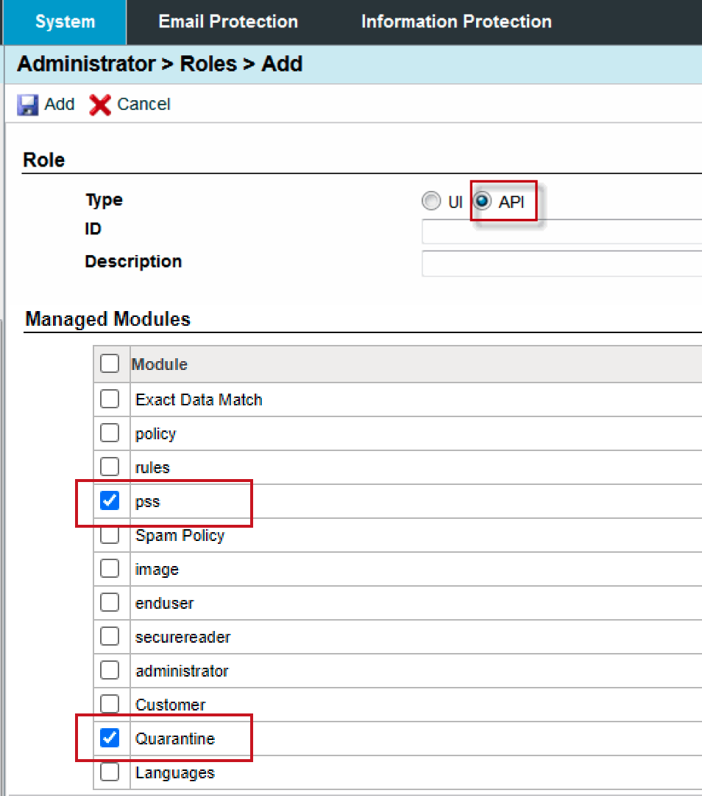

Proofpoint email security appliance.

This integration was integrated and tested with the following versions of Proofpoint Protection Server:
- Cloud 8.16.2
- On-premise 8.14.2

## Authentication
An administrator must have a role that includes access to a specific REST API. 

Proofpoint on Demand (PoD) administrators must file a support ticket to Proofpoint support to obtain a role with access to an API.

On premise administrators: Edit the **filter.cfg** file and set the following key to true: com.proofpoint.admin.apigui.enable=t

In the management interface, create a role of type API and select the APIs under **Managed Modules** for the role and assign an administrator that role.

The following are the required managed modules for this integration:
 - pss
 - Quarantine
 
  

The operations are accessed through port 10000.

## Configure Proofpoint Protection Server v2 in Cortex


| **Parameter** | **Description** | **Required** |
| --- | --- | --- |
| url | Server URL (e.g., `https://xxxxxxxx.pphosted.com:10000`) | True |
| credentials | Username | True |
| unsecure | Trust any certificate \(not secure\) | False |
| proxy | Use system proxy settings | False |

## Commands
You can execute these commands from the CLI, as part of an automation, or in a playbook.
After you successfully execute a command, a DBot message appears in the War Room with the command details.
### proofpoint-pps-smart-search
***
Trace and analyze information about messages after they have been filtered by the Proofpoint Protection Server.


#### Base Command

`proofpoint-pps-smart-search`
#### Input

| **Argument Name** | **Description** | **Required** |
| --- | --- | --- |
| action | Final disposition action message. Possible values are: "accept", "continue", "discard", "redirect", "reject", "retry". | Optional | 
| start_time | Time from when the search should begin. Can be either free text (\<number\> \<time unit\>, e.g., 12 hours, 7 days) or ISO-8601 (YYYY-MM-DDThh:mm:ssZ, e.g., 2020-01-25T10:00:00Z). Default is "24 hours". | Optional | 
| end_time | Time of when the search should end. Can be either free text (\<number\> \<time unit\>, e.g., 12 hours, 7 days) or ISO-8601 (YYYY-MM-DDThh:mm:ssZ, e.g., 2020-01-25T10:00:00Z). | Optional | 
| virus | Comma-separated list of the detected virus names that infected the message. | Optional | 
| sender | Email address of the sender. | Optional | 
| recipient | Email address of the recipient. | Optional | 
| attachment | Comma-separated list of the message attachments. | Optional | 
| queue_id | ID of the message queue. | Optional | 
| host | The host or IP address of the sent email message. | Optional | 
| sid | The SID of the email message. | Optional | 
| subject | The subject of the email message. | Optional | 
| guid | The global unique ID of the email message. | Optional | 
| message_id | The ID of the header message. This corresponds to the Message ID field in the UI. | Optional | 
| limit | The maximum number of email messages to return. The maximum value is set by the com.proofpoint.pss.query.default-count value in the filter.cfg file. Default is "100". | Optional |


#### Context Output

| **Path** | **Type** | **Description** |
| --- | --- | --- |
| Proofpoint.SmartSearch.Rule_ID | String | The ID of the message rule (e.g., system). | 
| Proofpoint.SmartSearch.Disposition_Action | String | Message disposition action. | 
| Proofpoint.SmartSearch.Sendmail_Action | String | Message send mail action. | 
| Proofpoint.SmartSearch.Attachment_Names | String | Names of the email attachments. | 
| Proofpoint.SmartSearch.Recipients | String | Email addresses of the recipient of the email message. | 
| Proofpoint.SmartSearch.SendmailRaw_Log | String | The raw log of the send mail email message. | 
| Proofpoint.SmartSearch.GUID | String | GUID of the email message. | 
| Proofpoint.SmartSearch.Date | Date |Date of the email message. | 
| Proofpoint.SmartSearch.Raw_Log | String | Raw log of the email message. | 
| Proofpoint.SmartSearch.Sender_Host | String | The sender host of the email message. | 
| Proofpoint.SmartSearch.Module_ID | String | The module ID of the email message (e.g., access). | 
| Proofpoint.SmartSearch.Sender_IP_Address | String | IP address of the email message sender. | 
| Proofpoint.SmartSearch.Quarantine_Folder | String | The email message quarantine folder. | 
| Proofpoint.SmartSearch.QID | String | The queue ID of the email message. | 
| Proofpoint.SmartSearch.Quarantine_Rule | String | The quarantine rule of the email message. | 
| Proofpoint.SmartSearch.Spam_Score | String | The spam score of the email message. | 
| Proofpoint.SmartSearch.country | String | The country of the email message (e.g., **). | 
| Proofpoint.SmartSearch.TLS | String | The TLS of the email message. | 
| Proofpoint.SmartSearch.Policy_Routes | String | Comma-separated list of mail message policy routes (e.g., allow_relay,firewallsafe). | 
| Proofpoint.SmartSearch.current_folder | String | The current folder of the email message. | 
| Proofpoint.SmartSearch.FID | String | The folder ID of the email message. | 
| Proofpoint.SmartSearch.module_rules | String | The module rules of the email message (e.g., access.system). | 
| Proofpoint.SmartSearch.PE_Recipients | String | The PE recipients of the email message. | 
| Proofpoint.SmartSearch.Virus_Names | String | The virus names of the email message. | 
| Proofpoint.SmartSearch.Sendmail_Errorcode | String | The error codes of the email message. | 
| Proofpoint.SmartSearch.FQIN | String | The FQIN of the email message (e.g., example.com-10000_instance1). | 
| Proofpoint.SmartSearch.SMIME_Recipients | String | The SMIME recipients of the email message. | 
| Proofpoint.SmartSearch.Agent | String | The agent host of the email message. | 
| Proofpoint.SmartSearch.Subject | String | The subject of the email message. | 
| Proofpoint.SmartSearch.Final_Rule | String | The final rule of the email message (e.g., access.system). | 
| Proofpoint.SmartSearch.Suborg | String | The sub-organization of the email message. | 
| Proofpoint.SmartSearch.SMIME_Recipients_Signed | String | The SMIME signed recipients  for the email message. | 
| Proofpoint.SmartSearch.Message_Encrypted | String | The encrypted email message. | 
| Proofpoint.SmartSearch.Message_Split | String | The split of the email message. | 
| Proofpoint.SmartSearch.Disposition_SmtpProfile | String | The disposition SMTP profile of the email message. | 
| Proofpoint.SmartSearch.Sendmail_To | String | The send to address in the email message. | 
| Proofpoint.SmartSearch.Sendmail_Stat | String | The send email status of the email message. | 
| Proofpoint.SmartSearch.SID | String | The SID of the email message. | 
| Proofpoint.SmartSearch.Message_ID | String | The ID of the email message. | 
| Proofpoint.SmartSearch.Final_Action | String | The final action of the email message (e.g., accept). | 
| Proofpoint.SmartSearch.Sender | String | The sender of the email message. | 
| Proofpoint.SmartSearch.Sendmail_To_Stat | String | The send mail to status of the email message. | 
| Proofpoint.SmartSearch.Message_Size | String | The size of the email message. | 


#### Command Example
```!proofpoint-pps-smart-search recipient=user@example.com sender=root@user.example.com start_time="24 hours ago"```

#### Context Example
```json
{
    "Proofpoint": {
        "SmartSearch": [
            {
                "Agent": "example.com",
                "Attachment_Names": "",
                "Date": "2020-05-20 14:13:02 [UTC-0600]",
                "Disposition_Action": "",
                "Disposition_SmtpProfile": "",
                "Duration": "0.124094999905240",
                "FID": "8lLtu31xs8H24NF8McYw-S6EidtLK-y_",
                "FQIN": "example.com-10000_instance1",
                "Final_Action": "accept",
                "Final_Rule": "access.system",
                "GUID": "9rLtu31xs8H24NF8KcRw-S6EihtLK-y_",
                "Message_Encrypted": "",
                "Message_ID": "<551609250613.u8P6D1l3019878@user.example.com>",
                "Message_Size": "1142",
                "Message_Split": "",
                "Module_ID": "access",
                "PE_Recipients": "",
                "Policy_Routes": "allow_relay,firewallsafe,internalnet",
                "QID": "u8P6D24m919880",
                "Quarantine_Folder": "",
                "Quarantine_Rule": "",
                "Raw_Log": "",
                "Recipients": "user@example.com",
                "Rule_ID": "system",
                "SID": "25nnq08028",
                "SMIME_Recipients": "",
                "SMIME_Recipients_Signed": "",
                "Sender": "root@user.example.com",
                "Sender_Host": "localhost",
                "Sender_IP_Address": "127.0.0.1",
                "SendmailRaw_Log": "",
                "Sendmail_Action": "",
                "Sendmail_Errorcode": "",
                "Sendmail_Stat": "",
                "Sendmail_To": "",
                "Sendmail_To_Stat": "",
                "Spam_Score": "",
                "Subject": "Cron <pps@user> /opt/proofpoint/pps8.0.1.1446/admin/tools/dbutil.sh -optimize -db msgqueue",
                "Suborg": "",
                "TLS": "",
                "Virus_Names": "",
                "country": "**",
                "current_folder": "",
                "module_rules": [
                    "access.system"
                ]
            }
        ]
    }
}
```

#### Human Readable Output

>### Proofpoint Protection Server Smart Search Results
>|GUID|Date|Sender|Recipients|Subject|Final_Action|
>|---|---|---|---|---|---|
>| 8lLtu31xs8H24NF8McYw-S6EidtLK-y_ | 2020-05-20 14:13:02 [UTC-0600] | root@user.example.com | user@example.com | Cron \<pps@user\> /opt/proofpoint/pps8.0.1.1446/admin/tools/dbutil.sh -optimize -db msgqueue | accept |


#### Partial Search Matches

Smart Search parses email addresses to support a variety of partial matches.

For example, the email address a.b@c.d can be found with these partial searches:
- a.b
- a.b*
- a.b@
- a.b@*
- *@c.d
- @c.d
- a.*@
- a*@
- @*.d
- @*d

If there is an @ sign, the * is not ignored. If you enter only @, no results are returned.

|Source Address|Matching Search|
|---|---|
|example\.user@abc.com|\*example\\*|
|user.example\@abc.com|\*example\\*|
|example@abc.com|\*example\*|
|user@example.com|\*example\*|
|user@example.org|\*example\*|
|user@example.com|@\*example\*|
|user@example.org|@\*example\*|

#### Analyzed Fields

The subject is passed through an Analyzer that applies stemming and removes stop words.

Here is a list of stop words:

"a", "an", "and", "are", "as", "at", "be", "but", "by", "for", "if", "in", "into", 

"is", "it", "no", "not", "of", "on", "or", "such", "that", "the", "their", "then", 

"there", "these", "they", "this", "to", "was", "will", "with"

Example: "I'm going to a party" becomes "I go party"

### proofpoint-pps-quarantine-messages-list
***
Search for quarantined messages.


#### Base Command

`proofpoint-pps-quarantine-messages-list`
#### Input

| **Argument Name** | **Description** | **Required** |
| --- | --- | --- |
| sender | Envelope message sender equals, starts with, ends with, or is in a domain such as "bar.com". At least one of the following arguments must be specified: sender, recipient, subject. | Optional | 
| recipient | Envelope message recipient equals, starts with, ends with, or is in a domain such as "bar.com". At least one of the following arguments must be specified: sender, recipient, subject. | Optional | 
| subject | Message subject starts with, ends with, or contains. At least one of the following arguments must be specified: sender, recipient, subject. | Optional | 
| start_time | Time from when the search should begin. Can be either free text (\<number\> \<time unit\>, e.g., 12 hours, 7 days) or ISO-8601 (YYYY-MM-DDThh:mm:ssZ, e.g., 2020-01-25T10:00:00Z). Default is "24 hours". | Optional | 
| end_time | Time of when the search should end. Can be either free text (\<number\> \<time unit\>, e.g., 12 hours, 7 days) or ISO-8601 (YYYY-MM-DDThh:mm:ssZ, e.g., 2020-01-25T10:00:00Z). | Optional | 
| folder_name | Quarantine folder name. Default is "Quarantine". | Optional | 
| guid | Message Global Unique Identifier (generated by PPS) to retrieve raw data for a message. If it is specified and a message is found, the message’s raw data will be returned. | Optional | 


#### Context Output

| **Path** | **Type** | **Description** |
| --- | --- | --- |
| Proofpoint.QuarantinedMessage.processingserver | String | The processing server of the quarantined message. | 
| Proofpoint.QuarantinedMessage.date | Date | The date of the quarantined message. | 
| Proofpoint.QuarantinedMessage.subject | String | The subject of the quarantined message. | 
| Proofpoint.QuarantinedMessage.messageid | String | The ID of the quarantined message. | 
| Proofpoint.QuarantinedMessage.folder | String | The folder of the quarantined message. | 
| Proofpoint.QuarantinedMessage.size | String | The size of the quarantined message. | 
| Proofpoint.QuarantinedMessage.rcpts | String | The recipients of the quarantined message. | 
| Proofpoint.QuarantinedMessage.from | String | The sender of the quarantined message. | 
| Proofpoint.QuarantinedMessage.spamscore | String | The spam score of the quarantined message. | 
| Proofpoint.QuarantinedMessage.guid | String | The GUID of the quarantined message. | 
| Proofpoint.QuarantinedMessage.host_ip | String | The host IP address of the quarantined message. | 
| Proofpoint.QuarantinedMessage.localguid | String | The local GUID of the quarantined message. | 


#### Command Example
```!proofpoint-pps-quarantine-messages-list subject=Loan* sender=john@doe.com```

#### Context Example
```json
{
    "Proofpoint": {
        "QuarantinedMessage": [
            {
                "date": "2020-01-15 20:00:00",
                "folder": "Quarantine",
                "from": "john@doe.com",
                "guid": "lR_SjEF1Llfn9gML8YZzpVPUukjXQcPO",
                "host_ip": "[10.54.40.3] [10.54.40.3]",
                "localguid": "6:6:239",
                "messageid": "YATQ2LPCWC3MFA2YUTDH.448380834@example.net",
                "processingserver": "...",
                "rcpts": [
                    "foo@bar.com"
                ],
                "size": "6496",
                "spamscore": "100",
                "subject": "Loan"
            },
            {
                "date": "2020-01-22 10:00:18",
                "folder": "Quarantine",
                "from": "john@doe.com",
                "guid": "edlp0pU9YXkWB5nmat91i9HUl7J-K-ep",
                "host_ip": "[10.12.40.4] [10.12.40.4]",
                "localguid": "6:6:4",
                "messageid": "TLW25LKOCDR72DBE06JF.221045479@email1.example.com",
                "processingserver": "...",
                "rcpts": [
                    "user@test.com"
                ],
                "size": "6143",
                "spamscore": "100",
                "subject": "Loan"
            }
        ]
    }
}
```

#### Human Readable Output

>### Proofpoint Protection Server Quarantined Messages
>|localguid|folder|spamscore|from|rcpts|subject|date|size|host_ip|
>|---|---|---|---|---|---|---|---|---|
>| 6:6:239 | Quarantine | 100 | john@doe.com | foo@bar.com | Loan | 2020-01-15 20:00:00 | 6496 | [10.54.40.3] [10.54.40.3] |
>| 6:6:4 | Quarantine | 100 | john@doe.com | user@test.com | Loan | 2020-01-22 10:00:18 | 6143 | [10.12.40.4] [10.12.40.4] |


### proofpoint-pps-quarantine-message-release
***
Releases the message to the email infrastructure without further scanning. The message remains in the folder and is moved to the deleted_folder if specified.


#### Base Command

`proofpoint-pps-quarantine-message-release`
#### Input

| **Argument Name** | **Description** | **Required** |
| --- | --- | --- |
| folder_name | Name of the folder where the message is stored (e.g., HIPAA). | Required | 
| local_guid | Comma-separated list of message GUIDs. Format is folder_id:table_id:dbase_id (e.g., 4:2:6), or in Cloud Quarantine format is GUID (e.g., g4fsnj_sTLMk9hECaJ wmmxwP6lQkr5k7). Can be retrieved using the proofpoint-pps-quarantine-messages-list command. | Required | 
| deleted_folder | Name of the folder to move the message to. The folder must be for quarantined messages from the same type of module. For example, you cannot send deleted spam messages to a folder for deleted DLP incidents, and vice versa. | Optional | 
| scan | Whether to rescan the message by the DLP and Attachment Defense filtering modules. Possible values are: "true" and "false". Default is "false". | Optional | 
| brand_template | When encryption is licensed, the Branding Template to use when an encrypted message is released. The Branding Templates are listed on the System > End User Services > Branding Templates page in the management interface (admin GUI). | Optional | 
| security_policy | The Secure Reader response profile to use when the release is used for an encrypted message.The Response Profiles are listed on the Information Protection &gt; Encryption &gt; Response Profiles page in the management interface (admin GUI). | Optional | 


#### Context Output

There is no context output for this command.

#### Command Example
```!proofpoint-pps-quarantine-message-release folder_name=HIPAA local_guid=4:2:6```

#### Human Readable Output

>Request sent. Message 4:2:6 will be released momentarily'

### proofpoint-pps-quarantine-message-resubmit
***
Resubmits the message to the filtering modules. The message is removed from the folder and is moved to any folder.


#### Base Command

`proofpoint-pps-quarantine-message-resubmit`
#### Input

| **Argument Name** | **Description** | **Required** |
| --- | --- | --- |
| folder_name | Name of the folder where the message is stored (e.g., HIPAA). | Required | 
| local_guid | Comma-separated list of message GUIDs. Format is folder_id:table_id:dbase_id (e.g., 4:2:6), or in Cloud Quarantine format is GUID (e.g., g4fsnj_sTLMk9hECaJ wmmxwP6lQkr5k7). Can be retrieved using the proofpoint-pps-quarantine-messages-list command. | Required | 


#### Context Output

There is no context output for this command.

#### Command Example
```!proofpoint-pps-quarantine-message-resubmit folder_name=HIPAA local_guid=4:2:6```

#### Human Readable Output

>Request sent. Message 4:2:6 will be resubmitted momentarily

### proofpoint-pps-quarantine-message-forward
***
Forwards the message to another recipient. The message remains in the folder and will be moved to the deleted_folder if specified.


#### Base Command

`proofpoint-pps-quarantine-message-forward`
#### Input

| **Argument Name** | **Description** | **Required** |
| --- | --- | --- |
| folder_name | Name of the folder where the message is stored (e.g., HIPAA). | Required | 
| local_guid | Comma-separated list of message GUIDs. Format is folder_id:table_id:dbase_id (e.g., 4:2:6), or in Cloud Quarantine format is GUID (e.g., g4fsnj_sTLMk9hECaJ wmmxwP6lQkr5k7). Can be retrieved using the proofpoint-pps-quarantine-messages-list command. | Required | 
| deleted_folder | Name of the folder to move the message to. The folder must be for quarantined messages from the same type of module. For example, you cannot send deleted spam messages to a folder for deleted DLP Incidents, and vice versa. | Optional | 
| subject | The new subject with which to overwrite the original subject for the message. | Optional | 
| append_old_subject | Whether to append the original subject to the string specified in the subject argument. Possible values are: "true" and "false". Default is "false". | Optional | 
| sender |The envelope email address of the sender. | Optional | 
| header_from | The header from email address. | Optional | 
| recipient | Comma-separate list of recipient email addresses. | Required | 
| comment | New message body. (The original message is sent as an attachment.) | Optional | 


#### Context Output

There is no context output for this command.

#### Command Example
```!proofpoint-pps-quarantine-message-forward folder_name=HIPAA local_guid=4:2:6```

#### Human Readable Output

>Request sent. Message 4:2:6 will be forwarded momentarily

### proofpoint-pps-quarantine-message-move
***
Moves the message to the specified target folder.


#### Base Command

`proofpoint-pps-quarantine-message-move`
#### Input

| **Argument Name** | **Description** | **Required** |
| --- | --- | --- |
| folder_name | Name of the folder where the message is stored (e.g., HIPAA). | Required | 
| local_guid | Comma-separate list of message GUIDs. Format is folder_id:table_id:dbase_id (e.g., 4:2:6), or in Cloud Quarantine format is GUID (e.g., g4fsnj_sTLMk9hECaJ wmmxwP6lQkr5k7). Can be retrieved using the proofpoint-pps-quarantine-messages-list command. | Required | 
| target_folder | Name of the folder to move the email message to (e.g., PCI).The folder for moved messages must be for quarantined messages from the same type of module. For example, you cannot move spam messages to a folder for DLP Incidents, and vice versa. | Required | 


#### Context Output

There is no context output for this command.

#### Command Example
```!proofpoint-pps-quarantine-message-move folder_name=HIPAA local_guid=4:2:6 target_folder=PCI```

#### Human Readable Output

>Successfully moved message 4:2:6

### proofpoint-pps-quarantine-message-delete
***
Deletes the message from the quarantine folder. The message is removed from its folder and is moved to the deleted_folder if specified.


#### Base Command

`proofpoint-pps-quarantine-message-delete`
#### Input

| **Argument Name** | **Description** | **Required** |
| --- | --- | --- |
| folder_name | Name of the folder where the message is stored (e.g., HIPAA). | Required | 
| local_guid | Comma-separate list of message GUIDs. Format is folder_id:table_id:dbase_id (e.g., 4:2:6), or in Cloud Quarantine format is GUID (e.g., g4fsnj_sTLMk9hECaJ wmmxwP6lQkr5k7). Can be retrieved using the proofpoint-pps-quarantine-messages-list command. | Required | 
| deleted_folder | Name of the folder to move the message to. The folder must be for quarantined messages from the same type of module. For example, you cannot send deleted spam messages to a folder for deleted DLP Incidents, and vice versa. | Optional | 


#### Context Output

There is no context output for this command.

#### Command Example
```!proofpoint-pps-quarantine-message-delete folder_name=HIPAA local_guid=4:2:6```

#### Human Readable Output

>Successfully deleted message 4:2:6

### proofpoint-pps-quarantine-message-download
***
Downloads an email message's raw data.

#### Base Command

`proofpoint-pps-quarantine-message-download`
#### Input

| **Argument Name** | **Description** | **Required** |
| --- | --- | --- |
| folder_name | Global unique ID of the email message (e.g., g4fsnj_sTLMk9hECaJwmmxwP6lQkr5k7). Can be retrieved using the proofpoint-pps-quarantine-messages-list command. | Required | 


#### Context Output

There is no context output for this command.

#### Command Example
```!proofpoint-pps-quarantine-message-download guid=g4fsnj_sTLMk9hECaJwmmxwP6lQkr5k7```


### proofpoint-pps-get-user
***
Gets the end user resource with the specified email address or UID.


#### Base Command

`proofpoint-pps-get-user`
#### Input

| **Argument Name** | **Description** | **Required** |
| --- | --- | --- |
| email | Email address of the user. | Optional | 
| uid | UID of the user. | Optional | 


#### Context Output

| **Path** | **Type** | **Description** |
| --- | --- | --- |
| Proofpoint.User.alias | unknown | List of aliases for the enduser. | 
| Proofpoint.User.attributes | unknown | All attributes for this user profile. The value of these attributes is calculated based on the Organization, Sub-Org/Group membership and Profile settings. For a description of these attributes, see the table at the end of this document. | 
| Proofpoint.User.blocklist | unknown | List of all block list entries for the enduser. | 
| Proofpoint.User.created | unknown | Timestamp when profile was created \(in UTC\). | 
| Proofpoint.User.creationsource | unknown | Source for the profile creation \(see the table below\). | 
| Proofpoint.User.email | unknown | Primary email address of the enduser. | 
| Proofpoint.User.firstname | unknown | First name of enduser. | 
| Proofpoint.User.groups | unknown | List of all the groups to which the user belongs. | 
| Proofpoint.User.lastmodified | unknown | Timestamp when profile changes were made \(in UTC\). | 
| Proofpoint.User.lastname | unknown | Last name of enduser. | 
| Proofpoint.User.lastpasswordchange | unknown | Timestamp for the last password change. | 
| Proofpoint.User.lastsignon | unknown | Timestamp for the last login by the end user. | 
| Proofpoint.User.safelist | unknown | List of all safe list entries for the enduser. | 
| Proofpoint.User.suborg | unknown | Defines the sub-organization to which this user profile belongs. | 
| Proofpoint.User.type | unknown | 0=User 1=Mailing List | 
| Proofpoint.User.uid | unknown | uid of the user. | 
### proofpoint-pps-create-user
***
Creates a new end user resource with the specified email address.


#### Base Command

`proofpoint-pps-create-user`
#### Input

| **Argument Name** | **Description** | **Required** |
| --- | --- | --- |
| email | Email address of the user. | Required | 
| fields | Request fields in JSON string format (e.g., firstname, lastname, addgroup). | Optional | 
| attributes | Attributes in JSON string format. | Optional | 


#### Context Output

| **Path** | **Type** | **Description** |
| --- | --- | --- |
| Proofpoint.User.alias | unknown | List of aliases for the enduser. | 
| Proofpoint.User.attributes | unknown | All attributes for this user profile. The value of these attributes is calculated based on the Organization, Sub-Org/Group membership and Profile settings. For a description of these attributes, see the table at the end of this document. | 
| Proofpoint.User.blocklist | unknown | List of all block list entries for the enduser. | 
| Proofpoint.User.created | unknown | Timestamp when profile was created \(in UTC\). | 
| Proofpoint.User.creationsource | unknown | Source for the profile creation \(see the table below\). | 
| Proofpoint.User.email | unknown | Primary email address of the enduser. | 
| Proofpoint.User.firstname | unknown | First name of enduser. | 
| Proofpoint.User.groups | unknown | List of all the groups to which the user belongs. | 
| Proofpoint.User.lastmodified | unknown | Timestamp when profile changes were made \(in UTC\). | 
| Proofpoint.User.lastname | unknown | Last name of enduser. | 
| Proofpoint.User.lastpasswordchange | unknown | Timestamp for the last password change. | 
| Proofpoint.User.lastsignon | unknown | Timestamp for the last login by the end user. | 
| Proofpoint.User.safelist | unknown | List of all safe list entries for the enduser. | 
| Proofpoint.User.suborg | unknown | Defines the sub-organization to which this user profile belongs. | 
| Proofpoint.User.type | unknown | 0=User 1=Mailing List | 
| Proofpoint.User.uid | unknown | uid of the user. | 
### proofpoint-pps-modify-user
***
Modifies a user profile.


#### Base Command

`proofpoint-pps-modify-user`
#### Input

| **Argument Name** | **Description** | **Required** |
| --- | --- | --- |
| email | Email address of the user. | Optional | 
| UID | UID of the user. | Optional | 
| fields | Request fields in JSON string format (e.g., firstname, lastname, addgroup). | Optional | 
| attributes | Attributes in JSON string format. | Optional | 


#### Context Output

| **Path** | **Type** | **Description** |
| --- | --- | --- |
| Proofpoint.User.alias | unknown | List of aliases for the enduser. | 
| Proofpoint.User.attributes | unknown | All attributes for this user profile. The value of these attributes is calculated based on the Organization, Sub-Org/Group membership and Profile settings. For a description of these attributes, see the table at the end of this document. | 
| Proofpoint.User.blocklist | unknown | List of all block list entries for the enduser. | 
| Proofpoint.User.created | unknown | Timestamp when profile was created \(in UTC\). | 
| Proofpoint.User.creationsource | unknown | Source for the profile creation \(see the table below\). | 
| Proofpoint.User.email | unknown | Primary email address of the enduser. | 
| Proofpoint.User.firstname | unknown | First name of enduser. | 
| Proofpoint.User.groups | unknown | List of all the groups to which the user belongs. | 
| Proofpoint.User.lastmodified | unknown | Timestamp when profile changes were made \(in UTC\). | 
| Proofpoint.User.lastname | unknown | Last name of enduser. | 
| Proofpoint.User.lastpasswordchange | unknown | Timestamp for the last password change. | 
| Proofpoint.User.lastsignon | unknown | Timestamp for the last login by the end user. | 
| Proofpoint.User.safelist | unknown | List of all safe list entries for the enduser. | 
| Proofpoint.User.suborg | unknown | Defines the sub-organization to which this user profile belongs. | 
| Proofpoint.User.type | unknown | 0=User 1=Mailing List | 
| Proofpoint.User.uid | unknown | uid of the user. | 
### proofpoint-pps-delete-user
***
Delete a user profile.


#### Base Command

`proofpoint-pps-delete-user`
#### Input

| **Argument Name** | **Description** | **Required** |
| --- | --- | --- |
| email | Email address of the user. | Optional | 
| uid | UID of the user. | Optional | 


#### Context Output

There is no context output for this command.