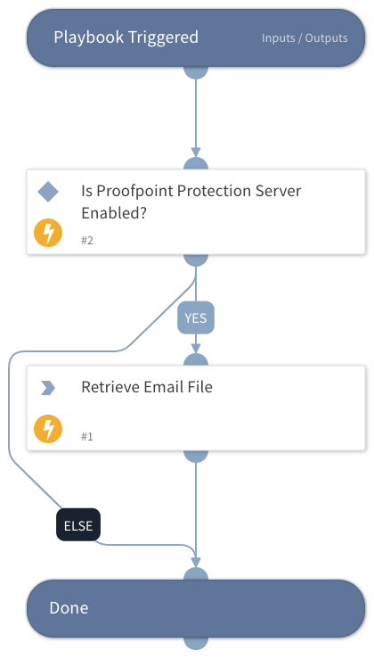

This playbook retrieves a specified EML/MSG file directly from the Proofpoint Protection Server.

## Dependencies
This playbook uses the following sub-playbooks, integrations, and scripts.

### Sub-playbooks
This playbook does not use any sub-playbooks.

### Integrations
ProofpointProtectionServerV2

### Scripts
This playbook does not use any scripts.

### Commands
proofpoint-pps-quarantine-message-download

## Playbook Inputs
---

| **Name** | **Description** | **Default Value** | **Required** |
| --- | --- | --- | --- |
| MessageID | The Proofpoint message GUID. |  | Optional |

## Playbook Outputs
---
There are no outputs for this playbook.

## Playbook Image
---

