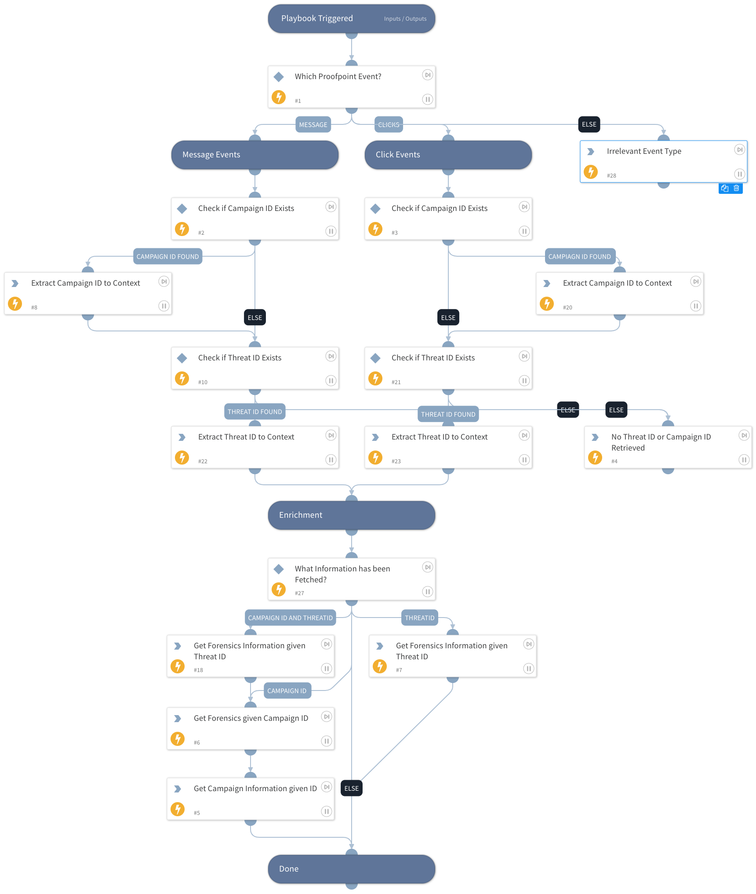

This playbook enriches Proofpoint Targeted Attack Protection (TAP) incidents with forensic evidence. 
By utilizing the 'proofpoint-get-forensics' command, the playbook retrieves forensic evidence based on the campaign ID and threat ID detected in the Proofpoint TAP incidents.

## Dependencies
This playbook uses the following sub-playbooks, integrations, and scripts.

### Sub-playbooks
This playbook does not use any sub-playbooks.

### Integrations
* Proofpoint TAP v2
* ProofpointTAP_v2

### Scripts
* Print
* SetAndHandleEmpty
* PrintErrorEntry

### Commands
* proofpoint-get-campaign
* proofpoint-get-forensics

## Playbook Inputs
---
There are no inputs for this playbook.

## Playbook Outputs
---

| **Path** | **Description** | **Type** |
| --- | --- | --- |
| Proofpoint.Campaign | Retrieved Campaign objects | string |
| Proofpoint.Campaign.info | The campaign information - ID,name, description, startDate, and notable. | string |
| Proofpoint.Campaign.actors | A list of actor objects. | string |
| Proofpoint.Campaign.families | A list of family objects. | string |
| Proofpoint.Campaign.malware | A list of malware objects. | string |
| Proofpoint.Campaign.techniques | A list of technique objects. | string |
| Proofpoint.Campaign.brands | A list of brand objects. | string |
| Proofpoint.Campaign.campaignMembers | A list of campaign member objects. | string |
| Proofpoint.Report | Retrieved Report object identifies | string |
| Proofpoint.Report.ID | The ID of the report. | string |
| Proofpoint.Report.Type | The threat type. Can be: "attachment", "url", or "hybrid". | string |
| Proofpoint.Report.Scope | Whether the report scope covers a campaign or an individual threat. | string |
| Proofpoint.Report.Attachment | Attachments evidence type objects retrieved from Proofpoint TAP. | string |
| Proofpoint.Report.Attachment.Time | The relative time at which the evidence was observed during sandboxing. | date |
| Proofpoint.Report.Attachment.Malicious | Whether the evidence was used to reach a malicious verdict. | string |
| Proofpoint.Report.Attachment.Display | A friendly display string. | string |
| Proofpoint.Report.Attachment.SHA256 | The SHA256 hash of the attachment's contents. | string |
| Proofpoint.Report.Attachment.MD5 | The MD5 hash of the attachment's contents. | string |
| Proofpoint.Report.Attachment.Blacklisted | Optional. Whether the file was block listed. | string |
| Proofpoint.Report.Attachment.Offset | Optional. The offset in bytes where the malicious content was found. | string |
| Proofpoint.Report.Attachment.Size | Optional. The size in bytes of the attachment's contents. | string |
| Proofpoint.Report.Attachment.Platform.Name | The name of the platform. | string |
| Proofpoint.Report.Attachment.Platform.OS | The operating system of the platform. | string |
| Proofpoint.Report.Attachment.Platform.Version | The version of the platform. | string |
| Proofpoint.Report.Cookie | Cookies evidence type objects retrieved from Proofpoint TAP. | string |
| Proofpoint.Report.Cookie.Time | The relative time at which the evidence was observed during sandboxing. | date |
| Proofpoint.Report.Cookie.Malicious | Whether the evidence was used to reach a malicious verdict. | string |
| Proofpoint.Report.Cookie.Display | A friendly display string. | string |
| Proofpoint.Report.Cookie.Action | Whether the cookie was set or deleted. | string |
| Proofpoint.Report.Cookie.Domain | The domain that set the cookie. | string |
| Proofpoint.Report.Cookie.Key | The name of the cookie being set or deleted. | string |
| Proofpoint.Report.Cookie.Value | Optional. The content of the cookie being set. | string |
| Proofpoint.Report.Cookie.Platform.Name | Name of the platform. | string |
| Proofpoint.Report.Cookie.Platform.OS | The operating system of the platform. | string |
| Proofpoint.Report.Cookie.Platform.Version | The version of the platform. | string |
| Proofpoint.Report.DNS | DNS evidence type objects retrieved from Proofpoint TAP. | string |
| Proofpoint.Report.DNS.Time | The relative time at which the evidence was observed during sandboxing. | date |
| Proofpoint.Report.DNS.Malicious | Whether the evidence was used to reach a malicious verdict. | string |
| Proofpoint.Report.DNS.Display | A friendly display string. | string |
| Proofpoint.Report.DNS.Host | The hostname being resolved. | string |
| Proofpoint.Report.DNS.CNames | Optional. An array of CNames, which were associated with the hostname. | string |
| Proofpoint.Report.DNS.IP | Optional. An array of IP addresses that were resolved to the hostname. | string |
| Proofpoint.Report.DNS.NameServers | Optional. The nameservers responsible for the hostname's domain. | string |
| Proofpoint.Report.DNS.NameServersList | Optional. The nameservers responsible for the hostnames. | string |
| Proofpoint.Report.DNS.Platform.Name | The name of the platform. | string |
| Proofpoint.Report.DNS.Platform.OS | The operating system of the platform. | string |
| Proofpoint.Report.DNS.Platform.Version | The version of the platform. | string |
| Proofpoint.Report.Dropper | Droppers evidence type objects retrieved from Proofpoint TAP. | string |
| Proofpoint.Report.Dropper.Time | The relative time at which the evidence was observed during sandboxing. | date |
| Proofpoint.Report.Dropper.Malicious | Whether the evidence was used to reach a malicious verdict. | string |
| Proofpoint.Report.Dropper.Display | A friendly display string. | string |
| Proofpoint.Report.Dropper.Path | The location of the dropper file. | string |
| Proofpoint.Report.Dropper.URL | Optional. The name of the static rule inside the sandbox that identified the dropper. | string |
| Proofpoint.Report.Dropper.Rule | Optional. The URL the dropper contacted. | string |
| Proofpoint.Report.Dropper.Platform.Name | The name of the platform. | string |
| Proofpoint.Report.Dropper.Platform.OS | The operating system of the platform. | string |
| Proofpoint.Report.Dropper.Platform.Version | The version of the platform. | string |
| Proofpoint.Report.File | Files evidence type objects retrieved from Proofpoint TAP. | string |
| Proofpoint.Report.File.Time | The relative time at which the evidence was observed during sandboxing. | date |
| Proofpoint.Report.File.Malicious | Whether the evidence was used to reach a malicious verdict. | string |
| Proofpoint.Report.File.Display | A friendly display string. | string |
| Proofpoint.Report.File.Path | Optional. The location of the file operated on. | string |
| Proofpoint.Report.File.Action | Optional. The filesystem call made \(create, modify, or delete\). | string |
| Proofpoint.Report.File.Rule | Optional. The name of the static rule inside the sandbox that identified the suspicious file. | string |
| Proofpoint.Report.File.SHA256 | Optional. The SH256 hash of the file's contents. | string |
| Proofpoint.Report.File.MD5 | Optional. The MD5 hash of the file's contents. | string |
| Proofpoint.Report.File.Size | Optional. The size in bytes of the file's contents. | string |
| Proofpoint.Report.File.Platform.Name | The name of the platform. | string |
| Proofpoint.Report.File.Platform.OS | The operating system of the platform. | string |
| Proofpoint.Report.File.Platform.Version | The version of the platform. | string |
| Proofpoint.Report.IDS | IDS evidence type objects retrieved from Proofpoint TAP. | string |
| Proofpoint.Report.IDS.Time | The relative time at which the evidence was observed during sandboxing. | date |
| Proofpoint.Report.IDS.Malicious | Whether the evidence was used to reach a malicious verdict. | string |
| Proofpoint.Report.IDS.Display | A friendly display string. | string |
| Proofpoint.Report.IDS.Name | The friendly name of the IDS rule that observed the malicious traffic. | string |
| Proofpoint.Report.IDS.SignatureID | The identifier of the IDS rule that observed the malicious traffic. | string |
| Proofpoint.Report.IDS.Platform.Name | The name of the platform. | string |
| Proofpoint.Report.IDS.Platform.OS | The operating system of the platform. | string |
| Proofpoint.Report.IDS.Platform.Version | The version of the platform. | string |
| Proofpoint.Report.Mutex | Mutex evidence type objects retrieved from Proofpoint TAP. | string |
| Proofpoint.Report.Mutex.Time | The relative time at which the evidence was observed during sandboxing. | date |
| Proofpoint.Report.Mutex.Malicious | Whether the evidence was used to reach a malicious verdict. | string |
| Proofpoint.Report.Mutex.Display | A friendly display string. | string |
| Proofpoint.Report.Mutex.Name | The name of the mutex. | string |
| Proofpoint.Report.Mutex.Path | Optional. The path to the process which spawned the mutex. | string |
| Proofpoint.Report.Mutex.Platform.Name | The name of the platform. | string |
| Proofpoint.Report.Mutex.Platform.OS | The operating system of the platform. | string |
| Proofpoint.Report.Mutex.Platform.Version | The version of the platform. | string |
| Proofpoint.Report.Network | Network evidence type objects retrieved from Proofpoint TAP. | string |
| Proofpoint.Report.Network.Time | The relative time at which the evidence was observed during sandboxing. | date |
| Proofpoint.Report.Network.Malicious | Whether the evidence was used to reach a malicious verdict. | string |
| Proofpoint.Report.Network.Display | A friendly display string. | string |
| Proofpoint.Report.Network.Action | The type of network activity being initiated \(connect or listen\). | string |
| Proofpoint.Report.Network.IP | The remote IP address being contacted. | string |
| Proofpoint.Report.Network.Port | The remote IP port being contacted. | string |
| Proofpoint.Report.Network.Type | The protocol being used \(tcp or udp\). | string |
| Proofpoint.Report.Network.Platform.Name | The name of the platform. | string |
| Proofpoint.Report.Network.Platform.OS | The operating system of the platform. | string |
| Proofpoint.Report.Network.Platform.Version | The version of the platform. | string |
| Proofpoint.Report.Process | Processes evidence type objects retrieved from Proofpoint TAP. | string |
| Proofpoint.Report.Process.Time | The relative time at which the evidence was observed during sandboxing. | date |
| Proofpoint.Report.Process.Malicious | Whether the evidence was used to reach a malicious verdict. | string |
| Proofpoint.Report.Process.Display | A friendly display string. | string |
| Proofpoint.Report.Process.Action | The action performed on the process. Relevant when create is produced. | string |
| Proofpoint.Report.Process.Path | The location of the executable that spawned the process. | string |
| Proofpoint.Report.Process.Platform.Name | The name of the platform. | string |
| Proofpoint.Report.Process.Platform.OS | The operating system of the platform. | string |
| Proofpoint.Report.Process.Platform.Version | The version of the platform. | string |
| Proofpoint.Report.Registry | Registry evidence type objects retrieved from Proofpoint TAP. | string |
| Proofpoint.Report.Registry.Time | The relative time at which the evidence was observed during sandboxing. | date |
| Proofpoint.Report.Registry.Malicious | Whether the evidence was used to reach a malicious verdict. | string |
| Proofpoint.Report.Registry.Display | A friendly display string. | string |
| Proofpoint.Report.Registry.Name | Optional. The name of the registry entry being created or set. | string |
| Proofpoint.Report.Registry.Action | The registry change made \(create or set\). | string |
| Proofpoint.Report.Registry.Key | The location of the registry key being modified. | string |
| Proofpoint.Report.Registry.Value | Optional. The contents of the key being created or set. | string |
| Proofpoint.Report.Registry.Platform.Name | The name of the platform. | string |
| Proofpoint.Report.Registry.Platform.OS | The operating system of the platform. | string |
| Proofpoint.Report.Registry.Platform.Version | The version of the platform. | string |
| Proofpoint.Report.URL | URL evidence type objects retrieved from Proofpoint TAP. | string |
| Proofpoint.Report.URL.Time | The relative time at which the evidence was observed during sandboxing. | date |
| Proofpoint.Report.URL.Malicious | Whether the evidence was used to reach a malicious verdict. | string |
| Proofpoint.Report.URL.Display | A friendly display string. | string |
| Proofpoint.Report.URL.URL | The URL which was observed. | string |
| Proofpoint.Report.URL.Blacklisted | Optional. Whether the URL appeared on a block list. | boolean |
| Proofpoint.Report.URL.SHA256 | Optional. The SHA256 hash of the file downloaded from the URL. | string |
| Proofpoint.Report.URL.MD5 | Optional. The MD5 hash of the file downloaded from the URL. | string |
| Proofpoint.Report.URL.Size | Optional. The size in bytes of the file retrieved from the URL. | string |
| Proofpoint.Report.URL.HTTPStatus | Optional. The HTTP status code that was produced when our sandbox visited the URL. | string |
| Proofpoint.Report.URL.IP | Optional. The IP address that was resolved to the hostname by the sandbox. | string |
| Proofpoint.Report.URL.Platform.Name | The name of the platform. | string |
| Proofpoint.Report.URL.Platform.OS | The operating system of the platform. | string |
| Proofpoint.Report.URL.Platform.Version | The version of the platform. | string |
| Proofpoint.Report.Behavior | Behavior evidence type objects retrieved from Proofpoint TAP. | string |
| Proofpoint.Report.Behavior.Time | The relative time at which the evidence was observed during sandboxing. | date |
| Proofpoint.Report.Behavior.Malicious | Whether the evidence was used to reach a malicious verdict. | string |
| Proofpoint.Report.Behavior.Display | A friendly display string. | string |
| Proofpoint.Report.Behavior.URL | The URL that was observed. | string |
| Proofpoint.Report.Behavior.Path | The location of the executable which spawned the behavior. | string |
| Proofpoint.Report.Behavior.Platform.Name | The name of the platform. | string |
| Proofpoint.Report.Behavior.Platform.OS | The operating system of the platform. | string |
| Proofpoint.Report.Behavior.Platform.Version | The version of the platform. | string |
| Proofpoint.Report.Screenshot | Screenshot evidence type objects retrieved from Proofpoint TAP. | string |
| Proofpoint.Report.Screenshot.Time | The relative time at which the evidence was observed during sandboxing. | date |
| Proofpoint.Report.Screenshot.Malicious | Whether the evidence was used to reach a malicious verdict. | string |
| Proofpoint.Report.Screenshot.Display | A friendly display string. | string |
| Proofpoint.Report.Screenshot.URL | The URL hosting the screenshot image. | string |

## Playbook Image
---
