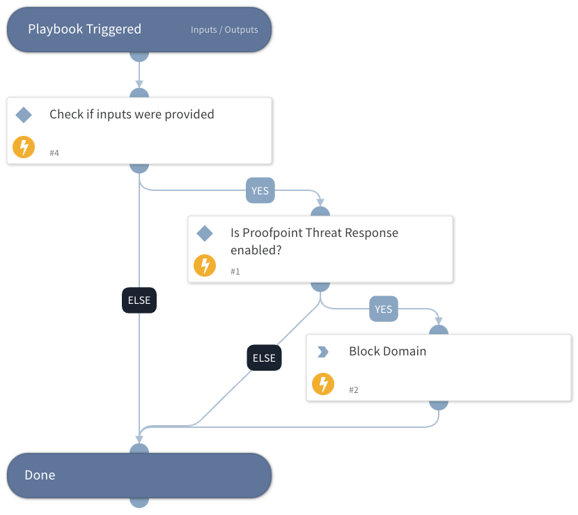

This playbook blocks domains using Proofpoint Threat Response.
The playbook checks whether the Proofpoint Threat Response integration is enabled, whether the Domain input has been provided and if so, blocks the domain.

## Dependencies

This playbook uses the following sub-playbooks, integrations, and scripts.

### Sub-playbooks

This playbook does not use any sub-playbooks.

### Integrations

* ProofpointThreatResponse

### Scripts

This playbook does not use any scripts.

### Commands

* proofpoint-tr-block-domain

## Playbook Inputs

---

| **Name** | **Description** | **Default Value** | **Required** |
| --- | --- | --- | --- |
| Domain | The Domain to block. |  | Optional |
| DomainBlackListID | The ID of the block list to block the domain in. |  | Optional |
| Expiration | The UTC expiration date and time of the suspicious object, for example: 2020-01-25T09:00:00Z |  | Optional |

## Playbook Outputs

---
There are no outputs for this playbook.

## Playbook Image

---

