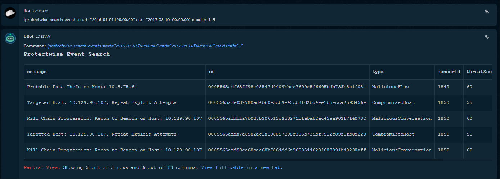
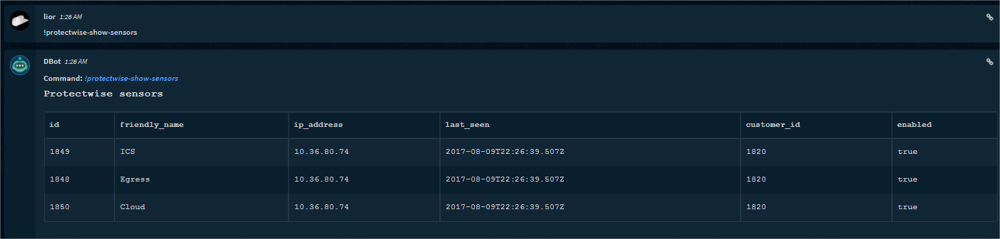
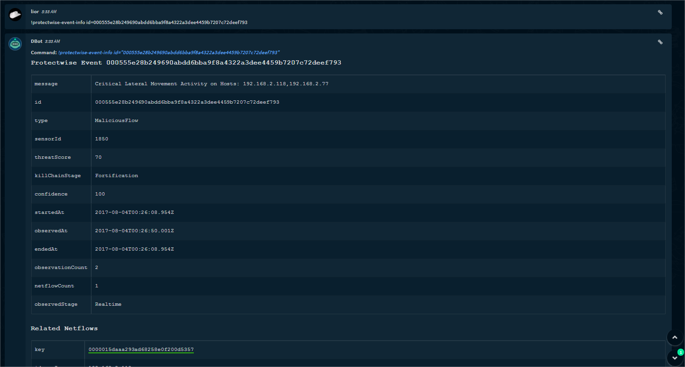
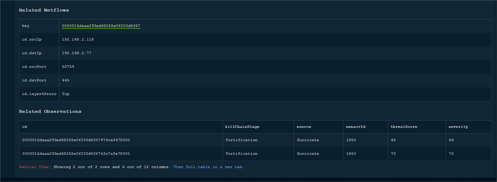
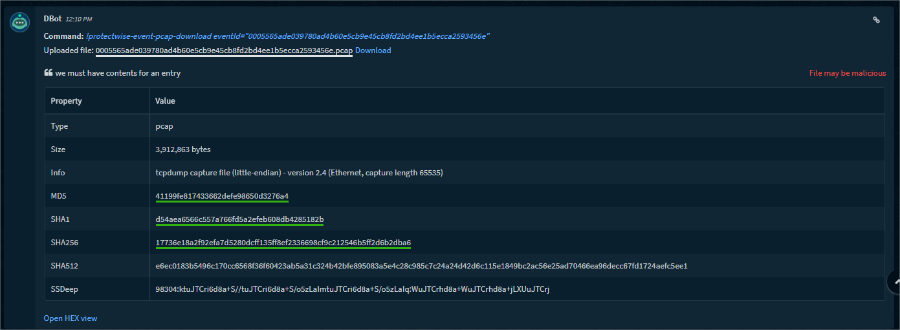

<!-- HTML_DOC -->

When integrating Protectwise with Cortex XSOAR, event data is received in a continues stream of data which can be handled by Cortex XSOAR.

<h3>To set up the integration on Cortex XSOAR:</h3>
<ol>
<li>Go to ‘Settings &gt; Integrations &gt; Servers &amp; Services’</li>
<li>Locate the Protectwise integration by searching for ‘Protectwise’ using the search box on the top of the page.
<ol>
<li>Click ‘Add instance’ to create and configure a new integration. You should configure the following Protectwise and Cortex XSOAR-specific settings:                                 <strong>Name</strong>: A textual name for the integration instance.</li>
</ol>
</li>
</ol>

<strong>URL</strong>: The hostname or IP address of the application. Make sure it is reachable with respect to IP address and port.

<strong>Email &amp; Password:</strong> the credentials for accessing the API.  

<strong>Do not validate certificate (insecure): </strong>Select to avoid server certification validation. You may want to do this in case Cortex XSOAR cannot validate the integration server certificate (due to missing CA certificate).

<strong>Only fetch events with this text in the name:</strong> To only pull events with a specific name, specify it here. Cortex XSOAR will look for one of the filter values in the Event name (comparison is case insensitive).  Separate multiple names with a comma. For example: Progression,Lateral Movement

<strong>Filter by threat category</strong>: To pull threats according to threat category.

<strong>Filter by killchain stage</strong>: To pull threats according to threat killchain stage.

<strong>Filter by LOW , MEDIUM , or HIGH threatLevel</strong>: To pull threats according to Threat Level.

<strong>Fetch incidents: </strong>Select whether to automatically create Cortex XSOAR incidents from the integration's events.  If this option is checked, the first fetch will search for events 10 minutes back from the moment you turn on Fetching. Subsequently, new offences will be fetched as soon as they are generated. Use the "Query to fetch offences" option to pull older offences as incidents. The next fetch interval depends on the systemwide interval (default 1 min).<strong> </strong>

<strong>Incident type:</strong> Specify the Cortex XSOAR incident type that will be set for incidents from this integration.

<strong>Use system proxy settings</strong>: Select whether to communicate via the system proxy server or not.

<strong>Cortex XSOAR engine:</strong> If relevant, select the engine that acts as a proxy to the server.  

Engines are used when you need to access a remote network segments and there are network devices such as proxies, firewalls, etc. that prevent the Cortex XSOAR server from accessing the remote networks.  For more information on Cortex XSOAR engines see: <a href="https://docs-cortex.paloaltonetworks.com/r/Cortex-XSOAR/6.13/Cortex-XSOAR-Administrator-Guide/Engines">Cortex XSOAR 6.13 - Engines</a>  <a href="https://docs-cortex.paloaltonetworks.com/r/Cortex-XSOAR/8/Cortex-XSOAR-Cloud-Documentation/Engines">Cortex XSOAR 8 Cloud- Engines</a>  <a href="https://docs-cortex.paloaltonetworks.com/r/Cortex-XSOAR/8.7/Cortex-XSOAR-On-prem-Documentation/Engines">Cortex XSOAR 8.7 On-prem - Engines</a>

<ol start="4">
<li>Press the ‘Test’ button to validate connection.</li>
<li>After completing the test successfully, press the ‘Done’ button.</li>
</ol>
<h3>Commands:</h3>

<strong>protectwise-event-info - </strong>Lookup a single event and its associated observations for ProtectWise.

<strong>protectwise-event-pcap-download - </strong>Event Pcap Download.

<strong>protectwise-event-pcap-info - </strong>Get ProtectWise Event Pcap info.

<strong>protectwise-observation-info - </strong>Lookup a single observation for ProtectWise.

<strong>protectwise-observation-pcap-download - </strong>Observation Pcap Download.

<strong>protectwise-observation-pcap-info - </strong>Get ProtectWise Observation Pcap info.

<strong>protectwise-search-events - </strong>search Events ,Events are resources that describe a threat and contains a collection of observations.

<strong>protectwise-search-observations - </strong>search observations in ProtectWise.

<strong>protectwise-show-sensors - </strong>Collection of all available sensors.

 

<h3>Example:</h3>

The following shows how fields provided by the API are mapped as labels in fetched Events.

<pre><code>[killChainStage] Fortification
[observedAt] 2017-08-04T13:00:03.436Z
[isUpdate] true
[type] MaliciousFlow
[threatLevel] High
[category] Suspicious
[observationCount] 2
[sensorId] 1849
[cid] 1820
[message] Critical Lateral Movement Activity on Hosts: 192.168.2.81,192.168.2.170
[confidence] 100
[endedAt] 2017-08-04T12:59:49.156Z
[threatScore] 70
[id] 000555ed127a1ca0b771fc0e4270cfcc24510b32d7ff9b9d66dfedcf
[startedAt] 2017-08-04T12:59:49.156Z
[threatSubCategory] None
[priority] false
[agentId] 1849
[observedStage] Realtime
[netflowCount] 1
[sensorIds] 1849
[Brand] ProtectWise
[Instance] ProtectWise_instance_1
</code></pre>

 

 

 

 
