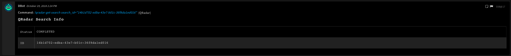
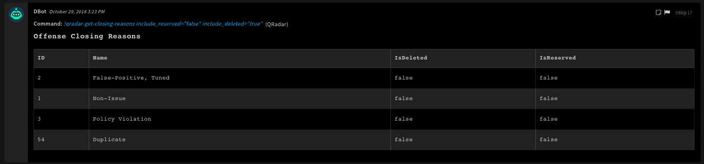

<!-- HTML_DOC -->

    Deprecated. Use IBM QRadar v2 or IBM QRadar v3 instead.
    This integration was integrated and tested with <strong>QRadar v7.3.1</strong> and <strong>API versions - 8.0, 8.1, and 9.0</strong>.
    The <strong>QRadar</strong> integration is deprecated from <strong>QRadar v7.3.2 Patch 2</strong>. If you're using a later version of QRadar, make sure you use the <strong>QRadar v2</strong> integration.

Use the QRadar integration to query offenses and create Cortex XSOAR incidents from the offenses.

For more information about filter syntax, see the <a href="https://www.ibm.com/support/knowledgecenter/SSKMKU/com.ibm.qradar.doc_cloud/c_rest_api_filtering.html" target="_blank" rel="noopener">IBM support documentation</a>.

<h2>QRadar Playbook</h2>

After you configure the QRadar integration, you can use the <em>QRadar - Get offense correlations</em> playbook. This playbook identifies and extracts additional information about QRadar offenses.

<ul>
<li>All correlations relevant to the offense.</li>
<li>Retrieve logs relevant to the correlations. Make sure that in the <strong><em>Should query for the correlations' log</em></strong> task you set the <code>inputs.GetCorrelationLogs</code> parameter to <code>True</code>). The maximum log count is 20.</li>
</ul>
<h2>Troubleshooting Performance Issues</h2>

In some cases, you might encounter performance issues when running QRadar AQL queries from Cortex XSOAR. This issue is caused by QRadar API limitations. We recommend that you test the QRadar API performance by running several cURL scripts.

<h5>1. Creating a search</h5>

Run the following command to use the QRadar API to create a new search.  Save the QUERY ID that is attached to the response for the next step.

<pre>curl -H "SEC: &lt;API KEY&gt;" -X POST &lt;QRADAR INSTANCE&gt;/api/ariel/searches?query_expression=&lt;QUERY IN URL SAFE ENCODING&gt;</pre>
<h5>2. Check if the search status is Complete or Executing</h5>

Use the following command to use the QRadar API to check the query status (EXECUTE, COMPLETED, or ERROR).

<pre>curl -H "SEC: &lt;API KEY&gt;" -X GET &lt;QRADAR INSTANCE&gt;/api/ariel/searches?&lt;QUERY ID&gt;</pre>
<h2>Configure QRadar on Cortex XSOAR</h2>
<ol>
<li>Navigate to <strong>Settings</strong> &gt; <strong>Integrations</strong> &gt; <strong>Servers &amp; Services</strong>.</li>
<li>Search for QRadar.</li>
<li>Click <strong>Add instance</strong> to create and configure a new integration instance. 
<ul>
<li>
<strong>Name</strong>: a textual name for the integration instance.</li>
<li><strong>Server URL (e.g. <a href="https://192.168.0.1/" rel="nofollow">https://192.168.0.1</a>)</strong></li>
<li><strong>Username</strong></li>
<li><strong>Authentication token</strong></li>
<li><strong>Query to fetch offenses</strong></li>
<li><strong>Number of offenses to pull per API call</strong></li>
<li><strong>Trust any certificate (not secure)</strong></li>
<li><strong>Use system proxy settings</strong></li>
<li><strong>Fetch incidents</strong></li>
<li><strong>Incident type</strong></li>
<li><strong>Full Incident Enrichment</strong> - when fetching incidents the integration will limit the number of requests it's sending QRadar. As a side effect, this will make the following fields contain their QRadar ids, and not values: source_address_ids, local_destination_address_ids.
<li><strong>Number of addresses to enrich per API call</strong></li>
</ul>
</li>
<li>Click <strong>Test</strong> to validate the URLs, token, and connection.</li>
</ol>
<h2 id="fetch-incidents-">Fetch incidents:</h2>

You can apply additional (optional) filters for the fetch-incident query using the <code>Query to fetch offenses</code> integration parameter. For more information on how to use the filter syntax, see the <a href="https://www.ibm.com/support/knowledgecenter/en/SS42VS_7.3.3/com.ibm.qradar.doc/c_rest_api_filtering.html">QRadar filter documentation</a> and <a href="https://www.ibm.com/support/knowledgecenter/en/SS42VS_7.3.2/com.ibm.qradar.doc/11.0--siem-offenses-GET.html">QRadar offense documentation</a>.

<ul>
<li>Full Incident Enrichment - Clear this checkbox to disable QRadar offense enrichment performed in fetch-incidents. This might help if you encounter a timeout while fetching new incidents.</li>
</ul>
<h2>Commands</h2>

You can execute these commands from the Cortex XSOAR CLI, as part of an automation, or in a playbook. After you successfully execute a command, a DBot message appears in the War Room with the command details.

<ol>
<li><a href="#h_63925473610281540896013759">Get offenses: qradar-offenses</a></li>
<li><a href="#h_79018805312601540896231220">Get an offense by offense ID: qradar-offense-by-id</a></li>
<li><a href="#h_92149467514891540897075885">Search QRadar using AQL: qradar-searches</a></li>
<li><a href="#h_87386991016071540897177298">Get a search ID and state: qradar-get-search</a></li>
<li><a href="#h_84112099417241540897241075">Get search results: qradar-get-search-results</a></li>
<li><a href="#h_32241731218401540897478973">Update an offense: qradar-update-offense</a></li>
<li><a href="#h_70700940319551540897642241">List all assets: qradar-get-assets</a></li>
<li><a href="#h_72974687620691540897778597">Get an asset by the asset ID: qradar-get-asset-by-id</a></li>
<li><a href="#h_9608617121821540897848969">Get the reason an offense was closed: qradar-get-closing-reasons</a></li>
<li><a href="#h_13326172022941540897946185">Create a note for an offense: qradar-create-note</a></li>
<li><a href="#h_28576390725071540898006566">Get a note for an offense: qradar-get-note</a></li>
<li><a href="#h_80276129726171540898072833">Get a reference by the reference name: qradar-get-reference-by-name</a></li>
<li><a href="#h_8213343321021542805401917">Create a reference set: qradar-create-reference-set</a></li>
<li><a href="#h_4048846705401542805486739">Delete a reference set: qradar-delete-reference-set</a></li>
<li><a href="#h_1052844619731542805553936">Create a value in a reference set: qradar-create-reference-set-value</a></li>
<li><a href="#h_38204499011231542805639258">Add or update a value in a reference set: qradar-update-reference-set-value</a></li>
<li><a href="#h_54862502414121542805968008">Delete a value from a reference set: qradar-delete-reference-set-value</a></li>
</ol>
<h3 id="h_63925473610281540896013759">1. Get offenses</h3>

Gets offenses from QRadar.

<h5>Base Command</h5>

<code>qradar-offenses</code>

<h5>Input</h5>
<table style="width: 744px;">
<thead>
<tr>
<th style="width: 129px;"><strong>Argument Name</strong></th>
<th style="width: 440px;"><strong>Description</strong></th>
<th style="width: 71px;"><strong>Required</strong></th>
</tr>
</thead>
<tbody>
<tr>
<td style="width: 129px;">filter</td>
<td style="width: 440px;">Query to filter offenses.  For more information, see the <a href="https://www.ibm.com/support/knowledgecenter/en/SS42VS_7.3.1/com.ibm.qradar.doc/c_rest_api_filtering.html" target="_blank" rel="noopener">QRadar documenatation</a>.</td>
<td style="width: 71px;">Optional</td>
</tr>
<tr>
<td style="width: 129px;">fields</td>
<td style="width: 440px;">If used, will filter all fields except for the specified ones. Use this parameter to specify which fields you would like to get back in the response. Fields that are not named are excluded. Specify subfields in brackets and multiple fields in the same object are separated by commas. The filter uses QRadar's field names.  For more information, see the <a href="https://www.ibm.com/support/knowledgecenter/SSKMKU/com.ibm.qradar.doc_cloud/9.1--siem-offenses-GET.html" target="_blank" rel="noopener">QRadar documentation</a>.</td>
<td style="width: 71px;">Optional</td>
</tr>
<tr>
<td style="width: 129px;">range</td>
<td style="width: 440px;">Range of results to return, e.g., 0-20</td>
<td style="width: 71px;">Optional</td>
</tr>
<tr>
<td style="width: 129px;">headers</td>
<td style="width: 440px;">Table headers to use the human readable output (if none provided, will show all table headers)</td>
<td style="width: 71px;">Optional</td>
</tr>
</tbody>
</table>

 

<h5>Context Output</h5>
<table style="width: 746px;">
<thead>
<tr>
<th style="width: 179px;"><strong>Path</strong></th>
<th style="width: 60px;"><strong>Type</strong></th>
<th style="width: 469px;"><strong>Description</strong></th>
</tr>
</thead>
<tbody>
<tr>
<td style="width: 179px;">QRadar.Offense.Followup</td>
<td style="width: 60px;">boolean</td>
<td style="width: 469px;">Offense followup</td>
</tr>
<tr>
<td style="width: 179px;">QRadar.Offense.ID</td>
<td style="width: 60px;">number</td>
<td style="width: 469px;">The ID of the offense</td>
</tr>
<tr>
<td style="width: 179px;">QRadar.Offense.Description</td>
<td style="width: 60px;">string</td>
<td style="width: 469px;">The description of the offense</td>
</tr>
<tr>
<td style="width: 179px;">QRadar.Offense.SourceAddress</td>
<td style="width: 60px;">unknown</td>
<td style="width: 469px;">The source addresses that are associated with the offense</td>
</tr>
<tr>
<td style="width: 179px;">QRadar.Offense.DestinationAddress</td>
<td style="width: 60px;">unknown</td>
<td style="width: 469px;">The local destination addresses that are associated with the offense. If your offense has a remote destination, you will need to use <em><strong>QRadarFullSearch</strong></em> playbook with the following query:  SELECT destinationip FROM events WHERE inOffense() GROUP BY destinationip</td>
</tr>
<tr>
<td style="width: 179px;">QRadar.Offense.RemoteDestinationCount</td>
<td style="width: 60px;">unknown</td>
<td style="width: 469px;">The remote destination that are associated with the offense. If this value is greater than 0 that means your offense has a remote destination, you will need to use QRadarFullSearch playbook with the following query:  SELECT destinationip FROM events WHERE inOffense() GROUP BY destinationip</td>
</tr>
<tr>
<td style="width: 179px;">QRadar.Offense.StartTime</td>
<td style="width: 60px;">date</td>
<td style="width: 469px;">The time (ISO) when the offense was started.</td>
</tr>
<tr>
<td style="width: 179px;">QRadar.Offense.EventCount</td>
<td style="width: 60px;">number</td>
<td style="width: 469px;">The number of events that are associated with the offense</td>
</tr>
<tr>
<td style="width: 179px;">QRadar.Offense.Magnitude</td>
<td style="width: 60px;">number</td>
<td style="width: 469px;">The magnitude of the offense</td>
</tr>
<tr>
<td style="width: 179px;">QRadar.Offense.LastUpdatedTime</td>
<td style="width: 60px;">date</td>
<td style="width: 469px;">The time (ISO) when the offense was last updated</td>
</tr>
<tr>
<td style="width: 179px;">QRadar.Offense.OffenseType</td>
<td style="width: 60px;">string</td>
<td style="width: 469px;">The offense type (due to API limitations if username and password were not provided, this value will be the id of offense type)</td>
</tr>
</tbody>
</table>

 

<h5>Command Examples</h5>
<pre>  !qradar-offenses range=0-1 filter="follow_up = false" headers=ID,Magnitude</pre>
<pre>  !qradar-offenses fields="id,start_time"</pre>
<h5>Context Example</h5>
<pre>{
    "QRadar": {
        "Offense": {
            "Followup": false, 
            "Description": "Multiple Login Failures for the Same User\n preceded by shachar_test\n containing Failed Login Attempt\n", 
            "EventCount": 3, 
            "Magnitude": 3, 
            "OffenseType": "Username", 
            "StartTime": "2018-10-16T13:07:36.245000Z", 
            "SourceAddress": [
                "94.188.164.68"
            ], 
            "ID": 78, 
            "LastUpdatedTime": "2018-10-16T13:07:40.675000Z"
        }
    }
}
</pre>
<h5>Human Readable Output</h5>

<h3 id="h_79018805312601540896231220">2. Get an offense by offense ID</h3>

Gets the offense with the matching offense ID from QRadar.

<h5>Base Command</h5>

<code>qradar-offense-by-id</code>

<h5>Input</h5>
<table style="width: 744px;">
<thead>
<tr>
<th style="width: 148px;"><strong>Argument Name</strong></th>
<th style="width: 508px;"><strong>Description</strong></th>
<th style="width: 10px;"><strong>Required</strong></th>
</tr>
</thead>
<tbody>
<tr>
<td style="width: 148px;">offense_id</td>
<td style="width: 508px;">Offense ID</td>
<td style="width: 10px;">Required</td>
</tr>
<tr>
<td style="width: 148px;">filter</td>
<td style="width: 508px;">Query to filter offenses.  For more information, see the <a href="https://www.ibm.com/support/knowledgecenter/en/SS42VS_7.3.1/com.ibm.qradar.doc/c_rest_api_filtering.html" target="_blank" rel="noopener">QRadar documentation</a>.</td>
<td style="width: 10px;">Optional</td>
</tr>
<tr>
<td style="width: 148px;">fields</td>
<td style="width: 508px;">If used, will filter all fields except for the specified ones. Use this parameter to specify which fields you would like to get back in the response. Fields that are not named are excluded. Specify subfields in brackets and multiple fields in the same object are separated by commas. The filter uses QRadar's field names.  For more information, see the <a href="https://www.ibm.com/support/knowledgecenter/SSKMKU/com.ibm.qradar.doc_cloud/9.1--siem-offenses-GET.html" target="_blank" rel="noopener">QRadar documentation</a>.</td>
<td style="width: 10px;">Optional</td>
</tr>
<tr>
<td style="width: 148px;">headers</td>
<td style="width: 508px;">Table headers to use the human readable output (if none provided, will show all table headers)</td>
<td style="width: 10px;">Optional</td>
</tr>
</tbody>
</table>

 

<h5>Context Output</h5>
<table style="width: 748px;">
<thead>
<tr>
<th style="width: 285px;"><strong>Path</strong></th>
<th style="width: 68px;"><strong>Type</strong></th>
<th style="width: 355px;"><strong>Description</strong></th>
</tr>
</thead>
<tbody>
<tr>
<td style="width: 285px;">QRadar.Offense.Credibility</td>
<td style="width: 68px;">number</td>
<td style="width: 355px;">The credibility of the offense</td>
</tr>
<tr>
<td style="width: 285px;">QRadar.Offense.Relevance</td>
<td style="width: 68px;">number</td>
<td style="width: 355px;">The relevance of the offense</td>
</tr>
<tr>
<td style="width: 285px;">QRadar.Offense.Severity</td>
<td style="width: 68px;">number</td>
<td style="width: 355px;">The severity of the offense</td>
</tr>
<tr>
<td style="width: 285px;">QRadar.Offense.SourceAddress</td>
<td style="width: 68px;">unknown</td>
<td style="width: 355px;">The source addresses that are associated with the offense.</td>
</tr>
<tr>
<td style="width: 285px;">QRadar.Offense.DestinationAddress</td>
<td style="width: 68px;">unknown</td>
<td style="width: 355px;">The local destination addresses that are associated with the offense. If your offense has a remote destination, you will need to use QRadarFullSearch playbook with the following query:  SELECT destinationip FROM events WHERE inOffense() GROUP BY destinationip</td>
</tr>
<tr>
<td style="width: 285px;">QRadar.Offense.RemoteDestinationCount</td>
<td style="width: 68px;">unknown</td>
<td style="width: 355px;">The remote destination that are associated with the offense. If this value is greater than 0 that means your offense has a remote destination, you will need to use QRadarFullSearch playbook with the following query:  SELECT destinationip FROM events WHERE inOffense() GROUP BY destinationip</td>
</tr>
<tr>
<td style="width: 285px;">QRadar.Offense.AssignedTo</td>
<td style="width: 68px;">string</td>
<td style="width: 355px;">The user the offense is assigned to</td>
</tr>
<tr>
<td style="width: 285px;">QRadar.Offense.StartTime</td>
<td style="width: 68px;">date</td>
<td style="width: 355px;">The time (ISO) when the offense started</td>
</tr>
<tr>
<td style="width: 285px;">QRadar.Offense.ID</td>
<td style="width: 68px;">int</td>
<td style="width: 355px;">The ID of the offense.</td>
</tr>
<tr>
<td style="width: 285px;">QRadar.Offense.DestinationHostname</td>
<td style="width: 68px;">unknown</td>
<td style="width: 355px;">Destination hostname</td>
</tr>
<tr>
<td style="width: 285px;">QRadar.Offense.Description</td>
<td style="width: 68px;">string</td>
<td style="width: 355px;">The description of the offense</td>
</tr>
<tr>
<td style="width: 285px;">QRadar.Offense.EventCount</td>
<td style="width: 68px;">number</td>
<td style="width: 355px;">The number of events that are associated with the offense.</td>
</tr>
<tr>
<td style="width: 285px;">QRadar.Offense.OffenseSource</td>
<td style="width: 68px;">string</td>
<td style="width: 355px;">The source of the offense.</td>
</tr>
<tr>
<td style="width: 285px;">QRadar.Offense.Status</td>
<td style="width: 68px;">string</td>
<td style="width: 355px;">The status of the offense ("OPEN", "HIDDEN", or "CLOSED")</td>
</tr>
<tr>
<td style="width: 285px;">QRadar.Offense.Magnitude</td>
<td style="width: 68px;">number</td>
<td style="width: 355px;">The magnitude of the offense.</td>
</tr>
<tr>
<td style="width: 285px;">QRadar.Offense.ClosingUser</td>
<td style="width: 68px;">string</td>
<td style="width: 355px;">The user that closed the offense</td>
</tr>
<tr>
<td style="width: 285px;">QRadar.Offense.ClosingReason</td>
<td style="width: 68px;">string</td>
<td style="width: 355px;">The offense closing reason.</td>
</tr>
<tr>
<td style="width: 285px;">QRadar.Offense.CloseTime</td>
<td style="width: 68px;">date</td>
<td style="width: 355px;">The time when the offense was closed.</td>
</tr>
<tr>
<td style="width: 285px;">QRadar.Offense.LastUpdatedTime</td>
<td style="width: 68px;">date</td>
<td style="width: 355px;">The time (ISO) when the offense was last updated.</td>
</tr>
<tr>
<td style="width: 285px;">QRadar.Offense.Categories</td>
<td style="width: 68px;">unknown</td>
<td style="width: 355px;">Event categories that are associated with the offense.</td>
</tr>
<tr>
<td style="width: 285px;">QRadar.Offense.FlowCount</td>
<td style="width: 68px;">number</td>
<td style="width: 355px;">The number of flows that are associated with the offense.</td>
</tr>
<tr>
<td style="width: 285px;">QRadar.Offense.FollowUp</td>
<td style="width: 68px;">boolean</td>
<td style="width: 355px;">Offense followup.</td>
</tr>
<tr>
<td style="width: 285px;">QRadar.Offense.OffenseType</td>
<td style="width: 68px;">string</td>
<td style="width: 355px;">A number that represents the offense type</td>
</tr>
<tr>
<td style="width: 285px;">QRadar.Offense.Protected</td>
<td style="width: 68px;">boolean</td>
<td style="width: 355px;">Is the offense protected</td>
</tr>
</tbody>
</table>

 

<h5>Command Example</h5>
<pre>!qradar-offense-by-id fields=id,magnitude offense_id=78</pre>
<pre>!qradar-offense-by-id offense_id=78</pre>
<h5>Context Example</h5>
<pre>{
    "QRadar": {
        "Offense": {
            "Followup": false, 
            "OffenseSource": "admin", 
            "Description": "Multiple Login Failures for the Same User\n preceded by shachar_test\n containing Failed Login Attempt\n", 
            "EventCount": 3, 
            "Credibility": 3, 
            "Status": "OPEN", 
            "DestinationHostname": [
                "Net-10-172-192.Net_172_16_0_0"
            ], 
            "StartTime": "2018-10-16T13:07:36.245000Z", 
            "Protected": false, 
            "Magnitude": 3, 
            "FlowCount": 0, 
            "OffenseType": "Username", 
            "SourceAddress": [
                "94.188.164.68"
            ], 
            "Relevance": 3, 
            "Severity": 7, 
            "ID": 78, 
            "Categories": [
                "User Login Failure", 
                "SIM User Authentication"
            ], 
            "LastUpdatedTime": "2018-10-16T13:07:40.675000Z"
        }
    }
}
</pre>
<h5>Human Readable Output</h5>

<h3 id="h_92149467514891540897075885">3. Search QRadar using AQLqradar-searches</h3>

Searches in QRadar using AQL. It is highly recommended to use the playbook 'QRadarFullSearch' instead of this command - it will execute the search, and will return the result.

<h5>Base Command</h5>

<code>qradar-searches</code>

<h5>Input</h5>
<table style="width: 748px;">
<thead>
<tr>
<th style="width: 157px;"><strong>Argument Name</strong></th>
<th style="width: 480px;"><strong>Description</strong></th>
<th style="width: 71px;"><strong>Required</strong></th>
</tr>
</thead>
<tbody>
<tr>
<td style="width: 157px;">query_expression</td>
<td style="width: 480px;">The query expressions in AQL.  For more information, see the <a href="https://www.ibm.com/support/knowledgecenter/en/SS42VS_7.3.0/com.ibm.qradar.doc/c_aql_intro.html" target="_blank" rel="noopener">Ariel Query Language documentation</a>.</td>
<td style="width: 71px;">Required</td>
</tr>
<tr>
<td style="width: 157px;">headers</td>
<td style="width: 480px;">Table headers to use the human readable output (if none provided, will show all table headers)</td>
<td style="width: 71px;">Optional</td>
</tr>
</tbody>
</table>

 

<h5>Context Output</h5>
<table style="width: 747px;">
<thead>
<tr>
<th style="width: 269px;"><strong>Path</strong></th>
<th style="width: 12px;"><strong>Type</strong></th>
<th style="width: 427px;"><strong>Description</strong></th>
</tr>
</thead>
<tbody>
<tr>
<td style="width: 269px;">QRadar.Search.ID</td>
<td style="width: 12px;">number</td>
<td style="width: 427px;">Search ID</td>
</tr>
<tr>
<td style="width: 269px;">QRadar.Search.State</td>
<td style="width: 12px;">string</td>
<td style="width: 427px;">The state of the search</td>
</tr>
</tbody>
</table>

 

<h5>Command Example</h5>
<pre>!qradar-searches query_expression="SELECT sourceip AS 'MY Source IPs' FROM events"</pre>
<h5>Context Example</h5>
<pre>{
    "QRadar": {
        "Search": {
            "Status": "EXECUTE", 
            "ID": "14b1d702-edba-43e7-b01c-36f8da1ed016"
        }
    }
}
</pre>
<h5>Human Readable Output</h5>

<h3 id="h_87386991016071540897177298">4. Get a search ID and state</h3>

Gets a specific search ID and state.

<h5>Base Command</h5>

<code>qradar-get-search</code>

<h5>Input</h5>
<table style="width: 748px;">
<thead>
<tr>
<th style="width: 156px;"><strong>Argument Name</strong></th>
<th style="width: 481px;"><strong>Description</strong></th>
<th style="width: 71px;"><strong>Required</strong></th>
</tr>
</thead>
<tbody>
<tr>
<td style="width: 156px;">search_id</td>
<td style="width: 481px;">The search ID</td>
<td style="width: 71px;">Required</td>
</tr>
<tr>
<td style="width: 156px;">headers</td>
<td style="width: 481px;">Table headers to use the human readable output (if none provided, will show all table headers)</td>
<td style="width: 71px;">Optional</td>
</tr>
</tbody>
</table>

 

<h5>Context Output</h5>
<table style="width: 746px;">
<thead>
<tr>
<th style="width: 270px;"><strong>Path</strong></th>
<th style="width: 30px;"><strong>Type</strong></th>
<th style="width: 408px;"><strong>Description</strong></th>
</tr>
</thead>
<tbody>
<tr>
<td style="width: 270px;">QRadar.Search.ID</td>
<td style="width: 30px;">number</td>
<td style="width: 408px;">Search ID</td>
</tr>
<tr>
<td style="width: 270px;">QRadar.Search.State</td>
<td style="width: 30px;">string</td>
<td style="width: 408px;">The state of the search</td>
</tr>
</tbody>
</table>

 

<h5>Command Example</h5>
<pre>!qradar-get-search search_id=14b1d702-edba-43e7-b01c-36f8da1ed016</pre>
<h5>Context Example</h5>
<pre>{
    "QRadar": {
        "Search": {
            "Status": "COMPLETED", 
            "ID": "14b1d702-edba-43e7-b01c-36f8da1ed016"
        }
    }
}
</pre>
<h5>Human Readable Output</h5>

<h3 id="h_84112099417241540897241075">5. Get search results</h3>

Gets search results.

<h5>Base Command</h5>

<code>qradar-get-search-results</code>

<h5>Input</h5>
<table style="width: 748px;">
<thead>
<tr>
<th style="width: 145px;"><strong>Argument Name</strong></th>
<th style="width: 492px;"><strong>Description</strong></th>
<th style="width: 71px;"><strong>Required</strong></th>
</tr>
</thead>
<tbody>
<tr>
<td style="width: 145px;">search_id</td>
<td style="width: 492px;">The search ID</td>
<td style="width: 71px;">Required</td>
</tr>
<tr>
<td style="width: 145px;">range</td>
<td style="width: 492px;">Range of results to return, e.g., 0-20</td>
<td style="width: 71px;">Optional</td>
</tr>
<tr>
<td style="width: 145px;">headers</td>
<td style="width: 492px;">Table headers to use the human readable output (if none provided, will show all table headers)</td>
<td style="width: 71px;">Optional</td>
</tr>
<tr>
<td style="width: 145px;">output_path</td>
<td style="width: 492px;">Replaces the default context output path for the query result <em><strong>(QRadar.Search.Result)</strong></em>.  For example, for <code>output_path=QRadar.Correlations</code> the result will be under the key <em><strong>QRadar.Correlations</strong></em> in the context data.</td>
<td style="width: 71px;">Optional</td>
</tr>
</tbody>
</table>

 

<h5>Context Output</h5>
<table style="width: 747px;">
<thead>
<tr>
<th style="width: 272px;"><strong>Path</strong></th>
<th style="width: 48px;"><strong>Type</strong></th>
<th style="width: 388px;"><strong>Description</strong></th>
</tr>
</thead>
<tbody>
<tr>
<td style="width: 272px;">QRadar.Search.Result</td>
<td style="width: 48px;">unknown</td>
<td style="width: 388px;">The result of the search</td>
</tr>
</tbody>
</table>

 

<h5>Command Example</h5>
<pre>!qradar-get-search-results search_id=14b1d702-edba-43e7-b01c-36f8da1ed016 range=0-0</pre>
<h5>Context Example</h5>
<pre>{
    "QRadar": {
        "Search": {
            "Result": {
                "events": [
                    {
                        "MY Source IPs": "172.31.25.170"
                    }
                ]
            }
        }
    }
}
</pre>
<h5>Human Readable Output</h5>

<h3 id="h_32241731218401540897478973">6. Update an offense</h3>

Updates an offense.

<h5>Base Command</h5>

<code>qradar-update-offense</code>

<h5>Input</h5>
<table style="width: 748px;">
<thead>
<tr>
<th style="width: 159px;"><strong>Argument Name</strong></th>
<th style="width: 478px;"><strong>Description</strong></th>
<th style="width: 71px;"><strong>Required</strong></th>
</tr>
</thead>
<tbody>
<tr>
<td style="width: 159px;">offense_id</td>
<td style="width: 478px;">The ID of the offense to update</td>
<td style="width: 71px;">Required</td>
</tr>
<tr>
<td style="width: 159px;">protected</td>
<td style="width: 478px;">Set to true to protect the offense</td>
<td style="width: 71px;">Optional</td>
</tr>
<tr>
<td style="width: 159px;">follow_up</td>
<td style="width: 478px;">Set to true to set the follow up flag on the offense</td>
<td style="width: 71px;">Optional</td>
</tr>
<tr>
<td style="width: 159px;">status</td>
<td style="width: 478px;">The new status for the offense</td>
<td style="width: 71px;">Optional</td>
</tr>
<tr>
<td style="width: 159px;">closing_reason_name</td>
<td style="width: 478px;">The name of a closing reason.  You must provide a valid closing_reason_name when you close an offense.  The default closing_reasons are: (1) False-Positive, Tuned (2) Non-Issues (3) Policy Violation</td>
<td style="width: 71px;">Optional</td>
</tr>
<tr>
<td style="width: 159px;">assigned_to</td>
<td style="width: 478px;">A user to assign the offense to</td>
<td style="width: 71px;">Optional</td>
</tr>
<tr>
<td style="width: 159px;">headers</td>
<td style="width: 478px;">Table headers</td>
<td style="width: 71px;">Optional</td>
</tr>
<tr>
<td style="width: 159px;">fields</td>
<td style="width: 478px;">Use this parameter to specify which fields you would like to get back in the response. Fields that are not named are excluded. Specify subfields in brackets and multiple fields in the same object are separated by commas.  For more information, see the <a href="https://www.ibm.com/support/knowledgecenter/SSKMKU/com.ibm.qradar.doc_cloud/9.1--siem-offenses-offense_id-POST.html" target="_blank" rel="noopener">QRadar documentation</a>.</td>
<td style="width: 71px;">Optional</td>
</tr>
</tbody>
</table>

 

<h5>Context Output</h5>
<table style="width: 748px;">
<thead>
<tr>
<th style="width: 261px;"><strong>Path</strong></th>
<th style="width: 68px;"><strong>Type</strong></th>
<th style="width: 379px;"><strong>Description</strong></th>
</tr>
</thead>
<tbody>
<tr>
<td style="width: 261px;">QRadar.Offense.Credibility</td>
<td style="width: 68px;">number</td>
<td style="width: 379px;">The credibility of the offense</td>
</tr>
<tr>
<td style="width: 261px;">QRadar.Offense.Relevance</td>
<td style="width: 68px;">number</td>
<td style="width: 379px;">The relevance of the offense</td>
</tr>
<tr>
<td style="width: 261px;">QRadar.Offense.Severity</td>
<td style="width: 68px;">number</td>
<td style="width: 379px;">The severity of the offense</td>
</tr>
<tr>
<td style="width: 261px;">QRadar.Offense.SourceAddress</td>
<td style="width: 68px;">unknown</td>
<td style="width: 379px;">The source addresses that are associated with the offense.</td>
</tr>
<tr>
<td style="width: 261px;">QRadar.Offense.DestinationAddress</td>
<td style="width: 68px;">unknown</td>
<td style="width: 379px;">The destination addresses that are associated with the offense.</td>
</tr>
<tr>
<td style="width: 261px;">QRadar.Offense.AssignedTo</td>
<td style="width: 68px;">string</td>
<td style="width: 379px;">The user the offense is assigned to.</td>
</tr>
<tr>
<td style="width: 261px;">QRadar.Offense.StartTime</td>
<td style="width: 68px;">date</td>
<td style="width: 379px;">The time (ISO) when the offense was started.</td>
</tr>
<tr>
<td style="width: 261px;">QRadar.Offense.ID</td>
<td style="width: 68px;">int</td>
<td style="width: 379px;">The ID of the offense.</td>
</tr>
<tr>
<td style="width: 261px;">QRadar.Offense.DestinationHostname</td>
<td style="width: 68px;">unknown</td>
<td style="width: 379px;">Destination hostname</td>
</tr>
<tr>
<td style="width: 261px;">QRadar.Offense.Description</td>
<td style="width: 68px;">string</td>
<td style="width: 379px;">The description of the offense.</td>
</tr>
<tr>
<td style="width: 261px;">QRadar.Offense.EventCount</td>
<td style="width: 68px;">number</td>
<td style="width: 379px;">The number of events that are associated with the offense.</td>
</tr>
<tr>
<td style="width: 261px;">QRadar.Offense.OffenseSource</td>
<td style="width: 68px;">string</td>
<td style="width: 379px;">The source of the offense.</td>
</tr>
<tr>
<td style="width: 261px;">QRadar.Offense.Status</td>
<td style="width: 68px;">string</td>
<td style="width: 379px;">The status of the offense. One of "OPEN", "HIDDEN", or "CLOSED".</td>
</tr>
<tr>
<td style="width: 261px;">QRadar.Offense.Magnitude</td>
<td style="width: 68px;">number</td>
<td style="width: 379px;">The magnitude of the offense.</td>
</tr>
<tr>
<td style="width: 261px;">QRadar.Offense.ClosingUser</td>
<td style="width: 68px;">string</td>
<td style="width: 379px;">The user that closed the offense</td>
</tr>
<tr>
<td style="width: 261px;">QRadar.Offense.ClosingReason</td>
<td style="width: 68px;">string</td>
<td style="width: 379px;">The offense closing reason.</td>
</tr>
<tr>
<td style="width: 261px;">QRadar.Offense.CloseTime</td>
<td style="width: 68px;">date</td>
<td style="width: 379px;">The time when the offense was closed.</td>
</tr>
<tr>
<td style="width: 261px;">QRadar.Offense.LastUpdatedTime</td>
<td style="width: 68px;">date</td>
<td style="width: 379px;">The time (ISO) when the offense was last updated.</td>
</tr>
<tr>
<td style="width: 261px;">QRadar.Offense.Categories</td>
<td style="width: 68px;">unknown</td>
<td style="width: 379px;">Event categories that are associated with the offense.</td>
</tr>
<tr>
<td style="width: 261px;">QRadar.Offense.FlowCount</td>
<td style="width: 68px;">number</td>
<td style="width: 379px;">The number of flows that are associated with the offense.</td>
</tr>
<tr>
<td style="width: 261px;">QRadar.Offense.FollowUp</td>
<td style="width: 68px;">boolean</td>
<td style="width: 379px;">Offense followup.</td>
</tr>
<tr>
<td style="width: 261px;">QRadar.Offense.OffenseType</td>
<td style="width: 68px;">string</td>
<td style="width: 379px;">A number that represents the offense type</td>
</tr>
<tr>
<td style="width: 261px;">QRadar.Offense.Protected</td>
<td style="width: 68px;">boolean</td>
<td style="width: 379px;">Is the offense protected</td>
</tr>
</tbody>
</table>

 

<h5>Command Example</h5>
<pre>!qradar-update-offense offense_id=78 protected=false</pre>
<h5>Context Example</h5>
<pre>{
    "QRadar": {
        "Offense": {
            "Followup": false, 
            "OffenseSource": "admin", 
            "Description": "Multiple Login Failures for the Same User\n preceded by shachar_test\n containing Failed Login Attempt\n", 
            "EventCount": 3, 
            "Credibility": 3, 
            "Status": "OPEN", 
            "DestinationHostname": [
                "Net-10-172-192.Net_172_16_0_0"
            ], 
            "StartTime": "2018-10-16T13:07:36.245000Z", 
            "Protected": false, 
            "Magnitude": 3, 
            "FlowCount": 0, 
            "OffenseType": "Username", 
            "SourceAddress": [
                "94.188.164.68"
            ], 
            "Relevance": 3, 
            "Severity": 7, 
            "ID": 78, 
            "Categories": [
                "User Login Failure", 
                "SIM User Authentication"
            ], 
            "LastUpdatedTime": "2018-10-16T13:07:40.675000Z"
        }
    }
}
</pre>
<h5>Human Readable Output</h5>

<h3 id="h_70700940319551540897642241">7. List all assets</h3>

List all assets found in the model.

<h5>Base Command</h5>

<code>qradar-get-assets</code>

<h5>Input</h5>
<table style="width: 746px;">
<thead>
<tr>
<th style="width: 141px;"><strong>Argument Name</strong></th>
<th style="width: 496px;"><strong>Description</strong></th>
<th style="width: 71px;"><strong>Required</strong></th>
</tr>
</thead>
<tbody>
<tr>
<td style="width: 141px;">filter</td>
<td style="width: 496px;">Query to filter assets.  For more information, see the <a href="https://www.ibm.com/support/knowledgecenter/en/SS42VS_7.3.1/com.ibm.qradar.doc/c_rest_api_filtering.html" target="_blank" rel="noopener">QRadar documentation</a>.</td>
<td style="width: 71px;">Optional</td>
</tr>
<tr>
<td style="width: 141px;">fields</td>
<td style="width: 496px;">If used, will filter all fields except for the specified ones. Use this parameter to specify which fields you would like to get back in the response. Fields that are not named are excluded. Specify subfields in brackets and multiple fields in the same object are separated by commas. The filter uses QRadar's field names.  For more information, see the <a href="https://www.ibm.com/support/knowledgecenter/SSKMKU/com.ibm.qradar.doc_cloud/9.1--asset_model-assets-GET.html" target="_blank" rel="noopener">QRadar documentation</a>.</td>
<td style="width: 71px;">Optional</td>
</tr>
<tr>
<td style="width: 141px;">range</td>
<td style="width: 496px;">Range of results to return. e.g.: 0-20</td>
<td style="width: 71px;">Optional</td>
</tr>
<tr>
<td style="width: 141px;">headers</td>
<td style="width: 496px;">Table headers to use the human readable output (if none provided, will show all table headers)</td>
<td style="width: 71px;">Optional</td>
</tr>
</tbody>
</table>

 

<h5>Context Output</h5>
<table style="width: 745px;">
<thead>
<tr>
<th style="width: 294px;"><strong>Path</strong></th>
<th style="width: 43px;"><strong>Type</strong></th>
<th style="width: 371px;"><strong>Description</strong></th>
</tr>
</thead>
<tbody>
<tr>
<td style="width: 294px;">QRadar.Assets.ID</td>
<td style="width: 43px;">number</td>
<td style="width: 371px;">The ID of the asset</td>
</tr>
<tr>
<td style="width: 294px;">Endpoint.IPAddress</td>
<td style="width: 43px;">unknown</td>
<td style="width: 371px;">IP address of the asset</td>
</tr>
<tr>
<td style="width: 294px;">QRadar.Assets.Name.Value</td>
<td style="width: 43px;">string</td>
<td style="width: 371px;">Name of the asset</td>
</tr>
<tr>
<td style="width: 294px;">Endpoint.OS</td>
<td style="width: 43px;">number</td>
<td style="width: 371px;">Asset OS</td>
</tr>
<tr>
<td style="width: 294px;">QRadar.Assets.AggregatedCVSSScore.Value</td>
<td style="width: 43px;">number</td>
<td style="width: 371px;">CVSSScore</td>
</tr>
<tr>
<td style="width: 294px;">QRadar.Assets.AggregatedCVSSScore.LastUser</td>
<td style="width: 43px;">string</td>
<td style="width: 371px;">Last user who updated the Aggregated CVSS Score</td>
</tr>
<tr>
<td style="width: 294px;">QRadar.Assets.Weight.Value</td>
<td style="width: 43px;">number</td>
<td style="width: 371px;">Asset weight</td>
</tr>
<tr>
<td style="width: 294px;">QRadar.Assets.Weight.LastUser</td>
<td style="width: 43px;">string</td>
<td style="width: 371px;">Last user who updated the weight</td>
</tr>
<tr>
<td style="width: 294px;">QRadar.Assets.Name.LastUser</td>
<td style="width: 43px;">string</td>
<td style="width: 371px;">Last user who updated the name</td>
</tr>
</tbody>
</table>

 

<h5>Command Example</h5>
<pre>!qradar-get-assets range=0-1</pre>
<h5>Context Example</h5>
<pre>{
    "QRadar": {
        "Asset": {
            "AggregatedCVSSScore": {
                "LastUser": "USER:admin", 
                "Value": "h"
            }, 
            "ID": 1001, 
            "Weight": {
                "LastUser": "USER:admin", 
                "Value": "10"
            }, 
            "Name": {
                "LastUser": "USER:admin", 
                "Value": "Test"
            }
        }
    }, 
    "Endpoint": {
        "OS": "80345", 
        "IPAddress": [
            "10.0.0.1", 
            "10.0.0.2"
        ]
    }
}
</pre>
<h5>Human Readable Output</h5>

<h3 id="h_72974687620691540897778597">8. Get an asset by the asset ID</h3>

Retrieves the asset by ID.

<h5>Base Command</h5>

<code>qradar-get-asset-by-id</code>

<h5>Input</h5>
<table style="width: 747px;">
<thead>
<tr>
<th style="width: 213px;"><strong>Argument Name</strong></th>
<th style="width: 462px;"><strong>Description</strong></th>
<th style="width: 33px;"><strong>Required</strong></th>
</tr>
</thead>
<tbody>
<tr>
<td style="width: 213px;">asset_id</td>
<td style="width: 462px;">The ID of the requested asset.</td>
<td style="width: 33px;">Required</td>
</tr>
</tbody>
</table>

 

<h5>Context Output</h5>
<table style="width: 746px;">
<thead>
<tr>
<th style="width: 266px;"><strong>Path</strong></th>
<th style="width: 75px;"><strong>Type</strong></th>
<th style="width: 367px;"><strong>Description</strong></th>
</tr>
</thead>
<tbody>
<tr>
<td style="width: 266px;">QRadar.Assets.ID</td>
<td style="width: 75px;">number</td>
<td style="width: 367px;">The ID of the asset.</td>
</tr>
<tr>
<td style="width: 266px;">Endpoint.MACAddress</td>
<td style="width: 75px;">unknown</td>
<td style="width: 367px;">Asset MAC address.</td>
</tr>
<tr>
<td style="width: 266px;">Endpoint.IPAddress</td>
<td style="width: 75px;">unknown</td>
<td style="width: 367px;">It's in ip_addresses - value</td>
</tr>
<tr>
<td style="width: 266px;">QRadar.Assets.ComplianceNotes.Value</td>
<td style="width: 75px;">string</td>
<td style="width: 367px;">Compliance notes</td>
</tr>
<tr>
<td style="width: 266px;">QRadar.Assets.CompliancePlan.Value</td>
<td style="width: 75px;">string</td>
<td style="width: 367px;">Compliance plan</td>
</tr>
<tr>
<td style="width: 266px;">QRadar.Assets.CollateralDamagePotential.Value</td>
<td style="width: 75px;">unknown</td>
<td style="width: 367px;">Collateral damage potential</td>
</tr>
<tr>
<td style="width: 266px;">QRadar.Assets.AggregatedCVSSScore.Value</td>
<td style="width: 75px;">number</td>
<td style="width: 367px;">CVSSScore</td>
</tr>
<tr>
<td style="width: 266px;">QRadar.Assets.Name.Value</td>
<td style="width: 75px;">string</td>
<td style="width: 367px;">Name of the asset</td>
</tr>
<tr>
<td style="width: 266px;">QRadar.Assets.GroupName</td>
<td style="width: 75px;">string</td>
<td style="width: 367px;">Name of the asset's group</td>
</tr>
<tr>
<td style="width: 266px;">Endpoint.Domain</td>
<td style="width: 75px;">unknown</td>
<td style="width: 367px;">DNS name</td>
</tr>
<tr>
<td style="width: 266px;">Endpoint.OS</td>
<td style="width: 75px;">unknown</td>
<td style="width: 367px;">Asset OS</td>
</tr>
<tr>
<td style="width: 266px;">QRadar.Assets.Weight.Value</td>
<td style="width: 75px;">number</td>
<td style="width: 367px;">Asset weight</td>
</tr>
<tr>
<td style="width: 266px;">QRadar.Assets.Vulnerabilities.Value</td>
<td style="width: 75px;">unknown</td>
<td style="width: 367px;">Vulnerabilities</td>
</tr>
<tr>
<td style="width: 266px;">QRadar.Assets.Location</td>
<td style="width: 75px;">string</td>
<td style="width: 367px;">Location.</td>
</tr>
<tr>
<td style="width: 266px;">QRadar.Assets.Description</td>
<td style="width: 75px;">string</td>
<td style="width: 367px;">The asset description.</td>
</tr>
<tr>
<td style="width: 266px;">QRadar.Assets.SwitchID</td>
<td style="width: 75px;">number</td>
<td style="width: 367px;">Switch ID</td>
</tr>
<tr>
<td style="width: 266px;">QRadar.Assets.SwitchPort</td>
<td style="width: 75px;">number</td>
<td style="width: 367px;">Switch port.</td>
</tr>
<tr>
<td style="width: 266px;">QRadar.Assets.Name.LastUser</td>
<td style="width: 75px;">string</td>
<td style="width: 367px;">Last user who updated the name</td>
</tr>
<tr>
<td style="width: 266px;">QRadar.Assets.AggregatedCVSSScore.LastUser</td>
<td style="width: 75px;">string</td>
<td style="width: 367px;">Last user who updated the Aggregated CVSS Score</td>
</tr>
<tr>
<td style="width: 266px;">QRadar.Assets.Weight.LastUser</td>
<td style="width: 75px;">string</td>
<td style="width: 367px;">Last user who updated the weight</td>
</tr>
<tr>
<td style="width: 266px;">QRadar.Assets.ComplianceNotes.LastUser</td>
<td style="width: 75px;">string</td>
<td style="width: 367px;">Last user who updated the compliance notes</td>
</tr>
<tr>
<td style="width: 266px;">QRadar.Assets.CompliancePlan.LastUser</td>
<td style="width: 75px;">string</td>
<td style="width: 367px;">Last user who updated the compliance plan</td>
</tr>
<tr>
<td style="width: 266px;">QRadar.Assets.CollateralDamagePotential.LastUser</td>
<td style="width: 75px;">string</td>
<td style="width: 367px;">Last user who updated the collateral damage potential</td>
</tr>
<tr>
<td style="width: 266px;">QRadar.Assets.Vulnerabilities.LastUser</td>
<td style="width: 75px;">string</td>
<td style="width: 367px;">Last user who updated the vulnerabilities</td>
</tr>
</tbody>
</table>

 

<h5>Command Example</h5>
<pre>!qradar-get-asset-by-id asset_id=1001</pre>
<h5>Context Example</h5>
<pre>{
    "QRadar": {
        "Asset": {
            "Name": {
                "LastUser": "USER:admin", 
                "Value": "Test"
            }, 
            "Weight": {
                "LastUser": "USER:admin", 
                "Value": "10"
            }, 
            "SwitchPort": {
                "LastUser": "USER:admin", 
                "Value": "1"
            }, 
            "SwitchID": {
                "LastUser": "USER:admin", 
                "Value": "1"
            }, 
            "AggregatedCVSSScore": {
                "LastUser": "USER:admin", 
                "Value": "h"
            }, 
            "Location": {
                "LastUser": "USER:admin", 
                "Value": "Israel"
            }, 
            "CompliancePlan": {
                "LastUser": "USER:admin", 
                "Value": "Correction Plan"
            }, 
            "ID": 1001, 
            "ComplianceNotes": {
                "LastUser": "USER:admin", 
                "Value": "some notes"
            }
        }
    }, 
    "Endpoint": [
        {
            "OS": "80345", 
            "IPAddress": [
                "10.0.0.1", 
                "10.0.0.2"
            ]
        }, 
        {
            "MACAddress": [
                "Unknown NIC"
            ], 
            "OS": "80345", 
            "IPAddress": [
                "10.0.0.1", 
                "10.0.0.2"
            ]
        }
    ]
</pre>
<h5>Human Readable Output</h5>

<h3 id="h_9608617121821540897848969">9. Get the reason an offense was closed</h3>

Get closing reasons.

<h5>Base Command</h5>

<code>qradar-get-closing-reasons</code>

<h5>Input</h5>
<table style="width: 748px;">
<thead>
<tr>
<th style="width: 148px;"><strong>Argument Name</strong></th>
<th style="width: 489px;"><strong>Description</strong></th>
<th style="width: 71px;"><strong>Required</strong></th>
</tr>
</thead>
<tbody>
<tr>
<td style="width: 148px;">include_reserved</td>
<td style="width: 489px;">If true, reserved closing reasons are included in the response</td>
<td style="width: 71px;">Optional</td>
</tr>
<tr>
<td style="width: 148px;">include_deleted</td>
<td style="width: 489px;">If true, deleted closing reasons are included in the response</td>
<td style="width: 71px;">Optional</td>
</tr>
<tr>
<td style="width: 148px;">filter</td>
<td style="width: 489px;">Query to filter results.  For more information, see the <a href="https://www.ibm.com/support/knowledgecenter/en/SS42VS_7.3.1/com.ibm.qradar.doc/c_rest_api_filtering.html" target="_blank" rel="noopener">QRadar documentation</a>.</td>
<td style="width: 71px;">Optional</td>
</tr>
<tr>
<td style="width: 148px;">fields</td>
<td style="width: 489px;">If used, will filter all fields except for the specified ones. Use this parameter to specify which fields you would like to get back in the response. Fields that are not named are excluded. Specify subfields in brackets and multiple fields in the same object are separated by commas. The filter uses QRadar's field names.  For more information, see the <a href="https://www.ibm.com/support/knowledgecenter/SSKMKU/com.ibm.qradar.doc_cloud/9.1--siem-offenses-GET.html" target="_blank" rel="noopener">QRadar documentation</a>.</td>
<td style="width: 71px;">Optional</td>
</tr>
<tr>
<td style="width: 148px;">range</td>
<td style="width: 489px;">Range of results to return. e.g.: 0-20</td>
<td style="width: 71px;">Optional</td>
</tr>
</tbody>
</table>

 

<h5>Context Output</h5>
<table style="width: 746px;">
<thead>
<tr>
<th style="width: 243px;"><strong>Path</strong></th>
<th style="width: 26px;"><strong>Type</strong></th>
<th style="width: 439px;"><strong>Description</strong></th>
</tr>
</thead>
<tbody>
<tr>
<td style="width: 243px;">QRadar.Offense.ClosingReasons.ID</td>
<td style="width: 26px;">number</td>
<td style="width: 439px;">Closing reason ID</td>
</tr>
<tr>
<td style="width: 243px;">QRadar.Offense.ClosingReasons.Name</td>
<td style="width: 26px;">string</td>
<td style="width: 439px;">Closing reason name</td>
</tr>
</tbody>
</table>

 

<h5>Command Example</h5>
<pre>!qradar-get-closing-reasons include_reserved=false</pre>
<h5>Context Example</h5>
<pre>{
    "QRadar": {
        "Offense": {
            "ClosingReasons": [
                {
                    "IsReserved": false, 
                    "ID": 2, 
                    "IsDeleted": false, 
                    "Name": "False-Positive, Tuned"
                }, 
                {
                    "IsReserved": false, 
                    "ID": 1, 
                    "IsDeleted": false, 
                    "Name": "Non-Issue"
                }, 
                {
                    "IsReserved": false, 
                    "ID": 3, 
                    "IsDeleted": false, 
                    "Name": "Policy Violation"
                }, 
                {
                    "IsReserved": false, 
                    "ID": 54, 
                    "IsDeleted": false, 
                    "Name": "Duplicate"
                }
            ]
        }
    }
}
</pre>
<h5>Human Readable Output</h5>

<h3 id="h_13326172022941540897946185">10. Create a note for an offense</h3>

Creates a note on an offense.

<h5>Base Command</h5>

<code>qradar-create-note</code>

<h5>Input</h5>
<table style="width: 746px;">
<thead>
<tr>
<th style="width: 140px;"><strong>Argument Name</strong></th>
<th style="width: 497px;"><strong>Description</strong></th>
<th style="width: 71px;"><strong>Required</strong></th>
</tr>
</thead>
<tbody>
<tr>
<td style="width: 140px;">offense_id</td>
<td style="width: 497px;">The offense ID to add the note to</td>
<td style="width: 71px;">Required</td>
</tr>
<tr>
<td style="width: 140px;">note_text</td>
<td style="width: 497px;">The note text</td>
<td style="width: 71px;">Required</td>
</tr>
<tr>
<td style="width: 140px;">fields</td>
<td style="width: 497px;">If used, will filter all fields except for the specified ones. Use this parameter to specify which fields you would like to get back in the response. Fields that are not named are excluded. Specify subfields in brackets and multiple fields in the same object are separated by commas. The filter uses QRadar's field names.  For more information, see the <a href="https://www.ibm.com/support/knowledgecenter/SSKMKU/com.ibm.qradar.doc_cloud/9.1--siem-offenses-offense_id-notes-POST.html" target="_blank" rel="noopener">QRadar documentation</a>.</td>
<td style="width: 71px;">Optional</td>
</tr>
<tr>
<td style="width: 140px;">headers</td>
<td style="width: 497px;">Table headers to use the human readable output (if none provided, will show all table headers)</td>
<td style="width: 71px;">Optional</td>
</tr>
</tbody>
</table>

 

<h5>Context Output</h5>
<table style="width: 747px;">
<thead>
<tr>
<th style="width: 266px;"><strong>Path</strong></th>
<th style="width: 29px;"><strong>Type</strong></th>
<th style="width: 413px;"><strong>Description</strong></th>
</tr>
</thead>
<tbody>
<tr>
<td style="width: 266px;">QRadar.Note.ID</td>
<td style="width: 29px;">number</td>
<td style="width: 413px;">Note ID</td>
</tr>
<tr>
<td style="width: 266px;">QRadar.Note.Text</td>
<td style="width: 29px;">string</td>
<td style="width: 413px;">Note text</td>
</tr>
<tr>
<td style="width: 266px;">QRadar.Note.CreateTime</td>
<td style="width: 29px;">date</td>
<td style="width: 413px;">The creation time of the note</td>
</tr>
<tr>
<td style="width: 266px;">QRadar.Note.CreatedBy</td>
<td style="width: 29px;">string</td>
<td style="width: 413px;">The user who created the note</td>
</tr>
</tbody>
</table>

 

<h5>Command Example</h5>
<pre>!qradar-create-note offense_id=78 note_text="Demisto has the best documentation!"</pre>
<h5>Context Example</h5>
<pre>{
    "QRadar": {
        "Note": {
            "Text": "Demisto has the best documentation!", 
            "CreateTime": "2018-10-29T13:26:57.579000Z", 
            "CreatedBy": "API_user: admin", 
            "ID": 190
        }
    }
}
</pre>
<h5>Human Readable Output</h5>

<h3 id="h_28576390725071540898006566">11. Get a note for an offense</h3>

Retrieve a note for an offense.

<h5>Base Command</h5>

<code>qradar-get-note</code>

<h5>Input</h5>
<table style="width: 748px;">
<thead>
<tr>
<th style="width: 133px;"><strong>Argument Name</strong></th>
<th style="width: 504px;"><strong>Description</strong></th>
<th style="width: 71px;"><strong>Required</strong></th>
</tr>
</thead>
<tbody>
<tr>
<td style="width: 133px;">offense_id</td>
<td style="width: 504px;">The offense ID to retrieve the note from</td>
<td style="width: 71px;">Required</td>
</tr>
<tr>
<td style="width: 133px;">note_id</td>
<td style="width: 504px;">The note ID</td>
<td style="width: 71px;">Optional</td>
</tr>
<tr>
<td style="width: 133px;">fields</td>
<td style="width: 504px;">If used, will filter all fields except for the specified ones. Use this parameter to specify which fields you would like to get back in the response. Fields that are not named are excluded. Specify subfields in brackets and multiple fields in the same object are separated by commas. The filter uses QRadar's field names.  For more information, see the <a href="https://www.ibm.com/support/knowledgecenter/SSKMKU/com.ibm.qradar.doc_cloud/9.1--siem-offenses-offense_id-notes-note_id-GET.html" target="_blank" rel="noopener">QRadar documentation</a>.</td>
<td style="width: 71px;">Optional</td>
</tr>
<tr>
<td style="width: 133px;">headers</td>
<td style="width: 504px;">Table headers to use the human readable output (if none provided, will show all table headers)</td>
<td style="width: 71px;">Optional</td>
</tr>
</tbody>
</table>

 

<h5>Context Output</h5>
<table style="width: 747px;">
<thead>
<tr>
<th style="width: 265px;"><strong>Path</strong></th>
<th style="width: 31px;"><strong>Type</strong></th>
<th style="width: 412px;"><strong>Description</strong></th>
</tr>
</thead>
<tbody>
<tr>
<td style="width: 265px;">QRadar.Note.ID</td>
<td style="width: 31px;">number</td>
<td style="width: 412px;">Note ID</td>
</tr>
<tr>
<td style="width: 265px;">QRadar.Note.Text</td>
<td style="width: 31px;">string</td>
<td style="width: 412px;">Note text</td>
</tr>
<tr>
<td style="width: 265px;">QRadar.Note.CreateTime</td>
<td style="width: 31px;">date</td>
<td style="width: 412px;">The creation time of the note</td>
</tr>
<tr>
<td style="width: 265px;">QRadar.Note.CreatedBy</td>
<td style="width: 31px;">string</td>
<td style="width: 412px;">The user who created the note</td>
</tr>
</tbody>
</table>

 

<h5>Command Example</h5>
<pre>!qradar-get-note offense_id=78 note_id=190 fields=id,create_time</pre>
<h5>Context Example</h5>
<pre>{
    "QRadar": {
        "Note": {
            "Text": "Demisto has the best documentation!", 
            "CreateTime": "2018-10-29T13:26:57.579000Z", 
            "CreatedBy": "API_user: admin", 
            "ID": 190
        }
    }
}
</pre>
<h5>Human Readable Output</h5>

<h3 id="h_80276129726171540898072833">12. Get a reference by the reference name</h3>

Information about the reference set that had data added or updated. This returns information set but not the contained data. This feature is supported from version 8.1 and later.

<h5>Base Command</h5>

<code>qradar-get-reference-by-name</code>

<h5>Input</h5>
<table style="width: 744px;">
<thead>
<tr>
<th style="width: 159px;"><strong>Argument Name</strong></th>
<th style="width: 515px;"><strong>Description</strong></th>
<th style="width: 34px;"><strong>Required</strong></th>
</tr>
</thead>
<tbody>
<tr>
<td style="width: 159px;">ref_name</td>
<td style="width: 515px;">The name of the requested reference.</td>
<td style="width: 34px;">Required</td>
</tr>
<tr>
<td style="width: 159px;">headers</td>
<td style="width: 515px;">Table headers to use the human readable output (if not specified, will show all table headers)</td>
<td style="width: 34px;">Optional</td>
</tr>
<tr>
<td style="width: 159px;">date_value</td>
<td style="width: 515px;">If true, will try to convert the data values to an ISO-8601 string</td>
<td style="width: 34px;">Optional</td>
</tr>
</tbody>
</table>

 

<h5>Context Output</h5>
<table style="width: 747px;">
<thead>
<tr>
<th style="width: 264px;"><strong>Path</strong></th>
<th style="width: 33px;"><strong>Type</strong></th>
<th style="width: 411px;"><strong>Description</strong></th>
</tr>
</thead>
<tbody>
<tr>
<td style="width: 264px;">QRadar.Reference.Name</td>
<td style="width: 33px;">string</td>
<td style="width: 411px;">The name of the reference set</td>
</tr>
<tr>
<td style="width: 264px;">QRadar.Reference.CreationTime</td>
<td style="width: 33px;">date</td>
<td style="width: 411px;">The creation time (ISO) of the reference</td>
</tr>
<tr>
<td style="width: 264px;">QRadar.Reference.ElementType</td>
<td style="width: 33px;">string</td>
<td style="width: 411px;">Reference element type</td>
</tr>
<tr>
<td style="width: 264px;">QRadar.Reference.NumberOfElements</td>
<td style="width: 33px;">number</td>
<td style="width: 411px;">Number of elements</td>
</tr>
<tr>
<td style="width: 264px;">QRadar.Reference.TimeToLive</td>
<td style="width: 33px;">string</td>
<td style="width: 411px;">Reference time to live</td>
</tr>
<tr>
<td style="width: 264px;">QRadar.Reference.TimeoutType</td>
<td style="width: 33px;">string</td>
<td style="width: 411px;">Reference timeout type (UNKNOWN, FIRST_SEEN, LAST_SEEN)</td>
</tr>
<tr>
<td style="width: 264px;">QRadar.Reference.Data</td>
<td style="width: 33px;">unknown</td>
<td style="width: 411px;">Reference set items</td>
</tr>
</tbody>
</table>

 

<h5>Command Example</h5>
<pre>!qradar-get-reference-by-name ref_name=Date date_value=True</pre>
<h5>Context Example</h5>
<pre>{
    "QRadar": {
        "Reference": {
            "Name": "Date", 
            "CreationTime": "2018-11-27T11:34:23.110000Z", 
            "TimeoutType": "UNKNOWN", 
            "ElementType": "DATE", 
            "Data": [
                {
                    "Source": "reference data api", 
                    "Value": "2018-11-27T11:34:23.000000Z", 
                    "LastSeen": "2018-11-27T11:34:59.552000Z", 
                    "FirstSeen": "2018-11-27T11:34:59.552000Z"
                }
            ], 
            "NumberOfElements": 1
        }
    }
}
</pre>
<h5>Human Readable Output</h5>

<h3 id="h_8213343321021542805401917">13. Create a reference set</h3>

Creates a new reference set. If the specified name is already in use, the command will fail.

<h5>Base Command</h5>

<code>qradar-create-reference-set</code>

<h5>Input</h5>
<table style="width: 745px;">
<thead>
<tr>
<th style="width: 149px;"><strong>Argument Name</strong></th>
<th style="width: 528px;"><strong>Description</strong></th>
<th style="width: 31px;"><strong>Required</strong></th>
</tr>
</thead>
<tbody>
<tr>
<td style="width: 149px;">ref_name</td>
<td style="width: 528px;">Reference name to be created</td>
<td style="width: 31px;">Required</td>
</tr>
<tr>
<td style="width: 149px;">element_type</td>
<td style="width: 528px;">The element type for the values allowed in the reference set. The allowed values are: ALN (alphanumeric), ALNIC (alphanumeric ignore case), IP (IP address), NUM (numeric), PORT (port number) or DATE.  Note that date values need to be represented in milliseconds since the Unix Epoch January 1st 1970.</td>
<td style="width: 31px;">Required</td>
</tr>
<tr>
<td style="width: 149px;">timeout_type</td>
<td style="width: 528px;">The allowed values are "FIRST_SEEN", LAST_SEEN and UNKNOWN. The default value is UNKNOWN.</td>
<td style="width: 31px;">Optional</td>
</tr>
<tr>
<td style="width: 149px;">time_to_live</td>
<td style="width: 528px;">The time to live interval, for example: "1 month" or "5 minutes"</td>
<td style="width: 31px;">Optional</td>
</tr>
</tbody>
</table>

 

<h5>Context Output</h5>
<table style="width: 747px;">
<thead>
<tr>
<th style="width: 257px;"><strong>Path</strong></th>
<th style="width: 42px;"><strong>Type</strong></th>
<th style="width: 409px;"><strong>Description</strong></th>
</tr>
</thead>
<tbody>
<tr>
<td style="width: 257px;">QRadar.Reference.CreationTime</td>
<td style="width: 42px;">date</td>
<td style="width: 409px;">Creation time of the reference set</td>
</tr>
<tr>
<td style="width: 257px;">QRadar.Reference.ElementType</td>
<td style="width: 42px;">string</td>
<td style="width: 409px;">The element type for the values allowed in the reference set. The allowed values are: ALN (alphanumeric), ALNIC (alphanumeric ignore case), IP (IP address), NUM (numeric), PORT (port number) or DATE.</td>
</tr>
<tr>
<td style="width: 257px;">QRadar.Reference.Name</td>
<td style="width: 42px;">string</td>
<td style="width: 409px;">Name of the reference set</td>
</tr>
<tr>
<td style="width: 257px;">QRadar.Reference.NumberOfElements</td>
<td style="width: 42px;">number</td>
<td style="width: 409px;">Number of elements in the created reference set.</td>
</tr>
<tr>
<td style="width: 257px;">QRadar.Reference.TimeoutType</td>
<td style="width: 42px;">string</td>
<td style="width: 409px;">Timeout type of the reference (FIRST_SEEN, LAST_SEEN and UNKNOWN)</td>
</tr>
</tbody>
</table>

 

<h5>Command Example</h5>
<pre>!qradar-create-reference-set element_type=DATE ref_name=Date</pre>
<h5>Context Example</h5>
<pre>{
    "QRadar": {
        "Reference": {
            "TimeoutType": "UNKNOWN", 
            "ElementType": "DATE", 
            "CreationTime": "2018-11-27T11:34:23.000000Z", 
            "Name": "Date", 
            "NumberOfElements": 1
        }
    }
}
</pre>
<h5>Human Readable Output</h5>

<h3 id="h_4048846705401542805486739">14. Delete a reference</h3>

Deletes a reference set corresponding to the name provided.

<h5>Base Command</h5>

<code>qradar-delete-reference-set</code>

<h5>Input</h5>
<table style="width: 747px;">
<thead>
<tr>
<th style="width: 196px;"><strong>Argument Name</strong></th>
<th style="width: 471px;"><strong>Description</strong></th>
<th style="width: 41px;"><strong>Required</strong></th>
</tr>
</thead>
<tbody>
<tr>
<td style="width: 196px;">ref_name</td>
<td style="width: 471px;">The name of reference set to delete</td>
<td style="width: 41px;">Required</td>
</tr>
</tbody>
</table>

 

<h5>Context Output</h5>

There is no context output for this command.

<h5>Command Example</h5>
<pre>!qradar-delete-reference-set ref_name=Date</pre>
<h5>Human Readable Output</h5>

<h3 id="h_1052844619731542805553936">15. Create a value in a reference set</h3>

Creates a value in a reference set.

<h5>Base Command</h5>

<code>qradar-create-reference-set-value</code>

<h5>Input</h5>
<table style="width: 745px;">
<thead>
<tr>
<th style="width: 145px;"><strong>Argument Name</strong></th>
<th style="width: 492px;"><strong>Description</strong></th>
<th style="width: 71px;"><strong>Required</strong></th>
</tr>
</thead>
<tbody>
<tr>
<td style="width: 145px;">ref_name</td>
<td style="width: 492px;">The name of the reference set to add or update a value in</td>
<td style="width: 71px;">Required</td>
</tr>
<tr>
<td style="width: 145px;">value</td>
<td style="width: 492px;">The value to add or update in the reference set.  Date values must be represented in milliseconds since the Unix Epoch January 1 1970.</td>
<td style="width: 71px;">Required</td>
</tr>
<tr>
<td style="width: 145px;">source</td>
<td style="width: 492px;">An indication of where the data originated.  The default value is 'reference data api'.</td>
<td style="width: 71px;">Optional</td>
</tr>
<tr>
<td style="width: 145px;">date_value</td>
<td style="width: 492px;">If true, will convert the <em>value</em> argument from the date format  <em>%Y-%m-%dT%H:%M:%S.%f000Z'</em> (e.g., 2018-11-06T08:56:41.000000Z) to epoch.</td>
<td style="width: 71px;">Optional</td>
</tr>
</tbody>
</table>

 

<h5>Context Output</h5>
<table style="width: 747px;">
<thead>
<tr>
<th style="width: 260px;"><strong>Path</strong></th>
<th style="width: 33px;"><strong>Type</strong></th>
<th style="width: 415px;"><strong>Description</strong></th>
</tr>
</thead>
<tbody>
<tr>
<td style="width: 260px;">QRadar.Reference.Name</td>
<td style="width: 33px;">string</td>
<td style="width: 415px;">The name of the reference set</td>
</tr>
<tr>
<td style="width: 260px;">QRadar.Reference.CreationTime</td>
<td style="width: 33px;">date</td>
<td style="width: 415px;">The creation time (ISO) of the reference</td>
</tr>
<tr>
<td style="width: 260px;">QRadar.Reference.ElementType</td>
<td style="width: 33px;">string</td>
<td style="width: 415px;">Reference element type</td>
</tr>
<tr>
<td style="width: 260px;">QRadar.Reference.NumberOfElements</td>
<td style="width: 33px;">number</td>
<td style="width: 415px;">Number of elements</td>
</tr>
<tr>
<td style="width: 260px;">QRadar.Reference.TimeoutType</td>
<td style="width: 33px;">string</td>
<td style="width: 415px;">Reference timeout type (UNKNOWN, FIRST_SEEN, LAST_SEEN)</td>
</tr>
</tbody>
</table>

 

<h5>Command Example</h5>

These command examples will create the same result in the reference set 'Date'.

The first example provides a value in time string format instead of an epoch value.  Reference set of element type 'DATE' has to be populated with epoch values, however, when the argument <code>date_value</code> is set to <code>True</code>, the integration translates the input to epoch value. So even though the input was provided as a time string, the actual value in the reference set will be populated with the equivalent epoch value.

<pre>!qradar-create-reference-set-value ref_name=Date value=2018-11-27T11:34:23.110000Z date_value=True</pre>
<pre>!qradar-create-reference-set-value ref_name=Date value=1543318463000</pre>
<h5>Context Example</h5>
<pre>{
    "QRadar": {
        "Reference": {
            "TimeoutType": "UNKNOWN", 
            "ElementType": "DATE", 
            "CreationTime": "2018-11-27T11:34:23.110000Z", 
            "Name": "Date", 
            "NumberOfElements": 1
        }
    }
}
</pre>
<h5>Human Readable Output</h5>

<h3 id="h_38204499011231542805639258">16. Add or update a value in a reference set</h3>

Adds or updates a value in a reference set.

<h5>Base Command</h5>

<code>qradar-update-reference-set-value</code>

<h5>Input</h5>
<table style="width: 748px;">
<thead>
<tr>
<th style="width: 132px;"><strong>Argument Name</strong></th>
<th style="width: 505px;"><strong>Description</strong></th>
<th style="width: 71px;"><strong>Required</strong></th>
</tr>
</thead>
<tbody>
<tr>
<td style="width: 132px;">ref_name</td>
<td style="width: 505px;">The name of the reference set to add or update a value in.</td>
<td style="width: 71px;">Required</td>
</tr>
<tr>
<td style="width: 132px;">value</td>
<td style="width: 505px;">The value to add or update in the reference set. Date values must be represented in milliseconds since the Unix Epoch January 1st 1970.</td>
<td style="width: 71px;">Required</td>
</tr>
<tr>
<td style="width: 132px;">source</td>
<td style="width: 505px;">An indication of where the data originated. The default value is 'reference data api'.</td>
<td style="width: 71px;">Optional</td>
</tr>
<tr>
<td style="width: 132px;">date_value</td>
<td style="width: 505px;">If true, will convert the <em>value</em> argument from the date format  <em>%Y-%m-%dT%H:%M:%S.%f000Z'</em> (e.g., 2018-11-06T08:56:41.000000Z) to epoch.</td>
<td style="width: 71px;">Optional</td>
</tr>
</tbody>
</table>

 

<h5>Context Output</h5>
<table style="width: 747px;">
<thead>
<tr>
<th style="width: 260px;"><strong>Path</strong></th>
<th style="width: 51px;"><strong>Type</strong></th>
<th style="width: 397px;"><strong>Description</strong></th>
</tr>
</thead>
<tbody>
<tr>
<td style="width: 260px;">QRadar.Reference.Name</td>
<td style="width: 51px;">string</td>
<td style="width: 397px;">The name of the reference set</td>
</tr>
<tr>
<td style="width: 260px;">QRadar.Reference.CreationTime</td>
<td style="width: 51px;">date</td>
<td style="width: 397px;">The creation time (ISO) of the reference</td>
</tr>
<tr>
<td style="width: 260px;">QRadar.Reference.ElementType</td>
<td style="width: 51px;">string</td>
<td style="width: 397px;">Reference element type</td>
</tr>
<tr>
<td style="width: 260px;">QRadar.Reference.NumberOfElements</td>
<td style="width: 51px;">number</td>
<td style="width: 397px;">Number of elements</td>
</tr>
<tr>
<td style="width: 260px;">QRadar.Reference.TimeoutType</td>
<td style="width: 51px;">string</td>
<td style="width: 397px;">Reference timeout type (UNKNOWN, FIRST_SEEN, LAST_SEEN)</td>
</tr>
</tbody>
</table>

 

<h5>Command Example</h5>
<pre>!qradar-update-reference-set-value ref_name="Documentation Reference" value="Important information" source="Documentation1"</pre>
<h5>Context Example</h5>
<pre>{
    "QRadar": {
        "Reference": {
            "TimeoutType": "UNKNOWN", 
            "ElementType": "ALN", 
            "CreationTime": "2018-11-21T11:42:25.492000Z", 
            "Name": "Documentation Reference", 
            "NumberOfElements": 1
        }
    }
}
</pre>
<h5>Human Readable Output</h5>

<h3 id="h_54862502414121542805968008">17. Delete a value from a reference set</h3>

Deletes a value from a reference set.

<h5>Base Command</h5>

<code>qradar-delete-reference-set-value</code>

<h5>Input</h5>
<table style="width: 747px;">
<thead>
<tr>
<th style="width: 151px;"><strong>Argument Name</strong></th>
<th style="width: 538px;"><strong>Description</strong></th>
<th style="width: 19px;"><strong>Required</strong></th>
</tr>
</thead>
<tbody>
<tr>
<td style="width: 151px;">ref_name</td>
<td style="width: 538px;">The name of the reference set to remove a value from</td>
<td style="width: 19px;">Required</td>
</tr>
<tr>
<td style="width: 151px;">value</td>
<td style="width: 538px;">The value to remove from the reference set</td>
<td style="width: 19px;">Required</td>
</tr>
<tr>
<td style="width: 151px;">date_value</td>
<td style="width: 538px;">If true, will convert the <em>value</em> argument from the date format  <em>%Y-%m-%dT%H:%M:%S.%f000Z'</em> (e.g., 2018-11-06T08:56:41.000000Z) to epoch.</td>
<td style="width: 19px;">Optional</td>
</tr>
</tbody>
</table>

 

<h5>Context Output</h5>
<table style="width: 748px;">
<thead>
<tr>
<th style="width: 261px;"><strong>Path</strong></th>
<th style="width: 61px;"><strong>Type</strong></th>
<th style="width: 386px;"><strong>Description</strong></th>
</tr>
</thead>
<tbody>
<tr>
<td style="width: 261px;">QRadar.Reference.Name</td>
<td style="width: 61px;">string</td>
<td style="width: 386px;">The name of the reference set</td>
</tr>
<tr>
<td style="width: 261px;">QRadar.Reference.CreationTime</td>
<td style="width: 61px;">date</td>
<td style="width: 386px;">The creation time (ISO) of the reference</td>
</tr>
<tr>
<td style="width: 261px;">QRadar.Reference.ElementType</td>
<td style="width: 61px;">string</td>
<td style="width: 386px;">Reference element type</td>
</tr>
<tr>
<td style="width: 261px;">QRadar.Reference.NumberOfElements</td>
<td style="width: 61px;">number</td>
<td style="width: 386px;">Number of elements</td>
</tr>
<tr>
<td style="width: 261px;">QRadar.Reference.TimeoutType</td>
<td style="width: 61px;">string</td>
<td style="width: 386px;">Reference timeout type (UNKNOWN, FIRST_SEEN, LAST_SEEN)</td>
</tr>
</tbody>
</table>

 

<h5>Command Example</h5>

These command examples will create the same result in the reference set 'Date'.

The first example provides a value in time string format instead of an epoch value.  Reference set of element type 'DATE' has to be populated with epoch values, however, when the argument <code>date_value</code> is set to <code>True</code>, the integration translates the input to epoch value. So even though the input was provided as a time string, the actual value in the reference set will be populated with the equivalent epoch value.

<pre>!qradar-delete-reference-set-value ref_name=Date value=2018-11-27T11:34:23.000000Z date_value=True</pre>
<pre>!qradar-delete-reference-set-value ref_name=Date value=1543318463000</pre>
<h5>Context Example</h5>
<pre>{
    "QRadar": {
        "Reference": {
            "TimeoutType": "UNKNOWN", 
            "ElementType": "DATE", 
            "CreationTime": "2018-11-27T11:34:23.110000Z", 
            "Name": "Date", 
            "NumberOfElements": 0
        }
    }
}
</pre>
<h5>Human Readable Output</h5>

