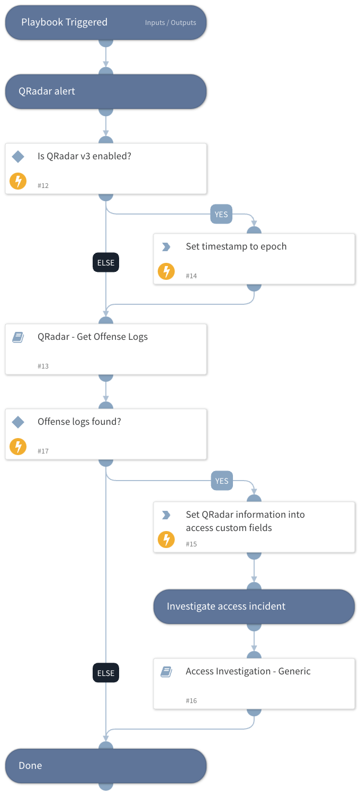

This playbook uses the QRadar integration to investigate an access incident by gathering user and IP information.

The playbook then interacts with the user that triggered the incident to confirm whether or not they initiated the access action.

## Dependencies

This playbook uses the following sub-playbooks, integrations, and scripts.

### Sub-playbooks

* QRadar - Get Offense Logs
* Access Investigation - Generic

### Integrations

This playbook does not use any integrations.

### Scripts

* Set
* IsIntegrationAvailable

### Commands

* setIncident

## Playbook Inputs

---
There are no inputs for this playbook.

## Playbook Outputs

---
There are no outputs for this playbook.

## Playbook Image

---

