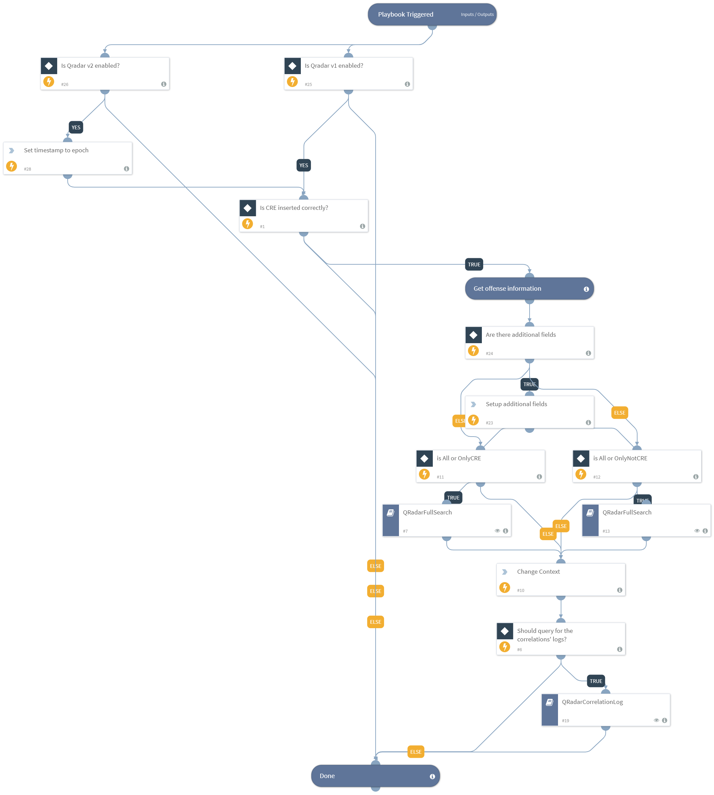

Deprecated. Use the "QRadar - Get Offense Logs" playbook instead.

Run on a QRadar offense to get more information:

* Get all correlations relevant to the offense
* Get all logs relevant to the correlations (not done by default - set "GetCorrelationLogs" to "True")

Inputs:
* GetCorrelationLogs (default: False)
* MaxLogsCount (default: 20)

## Dependencies
This playbook uses the following sub-playbooks, integrations, and scripts.

### Sub-playbooks
* QRadarFullSearch
* QRadarCorrelationLog

### Integrations
This playbook does not use any integrations.

### Scripts
This playbook does not use any scripts.

### Commands
This playbook does not use any commands.

## Playbook Inputs
---

| **Name** | **Description** | **Default Value** | **Required** |
| --- | --- | --- | --- |
| GetCorrelationLogs | When set to "True", retrieves all of the offense's correlations logs | True | Optional |
| MaxLogsCount | Maximum number of log entires to query from QRadar \(default: 20\) | 20 | Optional |
| ID | The QRadar offense ID  | incident.labels.id | Required |
| StartTime | The QRadar offense start time | incident.labels.start_time | Required |
| GetOnlyCREEvents | If value "OnlyCRE" get only events made by CRE. Values can be "OnlyCRE", "OnlyNotCRE", "All". | All | Optional |
| MaxCorrelationCount | Maximum number of correlations to query from QRadar \(default: 100\) | 100 | Optional |
| Fields | A comma-separated list of extra fields to get from each event. |  | Optional |

## Playbook Outputs
---

| **Path** | **Description** | **Type** |
| --- | --- | --- |
| QRadar.Correlation.StartTime | The correlation start time | unknown |
| QRadar.Correlation.CategoryID | The correlation category id  | unknown |
| QRadar.Correlation.QID | The correlation QID identifier | unknown |
| QRadar.Correlation.CREName | The correlation name | unknown |
| QRadar.Correlation.CREDescription | The correlation description | unknown |
| QRadar.Correlation | The QRadar offense correlations | unknown |
| QRadar.Correlation.SourceIP | The correlation source IP | unknown |
| QRadar.Correlation.DestinationIP | The correlation destination IP | unknown |
| QRadar.Correlation.Category | The correlation high level category | unknown |
| QRadar.Correlation.Username | The correlation username | unknown |
| QRadar.Log | The QRadar offense correlation logs | unknown |
| QRadar.Log.QID | The log's correlation ID | unknown |
| QRadar.Log.SourceIP | The log's source IP | unknown |
| QRadar.Log.DestinationPort | The log's destination port | unknown |
| QRadar.Log.SourcePort | The log's source port | unknown |
| QRadar.Log.DestinationIP | The log's destination IP | unknown |
| QRadar.Log.Category | The log's category | unknown |
| QRadar.Log.IdentityIP | The log's identity IP | unknown |
| QRadar.Log.Username | The log's username | unknown |
| QRadar.Log.StartTime | The log's start time | unknown |
| QRadar.Log.Magnitude | The log's magnitude | unknown |
| QRadar.Log.ProtocolName | The log's protocol name | unknown |

## Playbook Image
---
