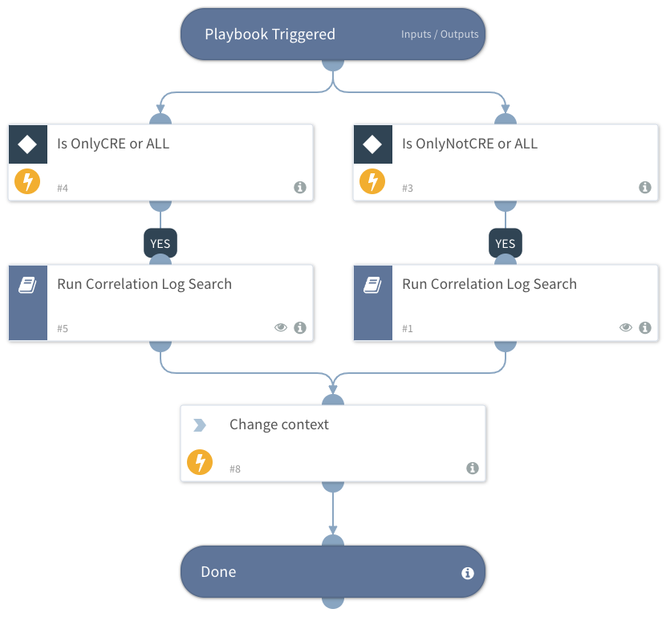

Deprecated. Use the "QRadar - Get Offense Logs" playbook instead.

This playbook retrieves the correlation logs of multiple QIDs.

## Dependencies
This playbook uses the following sub-playbooks, integrations, and scripts.

### Sub-playbooks
* QRadarFullSearch

### Integrations
This playbook does not use any integrations.

### Scripts
* ChangeContext

### Commands
This playbook does not use any commands.

## Playbook Inputs
---

| **Name** | **Description** | **Default Value** | **Required** |
| --- | --- | --- | --- |
| QID | The correlation QID. |  | Required |
| OffenseStartTime | The offense start time. |  | Required |
| OffenseID | The offense ID. |  | Required |
| additionalQueryFields | Add more fields for basic query \(a list with comma separators\) |  | Optional |
| GetOnlyCREEvents | If value "OnlyCRE" get only events made by CRE.
Values can be "OnlyCRE", "OnlyNotCRE", "All". | OnlyCRE | Optional |
| MaxLogsCount | Maximum number of log entires to query from QRadar \(default: 20\) | 20 | Optional |

## Playbook Outputs
---

| **Path** | **Description** | **Type** |
| --- | --- | --- |
| QRadar.Log | Logs of QRadar correlations | unknown |

