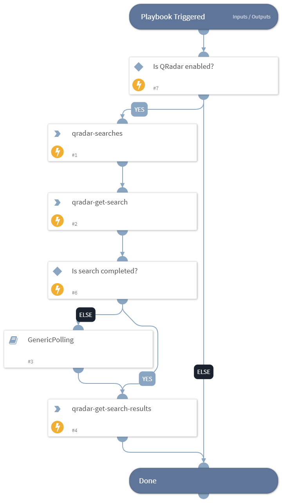

This playbook runs a QRadar query and return its results to the context.

## Dependencies
This playbook uses the following sub-playbooks, integrations, and scripts.

### Sub-playbooks
* GenericPolling

### Integrations
* QRadar_v2
* QRadar
* QRadar_v3

### Scripts
This playbook does not use any scripts.

### Commands
* qradar-get-search
* qradar-get-search-results
* qradar-searches

## Playbook Inputs
---

| **Name** | **Description** | **Default Value** | **Required** |
| --- | --- | --- | --- |
| timeout | How much time to wait before a timeout occurs \(minutes\) | 600 | Optional |
| interval | Polling frequency - how often the polling command should run \(minutes\) | 1 | Optional |
| query_expression | The query expressions in AQL |  | Required |
| range | Range of results to return \(e.g. 0-20\) |  | Optional |
| headers | Table headers |  | Optional |

## Playbook Outputs
---

| **Path** | **Description** | **Type** |
| --- | --- | --- |
| QRadar.Search.Result | The result of the search | unknown |

## Playbook Image
---
