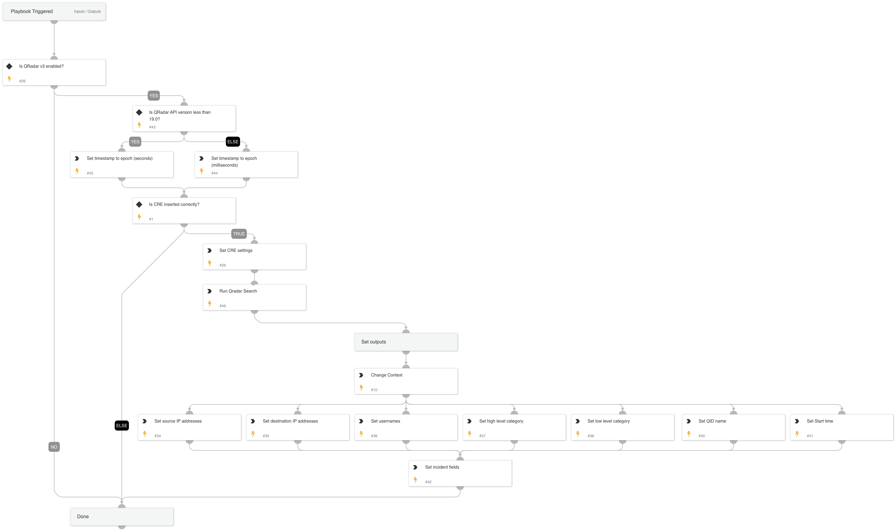

Works for QRadar integration version 3, v1 and v2 are deprecated.

Note: You can use the integration to fetch the events with the offense however it will fetch the events according to the specified limit defined in the instance settings. By using this playbook you can define an additional search to query a larger number of logs.

Default playbook inputs use the QRadar incident fields such as idoffense, starttime. These fields can be replaced but need to point to relevant offense ID and starttime fields. 

## Dependencies

This playbook uses the following sub-playbooks, integrations, and scripts.

### Sub-playbooks

* QRadarFullSearch

### Integrations

This playbook does not use any integrations.

### Scripts

* IsIntegrationAvailable
* SetAndHandleEmpty
* Set
* ChangeContext

### Commands

* setIncident

## Playbook Inputs

---

| **Name** | **Description** | **Default Value** | **Required** |
| --- | --- | --- | --- |
| MaxLogsCount | Maximum number of log entires to query from QRadar \(default: 50\) | 50 | Optional |
| ID | The QRadar offense ID. Uses the id offense incident field. | incident.idoffense | Required |
| StartTime | The QRadar offense start time | incident.starttime | Required |
| GetOnlyCREEvents | If value "OnlyCRE" get only events made by CRE. Values can be "OnlyCRE", "OnlyNotCRE", "All". | All | Optional |
| Fields | A comma-separated list of extra fields to get from each event. You can replace with different fields as well as rename the field names. | QIDNAME(qid), LOGSOURCENAME(logsourceid), CATEGORYNAME(highlevelcategory), CATEGORYNAME(category), PROTOCOLNAME(protocolid), sourceip, sourceport, destinationip, destinationport, QIDDESCRIPTION(qid), username, PROTOCOLNAME(protocolid), RULENAME("creEventList"), sourcegeographiclocation, sourceMAC, sourcev6, destinationgeographiclocation, destinationv6, LOGSOURCETYPENAME(devicetype), credibility, severity, magnitude, eventcount, eventDirection, postNatDestinationIP, postNatDestinationPort, postNatSourceIP, postNatSourcePort, preNatDestinationPort, preNatSourceIP, preNatSourcePort, UTF8(payload), starttime, devicetime | Optional |
| ApiVersion | The API version for the timestamp format to use | 18 | Optional |

## Playbook Outputs

---

| **Path** | **Description** | **Type** |
| --- | --- | --- |
| QRadar | The QRadar offense logs. | string |
| QRadar.SourceIP | The unique source ips. | string |
| QRadar.DestinationIP | The unique destination ips. | string |
| QRadar.Username | The unique usernames. | string |
| QRadar.HighLevelCategory | The unique high level categories. | string |
| QRadar.LowLevelCategory | The unique high low categories. | string |
| QRadar.QidName | The unique QID names. | string |
| QRadar.StartTime | The start time of the first event. | string |

## Playbook Image

---

