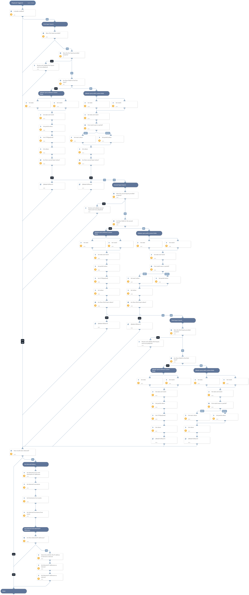

The Playbook queries QRadar SIEM using complex queries in case the provided search values require several conditions. Complex queries take into consideration several inputs and allow to include or exclude each of the values as well as perform a full or partial search. Each of the values can be searched across several fields.
The playbook supports 3 full separate conditions to be evaluated

For example in the first inputs will evaluate several user names that may or may not exist in several fields. The second input can for example evaluate for IP addresses in several fields that may or may not exist in several fields and a third value can search for an event id that may or may not exist in several fields. The results of all of the inputs will create an AQL query that covers all of the inputs combining all of the different conditions.

Each of the inputs is validated so in case the inputs are not set correctly the user can review and run again.
Also notice that populated inputs will be combined, meaning by populating the first and second values the resulting AQL query will be a combination of all of them and not 3 separate searches. In addition to that make sure to populate the inputs in order both according to the indexed fields in QRadar (indexed fields should be provided before non indexed ones) and don't leave a blanc input, meaning if you have 1 inputs make sure its in the first input and if you have two inputs they need to be in the first and second input and not skip to the third.

## Dependencies
This playbook uses the following sub-playbooks, integrations, and scripts.

### Sub-playbooks
* QRadarFullSearch

### Integrations
* QRadar_v2
* QRadar_v3
* QRadar

### Scripts
* IsIPInRanges
* Set
* SetAndHandleEmpty

### Commands
* qradar-get-assets

## Playbook Inputs
---

| **Name** | **Description** | **Default Value** | **Required** |
| --- | --- | --- | --- |
| FirstFieldValue | The values of the first field to search. This can be a single value or a list of comma delimited values. For example admin1,admin2 |  | Optional |
| FirstFieldName | The field names of the first field to search. This can be a single value or a list of comma delimited values. For example username,user |  | Optional |
| FirstFieldState | The state of the first field to search, meaning are the values in the field should be included or excluded. Valid options are include or exclude. | include | Optional |
| FirstFieldMatch | Are the values of the first field suppose to be exact match or partial match. Valid options are exact or partial. When choosing exact the AQL query will use the = operator. When choosing partial the AQL query will ILIKE and add '%%' to the values. | exact | Optional |
| SecondFieldValue | The values of the second field to search |  | Optional |
| SecondFieldName | The field names of the second field to search. This can be a single value or a list of comma delimited values. For example admin1,admin2 |  | Optional |
| SecondFieldState | The state of the second field to search, meaning are the values in the field should be included or excluded. Valid options are include or exclude. | exclude | Optional |
| SecondFieldMatch | Are the values of the second field suppose to be exact match or partial match. Valid options are exact or partial.  | partial | Optional |
| ThirdFieldValue | The values of the third field to search. This can be a single value or a list of comma delimited values. For example admin1,admin2 |  | Optional |
| ThirdFieldName | The field names of the third field to search. This can be a single value or a list of comma delimited values. For example username,user |  | Optional |
| ThirdFieldState | The state of the third field to search, meaning are the values in the field should be included or excluded. Valid options are include or exclude. | include | Optional |
| ThirdFieldMatch | Are the values of the third field suppose to be exact match or partial match. Valid options are exact or partial. When choosing exact the AQL query will use the = operator. When choosing partial the AQL query will ILIKE and add '%%' to the values. | exact | Optional |
| AdditionalSelectFields | Add any additional fields you would like to be in the AQL select section.  | | Optional |
| TimeFrame | Time frame as used in AQL Examples can be LAST 7 DAYS START '2019-09-25 15:51' STOP '2019-09-25 17:51' For more examples review IBM's AQL documentation. | LAST 7 DAYS | Optional |
| InternalRange | A list of internal IP ranges to check IP addresses against. The list should be provided in CIDR notation, separated by commas. An example of a list of ranges would be: "172.16.0.0/12,10.0.0.0/8,192.168.0.0/16" \(without quotes\). If a list is not provided, will use default list provided in the IsIPInRanges script \(the known IPv4 private address ranges\). |  | Optional |
| InvestigationIPFields | The values of these QRadar fields will be used for the playbook IP addresses outputs. | sourceip,destinationip | Required |
| InvestigationUserFields | The values of these QRadar fields will be used for the playbook user name outputs. | username | Required |

## Playbook Outputs
---

| **Path** | **Description** | **Type** |
| --- | --- | --- |
| QRadar.DetectedUsers | Users detected based on the username field in your search. | string |
| QRadar.DetectedInternalIPs | Internal IP addresses detected based on fields and inputs in your search. | string |
| QRadar.DetectedExternalIPs | External IP addresses detected based on fields and inputs in your search. | string |
| QRadar.DetectedInternalHosts | Internal host names detected based on hosts in your assets table. Note that the data accuracy depends on how the Asset mapping is configured in QRadar. | string |
| QRadar.DetectedExternalHosts | External host names detected based on hosts in your assets table. Note that the data accuracy depends on how the Asset mapping is configured in QRadar. | string |
| QRadar.Search.Result | The full result of the search. | string |

## Playbook Image
---
