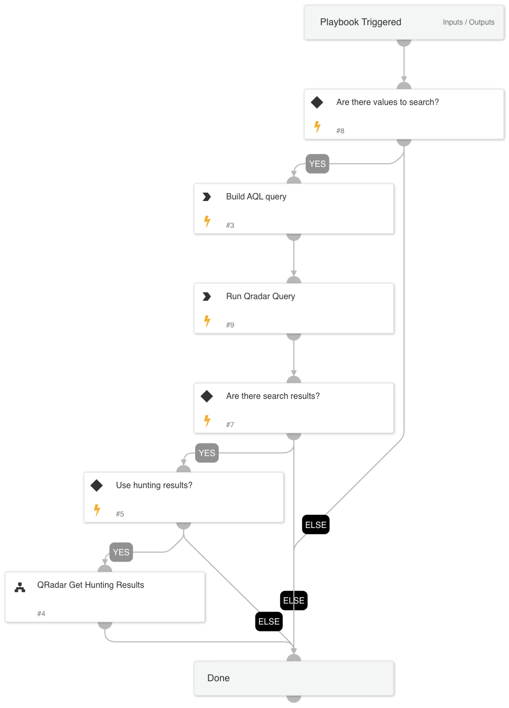

The QRadar Build Query and Search playbook creates an AQL query for the  QRadar SIEM using the QRadarCreateAQLQuery automation queries. Complex queries take into consideration several inputs and allow including or excluding each of the values as well as performing a full or partial search. Each of the values can be searched across several fields.

The playbook supports 3 separate conditions to be evaluated.
For example, in the first condition, inputs will evaluate several user names that may or may not exist in several fields. The second input, can for example, evaluate for IP addresses in several fields that may or may not exist in several fields, and a third value can search for an event ID that may or may not exist in several fields. The results of all of the inputs will create an AQL query that covers all of the inputs combining all of the different conditions.

Each of the inputs is validated so in case the inputs are not set correctly, the user can review and run again.
Also, populated inputs will be combined, meaning by populating the first and second values the resulting AQL query will be a combination of all of the values and not 3 separate searches. In addition, make sure to populate the inputs in order according to the indexed fields in QRadar (indexed fields should be provided before non indexed ones).

## Dependencies
This playbook uses the following sub-playbooks, integrations, and scripts.

### Sub-playbooks
* QRadarFullSearch
* QRadar Get Hunting Results

### Integrations
This playbook does not use any integrations.

### Scripts
QRadarCreateAQLQuery

### Commands
This playbook does not use any commands.

## Playbook Inputs
---

| **Name** | **Description** | **Default Value** | **Required** |
| --- | --- | --- | --- |
| BaseValuesToSearch | The values of the first field to search. This can be a single value or a comma-separated list of values. For example, admin1,admin2 |  | Optional |
| BaseFieldsToSearch | The field names of the first field to search. This can be a single value or a comma-separated list of values. For example, username,user |  | Optional |
| BaseFieldState | The state of the first field to search, meaning whether the values in the field should be included or excluded. Valid options are include or exclude. | include | Optional |
| BaseFieldMatch | Whether the values of the first field should be exact match or partial match. Valid options are exact or partial. When choosing exact, the AQL query will use the = operator. When choosing partial, the AQL query will ILIKE and add '%%' to the values. Notice that if you choose exact you will have to specify the BaseFieldsToSearch as well. | exact | Optional |
| FirstAdditionalValues | The values of the second field to search. This can be a single value or a comma-separated list of values. For example, admin1,admin2 |  | Optional |
| FirstAdditionalFields | The field names of the second field to search. This can be a single value or a comma-separated list of values. For example, admin1,admin2 |  | Optional |
| FirstAdditionalFieldState | The state of the second field to search, meaning whether the values in the field should be included or excluded. Valid options are include or exclude. | include | Optional |
| FirstAdditionalFieldMatch | Whether the values of the second field should be an exact match or a partial match. Valid options are exact or partial. When choosing exact, the AQL query will use the = operator. When choosing partial, the AQL query will ILIKE and add '%%' to the values. Notice that if you choose exact you will have to specify the FirstAdditionalFields as well. | exact | Optional |
| SecondAdditionalValues | The values of the third field to search. This can be a single value or a comma-separated list of values. For example, admin1,admin2 |  | Optional |
| SecondAdditionalFields | The field names of the third field to search. This can be a single value or a comma-separated list of values. For example, username,user |  | Optional |
| SecondAdditionalFieldState | The state of the third field to search, meaning whether the values in the field should be included or excluded. Valid options are include or exclude. | include | Optional |
| SecondAdditionalFieldMatch | Whether the values of the third field should be an exact match or a partial match. Valid options are exact or partial. When choosing exact, the AQL query will use the = operator. When choosing partial, the AQL query will ILIKE and add '%%' to the values. Notice that if you choose exact you will have to specify the SecondAdditionalFields as well.| exact | Optional |
| SelectFields | The list of fields to select within the AQL query. The default fields are DATEFORMAT\(devicetime,'dd-MM-yyyy hh:mm'\),LOGSOURCENAME\(logsourceid\),CATEGORYNAME\(category\),QIDNAME\(qid\),sourceip,destinationip,username | DATEFORMAT(devicetime,'dd-MM-yyyy hh:mm'),LOGSOURCENAME(logsourceid),CATEGORYNAME(category),QIDNAME(qid),sourceip,destinationip,username | Optional |
| TimeFrame | Time frame as used in AQL. For example: LAST 7 DAYS START '2019-09-25 15:51' STOP '2019-09-25 17:51' For more examples, see IBM's AQL documentation. | LAST 1 HOURS | Optional |
| UseHuntingResults | The QRadar Get Hunting Results playbook outputs the detected hosts, users, and IP addresses detected in the QRadar search results. | false | Optional |

## Playbook Outputs
---

| **Path** | **Description** | **Type** |
| --- | --- | --- |
| QRadar.Search.Result | The result of the search. | string |
| QRadar.DetectedUsers | Users detected based on the username field in your search. | string |
| QRadar.DetectedInternalIPs | Internal IP addresses detected based on fields and inputs in your search. | string |
| QRadar.DetectedExternalIPs | External IP addresses detected based on fields and inputs in your search. | string |
| QRadar.DetectedInternalHosts | Internal host names detected based on hosts in your assets table. Note that the data accuracy depends on how the asset mapping is configured in QRadar. | string |
| QRadar.DetectedExternalHosts | External host names detected based on hosts in your assets table. Note that the data accuracy depends on how the asset mapping is configured in QRadar. | string |

## Playbook Image
---

