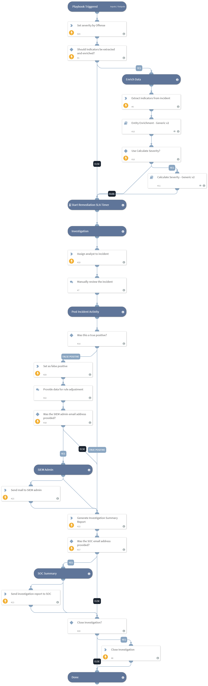

The QRadar Generic playbook is executed for the QRadar Generic incident type. It performs all the common parts of the investigation, including notifying the SOC, enriching data for indicators and users, calculating severity, assigning incidents, and notifying the SIEM admin about false positives.

## Dependencies
This playbook uses the following sub-playbooks, integrations, and scripts.

### Sub-playbooks
* Entity Enrichment - Generic v2
* Calculate Severity - Standard
* QRadar - Get Offense Logs

### Integrations
This playbook does not use any integrations.

### Scripts
* GenerateInvestigationSummaryReport
* AssignAnalystToIncident

### Commands
* send-mail
* setIncident
* extractIndicators
* excludeIndicators
* closeInvestigation
* setIndicator

## Playbook Inputs
---

| **Name** | **Description** | **Default Value** | **Required** |
| --- | --- | --- | --- |
| Enrich | Determines whether to enrich all indicators in the incident. | true | Optional |
| OnCall | Set to true to assign only the user that is currently on shift. Requires Cortex XSOAR v5.5 or later. | false | Optional |
| SocEmailAddress | The SOC team's email address. |  | Optional |
| SocMailSubject | The subject of the email to send to the SOC. | XSOAR Summary report, ID -  | Optional |
| SiemAdminEmailAddress | The SIEM admin's email address. |  | Optional |
| UseCalculateSeverity | Determines whether to use the Calculate Severity playbook to calculate the incident severity. If the playbook isn't used, the severity is determined by the QRadar magnitude value. | true | Optional |
| SiemAdminMailSubject | The subject of the email to send to the SIEM admin. | Adjustment/Exclusion for offense  | Optional |
| UseCustomSeveritySettings | Determines whether to use the default mapping in the QRadar generic mapper to set the XSOAR incident severity, or set the severity using the FieldToSetSeverityFrom and ScaleToSetSeverityFrom playbook inputs. Any value other than false is considered as true and causes the playbook inputs to be used. | false | Optional |
| FieldToSetSeverityFrom | Specifies the field to use for calculating the incident severity, for example the severity field.  | incident.magnitudeoffense | Optional |
| ScaleToSetSeverityFrom | The range of values of FieldToSetSeverityFrom is 1-10. The XSOAR incident severity field value range is 0-4 where 0 - Informational 1 - Low 2 - Medium 3 - High 4 - Critical  The scale translates the value of FieldToSetSeverityFrom to a valid incident severity value. The default scale is 1,1,1,2,2,2,2,3,3,3  This means that values 1-3 of FieldToSetSeverityFrom are translated to low severity \(positions 1-3 in the scale\), values 4-7 are translated to medium severity \(positions 4-7 in the scale\) and values 8-10 are translated to high severity \(positions 8-10 in the scale\). | 1,1,1,2,2,2,2,3,3,3 | Optional |
| RunAdditionalSeach | By default the incident fetches the events defined in the integration instance settings \(default is 20 events\). To fetch additional events, change this setting to true. | true | Optional |
| MaxLogsCount | Maximum number of log entires to query from QRadar. Used for the QRadar - Get Offense Logs subplaybook. | 50 | Optional |
| GetOnlyCREEvents | If this value is "OnlyCRE", get only events made by CRE. Values can be "OnlyCRE", "OnlyNotCRE", "All". Used for the QRadar - Get Offense Logs subplaybook.  | All | Optional |
| Fields | A comma-separated list of extra fields to get from each event. You can use different fields or rename the existing fields. Used for the QRadar - Get Offense Logs subplaybook.  | QIDNAME(qid), LOGSOURCENAME(logsourceid), CATEGORYNAME(highlevelcategory), CATEGORYNAME(category), PROTOCOLNAME(protocolid), sourceip, sourceport, destinationip, destinationport, QIDDESCRIPTION(qid), username, PROTOCOLNAME(protocolid), RULENAME("creEventList"), sourcegeographiclocation, sourceMAC, sourcev6, destinationgeographiclocation, destinationv6, LOGSOURCETYPENAME(devicetype), credibility, severity, magnitude, eventcount, eventDirection, postNatDestinationIP, postNatDestinationPort, postNatSourceIP, postNatSourcePort, preNatDestinationPort, preNatSourceIP, preNatSourcePort, UTF8(payload), starttime, devicetime | Optional |
| IndicatorTag | The tag to provide for true positive indicators, for example to use the indicators in an EDL \(External Dynamic List\). | block | Optional |
| ExcludeIndicatorsInXSOAR | If this value is not false, add indicators to the XSOAR exclude list. The excluded indicators won't be created in XSOAR anymore. | false | Optional |

## Playbook Outputs
---
There are no outputs for this playbook.

## Playbook Image
---
