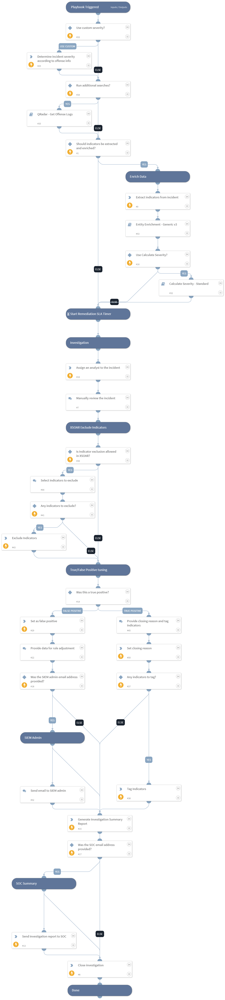

This is a generic playbook to be executed for the QRadar Generic incident type. The playbook performs all the common parts of the investigation, including notifying the SOC, enriching the data for indicators and users, calculating the severity, assigning the incident, notifying the SIEM admin for false positives and more.

## Dependencies
This playbook uses the following sub-playbooks, integrations, and scripts.

### Sub-playbooks
* Calculate Severity - Standard
* QRadar - Get Offense Logs
* Entity Enrichment - Generic v2

### Integrations
This playbook does not use any integrations.

### Scripts
* GenerateInvestigationSummaryReport
* AssignAnalystToIncident

### Commands
* extractIndicators
* send-mail
* closeInvestigation
* setIndicator
* excludeIndicators
* setIncident

## Playbook Inputs
---

| **Name** | **Description** | **Default Value** | **Required** |
| --- | --- | --- | --- |
| Enrich | Determines whether to enrich all indicators in the incident. Default is True. | true | Optional |
| OnCall | Set to true to assign only the user that is currently on shift. Default is False. Requires Cortex XSOAR v5.5 or later. | false | Optional |
| SocEmailAddress | The SOC team's email address. |  | Optional |
| SocMailSubject | The subject of the email to send to the SOC. | XSOAR Summary report, ID -  | Optional |
| SiemAdminEmailAddress | The SIEM admin's email address. |  | Optional |
| UseCalculateSeverity | Determines whether to use the Calculate Severity playbook to calculate the incident severity. Default is True. If the playbook isn't used, the severity is determined by the QRadar magnitude value. | true | Optional |
| SiemAdminMailSubject | The subject of the email to send to the SIEM admin. | Adjustment/Exclusion for offense  | Optional |
| UseCustomSeveritySettings | Determines whether to use the default mapping as provided in the QRadar generic mapper to set the XSOAR incident severity or set the severity using the FieldToSetSeverityFrom and ScaleToSetSeverityFrom playbook inputs. The mapper will be used by default. Any value other than False will be considered as True and will cause the playbook inputs to be used. | false | Optional |
| FieldToSetSeverityFrom | Specify the field to use for calculating the incident severity. The default field is magnitude. An example of another field is the severity field.  | incident.magnitudeoffense | Optional |
| ScaleToSetSeverityFrom | The range of values of FieldToSetSeverityFrom is 1-10. The XSOAR incident severity field values range is 0-4 where 0 - Informational 1 - Low 2 - Medium 3 - High 4 - Critical  A scale is required to translate the value of FieldToSetSeverityFrom to a valid incident severity value. The default scale is 1,1,1,2,2,2,2,3,3,3  The meaning of the default scale is that values 1-3 of FieldToSetSeverityFrom will be translated to low severity \(positions 1-3 in the scale\), values 4-7 will be translated to medium severity \(positions 4-7 in the scale\) and values 8-10 will be translated to high severity \(positions 8-10 in the scale\). | 1,1,1,2,2,2,2,3,3,3 | Optional |
| RunAdditionalSeach | By default the incident will fetch the events defined in the integration instance settings \(default is 20 events\). In case you are interested to fetch additional events change this setting to true. | true | Optional |
| MaxLogsCount | Maximum number of log entires to query from QRadar \(default: 50\). Used for the QRadar - Get Offense Logs subplaybook. | 50 | Optional |
| GetOnlyCREEvents | If value "OnlyCRE" get only events made by CRE. Values can be "OnlyCRE", "OnlyNotCRE", "All". The default value is All. Used for the QRadar - Get Offense Logs subplaybook.  | All | Optional |
| Fields | A comma-separated list of extra fields to get from each event. You can replace with different fields as well as rename the field names. Used for the QRadar - Get Offense Logs subplaybook.  | QIDNAME(qid), LOGSOURCENAME(logsourceid), CATEGORYNAME(highlevelcategory), CATEGORYNAME(category), PROTOCOLNAME(protocolid), sourceip, sourceport, destinationip, destinationport, QIDDESCRIPTION(qid), username, PROTOCOLNAME(protocolid), RULENAME("creEventList"), sourcegeographiclocation, sourceMAC, sourcev6, destinationgeographiclocation, destinationv6, LOGSOURCETYPENAME(devicetype), credibility, severity, magnitude, eventcount, eventDirection, postNatDestinationIP, postNatDestinationPort, postNatSourceIP, postNatSourcePort, preNatDestinationPort, preNatSourceIP, preNatSourcePort, UTF8(payload), starttime, devicetime | Optional |
| IndicatorTag | The tag to provide for true positive indicators. For example for using the indicators in an EDL \(External Dynamic List\). Default value is block. | block | Optional |
| ExcludeIndicatorsInXSOAR | Changing the setting not to false will enable the user to add indicators to the XSOAR exclude list. Meaning that the excluded indicators wont be created in XSOAR anymore. Default value is false. | false | Optional |

## Playbook Outputs
---
There are no outputs for this playbook.

## Playbook Image
---
