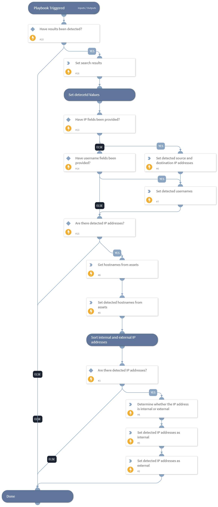

This playbook is used to sort the QRadar search results to display the IP addresses, assets, and usernames that the search provided. In addition, the results allow you to differentiate between internal and external IP addresses as well as query the QRadar assets API in order to get the assets details from the IP addresses. You can provide the QRadar fields names and the organizations' IP ranges in order to properly sort the data. The end result of the playbook will be the internal and external IP addresses detected as well as the assets and users.

## Dependencies
This playbook uses the following sub-playbooks, integrations, and scripts.

### Sub-playbooks
This playbook does not use any sub-playbooks.

### Integrations
* QRadar_v3

### Scripts
* IsIPInRanges
* SetAndHandleEmpty
* Set

### Commands
qradar-get-assets

## Playbook Inputs
---

| **Name** | **Description** | **Default Value** | **Required** |
| --- | --- | --- | --- |
| InternalRange | A list of internal IP ranges to check IP addresses against. The list should be provided in CIDR notation, separated by commas. An example of a list of ranges would be: "172.16.0.0/12,10.0.0.0/8,192.168.0.0/16" \(without quotes\). If a list is not provided, will use the default list provided in the IsIPInRanges script \(the known IPv4 private address ranges\). |  | Optional |
| InvestigationIPFields | The values of these QRadar fields will be used for the playbook IP addresses outputs. | sourceip,destinationip | Optional |
| InvestigationUserFields | The values of these QRadar fields will be used for the playbook user name outputs. | username | Optional |
| SearchResults | The search results of an AQL search. |  | Optional |

## Playbook Outputs
---

| **Path** | **Description** | **Type** |
| --- | --- | --- |
| QRadar.DetectedUsers | Users detected based on the username field in your search. | string |
| QRadar.DetectedInternalIPs | Internal IP addresses detected based on fields and inputs in your search. | string |
| QRadar.DetectedExternalIPs | External IP addresses detected based on fields and inputs in your search. | string |
| QRadar.DetectedInternalHosts | Internal host names detected based on hosts in your assets table. Note that the data accuracy depends on how the asset mapping is configured in QRadar. | string |
| QRadar.DetectedExternalHosts | External host names detected based on hosts in your assets table. Note that the data accuracy depends on how the asset mapping is configured in QRadar. | string |

## Playbook Image
---

