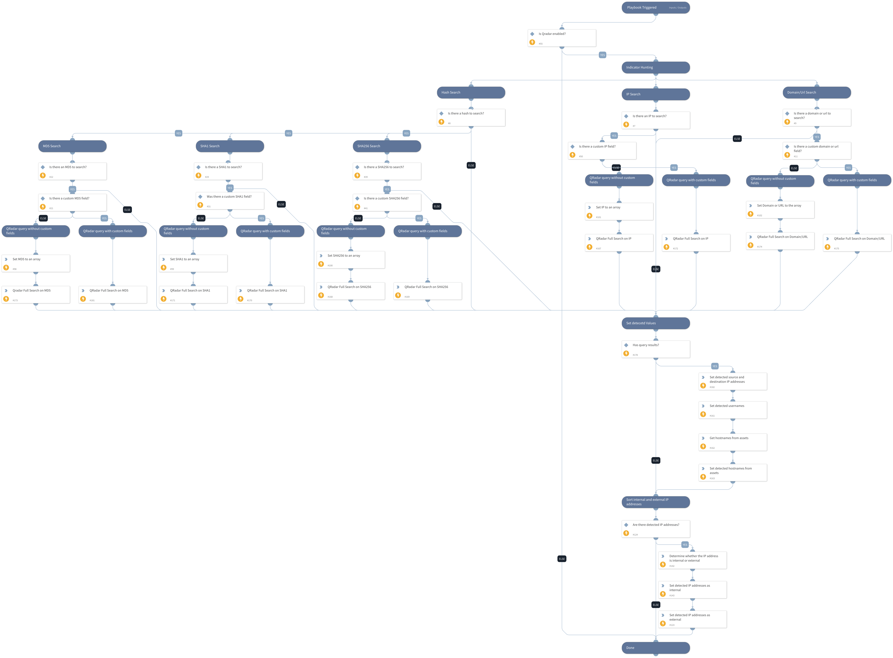

The Playbook queries QRadar SIEM for indicators such as file hashes, IP addresses, domains, or urls. 

## Dependencies

This playbook uses the following sub-playbooks, integrations, and scripts.

### Sub-playbooks

This playbook does not use any sub-playbooks.

### Integrations

* QRadar_v3

### Scripts

* IsIPInRanges
* Set
* SetAndHandleEmpty

### Commands

* qradar-assets-list
* qradar-search-retrieve-events

## Playbook Inputs

---

| **Name** | **Description** | **Default Value** | **Required** |
| --- | --- | --- | --- |
| MD5 | MD5 hash file or an array of hashes to search. |  | Optional |
| QradarMD5Field | MD5 field to search in QRadar. If none are specified, the search will use a payload contains filter. |  | Optional |
| SHA1 | SHA1 hash file or an array of hashes to search. |  | Optional |
| QradarSHA1Field | SHA1 field to search in QRadar. If none are specified, the search will use a payload contains filter. |  | Optional |
| SHA256 | SHA256 hash file or an array of hashes to search. |  | Optional |
| QradarSHA256Field | SHA256 field to search in QRadar. If none are specified, the search will use a payload contains filter. |  | Optional |
| IPAddress | Source or destination IP to search. Can be a single address or an array of addresses.  |  | Optional |
| QradarIPfield | IP field to search in QRadar. If none are specified, the search will use sourceip or destinationip \(combined\). | sourceip,destinationip | Optional |
| URLDomain | Domain or Url can be single or an array of domain/urls to search. By default the LIKE clause is used.  |  | Optional |
| QradarURLDomainField | URL/Domain field to search in QRadar. If none are specified, the search will use a payload contains filter.  |  | Optional |
| TimeFrame | Time frame as used in AQL Examples can be LAST 7 DAYS START '2019-09-25 15:51' STOP '2019-09-25 17:51' For more examples review IBM's AQL documentation. | LAST 7 DAYS | Optional |
| InternalRange | A list of internal IP ranges to check IP addresses against. The comma-separated list should be provided in CIDR notation. For example, a list of ranges would be: "172.16.0.0/12,10.0.0.0/8,192.168.0.0/16" \(without quotes\). | lists.PrivateIPs | Optional |
| InvestigationIPFields | The values of these QRadar fields will be used for the playbook IP addresses outputs. | sourceip,destinationip | Required |
| InvestigationUserFields | The values of these QRadar fields will be used for the playbook user name outputs. | username | Required |

## Playbook Outputs

---

| **Path** | **Description** | **Type** |
| --- | --- | --- |
| QRadar.DetectedUsers | Users detected based on the username field in your search. | string |
| QRadar.DetectedInternalIPs | Internal IP addresses detected based on fields and inputs in your search. | string |
| QRadar.DetectedExternalIPs | External IP addresses detected based on fields and inputs in your search. | string |
| QRadar.DetectedInternalHosts | Internal host names detected based on hosts in your assets table. Note that the data accuracy depends on how the Asset mapping is configured in QRadar. | string |
| QRadar.DetectedExternalHosts | External host names detected based on hosts in your assets table. Note that the data accuracy depends on how the Asset mapping is configured in QRadar. | string |

## Playbook Image

---

