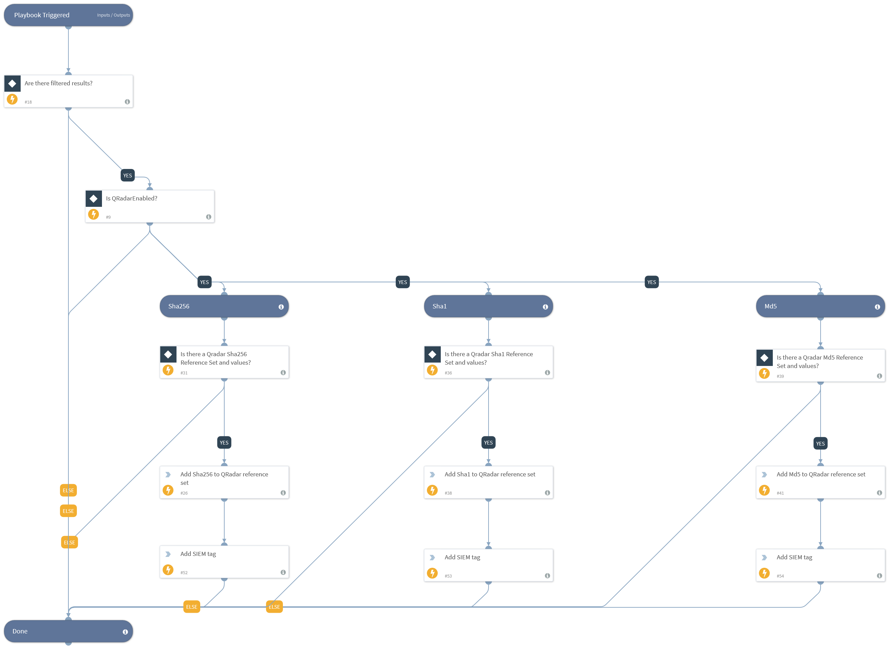

This playbook queries indicators based on a pre-defined query or results from a parent playbook, and adds the resulting indicators to a QRadar Reference Set. The Reference Set name must be defined in the playbook inputs.

## Dependencies
This playbook uses the following sub-playbooks, integrations, and scripts.

### Sub-playbooks
This playbook does not use any sub-playbooks.

### Integrations
* QRadar_v2
* QRadar

### Scripts
This playbook does not use any scripts.

### Commands
* qradar-update-reference-set-value
* appendIndicatorField

## Playbook Inputs
---

| **Name** | **Description** | **Default Value** | **Required** |
| --- | --- | --- | --- |
| QRadarMd5ReferenceSetName | The name of the QRadar Md5 reference set to insert the data in to. |  | Optional |
| QRadarSha1ReferenceSetName | The name of the QRadar Sha1 reference set to insert the data in to. |  | Optional |
| QRadarSha256ReferenceSetName | The name of the QRadar Sha256 reference set to insert the data in to. | Demisto Demo Sha256 | Optional |
| Indicator Query | Indicators matching the indicator query will be used as playbook input |  | Optional |

## Playbook Outputs
---
There are no outputs for this playbook.

## Playbook Image
---
