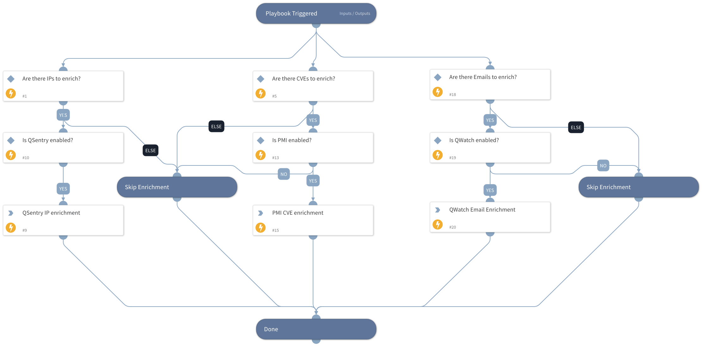

Enriches indicators from Qintel products

## Dependencies
This playbook uses the following sub-playbooks, integrations, and scripts.

### Sub-playbooks
This playbook does not use any sub-playbooks.

### Integrations
* QintelQSentry
* QintelPMI
* QintelQWatch

### Scripts
* IsIntegrationAvailable

### Commands
* cve
* qintel-qwatch-exposures
* ip

## Playbook Inputs
---

| **Name** | **Description** | **Default Value** | **Required** |
| --- | --- | --- | --- |
| IP | IPs to be enriched | ${IP} | Optional |
| Domain | Domains to be enriched | ${Domain} | Optional |
| CVE | CVEs to be enriched | ${CVE} | Optional |
| Email | Email to be enriched | ${Account.Email} | Optional |

## Playbook Outputs
---
There are no outputs for this playbook.

## Playbook Image
---
